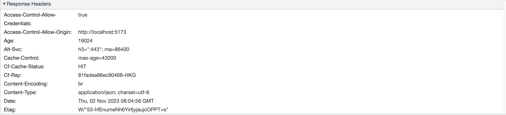
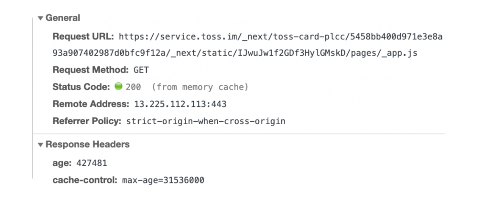
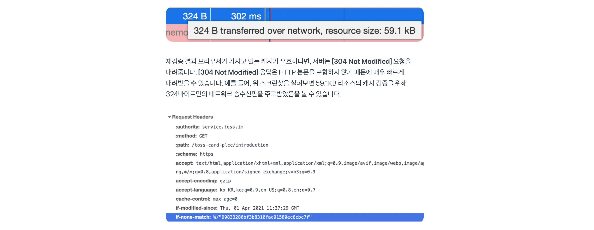
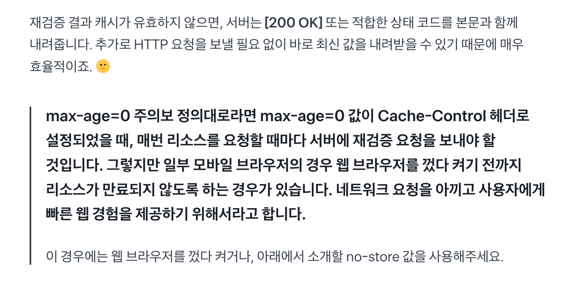
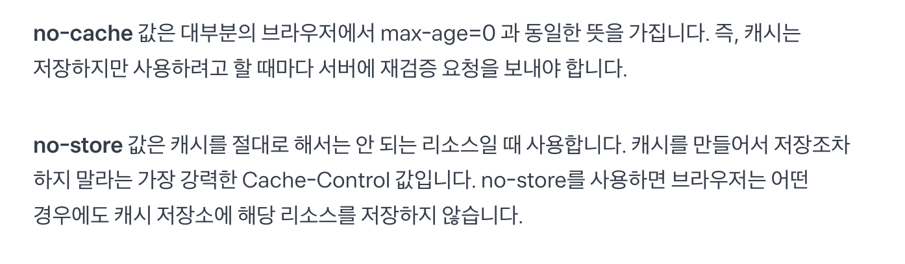
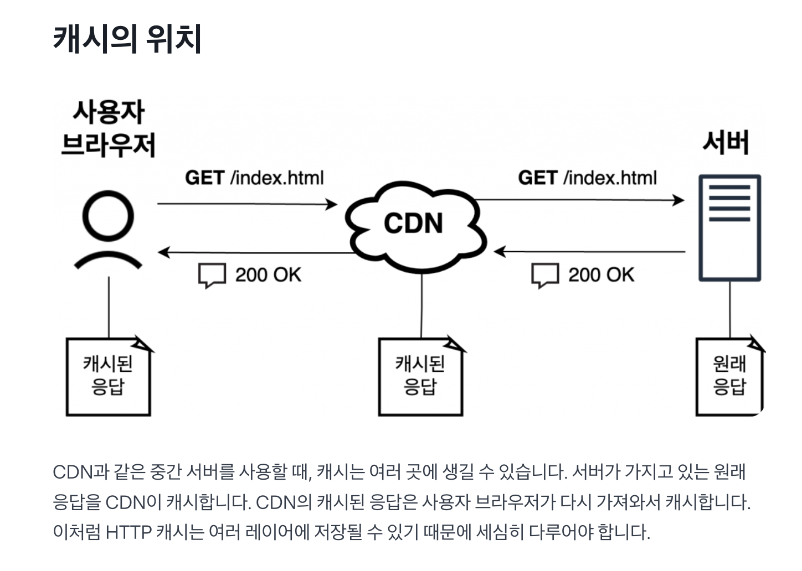
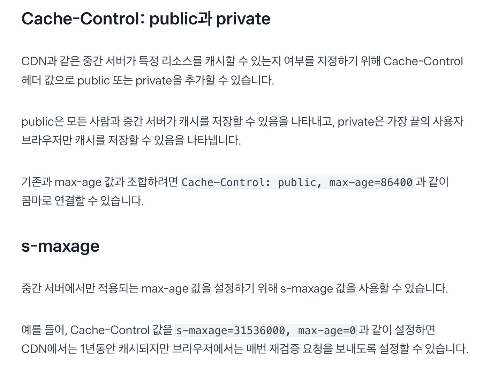
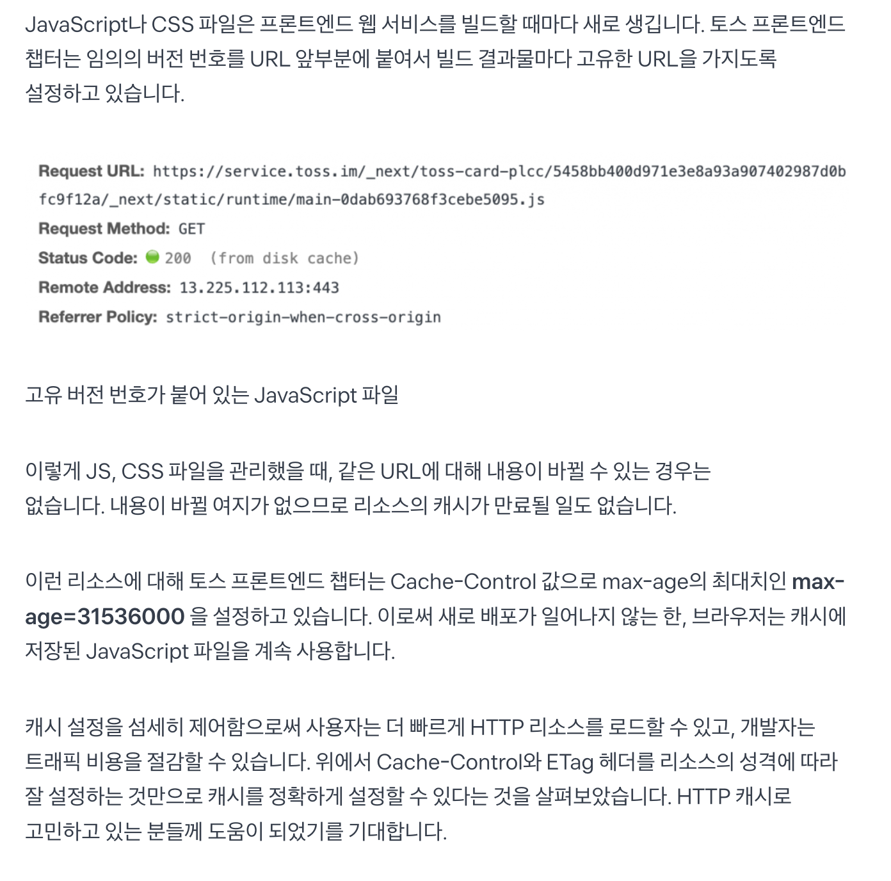

### Cache-Control 헤더 필요성

HTTP 캐시를 적극적으로 사용하면 웹 성능을 높일 수 있다.

- 원하는 시점에 캐시를 삭제해, 불필요한 http 요청을 줄일 수 있다.

http 캐시를 효율적으로 관리하려면 => Cache-Control 헤더 조절 필요

### http 리소스, 캐시 생명주기

http에서 리소스(resource)란, 웹브라우저가 http 요청으로 가져올 수 있는 모든 종류의 파일(html, js, image, video, ..)을 지칭

- 서버와 브라우저가 완전한 http 요청을 주고 받고, 이후 http 응답에 포함된 Cache-Control 헤더에 따라 리소스 생명주기 결정.

서버의 Cache-Control 헤더 값으로 `max-age=<seconds>` 값을 지정하면, 해당 리소스의 캐시 유효 기간은 `<seconds>`초가 된다.

응답 헤더를 보면, 이 리소스의 Cache-Control에 `max-age=43200`이라고 적혀 있다.
 이 리소스는 43200초 동안 캐시된다.

한 번 받아온 리소스의 유효 기간이 지나기 전이라면, 브라우저는 서버에 요청을 보내지 않고 디스크 또는 메모리에서만 캐시를 읽어와 계속 사용한다.

메모리 캐시에서 불러올 경우, 위 예제 이미지처럼
 from memory cache라고 적혀 있는 걸 볼 수 있다.

한번 브라우저에 캐시가 저장되면, 만료될 때까지 캐시는 계속 브라우저에 남아 있게 된다. 때문에 CDN invalidation을 포함한 서버의 어떤 작업이 있더라도 브라우저의 유효한 캐시를 지우기 어렵다.

- 참고로 Cache-Control: max-age 값 대신, Expires 헤더로 캐시 만료 시간을 정확히 지정할 수도 있다.

### 캐시 유효 기간 지나면

캐시 유효기간이 지나더라도, 캐시가 완전히 사라지는 건 아니다.
 대신 브라우저는 서버에 [조건부 요청](https://developer.mozilla.org/en-US/docs/Web/HTTP/Conditional_requests)을 통해 캐시가 유효한지 재검증(revalidation)을 수행한다.

대표적인 재검증 요청 헤더들

1. `if-None-Match`: 캐시된 리소스의 `ETag` 값과 현재 서버 리소스의 `ETag` 값이 같은지 확인
2. `if-Modified-Since`: 캐시된 리소스의 `Last-Modified` 값 이후 서버 리소스가 수정되었는지 확인

위에서 ETag와 Last-Modified는 기존에 받았던 리소스 응답 헤더에 있는 값을 사용.

### no-cache와 no-store

Cache-Control에서의 2가지 값의 동작은 매우 다르지만 혼동하기 쉽다.

### 캐시의 위치, CDN Invalidation

일반적으로 캐시를 없애기 위해 CDN Invalidation을 수행한다고 이야기한다. 
위 그림에서 가운데 위치한 CDN에 저장되어 있는 캐시를 삭제한다는 의미다.

브라우저 캐시는 다른 곳에 위치하므로 CDN 캐시를 삭제한다고 해서 브라우저 캐시가 삭제되지 않는다.

경우에 따라 중간 서버나 CDN이 여러 개 있는 경우, 전체 캐시를 날리려면 중간 서버 각각에 대해 캐시를 날려야 한다.

- 이렇듯 한번 저장한 캐시는 삭제가 어려워 신중히 Cache-Control의 max-age 값을 설정해야 한다.

### 토스에서의 cache-control

html 리소스는 `Cache-Control: s-maxage=31536000, max-age=0`으로 설정.

- 브라우저는 html 파일을 가져올 때마다 서버에 재검증 요청을 보내고, 그 사이 새로운 배포가 있다면 새로운 html 파일을 받는다.
- s-maxage는 중간서버에서만 적용되는 max-age값. 즉, CDN은 계속 html 파일에 대한 캐시를 계속 가지게 하고, 배포가 새롭게 이루어질 때마다 CDN Invalidation을 발생시켜 CDN이 서버로부터 새로운 html 파일 받아오도록 함.

js, css 파일

- js, css 파일은 빌드할 때마다 새로 생김.
- Cache-Control의 max-age를 최대치로 해서 새로운 배포가 일어나지 않는 한, 브라우저는 캐시에 저장된 js 파일을 계속 사용

### 마무리

캐시 설정 세밀하게 했을 때 이점

- 사용자, 더 빠르게 http 리소스 로드
- 개발자, 트래픽 비용 감소

## 참고자료

- [웹 서비스 캐시 똑똑하게 다루기](https://toss.tech/article/smart-web-service-cache)
