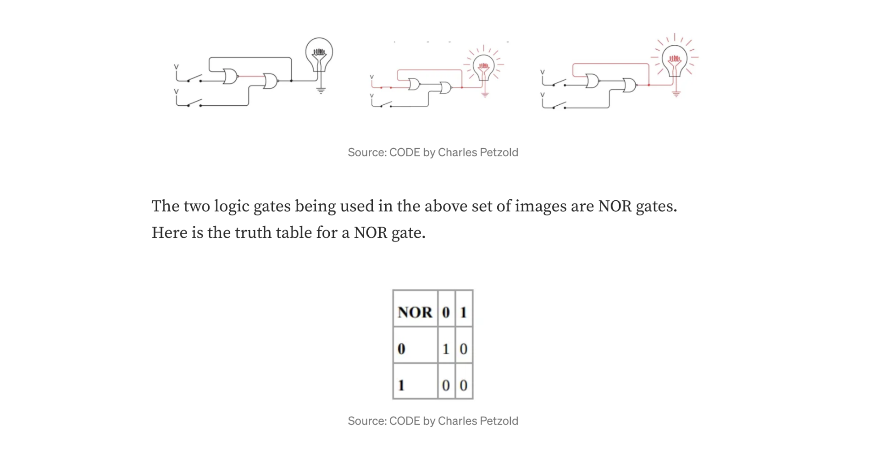
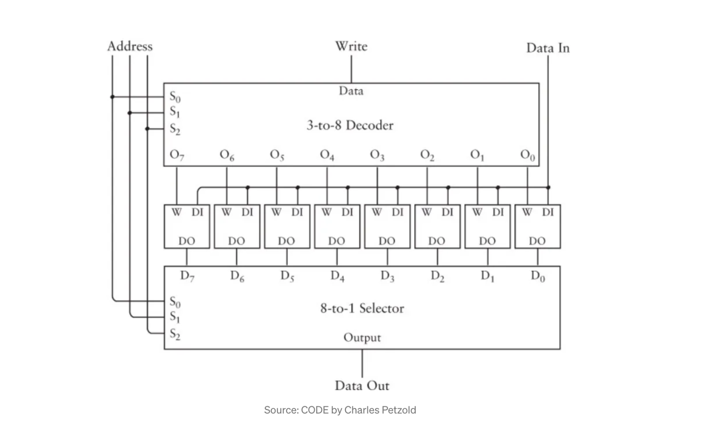

## Holding State

[이전 글](https://medium.com/swlh/how-computers-do-math-11af23139db)에서는 이진수와 회로의 전기 유무를 각각 0 또는 1로 모델링하는 방법을 배웠다. 하지만 전기 회로의 근본적인 문제는 일시적이라는 점이다. 현재 상태를 기억할 수 없다.

이 문제를 일부 논리 게이트를 조합해서 해결할 수 있다.



왼쪽 NOR 게이트는 초기에 두 입력이 모두 0이므로 1이 출력된다.

상단의 게이트를 닫으면 오른쪽 NOR 게이트의 출력은 모두 0이 되고 전구가 켜지므로 1이 된다.

이 상태에서 상단의 게이트를 열면 전구가 여전히 켜저 있게 된다.

왜? 오른쪽의 NOR 게이트에 대한 두 입력이 모두 여전히 0이므로 출력은 1로 유지된다. 이렇게 우리는 회로에 메모리를 생성한 것이다.

이제 상단의 게이트를 몇번이고 열고 닫아도 전구가 계속 켜져 있게 된다. 전구를 끄는 유일한 방법은 상단 게이트를 열어 두고 하단 게이트를 닫는 것이다.

이 회로는 일반적으로 플립플롭 회로(flip-flop circuit)라고 한다. 여기에 설명된 회로는 일반적으로 R-S 플립플롭(Reset-Set flip-flop)이다.

다음은 회로를 그리는 또 다른 방법이다. 전구가 제거되고 각 NOR 게이트에 대해 하나씩 2개의 출력이 표시되는 것만 제외하면 회로는 동일하게 유지된다.


하지만 RS플립플롭은 문제가 있다. 진리표를 보면 2개의 입력이 모두 1로 설정되어 있으면 출력이 불확실하다(indeterminate)는 것을 알 수 있다.

이를 피하기 위해, 레벨 트리거 D 타입 래치(level-triggered D-type latch)라는 것을 사용한다. 회로도는 다음과 같다.


다이어그램의 오른쪽 절반은 원래의 RS 플립플롭과 완전히 동일하다. 왼쪽 절반에는 데이터 입력과 클럭 입력이라는 2개의 입력에 연결된 2개의 추가 AND 게이트가 있다.

데이터 입력은 inverter에 연결되어 있기 때문에 2개의 AND 게이트에 동일한 입력을 제공할 수 없다. 클럭 입력은 일반적으로 0과 1을 번갈아 가며 현재 데이터 입력을 기억해야 하는지 여부를 결정하는 역할을 한다.

```bash
Inputs               Outputs
D    Clock           Q     Q_bar
0    1               0     1
1    1               1     0
X    0               Q     Q_bar
```

0 또는 1의 클럭 입력을 갖는 것에는 차이가 있다. 클럭 입력이 1일 때 출력Q 및 Q_bar는 각각 D의 항등식 및 역수를 반영한다. 클럭 입력이 0이면 입력D는 중요하지 않으며 출력은 동일하게 유지된다.

코드에서 level triggered flip flop을 모델링하면 다음과 같다.

```js
var levelTrigger = (function () {
  var state = null;

  return {
    getState: function () {
      return state;
    },

    flipflop: function (data, write) {
      state = write ? data : state;
    },
  };
})();
```

위 코드는 IIFE(즉시 호출 함수 실행)이다. 전역 범위에 노출하지 않고 함수의 내부 상태를 유지하기 위해 이를 사용했다.

이 flipflop 함수는 data와 write 매개변수를 기대한다. 오직 write가 1일 때만, state이 덮어씌워진다. 우리는 이렇게 비트를 저장하는 법을 알게 된 것이다.

위 코드를 아래와 같이 실행할 수 있다.

```js
levelTrigger.flipflop(0, 1);
levelTrigger.flipflop(1, 1);
levelTrigger.flipflop(0, 0);
var result = levelTrigger.getState();
```

## Assembling The Memory

위의 논리 게이트를 가져와서 이제 블랙박스로 표현하면 다음과 같다.<br>
아래 그림을 1비트 래치(1-bit latch)라고 부를 것이다.


위 그림에서 DO는 state 변수를 나타낸다.

이제 래치에 1비트 값을 저장할 수 있으므로 8개의 개별 래치에 8개의 1비트 값을 저장하여 8비트 값을 저장할 수 있다.

이러한 래치들이 8개가 있을 때, 이 래치들을 어떻게 구분할까?<br>
3비트 이진수를 사용하면 된다. 0에서 7까지의 숫자는 8개의 다른 값을 나타내며, 이진법에서는 000에서부터 111까지이다.

왜 구분하냐면, 메모리 주소를 나타내는 3비트 이진수로 메모리에서 이러한 각 함수를 나타내기 위함이다.

하지만 js는 c와 달리 메모리 엑세스를 허용하지 않는다. 예를 들어 c에서는 아래와 같이 함수 포인터의 주소에 접근할 수 있다.

```cpp
#include <stdio.h>
#include <stdlib.h>

int levelTrigger (int state, int data, int write) {
  if (write == 1) {
    state = data;
  }
  return state;
}

int main () {
  int (*funPtr)(int, int, int);
  funPtr = &levelTrigger;
  printf("%p", funPtr);
  return 0;
}
```

js를 사용하려면 약간의 조작이 필요하다. 일반 js 객체를 사용해서 내부 메모리를 나타낼 것이다.

```js
var levelTrigger = (function () {
  var memoryObj = {
    000: null,
    001: null,
    010: null,
    011: null,
    100: null,
    101: null,
    110: null,
    111: null,
  };

  return {
    getState: function (address) {
      if (!address) {
        throw new Error("Cannot access memory at undefined location");
      }

      try {
        return memoryObj[address];
      } catch (e) {
        throw new Error("Segmentation fault");
      }
    },

    writeData: function (address, data, write) {
      write ? (memoryObj[address] = data) : null;
    },
  };
})();
```

우리가 이렇게 구축한 논리회로를 물리적으로 보면 아래와 같다.



중간에 8개의 1비트 래치가 있으며, write 신호와 데이터 입력 신호가 제공된다. 주소는 8개의 래치를 각각 나타내는 3비트 주소이다.

3-to-8 decoder 및 8-to-1 selector는 공급되는 주소 신호를 기반으로 특정 메모리 주소를 대상으로 지정하는 기능을 수행하는 복잡한 논리 게이트이다.

객체의 key-value 쌍을 사용해서 js와 같은 프로그래밍 언어에서 구현할 수 있다.

3-to-8 decoder 및 8-to-1 selector가 수행하는 작업을 이해하려면 [여기](https://learnabout-electronics.org/Digital/dig42.php)와 [여기](https://www.elprocus.com/designing-3-line-to-8-line-decoder-demultiplexer/)를 읽어보면 좋다. 일단은 특정 메모리 주소에 맵핑하기 위해 전기 신호를 공급하는 회로 정도로만 이해해도 충분하다.

## The Size Of Memory

지금까지 배운 바에 의하면, 총 8비트의 메모리를 제공하기 위해 8개의 1비트 값을 저장할 수 있다. 위에서 구축한 것을 일반적으로 `8x1 RAM Array`라고 한다. 8비트로 제한한 이유는 3비트 메모리 주소를 사용했기 때문이다.

`2^3 = 8`이므로 일반 공식은 다음과 같다.

- `2^n`은 저장할 수 있는 총 비트의 수이며, 여기서 n은 메모리 주소의 비트 수이다.

각 주소가 1비트를 저장할 수 있는 4비트 메모리 주소가 있는 경우 아래와 같은 `16x1 RAM Array`를 갖게 된다.


메모리 주소가 10비트인 경우, 2^10=1024이므로 1024개의 개별 비트를 저장할 수 있다.

하지만 각 메모리 주소에 8비트를 더 저장할 수 있다면 어떻게 될까? 그러면 총 비트 수는 `1024*8 = 8192`가 된다. 이를 확장하면 각 주소에 8비트가 저장된 16비트 메모리 주소를 가질 수 있다.


## Visualizing Memory

잠시 시간을 내어 컴퓨터에서 메모리가 어떻게 "보이는지" 대략적으로 추정해보자. 우리는 n비트 숫자를 사용하여 메모리의 다른 주소를 참조할 수 있다는 것을 알고 있다. 여기서 n은 1과 16 사이의 숫자일 수 있다. 이를 물리적으로 나타내면 다음과 같이 보일 수 있다.


오른쪽 열의 각 블록은 별도의 메모리 조각을 나타낸다. 메모리의 각 조각은 구성 방법을 이미 살펴본 8개의 1비트 래치로 구성된다.

왼쪽 열은 각 블록의 3비트 주소를 나타낸다. 특정 숫자에 대한 메모리 주소에 엑세스하여 8비트 숫자에 엑세스할 수 있다.

우리는 내부 메모리를 표현하기 위해 js의 객체를 사용했으므로, 우리는 `memoryObj[address]`로 접근할 수 있다.

## Automation

이제 메모리가 어떻게 구성되는지 알아냈으니 메모리를 활용하여 몇 가지 기본 작업을 수행해볼 수 있다. 예를 들어 addition을 해보자.

이전에 만든 가산기에서는 2개의 8비트 숫자를 더하고 결과를 얻을 수 있는 함수를 만들었다. 이제 일련의 8비트 숫자를 더하고 중간 결과에 대해 걱정할 필요 없이 최종 결과를 얻으려면 어떻게 해야 할까?

우리는 모든 중간 결과를 8비트 래치에 저장할 수 있고 총합을 계속해서 업데이트할 수 있다. 우리는 이미 8비트 가산기를 설계해 중간 결과와 다음 숫자를 8비트 가산기에 계속 공급하여 합계를 계속 업데이트 할 수 있다.

이전 글에서 만든 fullAdder 코드를 가져와서 코드를 작성하면 아래와 같다.

```js
const fullAdder = require("../binary-adder/fullAdder");

var levelTrigger = (function () {
  var memoryObj = {
    000: "00000001",
    001: "00000000",
    010: "00000000",
    011: "00000000",
    100: "00000000",
    101: "00000000",
    110: "00000111",
    111: null,
  };

  return {
    getState: function (address) {
      if (!address) {
        throw new Error("Cannot access memory at undefined location");
      }

      try {
        return memoryObj[address];
      } catch (e) {
        throw new Error("Segmentation fault");
      }
    },

    writeData: function (address, data, write) {
      write ? (memoryObj[address] = data) : null;
    },

    memoryIteration: function* () {
      for (const key in memoryObj) {
        if (key !== "111") {
          yield memoryObj[key];
        }
      }
    },
  };
})();

function convert2Decimal(bin) {
  return bin ? parseInt(bin, 2) : null;
}

const gen = levelTrigger.memoryIteration();
let sum = 0;
for (const num of gen) {
  let parsedNum = convert2Decimal(num);
  sum = fullAdder.add(sum, parsedNum);
  levelTrigger.writeData(111, sum, 1);
}
console.log(sum);
console.log(levelTrigger.getState(111));
```

자동화가 아직은 부족하다. 이를 확장해보자.

## Extending Automation

자동화를 확장하는 방법을 파악하기 전에 빠른 추상화(abstraction)를 만들 것이다. levelTrigger를 제거하고 대신 js 객체 또는 ES6 맵을 직접 반복한다. 객체 또는 맵 내의 모든 값에는 levelTrigger를 포함할 수 있다. 그리고 이 levelTrigger는 8비트 상태를 유지할 수 있다.

자동화를 위해 load, add, store, halt 작업을 추가할 수 있다. 아래 그림은 우리가 하려는 작업을 시각적으로 나타낸 것이다.


load : 이 메모리의 숫자를 누산기에 로드한다.<br>
add : 이 메모리 주소에서 숫자를 가져와 누산기 합계에 추가한다.<br>
store : 이 메모리 주소에 누산기 합계를 저장한다.

이러한 작업을 하려면 해결해야 하는 2가지 문제가 있다.

각 블록에서 사용 가능한 메모리가 거기에 저장된 8비트 숫자로 점유되기 때문에 이 명령어 세트(instruction set)를 저장할 방법이 없다.
우리는 명령어 세트를 바이너리로 설명하는 방법을 찾아야 한다. 그것이 우리가 원하는 것을 컴퓨터가 이해하도록 하는 유일한 방법이기 때문이다. <br>우리는 아직 문자열을 만나지 않았다.

먼저 문제 1을 해결해보자.

우리는 8비트 이진수를 RAM 배열에 저장해왔다. RAM Array의 크기는 이미 앞에서 설명한 것처럼 다를 수 있다. 명령 세트를 저장하기 위해 다른 RAM Array를 사용하는 게 어떨까? 명령어 세트가 작업을 수행하려는 메모리 주소와 일치하도록 저장한다.


이제 특정 데이터 조각에 대해 수행하려는 명령이 있는 메모리 주소에 해당하는 2개의 RAM Array가 있다. 우리가 해야 할 일은 두 배열을 동시에 반복하여 데이터를 따라 이동할 때, 각 데이터 조각에 대해 필요한 명령을 수행하는 것이다.

이제는 두번째 문제를 해결해 보자.

이번 글에서는 8비트로 가능한 가장 큰 3개의 이진수를 사용하여 각각 load, add 및 store의 명령어 세트를 나타낼 것이다. (실제 코드 책에서는 16진수 시스템을 사용했다.)

```bash
Load: 11111101 (253)
Add: 11111110 (254)
Store: 11111111 (255)
```

이제 js에서 데이터 및 코드 RAM 배열을 표현해보자.

먼저 레벨 트리거 래치를 나타내는 IIFE를 제거할 것이다. js 맵을 사용하여 두 RAM 배열을 모두 저장할 것이다. 그리고 코드를 더 간단하게 만들어야 하고 js의 맵이 key 순서를 유지하기 때문에 js 객체를 맵으로 대체할 것이다.

```js
const dataMap = new Map([
  ["000", "00000001"],
  ["001", "00000001"],
  ["010", "00000001"],
  ["011", "00000001"],
  ["100", "00000001"],
  ["101", "00000001"],
  ["110", "00000111"],
  ["111", "00000001"],
]);
const codeMap = new Map([
  ["000", "11111101"],
  ["001", "11111110"],
  ["010", "11111110"],
  ["011", "11111110"],
  ["100", "11111111"],
  ["101", "11111101"],
  ["110", "11111110"],
  ["111", "11111111"],
]);
```

이제는 코드와 데이터에 대한 맵을 각각 반복할 수 있다(Map.entries()를 사용해서).<br>
우리는 마주치는 명령어세트에 따라 무엇을 해야 하는지 알아낼 방법이 필요하다. 간단한 switch case 문이 이를 처리한다.

```js
function runInstructionSet(memoryAdd) {
  const dataAtAddress = getAtAddress(dataDOM, memoryAdd);
  const instructionAtAddress = getAtAddress(codeDOM, memoryAdd);
  switch (instructionAtAddress) {
    case "11111101":
      loadDataIntoAccumulator(dataAtAddress);
      break;
    case "11111110":
      addToAccumulator(dataAtAddress);
      break;
    case "11111111":
      storeInMemoryAdd(dataAtAddress, memoryAdd);
      break;
  }
}
```

## 참고자료

- [Building Memory With Logic Gates](https://medium.com/swlh/building-memory-with-logic-gates-f36aec5c11b2)
