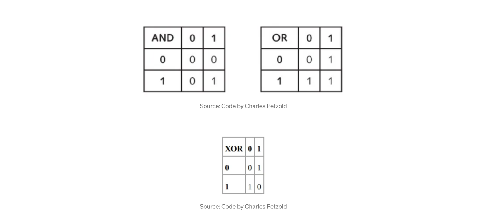
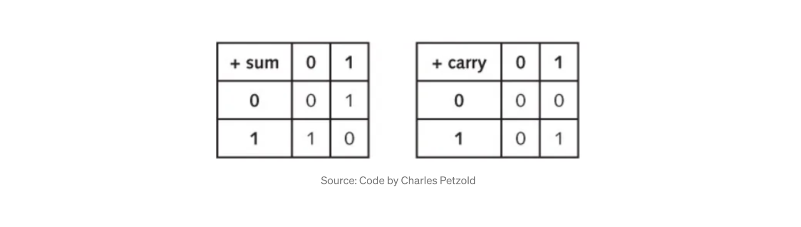
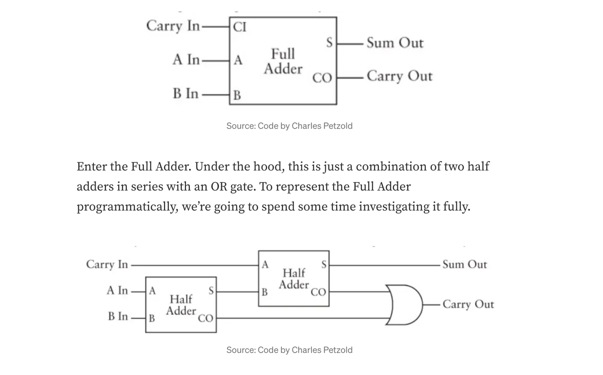
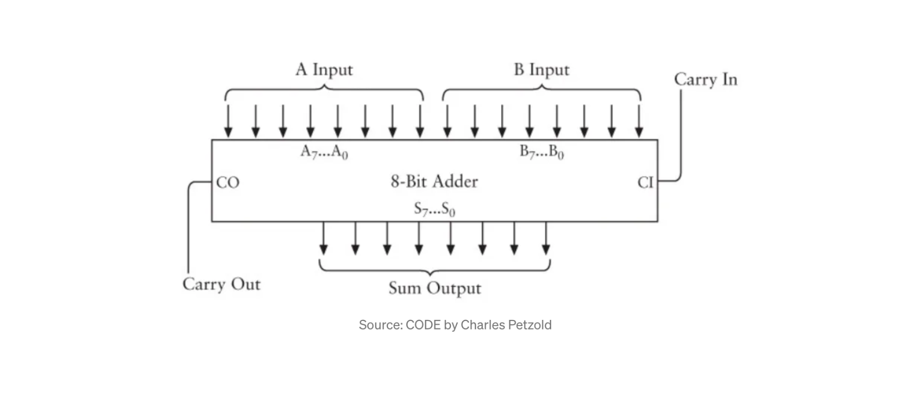
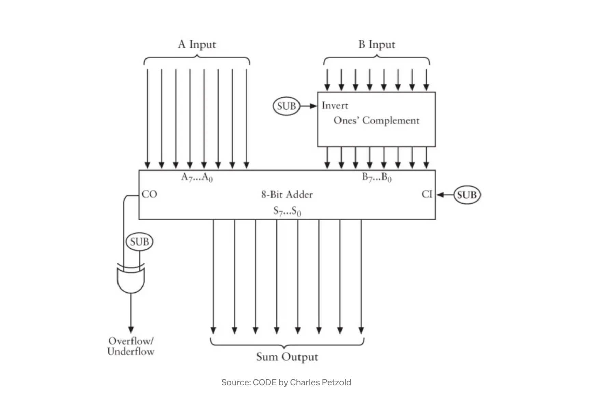

## 이진법이 필요한 이유를 생각해보기

우리는 왜 숫자를 1,2,3,4,5,6,7,8,9,10으로 셀까? 가능 한 이유 중 하나는 우리 손의 손가락 숫자이다. 우리는 손가락을 10개를 가졌으므로 숫자 체계도 그렇게 발전한 것이다. 우리는 전기 회로와 같은 사치를 누릴 수 없다. 회로는 전선을 통해 흐르는 전류의 있음 또는 없음이라는 2가지 상태 중 하나로 나타낼 수 있다. 이때 1과 0으로 표현한다.

다만 궁금해야 할 것은 왜 1과 2가 아니라 1과 0일까에 대한 질문이다.

## 0(zero)의 중요성

힌두-아랍 숫자 체계에서는 205를 다음과 같이 생각할 수 있다.

`205 = 2*100 + 0*10 + 5*1`

0(zero)는 숫자 체계가 위치적인 체계로 만들어준다.

## 이진법으로 세기

이진수로 계산하는 방법은 다음과 같다.

`00, 01, 10, 11 ... `

이러한 각 숫자를 비트(bit)라고 하며, 이들은 2비트 이진수(two-bit binary numbers)이다.

2비트와 이진법을 혼동하면 안 된다.<br>
이진수는 각 위치에서 0 또는 1을 의미하는 반면, 비트 수는 각 숫자의 자릿수를 나타낸다.

이제 이진수에 대해 부울 대수(Boolean Algebra) 연산을 수행하는 방법을 배워야 한다.

아래는 3가지 부울 대수 연산 결과의 이미지이다. 논리 게이트라고도 한다.



위 논리 게이트를 javascript로 표현하면 다음과 같다.

```js
AND &
OR |
XOR ^
```

이들은 비트 연산자라고 부른다.

## Binary Adding Machine 만들기

2개의 이진수를 더하면 아래와 같다.

```js
+   0   1
0   00   01
1   01   10
```

결과를 2비트로 표현하는데, 오른쪽 비트는 sum 비트라고 하며 왼쪽 비트는 carry 비트라고 한다.



## Circuits과 Code를 결합하기

1. 우리는 js에서 3가지 논리게이트와 해당하는 연산자를 알고 있다. (&, |, ^)
2. sum과 carry 테이블을 사용해서 2개의 이진수를 더하는 방법을 알고 있다.

이제 우리는 2를 이진수로 표현하는 방법을 알아내야 한다.

sum 테이블은 XOR 비트 연산자의 테이블과 정확히 일치한다.

```js
let a = [0, 1];
let b = [0, 1];

for (let i = 0; i < a.length; i++) {
  for (let j = 0; j < b.length; j++) {
    console.log(`${a[i]} + ${b[j]} = ${a[i] ^ b[j]}`);
  }
}
/**
0 + 0 = 0
0 + 1 = 1
1 + 0 = 1
1 + 1 = 0
 */
```

다음으로 carry 테이블을 고려해보자.<br>
carry 테이블은 AND 테이블과 정확히 일치한다.

```js
let a = [0, 1];
let b = [0, 1];

for (let i = 0; i < a.length; i++) {
  for (let j = 0; j < b.length; j++) {
    console.log(`${a[i]} + ${b[j]} = ${a[i] & b[j]}`);
  }
}
/**
0 + 0 = 0
0 + 1 = 0
1 + 0 = 0
1 + 1 = 1
 */
```

그러므로 우리는 2개의 1비트 이진수를 더하고 AND 게이트와 XOR 게이틀 조합해서 sum 비트와 carry 비트를 얻을 수 있다. 이것을 Half Adder라고 부를 것이다.


이제 우리는 2개의 이진수(1010, 0101)를 더해볼 것이다. (10진수로는 두 숫자는 5와 10에 해당한다.)

```bash
1 0 1 0
0 1 0 1
-------
1 1 1 1
```

모든 열이 동일한 작업(1과 0의 합)이므로 모든 열이 1이 된다. 이를 코드로 표현하면 다음과 같다.

```js
function halfAdder(a, b) {
  return { sum: a ^ b, carry: a & b };
}

function convert2Binary(num) {
  let str = "0000000" + num.toString(2);
  // (str.slice(-8, str.length)) === ('00000000' + num.toString(2)).substr(-8)
  return str.substring(str.length - 8);
}

function performReduction(acc, curr, index) {
  const result = halfAdder(curr, binSplit[index]);
  acc.push(result.sum);
  return acc;
}

function add(a, b) {
  const bin1 = convert2Binary(a); // 00000101
  const bin2 = convert2Binary(b); // 00001010

  binSplit = bin2.split("");
  // arr.reduceRight(callback[, initialValue])
  // callback의 경우 "(preValue, curValue, index, array) => { ... }"
  return bin1.split("").reduceRight(performReduction, []).reverse().join("");
}

const result = add(5, 10);
console.log(result); // 00001111
```

위에서 생성한 add 함수를 사용하면, 정상적으로 5와 10의 덧셈 결과인 15가 출력된다.

하지만 위 예제에서는 추가적인 이월이 없다. 다음과 같이 1과 1을 더하는 경우(즉, 이월이 발생하는 경우)는 어떻게 처리해야 할까?

```bash
0 0 1 1
1 0 1 1
-------
1 1 1 0
```

위에서 작성한 js 코드는 하나의 열에서 다음 열로의 이월을 고려하지 않기 때문에 정답을 제공할 수 없다. 사실 반가산기(Half Adders)는 2개의 입력(비트A, 비트B)만 설명하므로 우리의 반가산기로도 이를 해결할 수 없다.

즉, 우리는 3개의 입력 비트를 처리할 수 있는 무언가가 필요하다.

## The Full Adder (전가산기)



위 그림은 OR 게이트와 직렬로 연결된 2개의 반가산기 조합이다.

```bash
0 0 1 1
1 0 1 1
-------
1 1 1 0
```

1과 1을 더하면 이월이 돼서 OR 게이트로 공급된다.

전가산기(Full Adder)를 코드로 표현하면 다음과 같다.

```js
/**
 *
 * @param {String} a
 * @param {String} b
 * @param {String} carryIn
 */
function fullAdder(a, b, carryIn) {
  const [halfSum1, halfCarry1] = halfAdder(a, b);
  const [halfSum2, halfCarry2] = halfAdder(carryIn, halfSum1);
  return { sum: halfSum2, carryOut: halfCarry1 | halfCarry2 };
}

/**
 *
 * @param {String} a
 * @param {String} b
 */
function halfAdder(a, b) {
  return [a ^ b, a & b];
}

/**
 *
 * @param {Number} num
 * @param {Number} padding
 * @return {String}
 */
function convert2Binary(num, padding) {
  let str = "00000000" + num.toString(2);
  return str.substring(str.length - padding);
  // return ('00000000' + num.toString(2)).substr(-padding);
}

/**
 *
 * @param {String} bin
 * @returns {Number}
 */
function convert2Decimal(bin) {
  return parseInt(bin, 2);
}

/**
 *
 * @param {String} num1
 * @param {String} num2
 */
function addReduction(num1, num2) {
  let binSplit = num2.split("");
  let carryIn = 0;
  let result = num1
    .split("")
    .reduceRight(function performReduction(acc, curr, index) {
      const result = fullAdder(curr, binSplit[index], carryIn);
      carryIn = result.carryOut;
      acc.push(result.sum);
      return acc;
    }, []);
  carryIn === 1 ? result.push(carryIn) : null;
  return result.reverse().join("");
}

/**
 *
 * @param {String} num1
 * @param {String} num2
 * @param {Number} operationBit 0 to perform addition, 1 to perform subtraction
 * @returns {String}
 */
function binaryAdder(num1, num2) {
  return addReduction(num1, num2);
}

/**
 *
 * @param {String} num1
 * @param {String} num2
 * @returns {String}
 */
function add(num1, num2) {
  const bin1 = convert2Binary(num1, 8);
  const bin2 = convert2Binary(num2, 8);
  const result = binaryAdder(bin1, bin2);
  return convert2Decimal(result);
}

const result = add(3, 11);
console.log(result); // 14
```

위 코드를 그림으로 본다면 아래와 같다.



각 열의 계산에는 전가산기가 필요하다. 그래서 8비트 가산기는 8개의 전가산기로 구성되어 있다.

## Binary Subtraction Machine 만들기

> [참고]
> 우리가 구축하는 Binary Subtraction Machine의 코드에는 2가지 제한 사항이 있다. (복잡성을 줄이기 위해서)
>
> - 8비트 숫자만 처리할 수 있다.
> - 양수 결과가 있는 숫자만 뺄 수 있다.

```bash
253      Minuend
-176      Subtrahend
----
 077      Result
```

뺄셈을 수행하려면 왼쪽 숫자에서 빌려야 한다. 이를 이진수로 풀기는 굉장히 까다롭다. 그래서 Code 책에서는 약간의 수학 트릭을 사용한다.

```bash
   253 - 176
=  253 - 176 + 1000 - 1000           // add and subtract 1000
=  253 - 176 + 999 + 1 - 1000        // split 1000 into 999 + 1
=  253 + (999 - 176) + 1 - 1000      // rearrange the numbers
=  77
```

위 풀이에서 가장 중요한 부분은 (999-176)이다. 이 결과를 9’s complement(보수) of 176 라고 한다.

이진수에서는 이것을 1의 보수라고 하며, 다음과 같이 표현된다. 여기서는 비트로 가능한 가장 큰 수인 255에서 이진수 표현을 뺀다.

```bash
  255 - 176
= 11111111 - 10110000
= 01001111
```

뺄셈의 R.H.S에 있는 이진수와 뺄셈의 결과를 자세히 살펴보면 결과가 R.H.S의 정반대임을 알 수 있다.

js에서 이를 표현하는 방법은 ~ 연산자이다. 하지만 js의 양수 및 음수, 이진수 표현에는 문제가 있다.

js는 모든 숫자를 부동 소수점(floating points)으로만 나타낸다. 내부적으로 이 숫자를 정수로 변환하고 계산을 수행한 다음 다시 변환한다. js는 내부 표현을 위해 부호 있는 정수와 부호 없는 정수를 모두 사용한다.

그래서 js에서 ~ 연산자를 사용하려면 부호가 없는 정수만 처리해야 한다.

js는 느슨한 형식의 언어이므로 부호 있는 정수를 부호 없는 정수로 강제 변환한 다음 처리할 수 있다.

우리가 사용할 연산자는 >>> 연산자이다. (정수 처리)

앞에서 우리가 만든 convert2Binary 함수에 추가적인 기능을 넣을 것이다.

```js
function convert2Binary(num, padding) {
  return ("00000000" + (num >>> 0).toString(2)).substr(-padding);
}
```

우리가 하려는 연산은 다음과 같다.

```bash
253 + (999 - 176) + 1 - 1000
      |    a    |
|      b         |
|             c      |
|               d           |
```

수직선은 각 단계의 경계를 나타낸다. 예를 들어 a 단계는 괄호 안의 숫자에 대해서만 작동한다. 다음은 빼기 함수에 대한 코드이다.

```js
/**
 *
 * @param {String} num1 The minuend
 * @param {String} num2 The subtrahend
 */
function subtract(num1, num2) {
  if (num1 > 255 || num2 > 255) {
    throw new Error("Sorry, can only handle 8-bit numbers");
  }
  const bin1 = convert2Binary(num1, 8); //minuend
  const bin2flip = convert2Binary(~num2, 8); // 1's complement of subtrahend
  const result1 = binaryAdder(bin1, bin2flip);
  const result2 = binaryAdder(result1, convert2Binary(1, 8));
  const result3 = binaryAdder(result2, convert2Binary(256, 9), 1);
  return convert2Decimal(result3);
}
```


XOR 게이트는 빼기 연산에 있어 우리에게 정확히 필요한 걸 제공해준다. 다만 수행하려는 연산이 뺄셈인지 덧셈인지를 구분하기 위해 매개변수로 구분한다. 0(기본값)이면 덧셈이고 1이면 뺄셈을 의미한다.

```js
/**
 *
 * @param {String} num1
 * @param {String} num2
 * @param {Number} operationBit 0 to perform addition, 1 to perform subtraction
 * @returns {String}
 */
function binaryAdder(num1, num2, operationBit = 0) {
  if (num1.length !== num2.length) {
    let l = num1.length > num2.length ? num1.length : num2.length;
    num1 = convert2Binary(convert2Decimal(num1), l);
    num2 = convert2Binary(convert2Decimal(num2), l);
  }
  return operationBit ? subReduction(num1, num2) : addReduction(num1, num2);
}
```

전체 코드는 아래와 같다.

```js
/**
 *
 * @param {String} a
 * @param {String} b
 * @param {String} carryIn
 */
function fullAdder(a, b, carryIn) {
  const [halfSum1, halfCarry1] = halfAdder(a, b);
  const [halfSum2, halfCarry2] = halfAdder(carryIn, halfSum1);
  return { sum: halfSum2, carryOut: halfCarry1 | halfCarry2 };
}

/**
 *
 * @param {String} a
 * @param {String} b
 */
function halfAdder(a, b) {
  return [a ^ b, a & b];
}

/**
 *
 * @param {String} a
 * @param {String} b
 */
function fullSubtractor(a, b) {
  return a ^ b;
}

/**
 *
 * @param {String} bin
 * @returns {Number}
 */
function convert2Decimal(bin) {
  return parseInt(bin, 2);
}

/**
 *
 * @param {Number} num
 * @param {Number} padding
 * @return {String}
 */
function convert2Binary(num, padding) {
  return ("00000000" + (num >>> 0).toString(2)).substr(-padding);
}

/**
 *
 * @param {String} num1
 * @param {String} num2
 */
function subReduction(num1, num2) {
  let binSplit = num2.split("");
  let result = num1
    .split("")
    .reduceRight(function performReduction(acc, curr, index) {
      let result = fullSubtractor(curr, binSplit[index]);
      acc.push(result);
      return acc;
    }, []);
  return result.reverse().join("");
}

/**
 *
 * @param {String} num1
 * @param {String} num2
 */
function addReduction(num1, num2) {
  let binSplit = num2.split("");
  let carryIn = 0;
  let result = num1
    .split("")
    .reduceRight(function performReduction(acc, curr, index) {
      const result = fullAdder(curr, binSplit[index], carryIn);
      carryIn = result.carryOut;
      acc.push(result.sum);
      return acc;
    }, []);
  carryIn === 1 ? result.push(carryIn) : null;
  return result.reverse().join("");
}

/**
 *
 * @param {String} num1
 * @param {String} num2
 * @param {Number} operationBit 0 to perform addition, 1 to perform subtraction
 * @returns {String}
 */
function binaryAdder(num1, num2, operationBit = 0) {
  if (num1.length !== num2.length) {
    let l = num1.length > num2.length ? num1.length : num2.length;
    num1 = convert2Binary(convert2Decimal(num1), l);
    num2 = convert2Binary(convert2Decimal(num2), l);
  }
  return operationBit ? subReduction(num1, num2) : addReduction(num1, num2);
}

/**
 *
 * @param {String} num1
 * @param {String} num2
 * @returns {String}
 */
function add(num1, num2) {
  const bin1 = convert2Binary(num1, 8);
  const bin2 = convert2Binary(num2, 8);
  const result = binaryAdder(bin1, bin2);
  return convert2Decimal(result);
}

/**
 *
 * @param {String} num1 The minuend
 * @param {String} num2 The subtrahend
 */
function subtract(num1, num2) {
  if (num1 > 255 || num2 > 255) {
    throw new Error("Sorry, can only handle 8-bit numbers");
  }
  const bin1 = convert2Binary(num1, 8); //minuend
  const bin2flip = convert2Binary(~num2, 8); // 1's complement of subtrahend
  const result1 = binaryAdder(bin1, bin2flip);
  const result2 = binaryAdder(result1, convert2Binary(1, 8));
  const result3 = binaryAdder(result2, convert2Binary(256, 9), 1);
  return convert2Decimal(result3);
}

const result = subtract(200, 100);
```

위 코드는 완벽한 것은 아니지만, 거의 동일한 기능을 동일한 방식으로 수행한다. 물리적으로 표현하면 아래 그림과 같다.



B입력은 SUB 신호를 받는 1의 보수(complement)를 통과한다. SUB 신호는 0 또는 1이다. 0이면 B입력이 반전되지 않고, 그 반대도 마찬가지이다.

## 참고자료

- [How Computers Do Math](https://medium.com/swlh/how-computers-do-math-11af23139db)
- [Negative numbers to binary string in JavaScript](https://stackoverflow.com/questions/16155592/negative-numbers-to-binary-string-in-javascript)
- [How do I convert an integer to binary in JavaScript?](https://stackoverflow.com/questions/9939760/how-do-i-convert-an-integer-to-binary-in-javascript)
