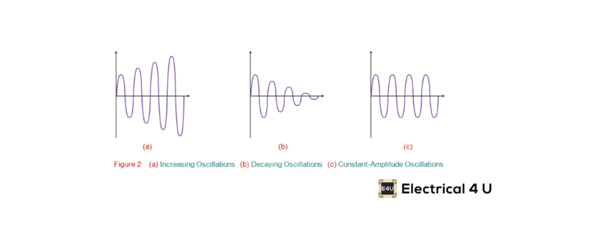
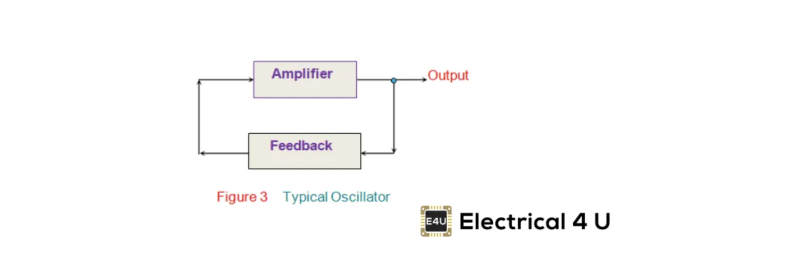
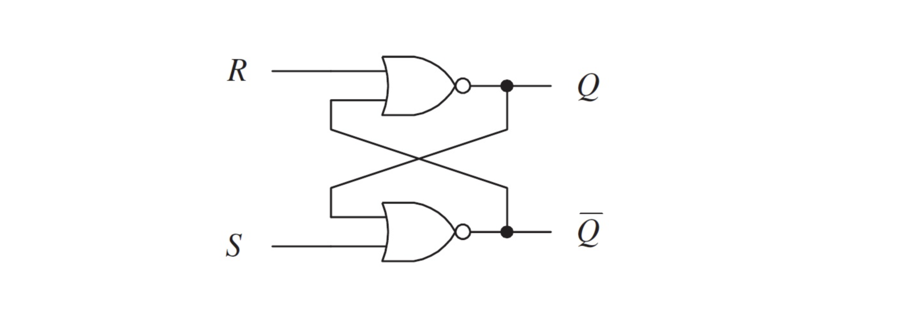
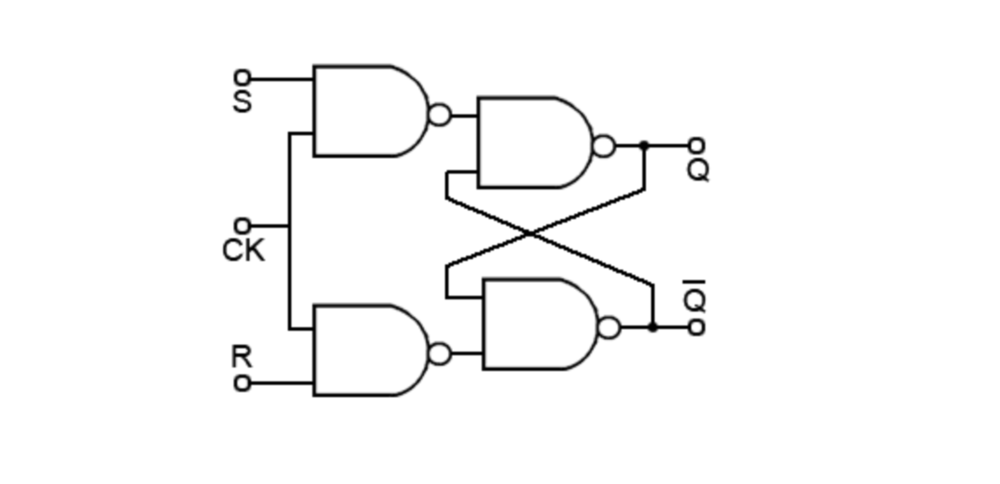
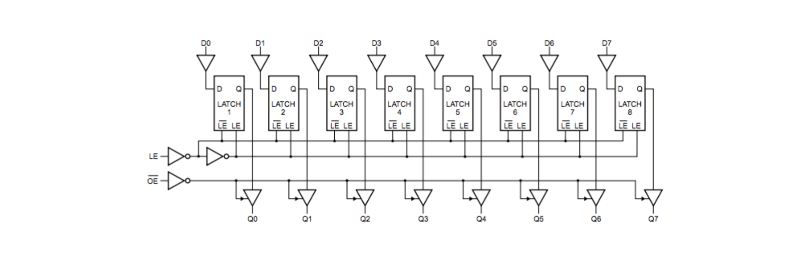

## Oscillator

앞서 adder를 통해 0과 1로 계산이 가능하다는 걸 배웠다. 
그 다음으로는 언제 계산할 것인가를 결정해야 한다.

데이터가 input될 때 input에 따라 output이 발생하고 이 output이 다음 input으로 들어간다든지 하려면 계산이 순차적으로 되어야 한다. 계산 시점이 꼬이면 원하는 결과를 얻을 수 없다. 보통 컴퓨터는 아주 미세한 간격으로 일정하게 동작하는데 우리는 이걸 clock이라고 부른다.

clock은 Oscillator을 통해 만들 수 있다.

Oscillator는 그 어떤 input 없이도 continuous, repeated, alternating waveform을 만들어낸다.

연속적이고 일정한 진폭의 진동을 얻으려면 적절하게 에너지 손실을 보상해야 한다. 손실된 에너지보다 많이 에너지를 보상하면 진동의 진폭이 증가해 출력이 왜곡된다. 반대로 너무 적은 에너지를 보상하면 진폭이 감소해 지속 불가능한 진동이 되고 만다.

Oscillator는 NOT 게이트의 원리와 같다. 손실된 에너지만큼 NOT을 걸어 보상하면 일정한 진동의 진폭을 유지할 수 있기 때문이다. Oscillator는 입력을 positive or regenerative feedback을 제공하는 일종의 amplifier circuits이다.

NOT 게이트가 0과 1을 아주 짧은 간격으로 반복하며 일정한 진동의 진폭을 유지하는 회로를 내부적으로 Oscillator라고 부르는 것이다.

이 Oscillator를 사용해서 우리가 원하는 clock을 만들어 낸다. 이 짧은 간격(0에서 1이 될 때)마다 CPU가 동작한다. 그럼 얼마나 짧은 간격으로 CPU가 동작하는가?

CPU clock frequency를 통해 CPU 동작 속도를 알아낼 수 있는데, Hz 단위를 쓴다. 1Hz면 하나의 사이클을 도는데 1초가 걸린다는 의미이다.

1GHz = 1,000,000,000Hz => 1초에 1,000,000,000 사이클이 돈다는 의미이다. Hz가 높을수록 1초에 더 많은 사이클을 수행할 수 있다는 의미가 된다. 참고로 Over-Clock은 사용자가 임의로 클럭을 높여 컴퓨터를 빠르게 쓰는 걸 말한다.

## Flip-Flop

Multiplexers, Demultiplexers, Encoders, Decoders, Parity Generators and Checkers 등과 같은 회로들은 조합논리회로(Combinational Logic Circuit)이다. 이 유형의 회로들은 입력의 또는 출력의 현재 상태에만 의존한다.

반면 과거의 입력/출력에도 의존하는 회로가 있다. 순차논리회로(Sequential Logic Circuit)이다. 나중에 데이터를 사용하기 위해 저장할 수 있는 메모리는 이러한 순차논리회로로 이루어져 있다. 그리고 이렇게 데이터를 저장하고 메모리 단위로 동작할 수 있는 장치를 Latches 또는 Flip-Flops라고 부른다(latch와 flip-flop은 기술적으로는 다르지만 동의어로 사용되기도 한다. flip-flop은 clock-controlled latch로서 clock signal가 있을 때만 output을 변경한다).

flip-flop은 1 bit의 데이터를 저장할 수 있는 기본 memory unit이다. 
2가지 상태를 갖는다(High와 Low).

flip-flop은 2개의 NOR 게이트를 조합해서 만들 수 있다.

예를 들어 위 그림을 보면 
R과 Q1이 모두 0이므로 Q2가 1이 된다. 
S는 0이고 Q2는 1이므로 Q3이 0이 돼서 Q1으로 들어간다.

이 상태에서 스위치 R을 누르면 
Q1은 0이고 R은 1이므로 Q2는 0이 된다. 
Q2는 0이고 S도 0이므로 Q3은 1이 돼서 전기가 흐른다.

이 상태에서 스위치 R을 다시 누르면 
Q1은 1이고 R은 0이 되므로 Q2는 0이 된다. 
Q2와 S 모두 0이므로 Q3가 여전히 1이 된다.

즉, 스위치를 눌러서 Q3에 전기가 흐르게 하다가, 스위치를 다시 눌러 끄더라도 Q3에는 여전히 전기가 흐른다. 즉, 데이터가 저장되는 개념이 된다.

1과 0은 기본적으로 전기를 켜고 끄는 개념이지만 회로를 이렇게 구성하면, 
1은 과거에 전기가 켜졌었다는 의미로, 0은 과거에 전기가 꺼졌었다는 의미로 발전하게 된다.

### SR Flip-Flop (Set-Reset flip-flop)

위 개념을 스위치를 구분해서 하는 Set, Reset으로 구분하면 아래 그림과 같다. 
Set 스위치는 1을 기억(저장)하는 역할을 하고 
Reset 스위치는 1을 삭제하고 0을 삽입한다.

그리고 가운데에 회로를 추가해서 set과 Reset을 동시에 누르는 게 불가능하도록 만든다. Q는 ~Q의 반대값일 수밖에 없다.

### Clocked(Level-triggered) SR flip-flop

level triggered flip-flop이라고도 한다.

기존 SR flip-flop에서 clock을 추가한 회로이다. 
(NOR 게이트를 사용해도 되고, NAND 게이트를 사용해도 된다)

clock이 없으면 control signal에 민감해지므로 이 문제를 해결하기 위해 clock를 추가함으로써 Clock signal이 device edge에 민감해지도록 만든다.

clock 회로를 추가하고 AND 게이트로 묶음으로써, 
clock이 1이어야만 다음 단계로 넘어갈 수 있게 만든다. 이렇게 함으로써 클럭 사이클에 맞춰서 동작할 수 있게 만드는 것이다.

clocked가 전제된 걸 일반적인 SR flip-flop으로 부르곤 한다.

### Level-triggered D-type flip-flop

E는 Edge이다. (clock과 유사하지만 조금 다르다)

기존의 RS flip-flop이 2개의 input(Set, Reset)을 갖는데, 
이 2개의 input을 1개의 input(Data)로 바꾸고 NOT 게이트를 붙인 회로.

- R과 S 둘 다 1일 경우를 피하도록
- R과 S 둘 다 0이어도 Q 값에 영향을 안 줄 수 있게

Edge가 1일 때만 동작해서 데이터를 저장할 수 있는 회로.

## Latch

하나의 Level-triggered D-type flip-flop를 1 bit latch라고 부른다. 
1 bit latch는 1 bit를 일시적으로 저장할 수 있는 메모리가 된다.

latch를 여러 개 연결하면 그만큼 데이터를 많이 저장할 수 있다. 
latch를 8개 연결해 8-bit latch를 만들면 2^8 bit만큼 데이터를 저장할 수 있게 되는 것이다.

## Flip-flop과 Latch 차이

flip-flop과 latch 모두 1 bit를 기억할 수 있는 장치이다.

둘의 차이점을 이해하려면, 우선 edge와 level의 차이를 알아야 한다.

edge는 low => high 혹은 hight => low로 변하는 과정에 걸리는 interrupt이다. 
반면 level은 low이거나 high일 때의 interrupt이다.

일반적으로 flip-flop은 edge sensitive하다. clock에 의존하므로 0에서 1로 1에서 0으로 변하는 과정에 interrupt가 걸린다. 즉, 동기식으로 동작한다. 
그래서 flip-flop은 2개의 입력을 갖는다. 
데이터 기억, 토글, 기록/삭제 등에 사용된다.

반면 latch는 level sensitive하다. clock에 의존하지 않고 0 혹은 1인 상태에 그 자체에 민감하므로 비동기식으로 동작한다. 반드시 0에서 1로, 혹은 1에서 0으로라는 순서를 지킬 필요가 없다. 
그래서 latch는 1개의 data 입력을 갖는다. 
데이터를 잠시 저장했다가 그대로 전달할 때 사용함.

flip-flop도 물론 비동기적으로 동작하곤 한다. 초기화의 경우 비동기 입력으로 동작한다.

## 참고자료

- [Oscillators: What Are They? (Definition, Types, & Applications)](https://www.electrical4u.com/what-is-an-oscillator/)
- [Timing Decisions 101: Oscillator or Clock?](https://www.electronicdesign.com/technologies/test-measurement/article/21248014/skyworks-solutions-timing-decisions-101-oscillator-or-clock)
- [SR Flip Flop-Designing using Gates and Applications](https://www.electronicshub.org/sr-flip-flop-design-with-nor-and-nand-logic-gates/)
- [SR Flip-flops](https://learnabout-electronics.org/Digital/dig52.php)
- [D Type Flip-flops](https://learnabout-electronics.org/Digital/dig53.php)
