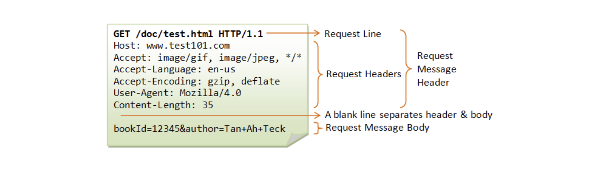
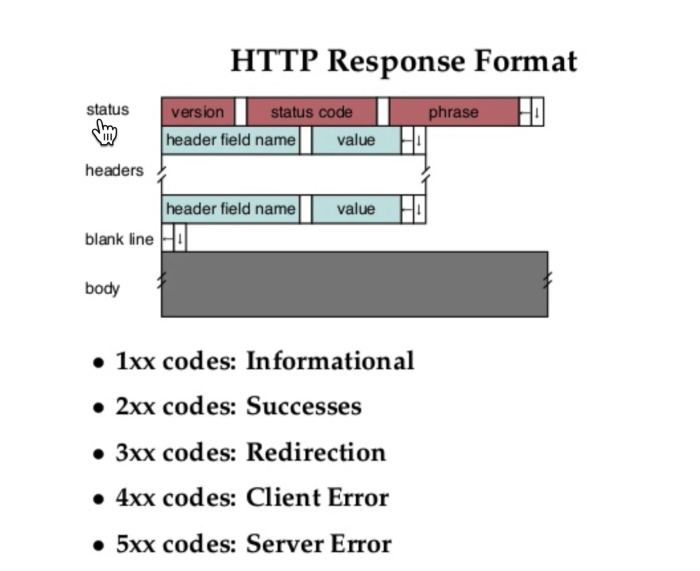

1990년 웹이 등장했을 때, 웹은 크게 4가지 요소로 이루어져 있었다.

- 웹페이지를 만드는 컴퓨터 언어인 HTML
- 원하는 웹페이지에 방문할 수 있게 해주는 주소체계인 URL, URI
- 웹페이지를 주고 받는 소프트웨어인 Web browser, Web server
- 웹브라우저와 웹서버가 통신할 때 사용하는 통신 규칙인 HTTP

처음 HTTP(HyperText Transfer Protocol)는 매우 단순한 통신 규칙이었다. 단순한 HTTP로는 성능, 보안, 안정성을 확보하기 점점 어려워졌다.

이 문제를 해결하기 위해 점점 발전했고, 오늘날은 html과 같은 텍스트 파일 뿐만 아니라 이미지, 오디오, 동영상과 같은 다양한 멀티미디어 파일을 전송하는 매우 중요한 프로토콜로 자리잡고 있다.

## HTTP 소개

브라우저의 개발자도구에서 네트워크 탭이 서버와 클라이언트가 어떤 통신하고 있는지 관찰할 수 있는 툴이다.

눌러서 Headers 탭 안을 보면,<br>
Request Headers가 보이는데 이게 바로 우리 웹브라우저가 웹서버에게 요청한 데이터다.<br>
보면 예를 들어 `GET /index.html HTTP/1.1`로 되어 있다면, Response Headers에 HTTP/1.1 200 ok가 있어야 한다. 통신 방식을 설정하는 이 부분은 필수로 들어가야 한다.

content-length는 콘텐츠 길이가 어느 정도인지 알려주는 거고, content-Type가 `text/html`이면 웹서버가 웹브라우저에게 응답하는 이 정보가 text/html이라는 걸 알려주는 것이다.

이런 정보들을 서버로부터 웹브라우저가 받아서 처리하는 것이다. 웹브라우저는 사용자가 요청한 정보를 웹서버에게 대신 물어봐주는 역할을 하는 것이다. 어떻게 물어보냐면 텍스트로 된 걸로. 그걸 Request Headers라고 한다. 그럼 웹서버는 자기가 가지고 있는 정보를 보내주면서 Response Headers를 만들어서 보내준다. 이걸 받아서 브라우저가 화면에 그려주는 것이다.

## HTTP Request message

네트워크 탭에서 Request Headers를 클릭해서 source를 보면.

```bash
GET /home.html HTTP/1.1
Host: developer.mozilla.org
User-Agent: Mozilla/5.0 (Macintosh; Intel Mac OS X 10.9; rv:50.0) Gecko/20100101 Firefox/50.0
Accept: text/html,application/xhtml+xml,application/xml;q=0.9,*/*;q=0.8
Accept-Language: en-US,en;q=0.5
Accept-Encoding: gzip, deflate, br
Referer: https://developer.mozilla.org/testpage.html
Connection: keep-alive
Upgrade-Insecure-Requests: 1
If-Modified-Since: Mon, 18 Jul 2016 02:36:04 GMT
If-None-Match: "c561c68d0ba92bbeb8b0fff2a9199f722e3a621a"
Cache-Control: max-age=0
```



첫번째 행을 요청 행(request line)이라고 한다.

그리고 위 그림에서 보면 request line과 request headers를 합쳐서 request message header라고 부른다고 나온다.

그리고 만약 서버 쪽으로 전송해야 되는 데이터가 있으면 그 정보를 payload라고도 하는데 request message body라고 한다.

이 request message header와 request message body 중간에 blank line을 둬서 구분한다고 나온다.

`GET`은 메서드인데, 웹브라우저와 웹서버가 어떤 방식으로 통신할 것인가를 나타낸다.

GET 다음에 나오는 `/home.html`은 우리가 웹서버에게 요청하는 정보가 무엇인지를 나타낸다. 이걸 서버가 보고 응답해준다.

그 다음에 나오는 `HTTP/1.1`은 웹브라우저가 현재 사용하고 있는 또는 사용할 수 있는 http의 버전을 말한다.

그 다음 Host부터는 우리가 request header라고 부르는 부분이다. 여러 개가 있지만 그중에서 반드시 적어야 하는 게 `Host`라는 것이다.<br>
host는 인터넷에 연결되어 있는 컴퓨터 1대 1대를 식별하는 이름이다. 우리가 요청하는 웹서버의 주소를 적는 곳이다.

이 Host가 있으면 1개의 웹서버가 여러 개의 도메인을 서비스할 수 있다. 이 Host에 어떤 게 적혀 있느냐에 따라 다른 정보를 응답해줄 수 있다. 이걸 가상호스트라고 한다.

`User-Agent`는 웹브라우저의 다른 표현이다. 요청하는 웹브라우저가 어떤 웹브라우저인지를 보여주는 것이다. 그리고 괄호 안에 적혀 있는 게 우리가 사용하고 있는 운영체제이다.<br>
단순히 웹브라우저가 아니라 검색엔진 같은 로봇이 접근할 수도 있다. 그럼 웹서버가 확인하고 차단하거나 할 수도 있다.

`Accept-Encoding`은 웹브라우저와 웹서버가 통신할 때 응답으로 데이터가 너무 많으면 웹서버가 압축해서 보내준다. 그걸 웹브라우저가 풀어서 처리할 수 있다. 이렇게 하면 네트워크 자원을 아낄 수 있다.<br>
그때 이 웹브라우저가 어떤 압축방식을 지원한다~라는 걸 적어놓은 것이다.

`If-Modified-Since`는 예를 들어 웹브라우저가 `/home.html` 파일을 요청했는데, 다음에 다시 요청할 수 있다. 그럼 요청할 때마다 그걸 다운로드 받는 건 효율적이지 않다.

If-Modified-Since를 서버에 전송한다는 건 내가 갖고 있는 파일이 언제 마지막으로 다운로드 받은 파일이라는 건 웹서버에게 알려준다. 그럼 웹서버가 응답할 때 자기가 가지고 있는 파일이랑 뭐가 더 최신인지 비교해서 자기가 갖고 있는 게 최신이면 전송해주고 최신이 아니면, 다운로드 할 필요 없으면 전송하지 않아도 되는 것이다.

## HTTP Response message

```bash
HTTP/1.1 200 OK
Access-Control-Allow-Origin: *
Connection: Keep-Alive
Content-Encoding: gzip
Content-Type: text/html; charset=utf-8
Date: Mon, 18 Jul 2016 16:06:00 GMT
Etag: "c561c68d0ba92bbeb8b0f612a9199f722e3a621a"
Keep-Alive: timeout=5, max=997
Last-Modified: Mon, 18 Jul 2016 02:36:04 GMT
Server: Apache
Set-Cookie: mykey=myvalue; expires=Mon, 17-Jul-2017 16:06:00 GMT; Max-Age=31449600; Path=/; secure
Transfer-Encoding: chunked
Vary: Cookie, Accept-Encoding
X-Backend-Server: developer2.webapp.scl3.mozilla.com
X-Cache-Info: not cacheable; meta data too large
X-kuma-revision: 1085259
x-frame-options: DENY
```



HTTP 버전을 명시해주고<br>
status code로 응답 상태를 표현해주고<br>
phrase는 응답 결과를 사람이 이해하기 쉽게 말로 풀어 쓴 것이다.

2XX는 성공이라는 의미이다.<br>
3XX를 받으면 웹브라우저가 바로 다른 곳으로 이동한다.<br>
4XX는 클라이언트 쪽 에러. 대표적인 게 404 Not Found. 잘못된 거 요청해서 서버에서 없으니까 발견할 수 없다고 보내는 거. 403 Forbidden. 접속하면 안 되는 곳으로 접속했을 때.<br>
5XX는 서버 쪽 문제.

그 다음에 headers가 나온다.

content-type은 웹서버가 응답할 때, 예를 들어 text/html은 이 응답은 텍스트고 html이라는 언어다. 그럼 웹브라우저가 이걸 보고 html로 해석해서 화면에 그려주는 것이다.

content-length는 콘텐트 사이즈를 보여준다. 단위는 byte다.

content-encoding은 이 content를 어떤 걸로 압축했는지 알려주는 것이다. 여기에 명시된 걸 사용해서 압축을 풀면 된다.

last-modified는 이 정보가 언제 마지막으로 수정된건지 알려주는 내용이다.

정리해보면 예를 들어 웹브라우저는 요청하기 전에 Request Headers를 생성한다. 아래와 같은 형태.

```bash
GET /home.html HTTP/1.1
Host: developer.mozilla.org
User-Agent: Mozilla/5.0 (Macintosh; Intel Mac OS X 10.9; rv:50.0) Gecko/20100101 Firefox/50.0
Accept: text/html,application/xhtml+xml,application/xml;q=0.9,*/*;q=0.8
Accept-Language: en-US,en;q=0.5
Accept-Encoding: gzip, deflate, br
Referer: https://developer.mozilla.org/testpage.html
Connection: keep-alive
Upgrade-Insecure-Requests: 1
If-Modified-Since: Mon, 18 Jul 2016 02:36:04 GMT
If-None-Match: "c561c68d0ba92bbeb8b0fff2a9199f722e3a621a"
Cache-Control: max-age=0
```

그리고 나서 GET이 아니라 POST면<br>
한칸 뛰고 그 다음줄에 body가 채워지는 것이다.<br>
이 body에 웹서버에 보낼 정보를 담는다.

이렇게 message를 완성해서 웹서버에 보내주면<br>
웹서버가 이걸 해석해서 응답 메시지를 만든다.<br>
이렇게 아래처럼.

```bash
HTTP/1.1 200 OK
Access-Control-Allow-Origin: *
Connection: Keep-Alive
Content-Encoding: gzip
Content-Type: text/html; charset=utf-8
Date: Mon, 18 Jul 2016 16:06:00 GMT
Etag: "c561c68d0ba92bbeb8b0f612a9199f722e3a621a"
Keep-Alive: timeout=5, max=997
Last-Modified: Mon, 18 Jul 2016 02:36:04 GMT
Server: Apache
Set-Cookie: mykey=myvalue; expires=Mon, 17-Jul-2017 16:06:00 GMT; Max-Age=31449600; Path=/; secure
Transfer-Encoding: chunked
Vary: Cookie, Accept-Encoding
X-Backend-Server: developer2.webapp.scl3.mozilla.com
X-Cache-Info: not cacheable; meta data too large
X-kuma-revision: 1085259
x-frame-options: DENY
```

이것도 마찬가지로 한칸 띄우고 html 코드를 붙여서 인터넷을 통해서 보내주면,

웹브라우저가 위 header와 한칸 띄우고 작성된 본문을 참고해서 사용자에게 화면을 보여주는 것이다.

## 앞으로 더 공부해볼만한 주제들

### http와 https의 차이.

주소창에 https를 작성하면 https 또는 ssl을 이용하고 있는 것과 같다.

### cache.

이미 저장된 걸 읽어와서 성능을 향상시키는 방법.<br>
풀기 어려운 문제는, 내용이 갱신되어도 웹브라우저는 그 사실을 알아채지 못한다는 것이다. 이 경우 MacOS면 cmd + R를 누르면 강제로 캐시가 갱신된다. 근데 일반 사용자는 캐시가 갱신되었다는 사실을 알 수가 없다. 이런 문제를 해결하기 위한 여러 테크닉들이 존재한다.<br>
cache-control, pragma 등의 header 값들은 캐시를 제어하는 테크닉이라고 볼 수 있다.

### cookie

로그인 상태가 유지되는데, 웹사이트 방문할 때 이전에 처리했던 기록들을 웹브라우저가 기억하고 있기 때문이다. 이걸 가능하게 해주는 게 cookie다.<br>
cookie보다 보안적으로 우수한 web storage.

### proxy.

중간에 위치한 서버.<br>
캐시를 대신해주거나<br>
보안 관련 공격을 막아주거나<br>
사용자 요청을 적당히 분산해주거나<br>
...

### 네트워크 관찰

개발자 도구 > network 탭
wireshark (강력한 도구)

## 참고자료

- [생활코딩 WEB2 - HTTP](https://opentutorials.org/course/3385)
- [Request header](https://developer.mozilla.org/en-US/docs/Glossary/Request_header)
- [Response header](https://developer.mozilla.org/en-US/docs/Glossary/Response_header)
