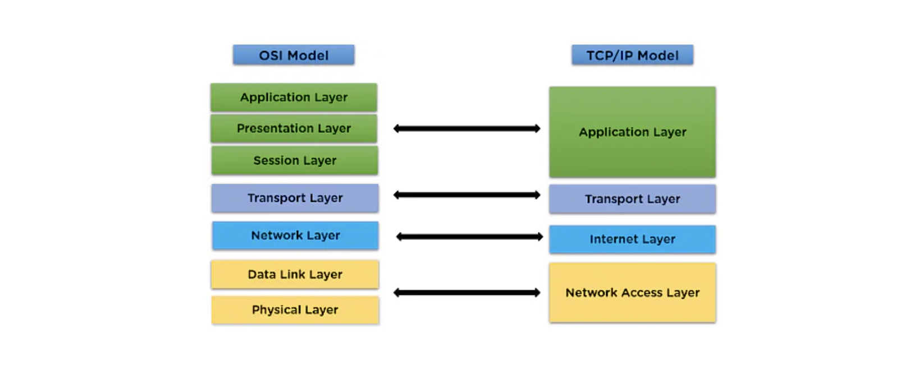
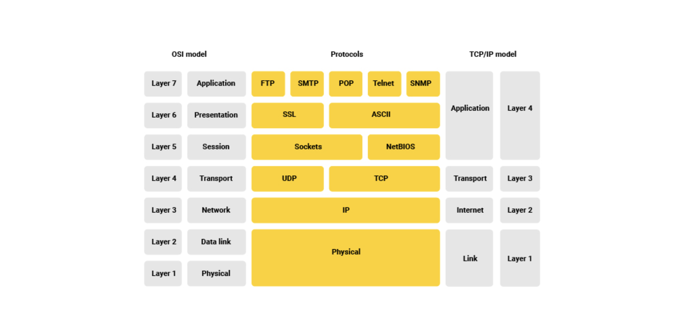
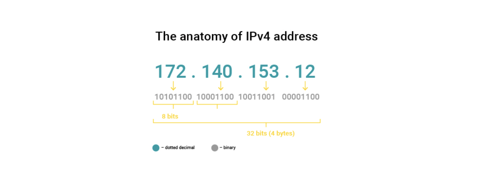
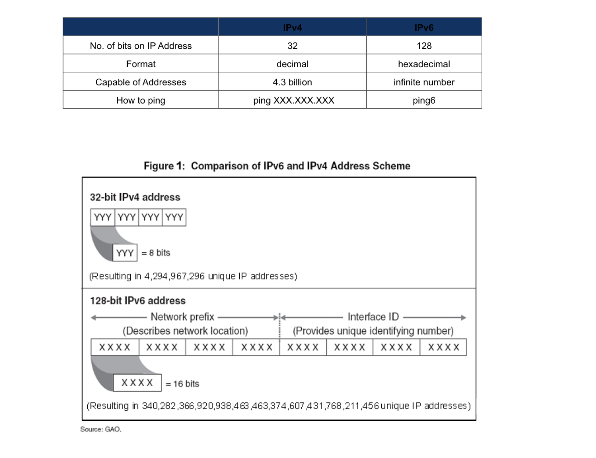

## TCP/IP Model

OSI 모델은 참조/논리 모델이다. 컴퓨터 간 통신할 때 이런 구조를 가져야 한다는 표준일 뿐, 실제로는 보다 간결한 구조로 통신을 한다.

TCP/IP 모델은 실제로 인터넷 통신을 위해 사용하는 네트워크 스택이다. OSI 모델은 보다 간소화된 형태이다. 인터넷은 TCP/IP 모델을 사용한다.

1. (Link) Network Access Layer는 두 하드웨어 간 전송을 담당한다. 여기에는 이더넷Ethernet 프로토콜이 사용된다.
2. (Internet) Internet Layer는 IP 프로토콜을 사용한다. IPv4, IPv6 등.
3. (Transport) Transport Layer는 TCP,UDP 프로토콜을 사용한다.
4. (Application) Application Layer에는 대표적으로 HTTP, FTP, DNS, POP3, SMTP 등이 대표적인 프로토콜이다.

- HTTP/HTTPS : 웹사이트 접속
- FTP : 파일 송수신 (FTP는 active mode와 passive mode가 존재함)
- SMTP/POP3 : 메일 송수신
- DNS : 도메인명 해석

이렇게 TCP/IP 모델에는 OSI 모델 계층에 해당하는 4개의 계층이 존재한다. 데이터가 한 장치에서 다른 장치로 전송될 때 위에서 아래로 다른 프로토콜로 캡슐화된다. 그리고 데이터를 수신할 때는 프로세스가 역전되어 unwrapped된다.

메일서버는 여러 프로토콜을 사용한다. SMTP는 메일 송신 프로토콜, POP3, IMAP은 메일을 수신하는 프로토콜이다.

- IMAP은 중앙 서버에서 메일을 동기화하므로 모든 장치에서 동일한 이메일 폴더를 확인할 수 있다. 다만 서버 용량에 제한이 있으므로, 용량이 부족하면 메일을 수신하지 못할 수 있다(보통 미리 삭제하라고 알려준다). POP3는 중앙 서버에서 로컬 장치로 이메일 데이터를 내려받는다. 중앙 서버와 로컬 장치 간 동기화 문제가 생길 수 있다는 게 단점이다.
- 메일을 수신할 때는 SMTP를 사용하지만, SMTP는 아스키코드만 읽을 수 있어서 다른 언어에 유연하지 않다. 이를 보완하기 위해 MIME 프로토콜을 사용한다.

## IP

인터넷 프로토콜(Internet Protocol)은 TCP/IP 안에서의 인터넷 계층(OSI-ISO layer 3) 프로토콜이다. 패킷 스트림과 데이터 그램을 네트워크를 통해 전달하는 데 사용된다.

데이터 패킷에 IP 주소를 포함하는 IP 헤더를 포함한다. 그러면 패킷이 네트워크 외부로 라우팅되어 서로 다른 라우터 간 일련의 과정을 통해 목적지에 도달한다.

즉, 서로 다른 네트워크에 있는 사용자가 통신할 수 있도록 모든 사람들에게 통일된 주소 지정 방식(장치에 IP 주소를 할당)을 제공한다.

모든 장치를 구별하는 기능은 MAC 주소지만 그게 네트워크 간 통신하는 방식은 아니다. 그러므로 라우터에 데이터 패킷을 보내야 하는 위치를 알려주는 IP 주소가 할당되는 것이다. 결국 인터넷을 쓰려면 IP 주소가 필요하며, IP(Internet Protocol)에는 버전이 2가지(4,6)가 있다.

### IPv4

IPv4(Internet Protocol version 4)은 주소 지정이 어떻게 작동하는지, 어떻게 호스트들이 네트워크에서 식별될 수 있는지에 관해 정의한다. IPv4는 4개의 octets (4x8)으로 구성된 32비트 값으로 표시되며 일반적으로 점(.)으로 구분되는 십진수로 표시된다.

IPv4 주소는 실제로 2부분으로 구성된다. 하나는 네트워크를 식별하는 부분이고, 다른 하나는 네트워크 내의 호스트를 식별하는 부분이다. 이런 부분들은 고정되어 있지 않으므로 네트워크 식별 부분의 길이를 결정하기 위해 주소에 network mask가 있다. CIDR 표기법에서 슬래쉬(/) 뒤에 위치한 숫자이다.

RIP, OSPF, and BGP와 같은 라우팅 프로토콜 덕분에 라우터는 자신에게 할당된 네트워크 주소 등을 서로 알게 할 수 있으므로 데이터 패킷을 올바른 네트워크로 전달할 수 있다.

### Dynamic IP addresses

장치의 IP주소를 확인해보면 항상 동일하지 않을 수 있다. 이는 DHCP 서버가 장치에 IP 주소를 동적으로 할당하기 때문이다. 즉, 특정 시간 동안 임대한다. 이러한 메커니즘은 사용 가능한 IPv4 주소의 매우 제한된 풀을 보존하기 위해 구현되었다. (IPv4를 보완하기 위해 IPv6이 등장했음에도 전환이 쉽지 않아서 이런 메커니즘을 사용하고 있다)

### IPv6

IPv6은 고갈되는 IP 주소 문제를 해결하기 위해 등장했다. IPv6은 128비트로 구성되며 콜론(:)으로 구분된 8개의 16진수 숫자로 구성된다.

## 참고자료

- [TCP/IP Model](https://www.geeksforgeeks.org/tcp-ip-model/)
- [TCP/IP Model: What are Layers & Protocol? TCP/IP Stack](https://www.guru99.com/tcp-ip-model.html)
- [The Best Guide To Understand What Is TCP/IP Model](https://www.simplilearn.com/tutorials/cyber-security-tutorial/what-is-tcp-ip-model)
- [Differences between IPv4 and IPv6](https://www.linksys.com/support-article?articleNum=139604)
- [Everything you need to know about IPv4](https://www.avsystem.com/blog/csp/IPv4/)
