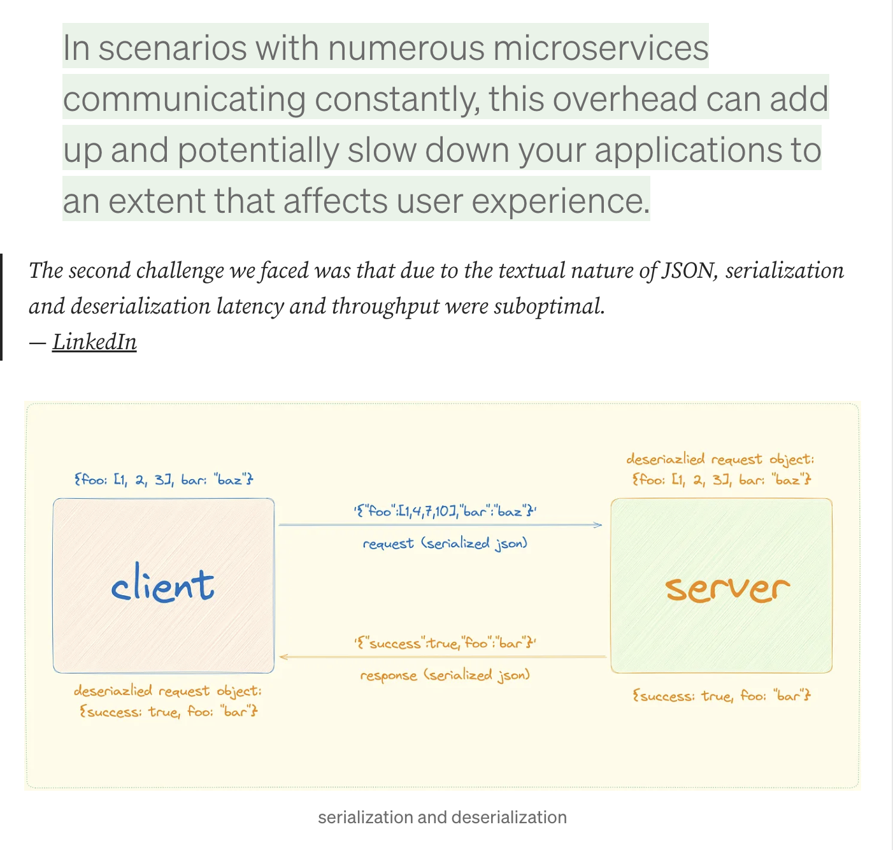
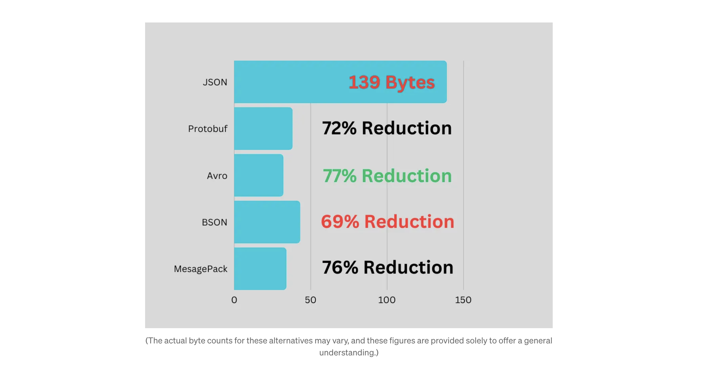
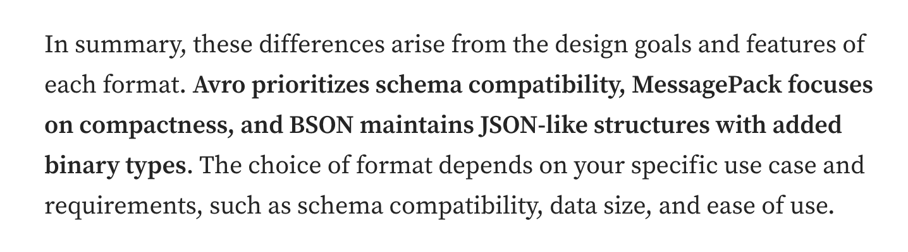

## JSON이란

json은 JavaScript Object Notation의 약자.

오늘날 웹앱에서 데이터 전송/저장에 주로 사용되는 경량 데이터 교환 형식.
<br>서버-클라이언트 간 데이터 통신 언어이며, db에 저장되는 형식으로 자주 사용됨.

## json 장점(json이 인기 있는 이유)

대중성

- json api => 수많은 웹앱에서 json 형식으로 api 구성
- 브라우저 지원 => 브라우저가 기본적으로 json을 지원
- 언어에 종속되지 않음 => 거의 모든 최신 프로그래밍 언어에서 지원
- 사람이 읽기 쉬운 형식 => 협업 강화/디버깅 단순화

일관성, 신뢰성

- json 스키마 => json 스키마를 통해 데이터 구조 명확성,신뢰성
- 데이터 구조의 일관성 => key-value 형식. 일관적이므로 프로그래밍 시나리오에서 예측 가능성 제공

## json의 단점과 대안책

### json이 어플리케이션을 느리게 만들 수 있는 지점들

1. Parsing Overhead

어플리케이션에 json 데이터가 도착하면, 사용 가능한 데이터 구조로 변경하기 위해 구문 분석(parsing) 프로세스를 거쳐야 한다.
<br>광범위하거나, 깊게 중첩된 json일 수록 파싱 프로세스가 느려질 수 있다.

2. Serialization and Deserialization

json에서는 클라이언트에서 서버로 데이터 전송할 때 직렬화(to be serialized (encoding objects into a string))해야 하며,
<br>서버에서 수신 시, 역직렬화(deserialized (converted the string back into usable objects))해야 한다.
<br>이러한 직렬화/역직렬화 과정 자체가 오버헤드를 발생시킬 수 있다.

특히, 마이크로서비스 아키텍쳐에서 데이터를 주고 받을 때, json을 자주 사용하는데 특히 이 직렬화/역직렬화가 성능 문제를 발생시킬 수 있다.



3. String Manipulation

json은 텍스트 기반이다. 그래서 파싱할 때, 문자열 조작에 크게 의존한다.
<br>문자열 처리는 이진 데이터 작업에 비해 느릴 수 있다.

4. Lack of Data Types

json은 문자열, 숫자, bool과 같이 제한된 타입을 사용한다.
<br>function, date, undefined와 같은 데이터타입을 사용할 수 없으며,
<br>이는 복잡한 데이터 구조 속에서 비효율적인 표현으로 인한 메모리 사용량 증가를 야기시킨다.

5. Verbosity

json은 사람이 읽을 수 있지만, 이 때문에 데이터 구조가 장황해진다. 중복된 키와 반복적인 구조로 인해 payload 크기가 늘어나 데이터 전송 시간을 늘린다.

6. No Binary Support

json은 바이너리 데이터를 제대로 지원하지 않으므로, 텍스트로 인코딩/디코딩해야 하는 경우가 있어 비효율적일 수 있다.

7. Deep Nesting

json 데이터가 깊게 중첩되어, 재귀가 많이 필요할 경우, 앱 속도를 저하시킬 수 있다.

### json의 대안책들?

1. Protocol Buffers (protobuf)

구글이 개발한 바이너리 직렬화 형식.
<br>바이너리 특성 덕분에 직렬화/역직렬화 작업이 json보다 빠르다.

마이크로서비스 아키텍쳐, IoT 어플리케이션, 또는 네트워크 대역폭이 제한된 시나리오에서 고성능 데이터 교환이 필요한 경우 protobuf를 고려해볼 수 있다.

- [protobuf-example](https://github.com/vaishnav-mk/protobuf-example?source=post_page-----ca35d5aaf9e8--------------------------------)
- [protobufjs](https://github.com/protobufjs/protobuf.js/)

2. MessagePack

또 다른 바이너리 직렬화 형식. 속도가 빠르고 컴팩트하다.
<br>다양한 프로그래밍 언어와 호환되며, json보다 효율적으로 설계되어있지만, json보다 호환성은 낮다.

실시간 어플리케이션 환경, 데이터 크기가 감소되어야 하는 상황에 적합하다.

3. BSON (Binary JSON)

json에서 파생된 바이너리 인코딩 형식.
<br>바이너리 인코딩을 통해 성능 향상 & json 유연성 유지.

일반적으로 mongodb와 같은 db에서 사용된다.

4. Apache Avro

컴팩트 바이너리 형식 제공에 중점을 둔 데이터 직렬화 프레임워크.
<br>스키마 기반이므로 효율적인 데이터 인코딩 및 디코딩이 가능.



### 다양한 형식 간의 차이는?



Avro의 경우, 스키마 정보가 인코딩된 데이터에 포함되어 있어 데이터 스키마 간 호환성을 유지할 수 있다.

## 그럼에도 json을 사용한다면, 최적화 방법은?

1. 데이터 크기 최소화하기

간결한 key 이름을 사용해 json 객체의 크기 자체를 줄여야 한다.

- 가능하다면 약어를 사용하는 게 좋다.

```js
// Inefficient
{
  "customer_name_with_spaces": "John Doe"
}

// Efficient
{
  "customerName": "John Doe"
}
```

2. 배열을 적절히 사용해, 중첩을 줄일 수 있어야 한다.

```js
// Inefficient
{
  "order": {
    "items": {
      "item1": "Product A",
      "item2": "Product B"
    }
  }
}

// Efficient
{
  "orderItems": ["Product A", "Product B"]
}
```

3. 숫자 표현 최적화

정수로 표현할 수 있다면, 가능한 정수 표현을 사용해야 한다.

```js
// Inefficient
{
  "quantity": 1.0
}

// Efficient
{
  "quantity": 1
}
```

4. 중복 제거하기

공유된 값을 참조해 중복된 데이터를 제거한다.

```js
// Inefficient
{
  "product1": {
    "name": "Product A",
    "price": 10
  },
  "product2": {
    "name": "Product A",
    "price": 10
  }
}

// Efficient
{
  "products": [
    {
      "name": "Product A",
      "price": 10
    },
    {
      "name": "Product B",
      "price": 15
    }
  ]
}
```

5. Compression(압축) 사용하기

압축 알고리즘 사용하기.

- Gzip 또는 Brotil과 같은 압축 알고리즘을 사용해 Json 페이로드 크기를 줄일 수 있다.

```js
// Node.js example using zlib for Gzip compression
const zlib = require("zlib");

const jsonData = {
  // Your JSON data here
};

zlib.gzip(JSON.stringify(jsonData), (err, compressedData) => {
  if (!err) {
    // Send compressedData over the network
  }
});
```

6. 서버 데이터 캐싱

반복적인 데이터에 대한 캐싱을 적절히 사용하기

7. 프로파일링 및 최적화

프로파일링 도구를 사용해서 json 처리 코드의 병목현상(bottlenecks) 식별 후 최적화

## 실제 사례

linkedin, auth0

- 프로토콜버퍼 도입/사용

uber

- H3 Geo-Index 도입을 통한 json 파싱 오버헤드 감소

slack

- 실시간 채팅 서비스에 대한 json 병목 현상 => json 구조 최적화를 통항 성능 개선

## 더 공부하기

- [Beating JSON performance with Protobuf (auth0.com)](https://auth0.com/blog/beating-json-performance-with-protobuf/)
- [LinkedIn Integrates Protocol Buffers With Rest.li for Improved Microservices Performance | LinkedIn Engineering](https://engineering.linkedin.com/blog/2023/linkedin-integrates-protocol-buffers-with-rest-li-for-improved-m)
- [H3: Uber’s Hexagonal Hierarchical Spatial Index | Uber Blog](https://www.uber.com/en-IN/blog/h3/)
- [Protocol Buffers Documentation (protobuf.dev)](https://protobuf.dev/)
- [MessagePack: It’s like JSON. but fast and small. (msgpack.org)](https://msgpack.org/)
- [BSON (Binary JSON) Serialization (bsonspec.org)](https://bsonspec.org/)
- [Apache Avro](https://avro.apache.org/)
- [Is JSON Blazingly Fast Or? — YouTube](https://www.youtube.com/watch?v=MuCK81q1edU&ab_channel=ThePrimeagen)
- [Use Binary Encoding Instead of JSON | by Shilpi Gupta | Better Programming](https://betterprogramming.pub/use-binary-encoding-instead-of-json-dec745ec09b6)
- [google/brotli: Brotli compression format (github.com)](https://github.com/google/brotli)
- [The gzip home page](https://www.gzip.org/)

## 참고자료

- [JSON is incredibly slow: Here’s What’s Faster!](https://medium.com/data-science-community-srm/json-is-incredibly-slow-heres-what-s-faster-ca35d5aaf9e8)
