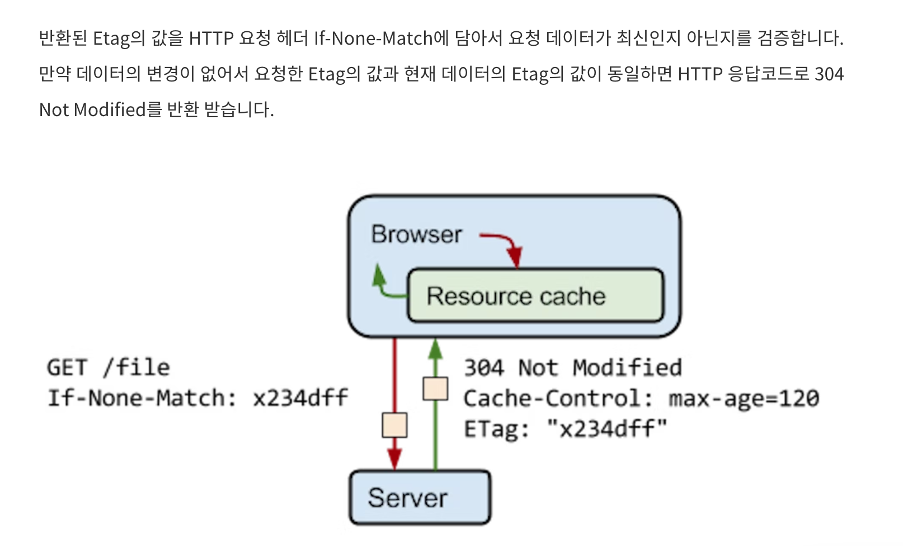

### cache

네트워크 위에서 데이터를 주고 받을 때 비용이 든다. 
이를 줄이기 위해 캐시를 사용한다.

- '캐시'라는 시스템 설계를 사용해 비용은 줄이고 유저는 더 빠른 결과를 받을 수 있다.
- 캐시는 데이터를 미리 복사해 놓는 임시 저장소.

### HTTP ETag

ETag는 클라이언트가 이전에 요청했던 데이터와 최신 데이터의 변경사항 유무를 검증하는 데 사용하는 http 응답 헤더.
 클라이언트에서 최신 데이터 자료를 요청할 때 응답 헤더로 ETag 값이 반환된다.

## 참고자료

- [ETag를 이용하여 더 나은 Restful API 만들기](https://yozm.wishket.com/magazine/detail/1772/)
