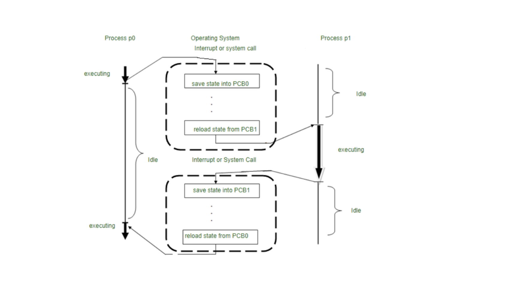
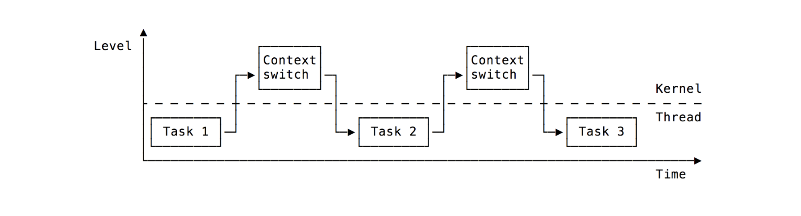
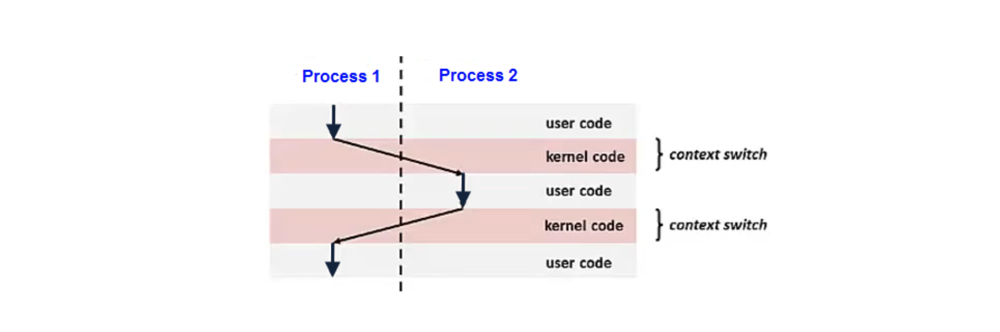
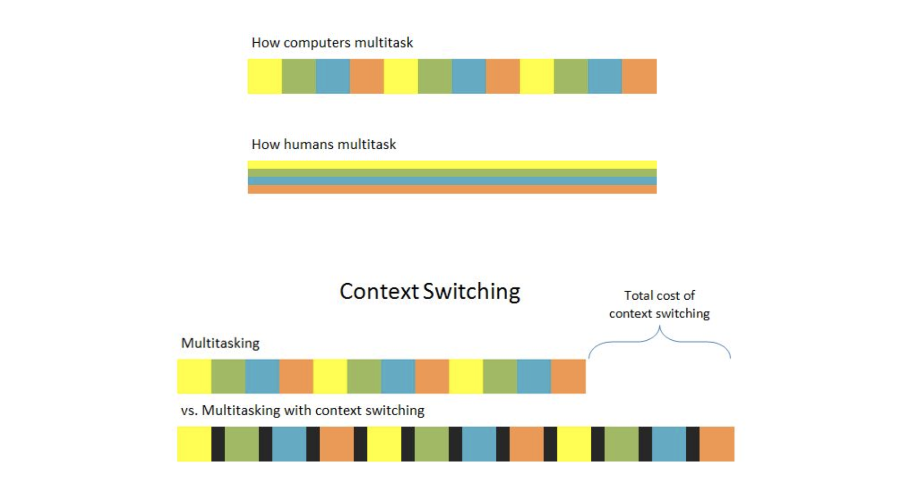
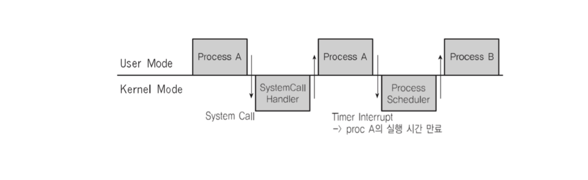

## Context Switch과 Process Control Block

컨텍스트 스위칭은 CPU에 실행할 프로세스를 교체하는 기술이다. 프로세스 스케줄링에서 프로세스를 계속해서 바꿔주는 기술들에 사용되는 게 바로 컨텍스트 스위칭이다.

프로세스는 다음에 실행할 코드가 담겨 있는 PC와 호출된 함수와 변수들의 주소를 갖고 있는 SP를 통해 동작한다. 여기서 현재 프로세스의 PC와 SP 주소를 다른 곳에 저장해두고 교체할 프로세스의 PC와 SP 주소를 가져와 업데이트하는 식으로 컨텍스트 스위칭을 구현할 수 있다.

현재 프로세스의 PC와 SP 등 정보를 저장하는 아주 작은 공간을 Process Control Block(PCB)라고 한다. PCB에는 Process ID(PID), 레지스터(PC, SP 등)들을 포함해 프로세스가 실행 중인 상태 정보를 저장한다.

예를 들어 아래 사진처럼 macOS에서 `lsof`를 입력하면 열려 있는 모든 파일 정보를 확인할 수 있는데, 목록 중 PID를 확인할 수 있다.

컨텍스트 스위칭에는 3가지 주요 트리거가 존재한다.

1. 멀티 태스킹 => 멀티태스킹 환경에서 프로세스는 다른 프로세스를 실행할 수 있도록 CPU에서 전환된다. 혹은 선점형 시스템에서 프로세스는 스케줄러에 의해 전환될 수 있다.
2. 인터럽트 처리 => 하드웨어는 인터럽트가 발생할 때 컨텍스트 일부를 전환한다. 인터럽트 처리 시간을 줄이기 위해 일부만 전환한다.
3. 사용자 및 커널 모드 전환 => 운영체제에서 모드 간 전환이 필요할 때 컨텍스트 스위칭이 발생할 수 있다.

컨텍스트 스위칭은 운영체제에서 중요한 기능이며, 매우 빈번하게 발생하므로 성능을 위해 어셈블리어로 작성되어 있다.

## 컨텍스트 스위칭 동작

-> 현재 실행 중인 프로세스 정보를 PCB에 업데이트 후 메인 메모리에 저장한다.
-> 다음 실행 할 프로세스 정보를 메인 메모리에서 가져와 CPU 레지스터에 넣고 실행한다.

## 멀티태스킹과 컨텍스트 스위칭

단일 프로세서에서 실행되는 모든 컴퓨터는 진정한 의미의 멀티태스킹을 구현할 수 없음에도 불구하고, 프로세스 스위칭이 매우 빠른 속도로 이루어짐에따라 여러 응용 프로그램을 마치 동시에 실행하고 있는 듯한 환상을 심어준다.

## 인터럽트

보통 인터럽트라고 하면, 하드웨어 인터럽트(외부 인터럽트)와 소프트웨어 인터럽트(내부 인터럽트)로 구분할 수 있다. 트랩, 시스템 콜과 같은 인터럽트는 소프트웨어 인터럽트에 해당한다.

인터럽트 중 가장 대표적인 게 timer interrupt. 시간을 측정해서 일정 시간이 지나면 프로세스를 어떻게 교체하냐면, 이 timer interrupt를 통해 교체 주기를 결정한다.

프로세스 A를 실행하다가 일정 시간이 지나 인터럽트가 발생하면, 그때 사용자모드에서 커널모드로 전환되어 운영체제가 해당 인터럽트를 처리하는 코드를 실행한다. 코드를 모두 수행하면, 다시 사용자모드로 전환되어 해 프로세스 B를 실행한다.

IDT(Interrupt Descriptor Table)에 인터럽트 관련 정보들이 기록되어 있다(번호와 함수가 매핑되어 있다). 인터럽트가 발생하면 IDT를 확인해 명령 번호를 확인하고 그 번호에 해당하는 함수를 실행한다. (컴퓨터가 부팅되면 운영체제가 IDT를 메모리에 적재한다.)

## 참고자료

- [What is Context Switching in Operating System?](https://www.tutorialspoint.com/what-is-context-switching-in-operating-system)
- [Difference between Swapping and Context Switching](https://www.geeksforgeeks.org/difference-between-swapping-and-context-switching/)
- [Context Switch on the ARM Cortex-M0](https://www.adamh.cz/blog/2016/07/context-switch-on-the-arm-cortex-m0/)
- [Multitasking and Context Switching](https://www.bryanbraun.com/2012/06/25/multitasking-and-context-switching/)
- [CH03. 프로세스와 스케쥴러의 이해 - 인터럽트 내부 동작](https://mymelody.tistory.com/208?category=1020274)
