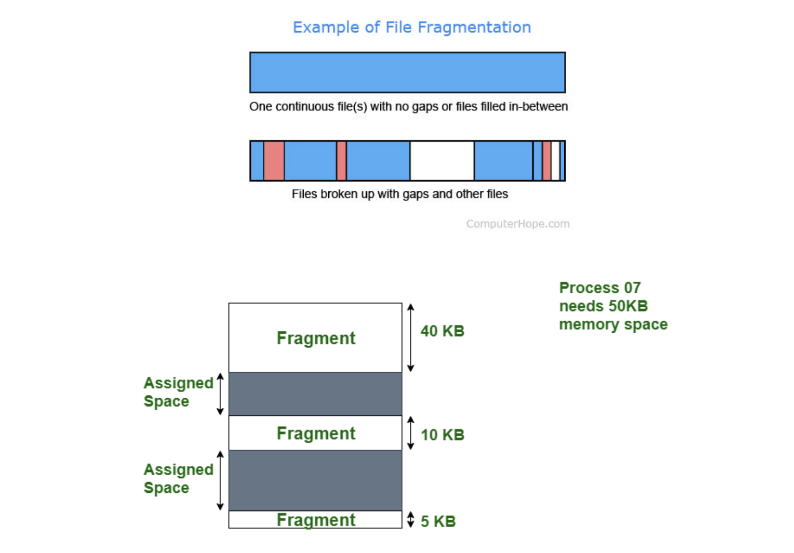
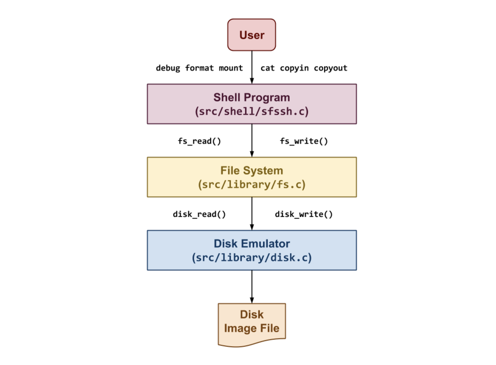
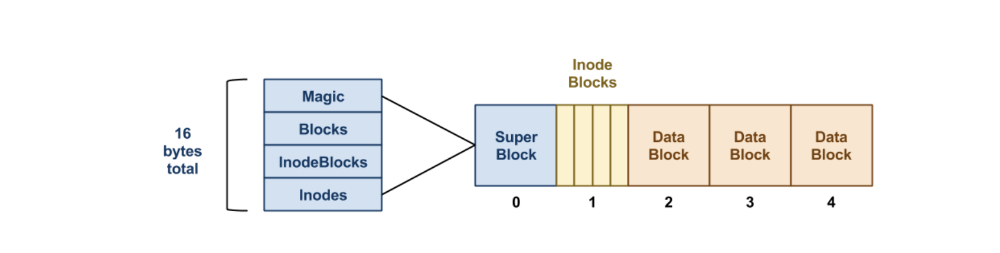
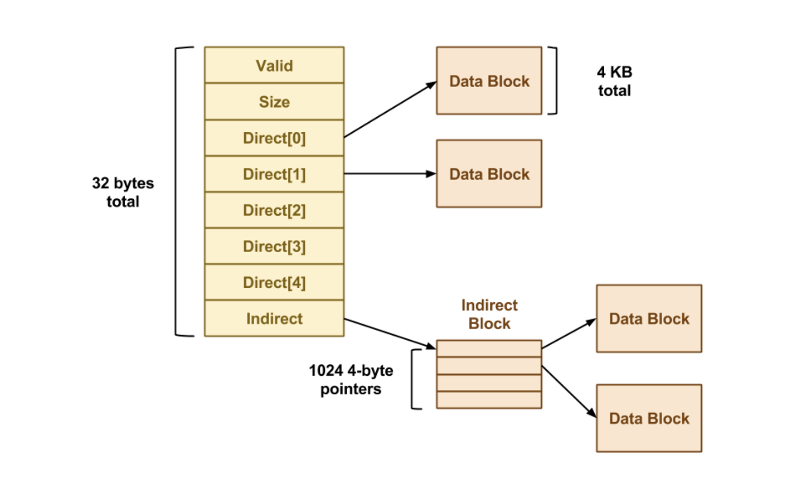
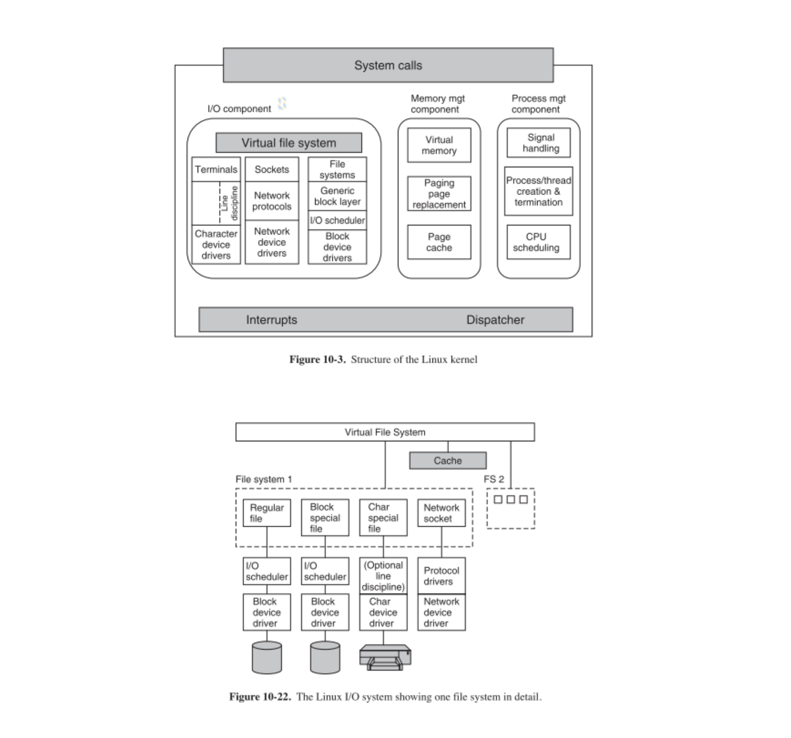
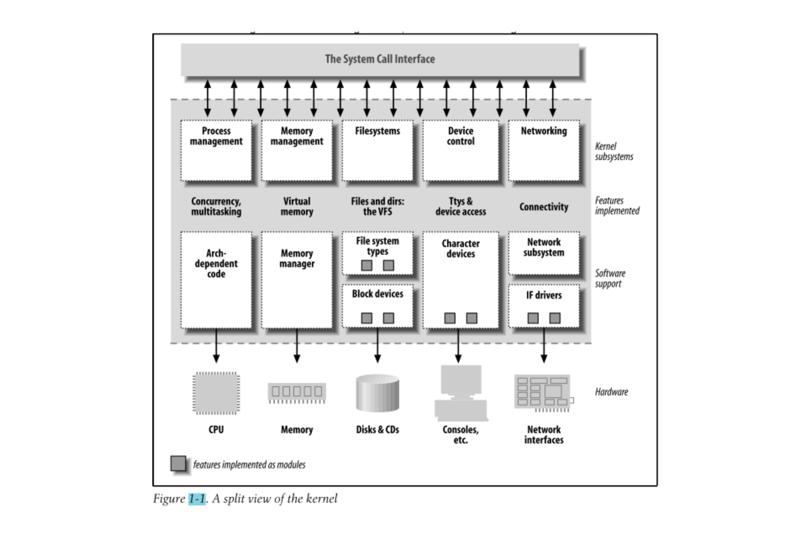

## 파일 시스템

파일 시스템은 OS에서 필수적이다. OS는 파일 시스템을 통해 파일들을 관리한다. 파일은 컴퓨터 시스템의 메모리에 저장된 특정 정보의 모음이다. 파일 관리는 컴퓨터 시스템에서 파일을 조작(생성, 수정, 삭제 등)하는 과정으로 정의될 수 있다.

파일 시스템은 데이터와 정보를 저장장치에 저장해 쉽게 검색할 수 있도록 하는 데이터 구조이다. OS마다 파일 시스템을 다르게 사용할 수는 있지만, 기능은 비슷하다.

내부적으로는, 
OS에 의해 0과 1로 이루어진 데이터가 block 단위로 관리되며 특정 block 모음을 사용자가 이해하기 쉽도록 추상적(논리적) 객체 개념인 "파일(file)"이라고 이름 붙이는 것이다.

### 파일시스템이 필요한 이유

저장장치에서 데이터가 삭제되고 새로운 데이터가 채워질 때 작은 간격이 발생하고 이 틈에 새 데이터가 저장된다. 이때 일정 간격의 블록 단위로 분할하지 않으면 때때로 그 작은 틈이 특정 파일의 요구 공간보다 더 크면, 데이터를 연속적으로 저장하기가 어렵다. 이러한 메모리 낭비 문제를 외부 단편화라고 한다. 반대로 분할된 블록보다 파일의 요구 공간이 작아서 생기는 메모리 낭비를 내부 단편화라고 한다.

이런 문제를 해결하는 방법으로는,

1. 블록을 Linked List로 연결해서 맨 처음 블록의 주소 정보를 갖고 관련 블록을 찾아갈 수 있게 하거나, (다만 첫 주소 정보로 일일이 찾아가야 하므로 번거로울 수 있음)
2. 각 블록에 대한 index를 다 기록해서 파일을 파편화된 공간에 저장한 뒤, 관련 블록을 바로 찾게 할 수 있다.

index를 활용한 파일 시스템이 가장 기본적이다.

Windows에서는 FAT(File Allocation Table, 예를 들어 윈도우에서 C, D드라이브 같이 저장매체를 파티션으로 나누는 것), NTFS 등으로 알려진 파일 시스템을 사용하며, Linux는 ext2,3,4 같은 파일 시스템을 사용한다.
운영체제에서 제공하는 파일 시스템과 관련된 여러가지 시스템 콜(혹은 이를 기반으로 한 각 언어 별 라이브러리)을 사용해서 파일들을 다룰 수 있게 된다.

### Inode 파일 시스템

Linux 같은unix 계열 운영체제는 inode 방식의 파일 시스템을 사용한다. inode 파일 시스템은 기본적으로 block 단위로 구성되며, block 종류는 크게 3가지로 분류된다.

- super block : 파일 시스템에 대한 정보(+파티션 정보)를 가진 블록. 윈도우즈가 C,D드라이브 이런 식으로 파티션을 구분했다면, 리눅스는 '/'를 통해 파티션을 나눈다.

- inode block : 각 파일에 대한 상세 정보를 가진 블록

- data block : 실제 파일의 데이터를 가진 블록

각 파일은 고유한 inode 값을 가지며, 해당 inode 값을 기반으로 한 블록 단위로 관리된다. 각 block의 크기는 4KB로 제한되어 있다. 각 블록은 direct block과 indirect block으로 구분되는데, indirect block에는 블록을 간접적으로 가리키는 주소들이 담겨 있게 된다.

각 파일들은 다시 한번 폴더 단위로 관리 된다. 각각의 폴더들은 directory entries를 통해 연결되어 있다.

### 가상 파일 시스템 (Virtual File System)

유닉스 계열 운영체제는 네트워크, 저장매체 등등 모든 것들을 파일처럼 다룬다. 파일처럼 파일 시스템 인터페이스를 통해 하드웨어 또한 추상화해서 관리할 수 있다. 하드웨어 별로 시스템 콜 인터페이스가 구현되어 있으며, 이를 드라이버(driver)라고 부른다.

하드웨어들을 파일처럼 다루는데,
일정한 크기를 갖는 블록 단위로 관리하는 저장매체들을 블록 디바이스(block device)라고 부른다. 반면, 블록 단위로 관리되지 않는 키보드, 마우스 등은 캐릭터 디바이스(character device)라고 부른다. 캐릭터 디바이스는 바이트(byte) 단위로 관리된다.

커널 위로는 쉘 프로그램을 포함해 여러가지 응용 프로그램이 존재한다. 커널은 시스템 콜 인터페이스를 통해 응용 프로그램과 소통한다.

커널 아래로는 하드웨어가 존재한다. 커널은 중간에서 하드웨어와 소프트웨어 모두 제어한다.

커널 내부에는 프로세스를 제어하기 위한 스케쥴러, 가상 메모리를 제어하는 memory manager, 그리고 모든 시스템, 하드웨어를 관리하기 위한 가상 파일 시스템(VFS) 등이 존재한다. 하드웨어를 파일처럼 관리하기 위해 device driver들이 하단에 존재한다.

## 참고자료

- [OS File Systems](https://e115.engr.ncsu.edu/file-systems/os-file-systems/)
- [Understanding File Management System in Operating System](https://princeabhishek410.medium.com/understanding-file-management-system-in-operating-system-4c7fbfc306f2)
- [File fragmentation](https://www.computerhope.com/jargon/f/filefrag.htm)
- [Difference between Internal and External fragmentation](https://www.geeksforgeeks.org/difference-between-internal-and-external-fragmentation/)
- [Simple File System](https://www3.nd.edu/~pbui/teaching/cse.30341.fa18/project06.html)
- [Are device files implemented by the specific file systems or the virtual file system in Linux?](https://stackoverflow.com/questions/34253611/are-device-files-implemented-by-the-specific-file-systems-or-the-virtual-file-sy)
- [Does the virtual filesystem work on top of character devices and network subsystems?](https://unix.stackexchange.com/questions/475835/does-the-virtual-filesystem-work-on-top-of-character-devices-and-network-subsyst)
