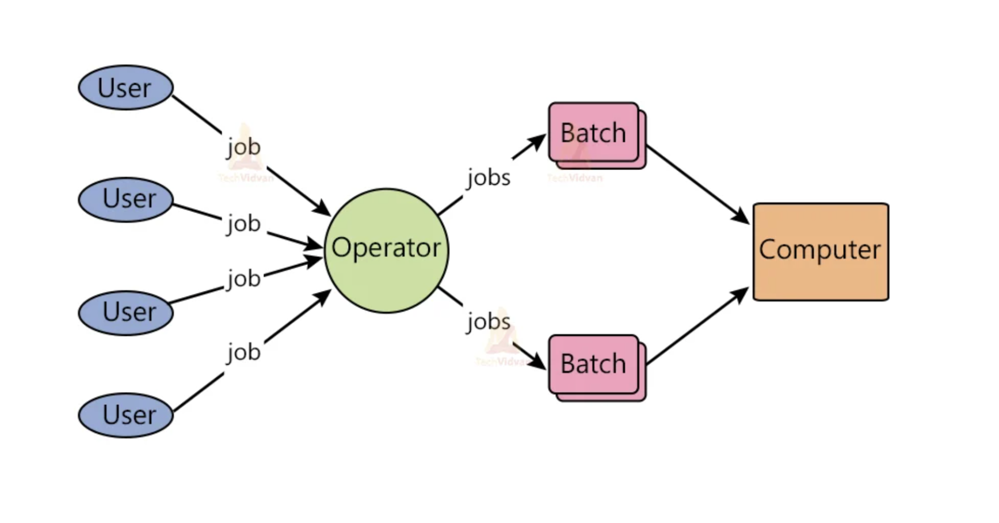
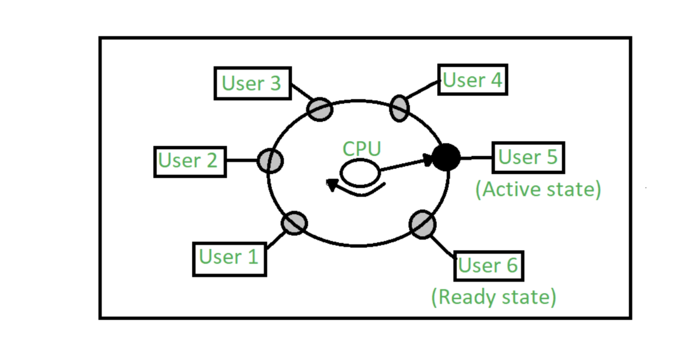
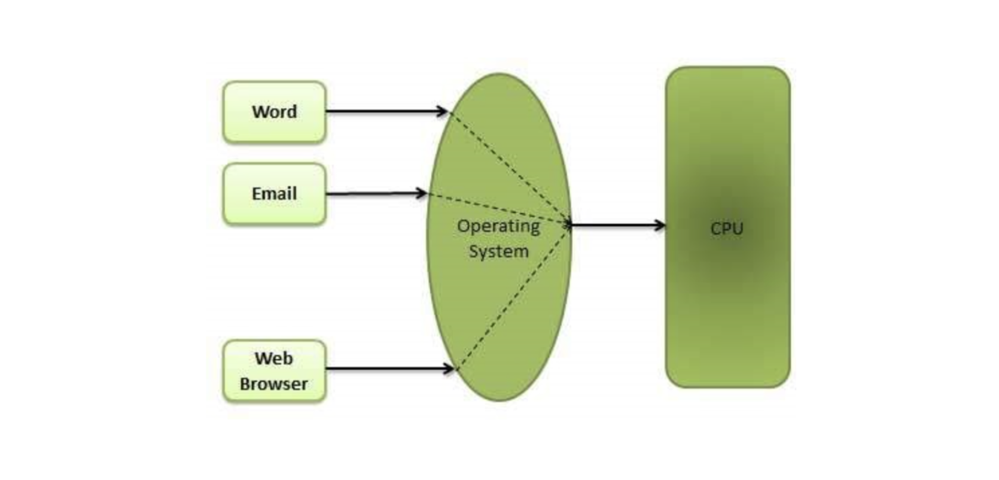
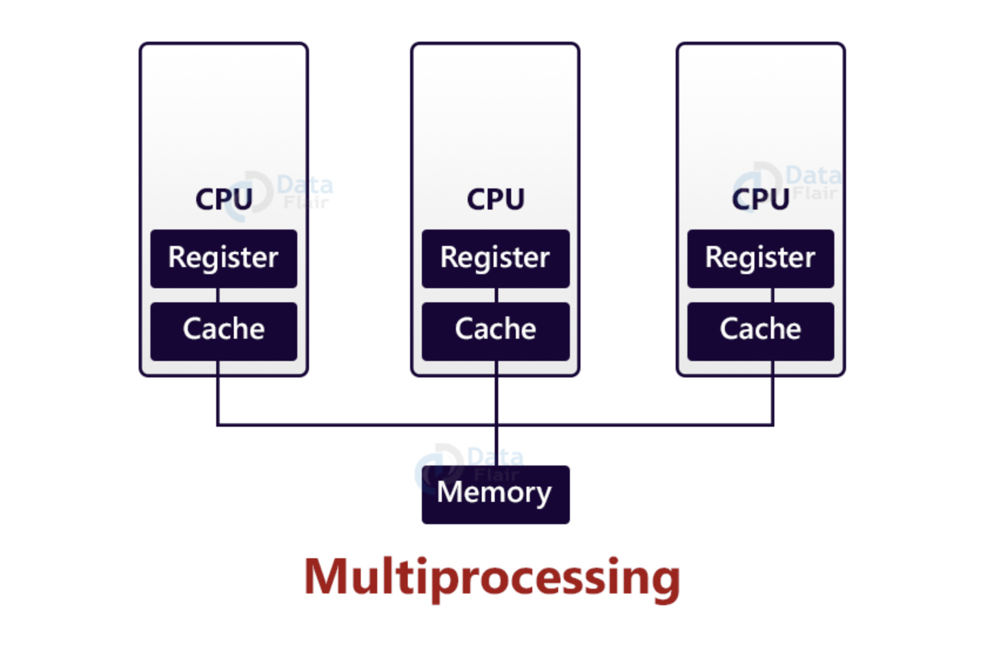
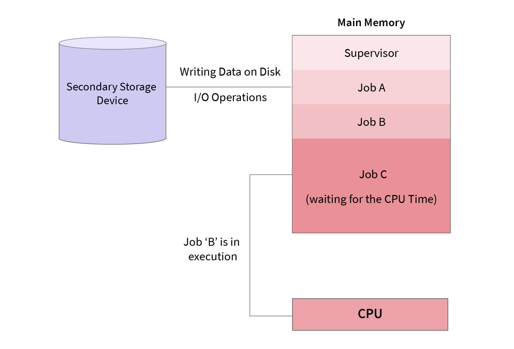
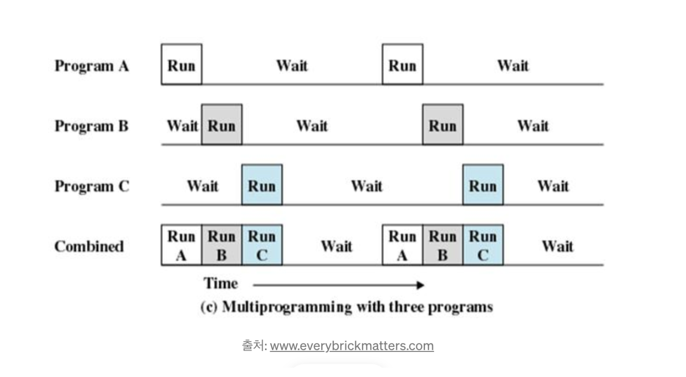

## 프로세스 스케줄링

여러 개의 프로세스 중 어느 시점에 어떤 프로세스를 실행할지에 대한 규칙, 즉 알고리즘. 그런 알고리즘들이 운영체제의 여러 기능 중 하나로 구현되어 있고, 이걸 우리는 프로세스 스케줄러라고 말한다.

### 일괄 처리, Batch Processing System

사용자와 시스템 간 상호작용이 없이 수행되는 작업. 요청이 있을 때마다 실시간으로 통신하는 게 아닌, 정해진 시간에 일괄적으로 처리되는 시스템.

초기에는 여러 개의 프로세스를 동시에 실행하는 게 아니라 순차적으로 다른 프로세스가 끝날 때까지 기다렸다가 프로세스를 실행해야 했다. 사용자 입장에서 프로세스가 언제 끝날지 예측하기 어렵고, 마냥 기다릴 수 없으므로 미리 프로세스를 등록시켜놓는 것. 그래서 프로세스가 끝나면 자동으로 등록해놓은 프로세스가 자동으로 실행되는 게 일괄 처리 시스템(batch processing system).

유저가 job을 등록해놓으면 운영체제가 처리함. 먼저 등록한 순서대로 처리하려면 큐 자료구조를 사용하면 된다.

운영체제의 시작은, Serial Processing System. 직렬 처리 시스템에서는 CPU가 한번에 하나의 작업만 수행할 수 있으므로 모든 명령어가 FIFO(선입선출) 방식으로 하나씩 실행된다.

직렬 처리 시스템 이후 일괄 처리 시스템(Batch Processing System)의 등장한다. 일괄 처리는 직렬 처리와 기법은 동일하다. 다만 운영체제가 job을 일괄적으로 수집해 CPU에 처리하는 방식. 일괄 처리의 장점으로는, 수동 개입 없이 이전 작접이 완료되는 즉시 자동으로 새 작업을 시작할 수 있으므로 성능이 향상된다. 단점으로는, 디버깅이 어렵고, job이 무한루프에 빠질 수 있다. 또한, 메모리 보호 정책이 없으므로 하나의 job이 다른 job의 데이터를 손상시킬 수도 있음.

### 시분할, Time Sharing System

다중 사용자를 지원하기 위해, 컴퓨터 응답 시간을 최소화하는 스케줄링 알고리즘. 일괄 처리를 진행하면 다른 프로세스가 끝나기 전까지 내가 원하는 작업을 수행할 수 없다. 실행 중인 프로세스가 짧다면 괜찮지만, 길다면 마냥 기다릴 수 없으니까. 서버 컴퓨터가 있다고 가정할 때, 하나의 프로세스만을 기다리면 컴퓨터 1대를 사용자 여러 명이서 쓸 수 없다. 이를 위해 나온 게 시분할 시스템. 시간을 잘게 쪼개는 것. 몇 초 간격으로 프로세스를 바꿔가며 프로세스A를 실행하고, 프로세스B를 실행하고 ... 이렇게 나눠서 처리하다 보면, 짧은 프로세스는 응답 시간이 훨씬 빨라진다는 것.

일괄 처리 시스템과 달리, 사용자와 컴퓨터 시스템 간 상호 작용이 가능함. 시간을 잘게 나눠 시스템 사용자가 빠르게 전환되므로 각 사용자는 컴퓨터 시스템을 전용으로 사용한다는 인상을 받는다.

사용자 5는 활성 상태, 사용자 6은 대기 상태, 사용자 1~4는 대기 상태.

### 멀티 태스킹, Multitasking Operating System

하나의 CPU에서 여러 작업을 동시에 실행하는 것처럼 보이게 하는 시스템. 구현은 시분할 시스템과 유사하되, 전환 간격을 보다 잘게 쪼개서 전환함으로써 사람이 보기에는 여러 프로세스가 동시에 실행되는 것처럼 보임.

멀티 프로세싱(Multi Processing)과 멀티 태스킹(Multi Tasking)의 차이점,
멀티 태스킹은 단일 CPU에서 여러 프로세스가 마치 동시에 실행하는 것처럼 보이도록 하는 스케줄링 알고리즘. 반면 멀티 프로세싱은 여러 CPU에 여러 개의 프로세스가 존재하는 것. 여러 CPU에 하나의 프로그램을 병렬로 실행해서 실행 속도를 극대화할 수 있음.

### 멀티 프로그래밍, Multiprogramming Operating System

마찬가지로 구현이 유사하지만, 최대한 CPU를 많이 사용하기 위해 사용하는 스케줄링 알고리즘. 예를 들어, SSD/HDD에 저장되어 있는 데이터를 가져오는 동안 CPU는 아무 것도 못한다. 그 일정 시간 동안 다른 프로세스로 전환해서 작업을 수행하도록 하는 알고리즘.

즉, 프로그램이 I/O 작업을 기다려야 하는 경우 그 동안 다른 프로그램이 CPU를 사용하도록 하는 것. 멀티 프로그래밍의 주요 목표 중 하나는 전체 시스템의 다양한 리소스를 관리하는 것. 그러므로 여러 프로그램을 동시에 저장하고 처리하도록 설계되었음.

## 참고자료

- [Properties of Operating System](https://techvidvan.com/tutorials/properties-of-operating-system/)
- [Time Sharing Operating System](https://www.geeksforgeeks.org/time-sharing-operating-system/)
- [Operating System - Properties](https://www.tutorialspoint.com/operating_system/os_properties.htm)
- [Multiprogramming Operating System](https://www.scaler.com/topics/multiprogramming-operating-system/)
- [Operating System-Part1 : Intro to OS](https://medium.com/@mrummanhasan/operating-system-part1-intro-to-os-4d6639239846)
