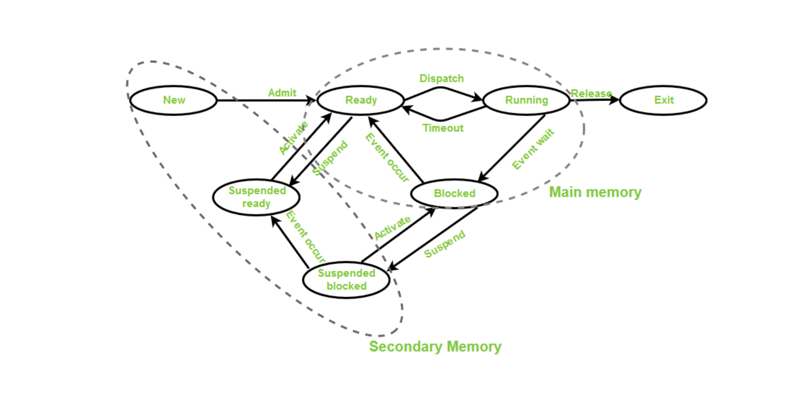
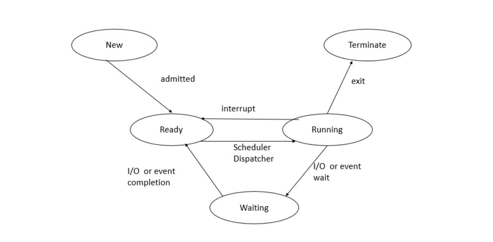

## state of a process

각 프로세스에 위와 같은 상태 정보를 넣어서, 프로세스 상태를 기반으로 프로세스를 스케줄링한다. 이전에 배운 여러 가지 알고리즘들도 상태 정보를 갖는다.

> - new(create) state : 생성될 예정이지만 아직 생성되지 않은 상태. 보조 메모리에 존재한다.
> - ready state : 프로세스가 CPU에서 실행할 준비가 된 상태. 이때, 프로세스가 메인 메모리로 로드된다.
> - running state : 실행을 위해 CPU에 의해 선택되어 실행 중인 상태
> - blocked state : 프로세스 실행 중간에 저장매체를 access해서 더 이상 실행이 불가능한 상태. (특정 이벤트 발생 대기 상태)
> - exit state : 프로세스가 완료되고 종료하기 직전의 상태

각 프로세스는 상태를 오고 가며 실행된다.

## CPU and I/O Bound Processes

프로그램에 따라, CPU/메모리를 주로 사용하는 프로그램과 I/O 관련 기능(저장매체 자주 오고 가는)을 주로 사용하는 프로그램 등 여러가지로 분류될 수 있다.

- CPU bound : 프로세스 진행 속도가 CPU 속도에 의해 제한됨. 더 많은 데이터를 처리하거나, 오디오/비디오를 처리하거나, 벡터 명령을 처리하거나 ...
- I/O bound : 프로세스 진행 속도가 I/O 시스템 속도에 의해 제한됨. 파일을 읽고 쓰거나, 네트워크 호출을 수행하거나 더 많은 네트워크 호출에 응답하거나 ...
- Memory bound : 메모리 양과 해당 메모리 엑세스 속도에 의해 제한됨.
- Cache bound : 사용 가능한 캐시의 양과 속도에 따라 프로세스 진행 속도가 제한됨.

속도 순서 분류(I/O Bound가 가장 느리고, CPU Bound가 가장 빠르다)
`I/O Bound > Memory Bound > Cache Bound > CPU Bound`

저장매체를 빈번하게 오고 간다면 성능 문제를 야기할 수 있으므로, I/O bound라면 최대한 CPU bound가 되도록 코드를 짜는 게 좋다.

## 참고자료

- [States of a Process in Operating Systems](https://www.geeksforgeeks.org/states-of-a-process-in-operating-systems/)
- [What is the relationship between process states and the machine cycle?](https://www.tutorialspoint.com/what-is-the-relationship-between-process-states-and-the-machine-cycle)
- [CPU Bound vs I/O Bound](https://dev.to/entangledcognition/cpu-bound-vs-i-o-bound-498i)
- [What do the terms "CPU bound" and "I/O bound" mean?](https://stackoverflow.com/questions/868568/what-do-the-terms-cpu-bound-and-i-o-bound-mean)
