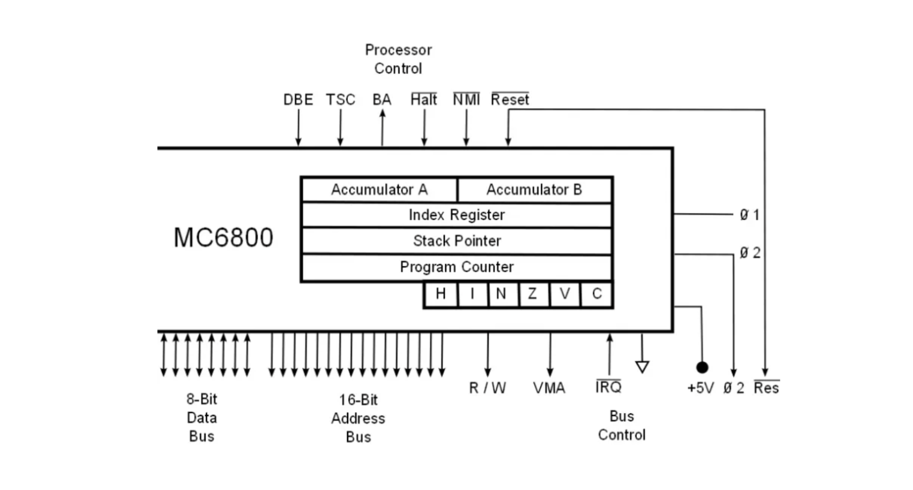
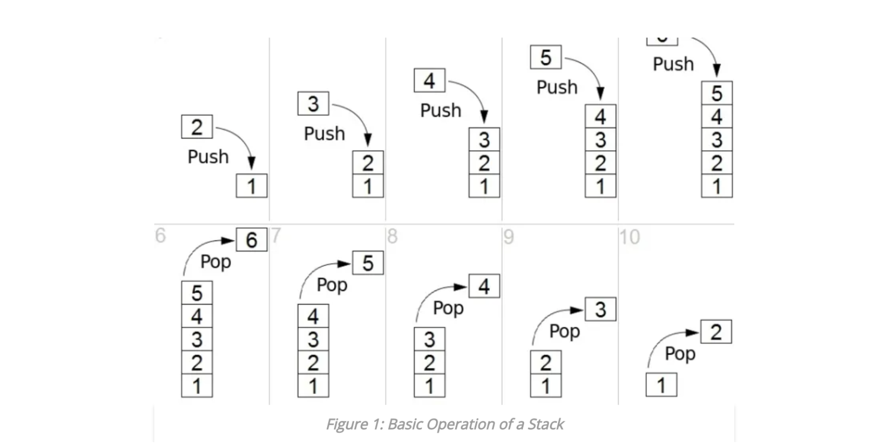

Registers는 CPU에 내장된 작은 저장 장치이다. 데이터를 임시로 저장하고 컴퓨터 성능을 높이는 데 도움이 된다. 레지스터의 크기는 컴퓨터 아키텍처에 따라 다를 수 있고, 다양한 유형의 레지스터가 각자의 역할을 수행한다. stack pointer와 program counter는 레지스터이다.

## Program Counter (PC)

program counter는 메모리에서 실행할 다음 명령어의 주소를 저장하는 레지스터이다. 예를 들어, 우리가 작성한 프로그램 코드가 있을 때, PC가 한줄 씩 코드를 읽어나가면서 다음 줄의 코드 주소를 PC에 저장한다.

컴퓨터 프로그램은 CPU에게 작업을 수행하도록 명령한다. 즉, 컴퓨터 프로그램은 이 명령(instructions)으로 이루어져 있고, CPU는 이러한 명령을 차례대로 가져와서 실행한다. 이때 program counter는 다음에 실행할 명령어의 주소를 저장하는 역할을 하는 레지스터인 것이다. Instruction pointer, Instruction address register 혹은 instruction counter라고 부르기도 한다.

CPU가 명령어를 가져올 때마다 program counter는 1씩 증가한다. 컴퓨터를 재설정하면 해당 값은 다시 0이 된다.

## Stack Pointer (SP)

stack pointer는 스택의 마지막 프로그램 요청 주소를 저장하는 레지스터이다. 스택의 최상단 주소를 갖고 있다고 보면 된다.

예를 들어, 재귀 함수를 보면 함수 안에서 함수를 계속해서 호출한다. 그러다 종료 조건을 만나서 return하게 되면 함수는 스택 최상단으로 바로 복귀하는 게 아니라 직전 해당함수를 호출한 곳으로 복귀한다. 그렇게 순차적으로 복귀하다가 가장 최근에 호출한 함수의 위치, 즉 스택의 최상단을 가리키고 있는 게 stack pointer이다. 그러다 보니, 최상단 stack pointer만 알고 있다면 함수가 어디까지 호출되었는지 추적할 수 있다.

이렇듯 스택 포인터 혹은 스택 레지스터는 스택을 처리하는 데 도움이 되는 작은 레지스터이다. 마지막 프로그램 요청 주소를 저장한다. 여기에서 최근 입력된 요청은 스택의 최상단에 위치해 있게 된다. 스택에 프로그램 요청을 삽입하면 스택 포인터는 먼저 1씩 증가한다. 그런 다음 요청이 스택으로 push된다. 스택에서 프로그램 요청을 제거하면 요청이 먼저 스택에서 나오고 난 뒤에 스택 포인터가 1씩 감소한다.

## PC와 SP를 통해 프로세스가 우리의 의도대로 동작하는 원리

프로그램이 프로세스화되면 프로세스 메모리 구조에 따라, 코드 영역에 코드가 들어가고 데이터 영역에 전역 변수 같은 게 들어간다.

함수를 호출하면 해당 함수를 호출한 위치를 stack pointer에 기록해둔 뒤, 이를 기반으로 함수 내부 코드를 처리한 뒤 다시 해당 함수가 return되는 순간부터 스택포인터를 줄여가면서 return address(해당 함수가 호출된 위치)를 만나면 그 return address를 program counter(PC)에 넣고 해당 PC를 실행하게끔 구조를 짜놓으면 프로세스는 우리가 작성한 의도대로 동작하게 된다.

## PC와 SP의 차이점?

스택 포인터는 호출 스택을 추적하는 게 목적인 CPU 레지스터이다. 반면 프로그램 카운터는 컴퓨터가 프로그램 순서 중 어디에 위치해 있는지를 나타내는 CPU 레지스터이다.

스택 포인터는 스택의 마지막 프로그램 요청 주소를 보유하는 반면, 프로그램 카운터는 실행되어야 할 다음 명령어의 주소를 보유한다.

## 참고자료

- [What is the Difference Between Stack Pointer and Program Counter](https://pediaa.com/what-is-the-difference-between-stack-pointer-and-program-counter/)
- [Why Stack and Stack Pointer Matters The Most?](https://www.watelectronics.com/why-stack-and-stack-pointer-matters-the-most/)
