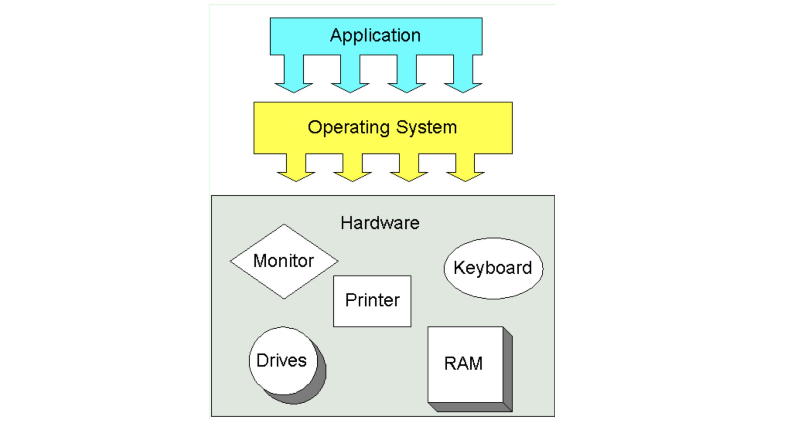
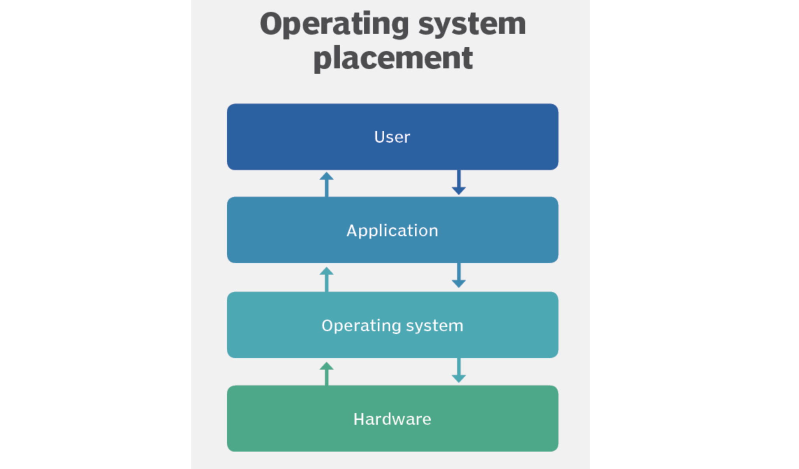
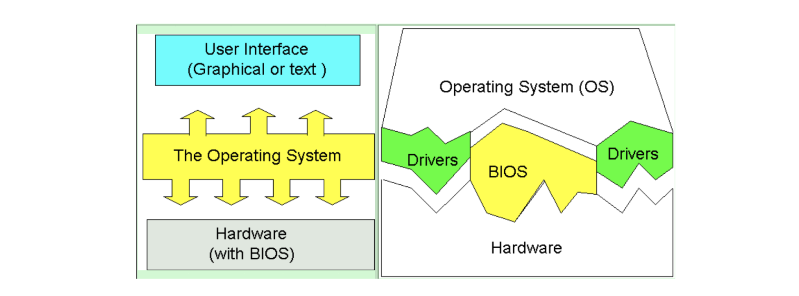

## 운영체제의 주요 역할 3가지

### 1. Device management :: CPU, 메모리, 각종 I/O 장치와 같은 시스템 리소스(System Resource) 관리자

CPU(중앙처리장치), 메모리(RAM), I/O (모니터, 마우스 등 입출력기기), 저장매체(SSD, HDD 등)

각각의 응용프로그램들이 아니라 운영체제가 직접적으로 시스템 자원(컴퓨터 하드웨어)을 제어한다. 즉, CPU를 얼마나 사용할지, 각 응용 프로그램의 주소, 메모리 공간, 어디에 어떻게 저장할지 등을 모두 운영체제가 제어한다.

### 2. User Interface :: 컴퓨터와 사용자 간 커뮤니케이션 지원

사용자는 CLI(Comman-Line Interface) 또는 GUI(Graphical UI)와 같은 사용자 인터페이스를 통해 상호작용할 수 있다.

### 3. Application management :: 응용 프로그램 소프트웨어 제어(실행, 중지 등)

운영체제는 부팅 프로그램에 의해 컴퓨터에 처음 로드된 후 컴퓨터의 다른 모든 응용 프로그램을 관리한다. 응용 프로그램은 정의되어 있는 응용 프로그램 인터페이스(API, Application Program Interface)를 통해 서비스를 요청해 운영체제를 사용한다.

운영체제도 결국 소프트웨어지만, 운영체제 위에서 동작하는 소프트웨어를 구분하기 위해 응용프로그램이라고 부름. 운영체제는 응용 프로그램을 제어/관리(실행, 권한 제어, 사용자 접근(로그인 등))한다.

응용프로그램이 잘 동작하도록 관리한다. 응용 프로그램이 요청하는 시스템 자원을 효율적으로 분배하고 지원한다.

## 참고자료

- [Operating Systems](https://homepage.cs.uri.edu/faculty/wolfe/book/Readings/Reading07.htm)
- [operating system (OS)](https://www.techtarget.com/whatis/definition/operating-system-OS)
