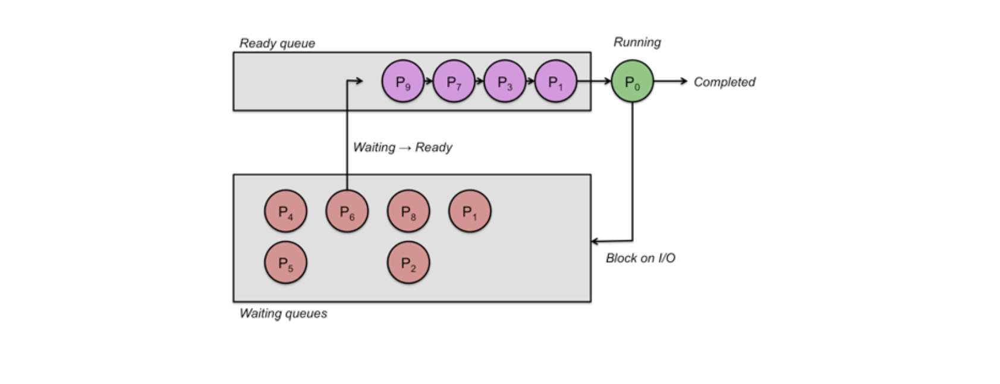
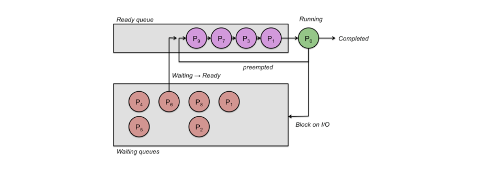

## 비선점형 스케줄링(Non-preemptive Scheduling)과 선점형 스케줄링(Preemptive Scheduling)

### 비선점형 스케줄링

프로세스가 CPU를 할당 받으면, 프로세스가 자발적으로 종료될 때까지 계속 실행을 보장한다.

- FCFS (First Come First Served Scheduling)
- SJF (Shortest Job First Scheduling)
- HRRN (Highest Response Ratio Next Scheduling)

### 선점형 스케줄링

CPU를 할당 받아 실행 중인 프로세스가 있어도 다른 프로세스가 해당 프로세스의 실행을 중지하고 CPU를 강제로 점유할 수 있다.

- RR (Round Robin Scheduling)
- SRTF (Shortest Remaining-Time First Scheduling)
- MQ (Multilevel Queue Scheduling)
- MFQ (Multilevel Feedback Queue Scheduling)
- RM (Rate Monotonic Scheduling)
- EDF (Earliest Deadline First Scheduling)

## FCFS (First Come First Served) 스케줄링

First In First Out

가장 단순한 스케줄링 알고리즘이다. 단순히 준비 대기열에 도착한 순서대로 프로세스를 대기열에 넣는 것을 말한다.

1. ready queue를 생성해서 실행시킬 프로세스들을 ready queue에 넣는다.
2. 해당 큐에서 프로세스를 뽑아서 CPU에 실행시키고
3. 끝나면 다시 큐로 돌아와서 다음 프로세스 실행하고
4. ... 위 과정 반복

장점

- 구현하기 쉽고, 직관적으로 fair하다(먼저 들어간 프로세스가 먼저 실행되는 방법)

단점

- preemptive가 아니다. 이 때문에 interactive 작업을 수행하는 데 적합하지 않다.
- long-running 프로세스가 뒤 작업들을 모두 지연시킨다.

## SJF (Shortest Job First) 스케줄링

최단 작업 우선 스케줄러

프로세스를 실행할 때, 실행 시간이 짧은 프로세스부터 우선적으로 실행하는 알고리즘을 말한다. 작업 완료 시간을 알아야 하지만 예측하기 어려운 경우가 많다.

예를 들어, RTOS(Real Time Operating System)과 같이, 실시간 응용 프로그램을 위해 개발되어 CPU 시간 관리 부분에 초점을 맞춰 설계된 운영체제(응용 프로그램의 실시간 성능 보장)에서는 SJF 스케줄러를 사용할 수 있을 만큼 특정 프로세스의 완료 시간을 정확하게 알 수 있다.
이와 달리, 우리가 일반적으로 사용하는 운영체제들(윈도우즈, 맥OS ...)은 GPOS(General Purpose OS)라고 한다. 이 경우 프로세스가 언제 끝나는지에 대해 그렇게까지 민감하지 않다.

## 우선 순위 기반(Priority-Based) 스케줄링

각 프로세스에 우선 순위를 할당한다. 실행할 준비가 된 프로세스 중 가장 높은 우선 순위를 가진 프로세스를 실행한다.

우선 순위는 Internal이거나 External하게 결정될 수 있다.
내부 우선 순위는 시간 제한, 프로세스의 메모리 요구 사항, 예상 I/O 대비 CPU 비율 등 시스템 내부 요소에 따른 우선순위가 결정되는 것이다. 외부 우선 순위란 administrators에 의해 우선 순위가 할당되는 것이다.

우선 순위는 동적이거나 정적일 수 있다. 정적으로 우선순위가 미리 지정되는 경우 정적 우선 순위인 것이다. 반면, 동적으로, 예를 들어 I/O에서 대기하는 시간이 길다거나 할 때 우선 순위를 높이거나 하는 경우를 동적 우선 순위(상황에 따라 스케줄러가 우선순위를 동적으로 변경)라고 할 수 있다.

프로세스의 상대적인 중요도에 따라 프로세스를 실행할 수 있다는 장점이 있지만, 우선 순위가 높은 프로세스만 실행하다 보면 상대적으로 우선순위가 낮아 무기한적으로 실행 연기가 발생하는 경우 기아 상태(starvation)에 빠질 수 있다는 단점이 있다.

> starvation을 해결하는 방법으로는, 동적으로 우선순위를 할당하는 방법이 있다. 실행 기회가 적은 프로세스에 동적으로 우선 순위를 높여주거나 할 수 있는 것이다. 실행 기회를 얻기 위해 프로세스의 우선 순위를 주기적으로 높이는 걸 process aging이라고 한다.

## SRTF (Shortest Remaining Time First) 스케줄링

SRTF 스케줄링은 비선점혀인 SJF 스케줄링의 선점형 버전이다. 작업 대기열이 예상 작업 시간이 짧은 순으로 정렬되어 소요 시간이 짧은 프로세스부터 실행된다.

## RR (Round Robin) 스케줄링

FCFS 스케줄링의 선점형 방식이다. 각 프로세스들이 선입선출 방식으로 dispatch되지만 각각의 프로세스는 제한된 시간 동안만 실행될 수 있다. 일정 시간 동안 프로세스가 완료되지 않으면, 중지한 후 다시 큐의 맨 뒤로 넣는다.

FCFS 스케줄링에 비해 RR 스케줄링은 선점형이므로 평균 응답 시간이 크게 향상된다. 각 프로세스 별로 작업 시간을 제한함으로써 모든 작업을 순환할 수 있다.

## 참고자료

- [Process Scheduling](https://people.cs.rutgers.edu/~pxk/416/notes/07-scheduling.html)
