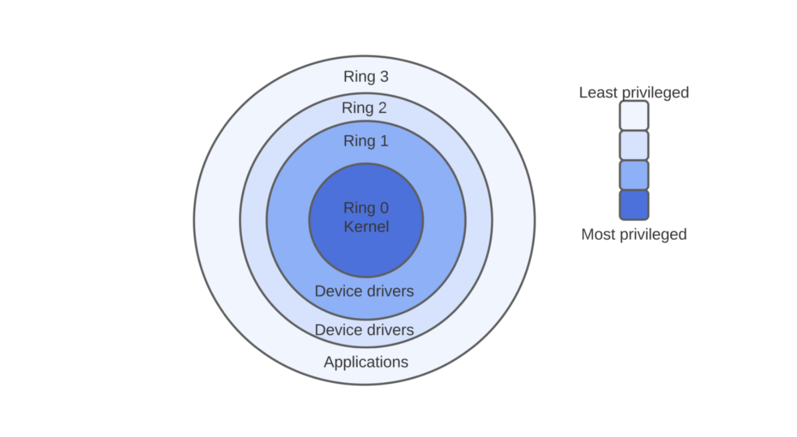
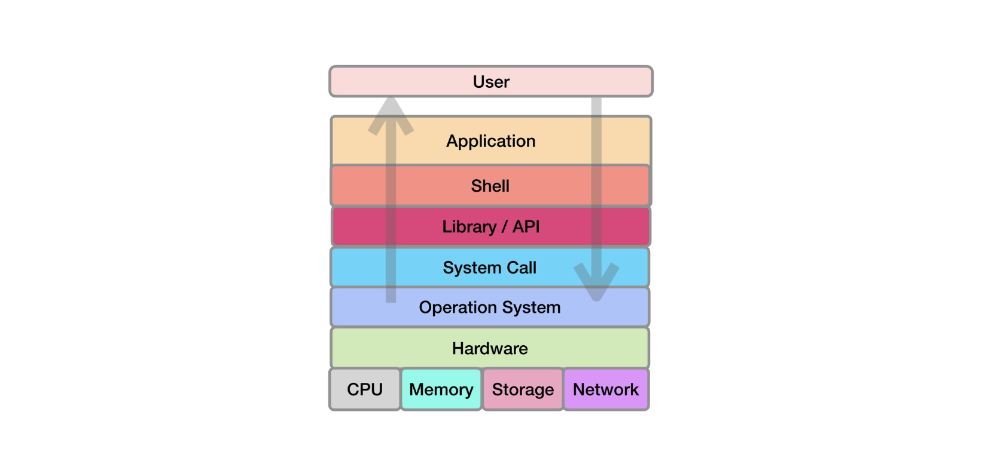

## 시스템 콜 System calls

응용 프로그램을 사용하기 위해, 커널에 뭔가를 요청하고 다시 커널이 그 요청 결과를 쉘에게 건네준다. 사용자가 응용 프로그램을 사용하는 동안 이런 일들이 벌어지는 것이다. 이때 커널과 쉘 프로그램은 어떻게 의사소통을 할까?

커널은 쉘 프로그램이 요청할 수 있도록 특정 형태의 통신 인터페이스를 제공하는데, 그걸 우리는 system calls 혹은 system-call interface라고 한다. 시스템콜은 보통 함수 형태를 갖는다.

시스템콜은 프로그램이 운영체제의 커널에게 서비스를 요청하는 프로그래밍 방식이다. 즉, 프로그램이 운영체제와 상호작용하는 방식이다. 시스템 콜은 API를 통해 운영체제의 서비스를 사용자 응용 프로그램에게 제공해준다. 시스템 콜은 커널 시스템으로의 유일한 진입점이며, 리소스를 필요로 하는 모든 프로그램은 시스템 콜을 사용한다.

### 시스템 콜에 의해 제공되는 서비스들은 다음과 같다.

- Process 생성과 관리
- Main memory 관리
- File 접근, Directory and File system 관리
- I/O device 제어
- Protection
- Networking, etc.

### 시스템 콜의 5가지 유형

- Process 제어 : end, abort, create, terminate(중단, 생성, 종료 등) , allocate and free memory (메모리 할당 및 해제)
- fill 관리 : create, open, close, delete, read file etc.
- device 관리
- Information maintenance
- communication

## 사용자 모드와 커널 모드 User mode and Kernel mode

운영체제는 CPU protection rings을 통해 컴퓨터 리소스를 관리한다. CPU에서 뭔가 실행할 때마다 cpu protection rings에 적혀 있는 레벨 정보를 명령에 같이 써넣음으로서 레벨에 맞게 사용자 모드와 커널 모드를 오고 간다.

시스템 콜은 커널 모드에서 실행된다. 응용 프로그램이 API의 특정 함수(시스템 콜과 연결된)를 호출하면, 그 순간 사용자 모드에서 커널 모드로 바뀌어 운영체제 내부에서 해당 명령을 처리한 뒤 응용 프로그램에게 처리 결과를 반환하면서 다시 사용자 모드로 전환된다.

이렇게 우리가 사용하는 응용 프로그램은 빈번하게 사용자 모드와 커널 모드로 스위칭하며 실행된다. 시스템 리소스 접근처럼 중요한 동작은 사용자 모드가 아니라 커널 모드에서 실행된다.

### 사용자 모드와 커널 모드의 차이

- interruptions : 사용자 모드에서 인터럽션이 발생하면 단일 프로세스가 실패하지만, 커널 모드에서 인터럽션이 발생하면 전체 운영체제가 다운될 수 있다.
- mode name : 커널 모드는 master mode, privileged mode, or system mode로 불린다. 사용자 모드는 unprivileged mode, restricted mode, or slave mode 로 불린다.
- virtual address space : 커널 모드에서 모든 프로세스는 단일 가상 주소 공간을 공유한다. 사용자 모드에서 모든 프로세스는 별도의 가상 주소 공간을 할당받는다.
  ...

## 응용 프로그램을 운영체제에 맞게 다운로드 받는 이유

우리가 고급 언어에서 파일 처리와 같이 커널에게 요청이 필요한 기능을 써야하는 경우, 자바는 JDK 혹은 자바스크립트는 node.js가 자동으로 중간에서 C언어로 된 시스템콜을 도와준다. 웹 브라우저에서 파일 처리를 요청한다면 그 웹브라우저조차 운영체제에 맞게 중간에서 시스템 콜을 도와준다. 즉, 각각의 언어는 각 운영체제에 맞게 자동으로 porting, 즉 해당 언어가 해당 운영체제에서 동작하게끔 만드는 변환 과정을 거친다.

그리고 이런 시스템콜의 종류가 많으므로 각각의 기능들을 묶어 라이브러리 혹은 패키지 형태로 제공해주며, 우리는 그 사용법을 익혀 코드를 작성하는 것이다. 이런 라이브러리나 패키지를 통칭해 API라고 부르곤 한다. 응용 프로그램을 만들 수 있는 인터페이스, 즉 Application Programing Interface라고 한다.

정리하자면,

1. 운영체제 프로그램은 운영체제의 핵심인 kernel만 필요한 게 아니다.
2. kernel 기능을 쓸 수 있도록 도와주는 system calls도 필요하다. (운영체제는 시스템 콜을 제공해준다.)
3. 이 시스템콜을 기반으로, 특정 프로그래밍 언어가 해당 kernel에서 동작할 수 있도록 porting을 해주는 언어별 API도 필요하다. (프로그래밍 언어에 맞게 운영체제 별로 API를 제공해준다.)
4. 이를 기반으로 shell 프로그램도 필요하며, 그 위에서 각각의 언어로 응용 프로그램을 개발하는 것이다. (응용 프로그램 개발 시, 운영체제 기능이 필요하면 해당 API를 사용해서 코드 작성)

우리가 사용하는 응용 프로그램들이 운영체제별로 존재하는 이유도 여기에서 찾을 수 있다. 각각의 운영체제마다 시스템콜도 다르고, API 구현도 다르기 때문이다.

## 참고

- [Application, Operating System, System Resource의 관계 with Node.js](https://devwhkang.gatsbyjs.io/posts/os-systemcall/)
- [Introduction of System Call](https://www.geeksforgeeks.org/introduction-of-system-call/?ref=gcse)
- [운영체제 04 : 시스템 콜 (시스템 호출, System Call)](https://luckyyowu.tistory.com/133)
- [Difference Between User Mode and Kernel Mode](https://www.geeksforgeeks.org/difference-between-user-mode-and-kernel-mode/)
- [What are Rings in Operating Systems?](https://www.baeldung.com/cs/os-rings)
