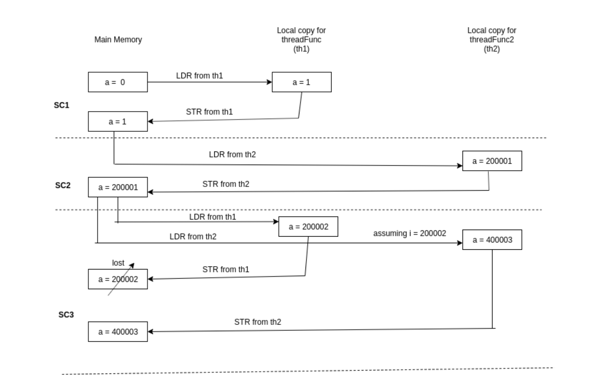
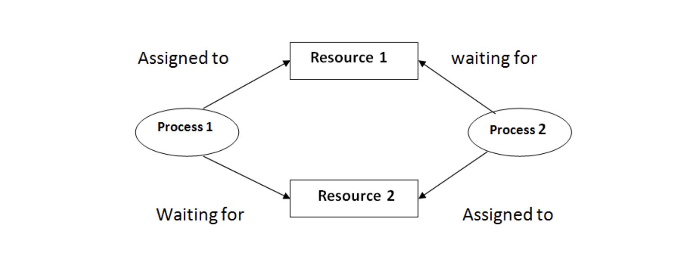

## 스레드 동기화 (thread synchronization)

```cpp
#include <stdio.h>
#include <stdlib.h>
#include <unistd.h>

volatile long int a = 0;

int main()
{
    int i;
    a = 0;

    for(i = 0; i < 100000; i++)
    {
        a = a + i;
    }

    printf("%ld\n",a);
    return 0;
}
```

위 코드는 단일 스레드로 구성되어 parallelism를 걱정할 필요 없는 간단한 코드이다. 코드는 항상 4999950000를 반환한다.

```cpp
#include <stdio.h>
#include <stdlib.h>
#include <pthread.h>
#include <unistd.h>

volatile long int a = 0;
pthread_mutex_t aLock;

void threadFunc()
{
    int i;

    for (i = 1; i < 200000 ; i++)
    {
        a = a + 1;
    }
}

void threadFunc2()
{
    int i;

    for(i = 200000; i <= 500000; i++)
    {
        a = a + i;
    }
}

int main()
{
    pthread_t th_one, th_two;
    int i;
    a = 0;

    pthread_create(&th_one, NULL, (void*)&threadFunc, NULL);  // Create a new thread for threadFunc
    pthread_create(&th_two, NULL, (void*)&threadFunc2, NULL); // Create a new thread for threadFunc2

    pthread_join(th_one, NULL);  // waiting to join thread "th_one" without status
    pthread_join(th_two, NULL);  // waiting to join thread "th_two" without status

    printf("%ld\n",a);

    return 0;
}
```

위 코드는 두 개의 새로운 스레드 threadFunc, threadFunc2가 추가된 코드이다. 하지만 위 코드를 출력해보면 앞선 코드와 달리 일정하지 않은, 부정확한 코드를 반환한다. 이유는, 스레드 동기화를 처리하지 않았기 때문이다.

아래 그림에서 확인해보면,
로컬 메모리에 변수를 로드한 다음 연산 작업을 수행하고 다시 메인 메모리에 저장하는 게 기본 로직이다.

```bash
LDR R0, a
ADD R0, R0, R1
STR R0, a

LDR(메모리 값을 레지스터로 읽고, load)
ADD(레지스터에서 그 값을 변경한 뒤, 여기선 덧셈)
STR(변경된 값을 메모리에 쓴다, store)
```

하지만 스레드 동기화가 처리되지 않아, 저장하지도 않았는데 다음 작업을 수행하고 로드한다거나 해서 명령이 꼬이게 된다.



즉, 3개의 명령어(LDR,ADD,STR)가 한 세트로 이루어져야 하는데, 그걸 인식하지 못하고 3개의 명령어 중간에 context switching이 발생해버리는 것이다. 이게 바로 동기화 이슈이다. 중간중간 값이 꼬이므로 결과값이 일정하지 않고 랜덤하게 출력된다.

이때 동기화란 결국 여러 작업들 간 실행 시기를 맞추는 것으로서, 스레드가 프로세스의 데이터를 동시에 접근할 수 있기에 동기화 이슈를 처리해주지 않으면 위 예제 코드처럼 오류가 발생한다.

## 동기화 이슈 해결 방법

### 1. Exclusive lock

Mutex(Mutual Exclusion, 상호배제)를 사용하는 것이다.

```cpp
#include <stdio.h>
#include <stdlib.h>
#include <pthread.h>
#include <unistd.h>


volatile long int a = 0;
pthread_mutex_t aLock;


void threadFunc(void* arg)
{
    int i;


    for (i = 1; i < 200000 ; i++)
    {
        pthread_mutex_lock(&aLock); // Lock a mutex for a
        a = a + 1;
        pthread_mutex_unlock(&aLock); // Unlock a mutex for a
    }
}


void threadFunc2(void *arg)
{
    int i;


    for(i = 200000; i <= 500000; i++)
    {
        pthread_mutex_lock(&aLock); // Lock a Mutex for a
        a = a + i;
        pthread_mutex_unlock(&aLock); // Unlock a mutex for a
    }
}


int main()
{
    pthread_t th_one, th_two;
    int i;
    a = 0;


    pthread_create(&th_one, NULL, (void*)&threadFunc, NULL);  // Create a new thread for threadFunc
    pthread_create(&th_two, NULL, (void*)&threadFunc2, NULL); // Create a new thread for threadFunc2


    pthread_join(th_one, NULL);  // waiting to join thread "one" without status
    pthread_join(th_two, NULL);  // waiting to join thread "two" without status


    printf("%ld\n",a);
    return 0;
}
```

기본적으로 스레드가 프로세스의 데이터에 접근할 수 있으므로 특정 작업을 하는 동안 다른 스레드가 해당 데이터를 처리하지 못하도록 막는 방법이다.

이때, 임계 자원(Critical resource)과 임계 영역(Critical section)을 알아두면 좋다.
임계자원은 쉽게 말해 각 스레드가 모두 접근 가능한 데이터로, 위 코드에서는 변수 a를 말한다.
임계영역은 접근 가능한 데이터 영역으로 좁게는 변수 a, 넓게는 for loop로 볼 수 있다.

어쨌든, 임계영역에 여러 스레드가 동시에 접근하지 못하도록 잠금장치(lock)을 걸어둔다.
하나의 스레드가 잠금장치를 열고 들어가서 unlock할 때까지 다른 스레드들은 기다리도록 한다.

```cpp
for(i = 200000; i <= 500000; i++)
    {
        pthread_mutex_lock(&aLock); // Lock a Mutex for a
        a = a + i;
        pthread_mutex_unlock(&aLock); // Unlock a mutex for a
    }
```

### 2. Non-exclusive lock

임계영역(Critical section)에 접근을 막는 locking 메커니즘 중 하나로 Mutex는 binary semaphore라고 한다. 즉, 임계영역에 하나의 스레드만 들어갈 수 있게하는 locking 기법인 것이다.

반대로, 세마포어(semaphore)는 임계영역에 여러 개의 스레드가 들어갈 수 있게 설계하는 locking 기법이다. 스레드를 하나씩만 접근하게 하면 성능이 떨어질 수도 있다. 처리해야 할 스레드가 쌓여 있는데 하나씩 처리하면 처리가 지연될 수 있기 때문이다.

다만, 무한정으로 접근을 허용하면 안 되므로
count를 해서 적당한 개수만 허용하게 설정한다든지, 혹은 다른 방법으로든 임계영역에 들어갈 스레드의 개수를 임의로 설정하면 된다.

```cpp
class Program
    {
        public static Semaphore semaphore = new Semaphore(3, 5);
        public static void Main(string[] args)
        {
            for (int i = 0; i < 10; i++)
            {
                Thread threadObject = new Thread(Process);
                threadObject.Name = "Thread: " + i;
                threadObject.Start();
            }
            Console.ReadLine();
        }
        private static void Process()
        {
            Console.WriteLine("{0} is waiting to enter the critical
            section.", Thread.CurrentThread.Name);
            semaphore.WaitOne();
            Console.WriteLine("{0} is inside the critical section now...",
            Thread.CurrentThread.Name);
            Thread.Sleep(1000);
            Console.WriteLine("{0} is releasing the critical section...",
            Thread.CurrentThread.Name);
            semaphore.Release();
        }
    }
```

이렇듯 각 언어 별로 스레드에 대한 동기화 라이브러리 혹은 함수를 제공한다.

## 교착상태 (deadlock)



동기화를 처리해서 특정 공유 리소스에 접근(혹은 처리)할 때 권한이 필요하도록 설계를 했을 때, 생길 수 있는 문제가 바로 deadlock이다.

위 그림처럼 예를 들어, 서로가 resource를 점유하고 있어서 서로 움직이지 못하면서 그렇다고 빠져나오지도 못하는 상태. 즉, 여러 개의 task가 서로 다른 task가 끝나기를 기다리면서 다음 단계로 나아가지 못하고 무한정 대기하는 상태를 말한다.

어플리케이션을 사용할 때 반응이 없다든지 ... deadlock을 해결하는 방법 중 하나는 특정 시간 동안 반응이 없을 때 강제로 종료하는 방법이 있다.

```cpp
class Program {
  private readonly static object lockObj = new object();
  static void Main(string[] args) {
    try {
      if (Monitor.TryEnter(lockObj, 100)) {
        //This is the critical section
      }
    } catch (Exception ex) {
      //Write your code here to handle exceptions
    } finally {
      Monitor.Exit(lockObj);
    }
  }
}
```

## 기아 상태 (Starvation)

교착상태(deadlock)과 비교해서 알아두면 좋은 기아상태(starvation).

스레드 보다는 프로세스와 밀접하게 관련 있다.

deadlock이 여러 task(프로세스 혹은 스레드)가 중복되는 리소스 점유를 요청할 때 발생하는 것이라면, starvation은 여러 프로세스가 부족한 리소스를 두고 경쟁할 때, 특정 프로세스의 우선순위가 낮아 계속해서 리소스를 할당받지 못하는 상태를 일컫는다.

=> 일정 시간이 지나면 프로세스의 우선순위를 높여주거나 우선순위와 상관 없는 스케줄링 방식을 사용하는 것이 해결방법이 될 수 있다.

## 참고자료

- [Multithreading and Thread synchronization - with an example code in C](https://www.linkedin.com/pulse/multithreading-thread-synchronization-example-code-c-pratik-parvati/)
- [Working with Thread Synchronization and Semaphores in C#](https://www.codeguru.com/csharp/thread-synchronization-c-sharp/)
- [Deadlock and method for handling deadlock](https://www.includehelp.com/operating-systems/deadlock-and-method-for-handling-deadlock.aspx)
