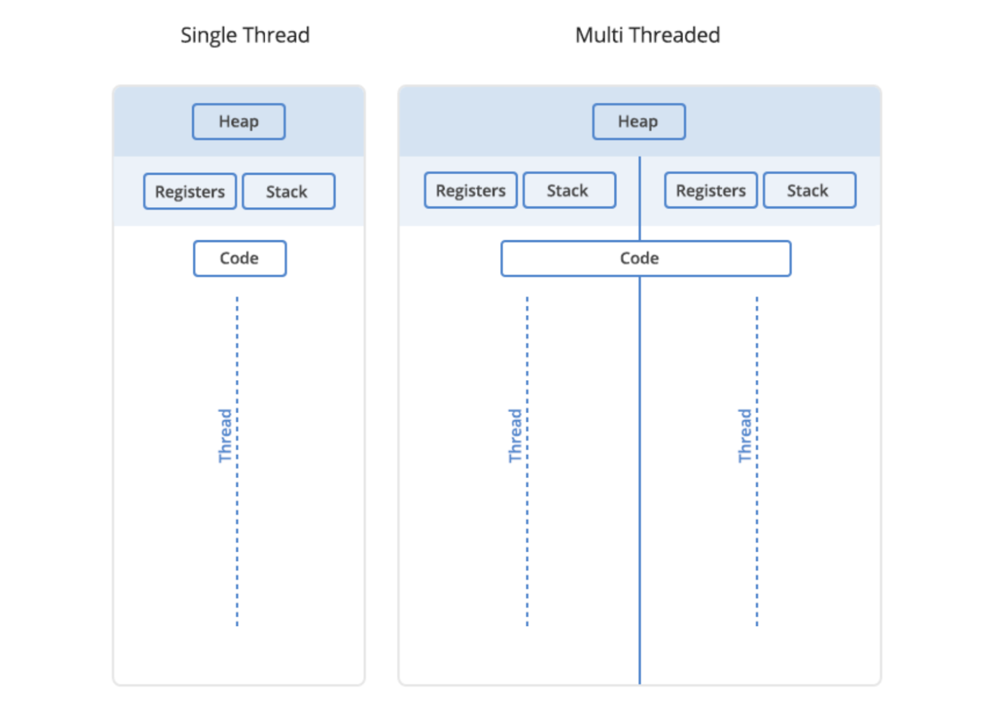

## Thread

스레드(thread)는 프로세스 내 a path of execution이자 레지스터와 스택으로 구성된 CPU 수행 기본 단위이다. (프로세스가 OS로부터 자원을 할당 받은 작업의 단위라면, 스레드는 프로세스가 할당받은 자원을 사용하는 실행 흐름의 단위이다.)

스레드는 순차적인 프로그램과 유사하다. 단일 스레드에도 시작, 실행순서, 그리고 끝이 존재하며 스레드가 실행되는 동안에도 특정 시간에 단일 실행 지점이 존재한다. 하지만 스레드는 자체 프로그램은 아니며 자체적으로 실행할 수 없다. 스레드는 프로그램 내에서 실행된다.

하지만 스레드의 장점은 단순히 순차적으로 실행한다는 점이 아니라 오히려 단일 프로그램에서 여러 스레드를 사용할 수 있다는 점에 있다. 앞서, 멀티 프로세스 간 데이터 공유는 어렵기에 IPC 기법을 사용했었다. 반면 스레드는 하나의 프로세스 안에서 동작하며, 하나의 프로세스 안에서 여러 개의 스레드가 실행 가능하기에 각각의 스레드가 하나의 프로세스에 있는 모든 데이터에 접근할 수 있다는 장점이 있다.

일부 텍스트에서는 스레드를 Light Weight Process 라고 하기도 한다. 예를 들어, 리눅스에서는 스레드 내부 또한 마치 프로세스처럼 구현되어 있다. 다만, 프로세스가 4개 영역(힙, 스택, 코드, 데이터)를 각각 가지는 반면 스레드는 자기만의 스택 영역(자체 실행 스택과 프로그램 카운터 등의 레지스터)만을 갖추고 나머지 리소스는 공유한다는 점에서 Light Weight Process라고 부르는 것이다. 그래서 리눅스에서는 프로세스와 스레드를 구분하지 않고 보다 일반적인 용어인 'tasks'로 사용한다.

IPC 기법을 사용해야하는 프로세스와 달리, 스레드는 프로세스 내부에서 리소스 공유가 가능하므로 소프트웨어 병행 작업을 처리하기 위해 멀티 스레드 방식을 많이 사용된다. 예를 들어, 웹 브라우저는 다중 스레드 응용 프로그램의 한 예시이다. 일반적으로 브라우저 내에서 이미지를 다운 받는 동안 페이지를 스크롤하거나, 심지어 동시에 음악을 재생하는 등. 또는 브라우저에서 여러 개의 탭이 멀티 스레드의 예시가 될 수 있다.

멀티 프로세스의 경우, IPC기법이 가능하도록 처음부터 코드를 짜야 하지만, 멀티 스레드의 경우 프로그램의 일부 동작에서만 사용할 수 있게 코드를 추가할 수 있으므로 => 멀티 프로세스보다 멀티 스레드 방식에 더 쉽게 접근하곤 한다.

## thread의 장점

### 1. Responsiveness

사용자의 다양한 요청을 다중 프로세스가 아닌 여러 개의 스레드로 분리해서 만들면 빠른 응답을 제공할 수 있다.

예를 들어, 단일 스레드 환경에서의 서버는 일부 요청에 대해 요청을 처리한 다음에야 다른 요청을 수신할 수 있으므로, 대기 시간이 길어질 수밖에 없다.

다중 스레드 웹 브라우저에서는 전체 웹 페이지가 로드되는 동안 웹 페이지 일부를 볼 수 있다.

### 2. Resource sharing & Economy

기본적으로 스레드는 공통 코드, 데이터 및 기타 리소스를 공유하므로 단일 주소 공간에서 여러 작업을 동시에 수행할 수 있다. 자원 공유를 위해 프로세스처럼 IPC 기법을 사용한다든지 번거롭게 할 필요가 없다.

스레드 생성 및 관리(스레드 간 context switching 등)가 프로세스보다 훨씬 빠르다. 프로세스의 컨텍스트 스위칭은 프로세스 간 공유되는 자원이 없으므로 컨텍스트 스위칭의 시간이 오래 걸린다. 반면 스레드는 스레드 간 공유 자원이 많으므로 프로세스보다 컨텍스트 스위칭 속도가 프로세스보다 더 빠르다.

### 3. Scalability(확장성)

멀티 프로그래밍의 장점은 멀티 프로세서 아키텍처(스레드가 다중 프로세서에서 병렬로 실행되는)에서 극대화된다.

스레드가 하나만 있으면 프로세스를 다른 프로세서가 수행할 수 있는 더 작은 단위로 나눌 수 없다. 즉, 단일 스레드를 사용하는 프로세스는 사용 가능한 프로세서 수에 관계없이 하나의 프로세서에서만 실행할 수 있다. 반면 멀티 스레드를 사용하는 프로세스는 여러 개의 프로세서를 사용할 수 있다.

프로세서는 CPU 혹은 microprocessor라는 하드웨어를 의미하며, 프로세스는 실제 메모리에 적재되어 프로세서에 의해 실행되고 있는 프로그램을 말한다.

## thread의 단점

스레드는 프로세스에 묶여 있으므로 프로세스와 달리, 하나의 스레드만 문제가 생겨도 전체 스레드가 영향을 받는다.

또는 리눅스에서는 프로세스 내부에 여러 개의 스레드를 생성시, 프로세스와 스레드를 같이 다루므로 스레드를 많이 생성할 수록 context switch가 더 빈번하게 발생할 수 있다. 이는 성능 저하로 이어질 수도 있다.

동기화 문제. 각각의 스레드는 프로세스의 데이터를 접근할 수 있으므로 경우에 따라서 여러 개의 스레드가 동시에 프로세스의 데이터에 접근할 경우 비정상적으로 동작할 수 있다.

## 참고자료

- [What Is a Thread?](https://www.iitk.ac.in/esc101/05Aug/tutorial/essential/threads/definition.html)
- [What’s the Diff: Programs, Processes, and Threads](https://www.backblaze.com/blog/whats-the-diff-programs-processes-and-threads/)
- [Thread in Operating System](https://www.geeksforgeeks.org/thread-in-operating-system/?ref=lbp)
- [Difference Between Multiprocessing and Multithreading](https://techdifferences.com/difference-between-multiprocessing-and-multithreading.html)
- [[운영체제(OS)] 4. 멀티쓰레드(Multithreaded Programming)](https://rebro.kr/174)
- [Threads](https://www.cs.uic.edu/~jbell/CourseNotes/OperatingSystems/4_Threads.html)
- [Benefits of Multithreading](https://eng.libretexts.org/Courses/Delta_College/Operating_System%3A_The_Basics/04%3A_Threads/4.4%3A_Benefits_of_Multithreading)
