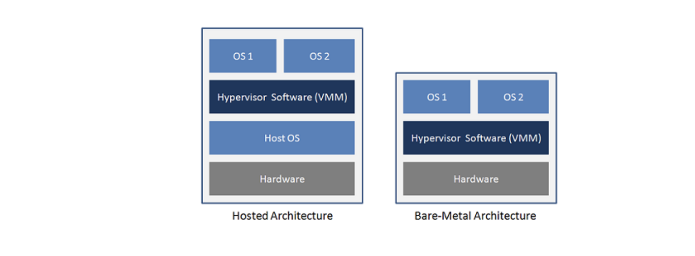

## Virtual Machine 가상머신

하나의 하드웨어(CPU, Memory 등)에 여러 개의 운영체제를 설치하고 개별 컴퓨터처럼 동작하도록 하는 프로그램

### type 1 Bare-Metal Architecture

bare metal에 기반한 hypervisor(가상 머신의 리소스를 하드웨어에서 분리해서 제어하는 프로그램). 하드웨어와 다양한 운영체제 중간에 위치해 각각 통신하는 유형.

AWS 등에서 사용하는 유형이다. AWS에서는 내가 원하는 만큼 여러 개의 컴퓨터 인스턴스를 생성할 수 있는데, 이게 사실은 하나의 물리적 하드웨어 여러 개의 인스턴스가 구동되는 방식으로 동작한다.

### type 2 Hosted Architecture

호스팅되는 hypervisor.

호스트 운영체제 위에서 일종의 응용프로그램처럼 특정 운영체제를 지원하는 가상머신 프로그램 형태.

대표적인 예시가 VMWare, 혹은 맥 parallels 등.

## 참고자료

- [What is a virtual machine (VM)?](https://www.redhat.com/en/topics/virtualization/what-is-a-virtual-machine)
- [Type 1 and Type 2 Hypervisor](https://vgyan.in/type-1-and-type-2-hypervisor/)
