## 가상 메모리 Virtual Memory

프로세서(processor)가 프로그램을 실행하기 위해서는 메인 메모리에 프로세스(process)가 적재되어야 한다. 폰노이만 구조에 따르면 모든 코드나 데이터는 메인 메모리에 적재되어야 하기 때문이다.

하지만 컴퓨터에서 CPU에서 사용할 수 있 메모리가 32MB RAM 혹은 64MB RAM이라고 가정해보면, 이 메모리 양은 우리가 기대하는 프로그램을 실행하기에 턱없이 부족하다. 심지어 여러 프로그램을 동시에 실행하려고 하면 더더욱 문제가 생긴다. 이러한 문제점을 해결해줄 수 있는 게 바로 가상 메모리이다. 가상 메모리를 사용하면 프로그램을 하나의 조각으로 보지 않는다. 프로그램을 여러 조각으로 쪼개서 현재 프로세서가 참조하고 있는 그 부분만 physical main memory에서 사용할 수 있으면 되는 것이다. 이는 CPU가 특정 시점에 접근하는 데이터는 굉장히 작다는 점에서 착안되었으며, 이렇게 되면 실제 프로세스를 위해 필요한 메모리를 줄일 수 있다. 프로세스가 실행되더라도 한번에 모든 데이터가 프로세스에 있는 게 아니라, 필요할 때만 주소를 찾아가서 데이터를 가져오는 방식인 것이다.

또한, 운영체제의 주요 작업 중 하나는 프로그램을 서로 격리하는 것이다. 이 관점에서 가상 메모리의 기본 개념은 기본 물리 저장 장치에서 메모리 주소를 추상화하는 것이기도 하다. 저장 장치에 직접 접근하는 게 아니라 중간 변환 단계를 수행하는 것이다.

이렇듯 가상 메모리 기술은 특정 프로그램과 데이터 블록이 실행에 필요할 때, physical main memory로 자동으로 이동하는 기술을 말한다. 따라서 프로세서는 독립적인 명령 및 데이터 공간(가상 주소virtual address 혹은 논리 주소logical address)을 참조하며, 이 가상 주소는 하드웨어 및 소프트웨어 구성 요소의 조합에 의해 physical main memory로 변환된다.

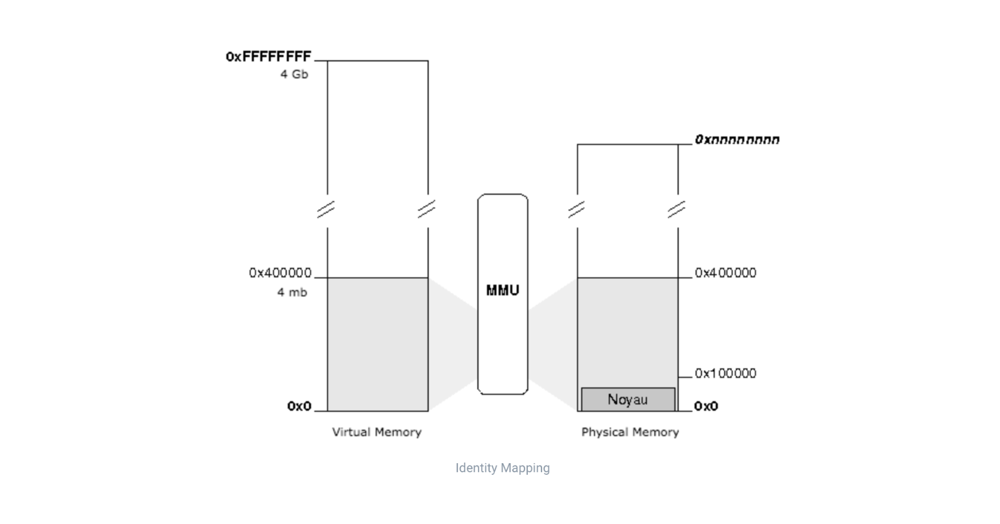

즉, 프로세스는 가상 주소(virtual address)를 사용하며 실제 해당 주소에서 데이터를 읽고 쓸 때만 물리 주소(physical address)로 바꿔주는 방식이다.

이때 중간에서 가상 주소를 물리 주소로 mapping해주는 역할을 하는 게 MMU(Memory Management Unit)이다. MMU는 작은 하드웨어 장치인데, 이 중간 과정이 매번 메모리로 오고 가는 시간이 소요되며 매우 빈번하게 발생하므로 코드로 작성하면 성능에 좋지 않은 영향을 끼칠 수 있기 때문이다.

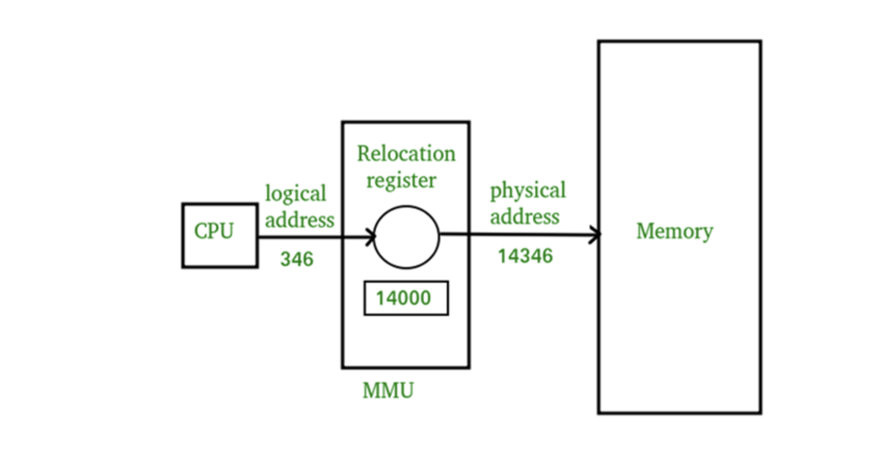

## Paging

가상 메모리의 아이디어는 프로세스의 모든 데이터를 물리 메모리에 적재할 필요가 없다는 것이다. 필요한 만큼만 물리 메모리에 올린다는 것인데, 얼만큼 올리는가?에 대한 다양한 아이디어 중 하나가 바로 페이징 시스템(paging system)이다.

페이징 시스템의 기본 아이디어는 가상 및 물리 메모리 공간을 "고정된" 작은 크기의 조각으로 나누는 것이다.

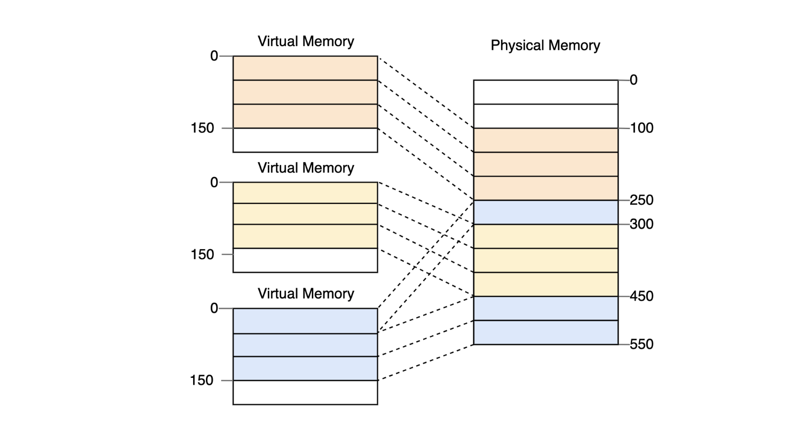

조각의 크기는 운영체제에 따라 다르며 리눅스 같은 경우 4kb라는 고정된 크기로 쪼갠다. 그리고 각 페이지는 페이지 테이블(page table)을 통해서 관리한다. 페이지 테이블에는 가상주소와 물리주소 간 매핑 정보가 담겨 있다. ++ 페이지 테이블의 주소도 프로세스 생성될 때 메모리 어딘가에 적재되는데, CR3 레지스터에서 주소를 확인할 수 있다.

예를 들어, PCB에는 페이지 테이블의 첫번째 주소, 물리주소에 페이지가 적재되어 있는지 등 각종 프로세스의 정보가 담겨 있다. 이때 CPU는 가상주소를 요청을 한다.

중간에 있는 MMU 칩이 확인해서

- 해당 페이지가 물리 메모리에 적재되어 있으면 요청 주소와 페이지 첫번째 주소(페이지 번호 p) 사이의 간격(변위 d)을 계산해서 물리 주소를 구하고,
- 해당 페이지가 물리 메모리에 적재되어 있지 않으면 페이지를 물리 메모리에 적재하고 적재된 페이지의 첫번째 주소를 페이지 테이블에 기록한다.

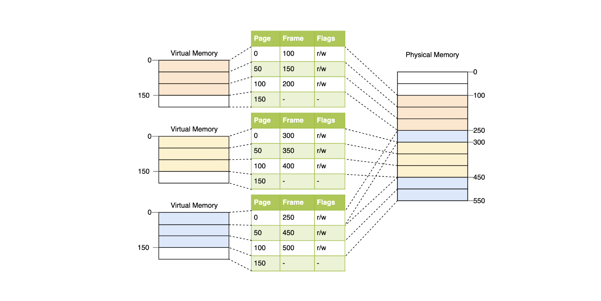

변위 d는 그대로 놔두고, 논리주소 p를 물리주소 fr로만 변경하면 물리주소를 구할 수 있다.

> 물리주소 {fr, d}

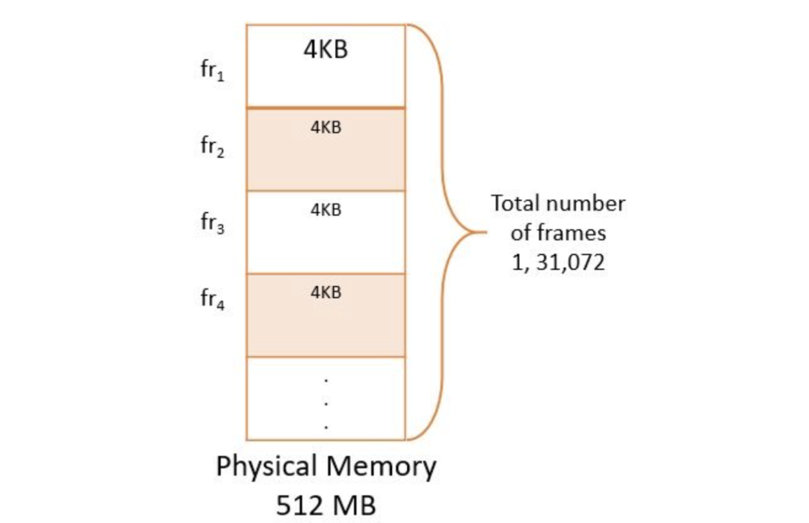

> 논리주소 {p, d}

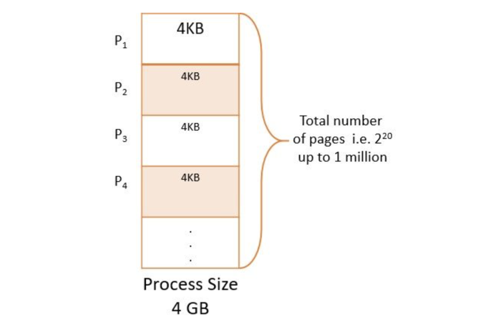

## Multilevel Paging

페이지 테이블의 크기가 크면 결국 메인 메모리를 낭비한다. 이를 방지하기 위해 Multilevel Paging를 사용할 수 있다.

가상주소는 페이지 정보 p와 변위(오프셋) d로 구성되어 있는데,
이 페이지 정보를 단계별로 세분화해서 공간을 절약하는 게 멀티레벨 페이징 방식이다. 미리 모든 페이지 정보를 만드는 게 아니라, 일부 단계만 생성해서 필요할 때만 메모리를 사용할 수 있도록 하는 방법.

예를 들어 아래 그림처럼 3단계로 나누면,
level 1때 페이지 정보 p를 가지고 offset과 더해서 물리주소를 구하다가, level 2까지 필요하면 그때 또 페이지 정보를 생성해서 offset과 더해서 물리주소를 만들고

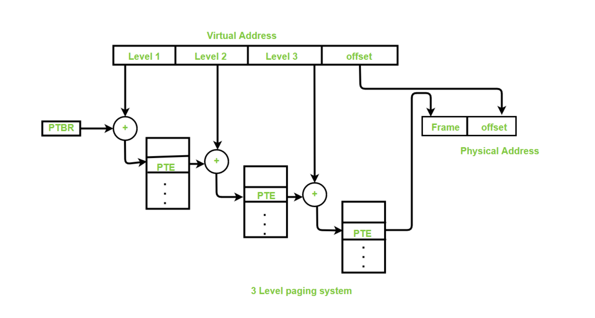

기존 linear page table을 tree 형식으로 만들어서 사용하는 것이다.

- 페이지 테이블을 페이지 사이즈 단위로 자르고,
- 자르다가 page table entry에 대해 모두 invalid라면 해당 페이지에 대해 메모리를 할당하지 않는다.
- page directory라는 새로운 자료구조를 통해 page의 유무를 확인한다.

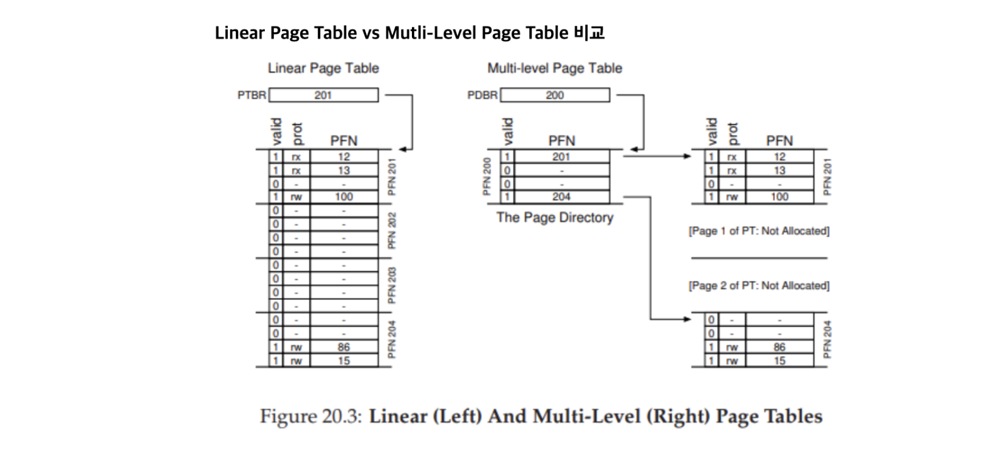

필요 없는 페이지 디렉토리를 생성하지 않음으로써 메모리를 절약할 수 있다. 
하지만, 기존 TLB Miss가 1개에서 2개로 늘어난다는 점이 단점이다.

## MMU와 TLB

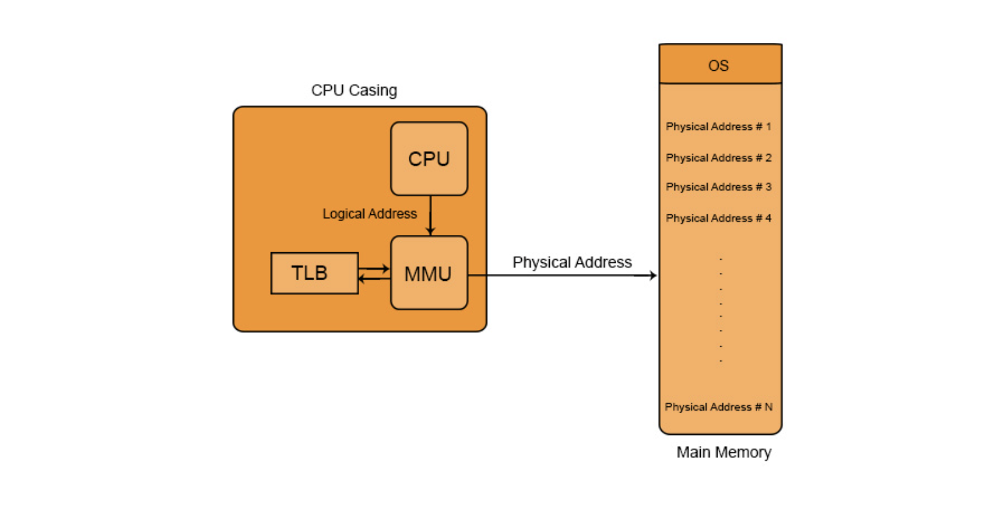

페이징 시스템에 따르면, 
CPU가 가상주소를 요청하면 MMU가 요청받은 가상주소에 매핑된 물리주소에 가서 데이터를 가져온다.

이 과정을 조금 더 자세히 살펴보면, 

1. MMU가 중간에서 CPU의 CR3 레지스터에서 해당 프로세스의 페이지 테이블이 저장되어 있는 물리 메모리 주소를 읽어온다.
2. 그다음, MMU가 물리 메모리에 찾아 가서 거기에 있는 페이지 테이블 정보를 찾고, 그 정보를 바탕으로 CPU에게서 요청받은 물리주소 찾는다.
3. 다시 MMU가 물리 메모리로 접근해서 해당 페이지에 있는 데이터를 얻어서 이를 CPU에 전달해준다.

메모리 계층 구조 상 
(1)처럼 CPU 내의 CR3 레지스터에 접근하는 건 1cycle만 소요되지만, (2)(3)의 경우 메인 메모리에 접근하므로 한번 가는 데 100cycle이 소요된다고 하면 2번을 왔다갔다하므로 약 400cycle이 소요된다. 그 동안 CPU는 아무 일도 못하게 되는 것이다.

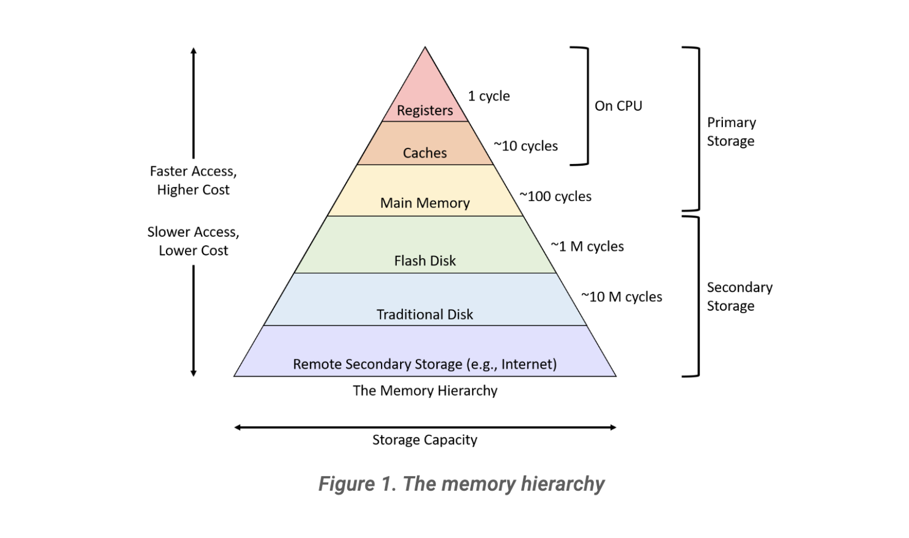

운영체제에는 locality of reference 개념이 있는데, TLB(Translation Lookaside Buffer)는 이 개념을 따른다. TLB는 일종의 캐시 개념으로, 최근 CPU가 요청한 가상주소에 매핑된 물리주소 정보를 임시로 저장하고 있다. MMU는 메인 메모리로 접근하기 전에 먼저 TLB에 접근해 요청받은 가상주소가 TLB에 있다면 메인 메모리에 접근할 필요가 없으므로 효율적이다. TLB는 CPU 내에 있으므로 10 cycle 정도만 소요되기 때문이다.

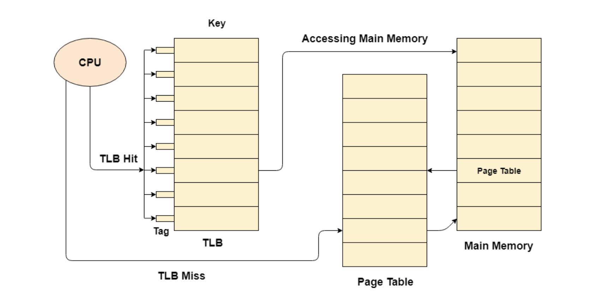

예를 들어 위 그림을 보면,
TLB에 있다면(TLB Hit) 메인 메모리에 1번 갔다오면 되고,
TLB에 없다면(TLB Miss) 메인 메모리에 2번 갔다와야 한다.

## Demand Paging과 Page Fault

페이징 시스템에 따르면 프로세스 내 모든 데이터를 물리 메모리에 적재하지 않아도 된다. 이때 페이징 방식을 구분할 수 있는데,

실행 중 당장 필요한 시점에만 물리 메모리로 적재하는 걸 요구 페이징(demand paging)이라고 한다. 정확히는 당장 실행에 필요하지 않은 데이터는 backing store(각종 저장매체)에 저장해두었다가 필요할 때 물리 메모리에 올리는 걸 말한다.

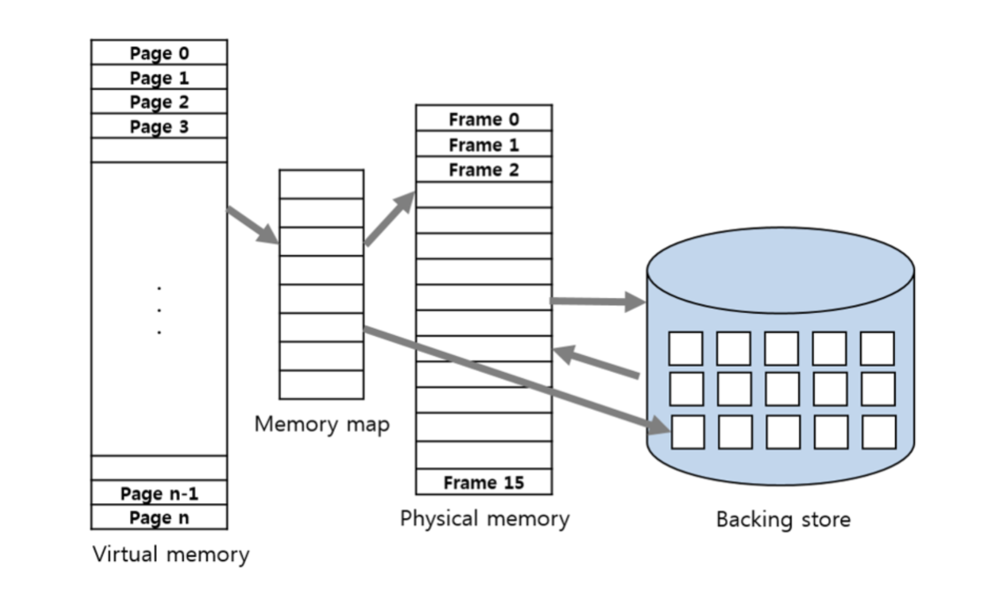

반대 개념으로는 pre paging이 있는데, 관련된 데이터들을 모두 메모리에 올려 놓고 이후 다른 페이지가 더 필요하면 그때 또 필요한 페이지를 메모리에 적재하는 방법이다.

이때 언제가 필요한 시점인지를 알려주기 위한 기능으로 page fault가 존재한다. 모든 페이지 테이블에는 valid-invalid bit가 존재하는데, CPU가 MMU에 가상주소로 요청을 해서, MMU가 페이지 테이블을 확인했을 때 invalid라고 적혀 있다면 page fault trap(내부 인터럽트)가 발생한다. 인터럽트가 발생했을 때 물리 메모리에 필요한 데이터를 적재하고 나면 CPU가 다시 해당 가상주소로 요청할 수 있게 신호를 보내준다. 그래서 다시 CPU가 해당 가상주소로 요청을 다시 하면 MMU가 페이지테이블을 확인했을 때 valid가 적혀 있을 테니 데이터 가져오는 과정을 밟으면 되는 것이다.

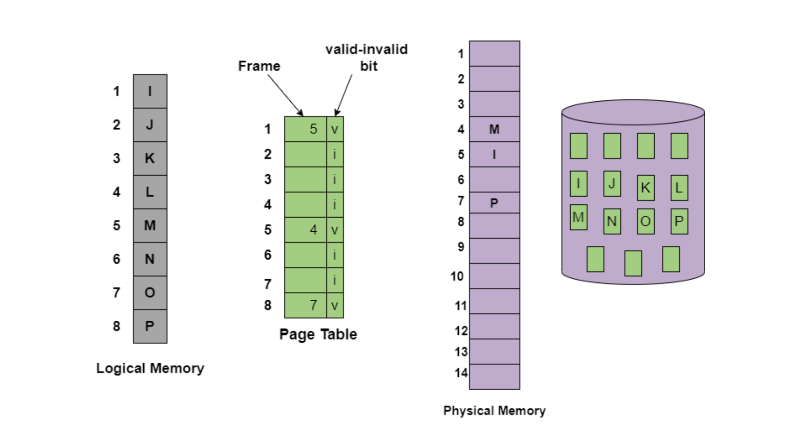

페이지 폴트 트랩이 발생하면 CPU가 IDT에 가서 번호에 매핑된 운영체제 함수를 실행하게 되고, 이 함수에 따라 요청 받은 페이지 정보를 저장매체에서 읽어와서 로드한다.

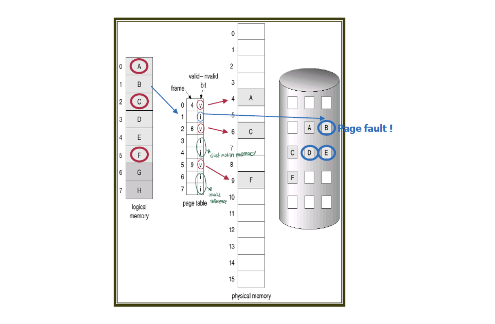

MMU가 페이지 테이블을 확인했을 때, invalid라면 page fault trap이 발생한다. 운영체제는 backing store에 가서 페이지가 있는지 확인한 후, 페이지가 backing store에 있다면 비어 있는 frame에 페이지를 올린다.

이때 비어 있는 프레임이 없다면? 메모리는 한정된 자원이므로 기존 페이지들을 삭제해야 한다. 이때 향후에도 쓸 페이지를 삭제해버리면 또 페이지 폴트 trap이 발생하므로(또 backing store에 다녀와야 하므로 성능에 좋을 리가 없다) "잘" 삭제해야 한다.

나중에도 사용하지 않을 법한 페이지를 삭제하려면 어떤 페이지들을 삭제하고 올려야 하는지에 대한 게 바로 페이지 교체 정책(page replacement(swapping) policy)이다.

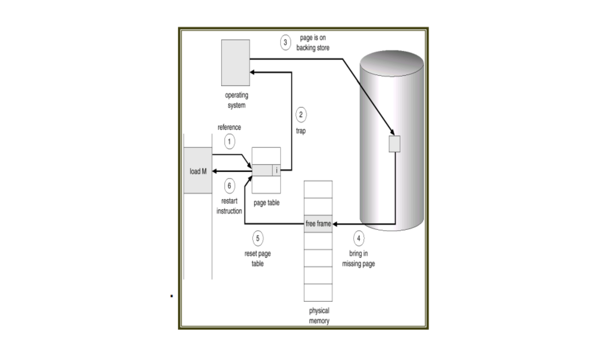

## 참고자료

- [26 Virtual Memory I](https://www.cs.umd.edu/~meesh/411/CA-online/chapter/virtual-memory-i/index.html)
- [Theory: physical and virtual memory](https://samypesse.gitbook.io/how-to-create-an-operating-system/chapter-8)
- [Memory Management Unit (MMU)](https://cstaleem.com/memory-management-unit-in-os)
- [Memory Allocation Techniques | Mapping Virtual Addresses to Physical Addresses](https://www.geeksforgeeks.org/memory-allocation-techniques-mapping-virtual-addresses-to-physical-addresses/)
- [Introduction to Paging](https://os.phil-opp.com/paging-introduction/)
- [Structure of Page Table](https://binaryterms.com/structure-of-page-table.html)
- [Multilevel Paging in Operating System](https://www.geeksforgeeks.org/multilevel-paging-in-operating-system/)
- [11.1. The Memory Hierarchy](https://diveintosystems.org/book/C11-MemHierarchy/mem_hierarchy.html)
- [Translation Look aside buffer](https://www.javatpoint.com/os-translation-look-aside-buffer)
- [[CS스터디] Paging(1)](https://vicente-blog.com/blog/69/)
- [Demand Paging in Operating Systems](https://www.studytonight.com/operating-system/os-demand-paging)
- [[운영체제] 가상메모리(Virtual Memory)와 요구 페이징(Demand Paging), Valid-Invalid Bit, 페이지 부재(Page Fault)과정](https://code-lab1.tistory.com/59)
- [운영체제) Multi-level Page Tables](https://m.blog.naver.com/PostView.naver?isHttpsRedirect=true&blogId=babobigi&logNo=221469166508)
