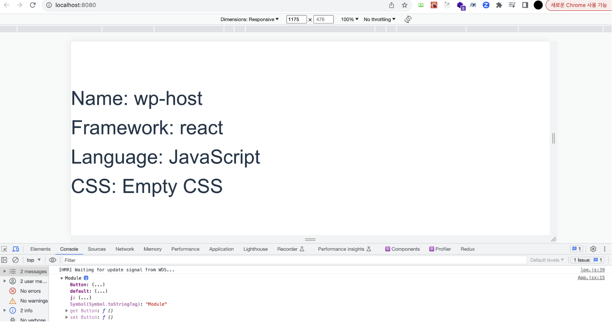
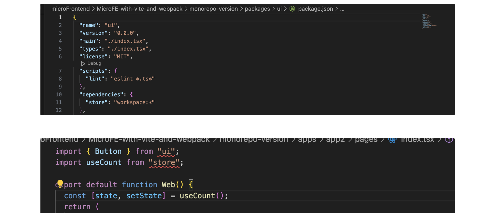

# 개요

> [tutorial repo](https://github.com/wooleejaan/yw-frontend/tree/main/microFrontend/MicroFE-with-vite-and-webpack)

기본적으로 pnpm을 사용합니다.

remote 디렉토리에서는 컴포넌트를 제작할 예정이며,<br>
host 디렉토리들은 remote 디렉토리의 컴포넌트를 가져다 사용하는 구조입니다.

- host의 경우 하나는 vite, 다른 하나는 webpack으로 구현합니다.

## remote 디렉토리 생성

```bash
npm i -g pnpm

pnpm create vite remote —-template react
```

`cd remote`을 통해 remote로 가서 federation을 설치해준다.

```bash
pnpm add @originjs/vite-plugin-federation -D
```

port를 host와 remote를 다르게 해줘야 하므로, remote는 strictPort로 포트번호를 변경해준다.

```json
// package.json in remote dir
...

"dev": "vite --port 5001 --strictPort",
"build": "vite build",
"preview": "vite preview --port 5001 --strictPort",
"serve": "vite preview --port 5001 --strictPort"
```

Button 컴포넌트 만들고 pnpm dev로 remote repo 개발서버를 열어준다.

remote의 vite config를 아래와 같이 작성해준다.

```js
// remote/vite.config.js

import { defineConfig } from "vite";
import react from "@vitejs/plugin-react-swc";
import federation from "@originjs/vite-plugin-federation";

// https://vitejs.dev/config/
export default defineConfig({
  plugins: [
    react(),
    federation({
      name: "remote_app",
      filename: "remoteEntry.js",
      exposes: {
        "./Button": "./src/Button",
        "./store": "./src/store",
      },
      shared: ["react", "react-dom", "jotai"],
    }),
  ],
  build: {
    modulePreload: false,
    target: "esnext",
    minify: false,
    cssCodeSplit: false,
  },
});
```

원래 webpack에서는 remote와 expose를 연결만 해주면 되지만, vite의 경우 빌드를 해줘야 한다.

```bash
yarn build && yarn serve
```

serve 까지 끝내고 `http://localhost:5001/assets/remoteEntry.js` 들어갔을 때 파일이 생성되어 있어야 한다.

- 이 파일은 pnpm dev로는 생성되지 않으므로 yarn을 사용해 Build를 해준다.

## host 디렉토리 1

host도 똑같이 만들어준다.

```bash
pnpm create vite host --template react
cd host
pnpm add @originjs/vite-plugin-federation -D
```

host도 이제 config를 설정해준다.

```js
// host/vite.config.js

import { defineConfig } from "vite";
import react from "@vitejs/plugin-react";
import federation from "@originjs/vite-plugin-federation";

// https://vitejs.dev/config/
export default defineConfig({
  plugins: [
    react(),
    federation({
      name: "app",
      remotes: {
        remoteApp: "http://localhost:5001/assets/remoteEntry.js",
      },
      shared: ["react", "react-dom"],
    }),
  ],
  build: {
    modulePreload: false,
    target: "esnext",
    minify: false,
    cssCodeSplit: false,
  },
});
```

이제 Host에서 Remote에서 만든 컴포넌트를 가져다 쓸 수 있다.

아래처럼 가져다 쓰고, `pnpm build && pnpm preview`하면 된다.

```js
// host/src/App.jsx

import "./App.css";
import Button from "remoteApp/Button";
import useStore from "remoteApp/store";

function App() {
  const [count, setCount] = useStore();
  return (
    <div>
      <h1>Host Application</h1>
      <Button />
      <div className="card">
        <button onClick={() => setCount((count) => count + 1)}>
          count is {count}
        </button>
      </div>
    </div>
  );
}

export default App;
```

remote에서 가져다 쓴 걸 수정했다면, remote만 `yarn build && yarn serve`로 재배포 하면, 그걸 가져다 쓰는 Host는 재배포할 필요가 없다.

위에서 보면, 단순히 컴포넌트 뿐만 아니라 Store도 가져다 쓴 걸 볼 수 있다.

- 아래와 같이 store도 remote에 추가하면 된다.

```js
// remote/vite.config.js

import { defineConfig } from "vite";
import react from "@vitejs/plugin-react-swc";
import federation from "@originjs/vite-plugin-federation";

// https://vitejs.dev/config/
export default defineConfig({
  plugins: [
    react(),
    federation({
      name: "remote_app",
      filename: "remoteEntry.js",
      exposes: {
        "./Button": "./src/Button",
        "./store": "./src/store",
      },
      shared: ["react", "react-dom", "jotai"],
    }),
  ],
  build: {
    modulePreload: false,
    target: "esnext",
    minify: false,
    cssCodeSplit: false,
  },
});
```

## webpack으로 만든 host에 vite remote 가져다 쓰기

빠르게 만들기 위해

```bash
npx create-mf-app
pnpm i
pnpm start
```

webacpk.config.js에서 아래와 같이 설정해주면 된다.

```js
// wp-host/webpack.config.js

target: "es2020",
  experiments: {
    outputModule: true,
  },

  plugins: [
    new ModuleFederationPlugin({
      name: "wp_host",
      library: { type: "module" },
      filename: "remoteEntry.js",
      remotes: {
        remote: "http://localhost:5001/assets/remoteEntry.js",
      },
      exposes: {},
      shared: {
        ...deps,
        react: {
          singleton: true,
          requiredVersion: deps.react,
        },
        "react-dom": {
          singleton: true,
          requiredVersion: deps["react-dom"],
        },
      },
    }),
    new HtmlWebPackPlugin({
      template: "./index.ejs",
      inject: false,
    }),
  ],
```

webpack과 Vite의 Ecmascript modules 사용 방식이 달라서 `library: { type: "module" },` 옵션을 추가해주고

target도 es2020으로 잡아줘야 한다.

그리고 이렇게 했을 때, vite 모듈을 받을 새로운 index가 필요하다.

- 아래처럼 새로 만든 e.js에 맞게 template 경로도 수정해주면 된다.

```js
// wp-host/index.ejs

<html>
  <head>
    <% for (key in htmlWebpackPlugin.files.js) { %>
    <script type="module" src="<%= htmlWebpackPlugin.files.js[key] %>"></script>
    <% } %>
  </head>
  <body>
    <div id="app"></div>
  </body>
</html>

```

wp-host에서 App.jsx에서 Button을 찍어보면 모듈이 나온다.

```js
// wp-host/src/App.jsx

import Button from "remote/Button";
import "./index.css";
console.log(Button);
```



default에 담겨 있으므로 아래와 같이 변환해서 사용하면 된다.

```js
// wp-host/src/App.jsx

import ButtonModule from "remote/Button";
const Button = ButtonModule.default;
import "./index.css";
console.log(Button);
```

## 모노레포

> [monorepo version](https://github.com/wooleejaan/yw-frontend/tree/main/microFrontend/MicroFE-with-vite-and-webpack/monorepo-version)

모노레포에서 똑같은 흐름으로 이해할 수 있다.

apps 안에 app1, app2가 존재할 것이고,<br>
packages/ui에 공유했던 Button 컴포넌트가 존재한다.<br>
store도 존재한다.

설정을 `workspace:*`로 해뒀기 때문에 바로 가져다 쓸 수 있다.



## 참고자료

- [Creating React App using Vite and PNPM](https://medium.com/@sahu.jyotirmaya26/creating-react-app-using-vite-and-pnpm-746bb0f9a0c2)
- [Vite and Module Federation Makes Micro-Frontends EASY!](https://www.youtube.com/watch?v=t-nchkL9yIg)
