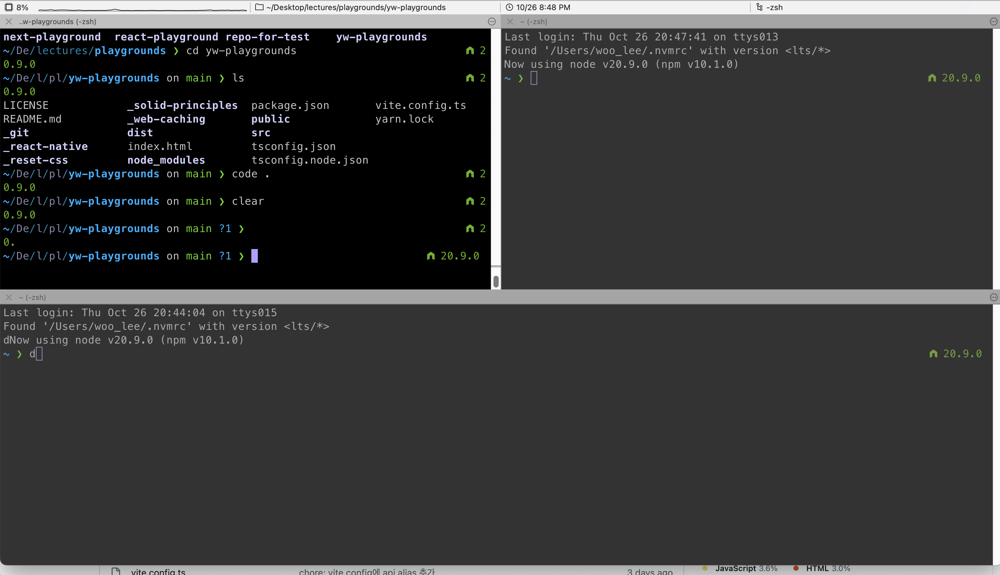
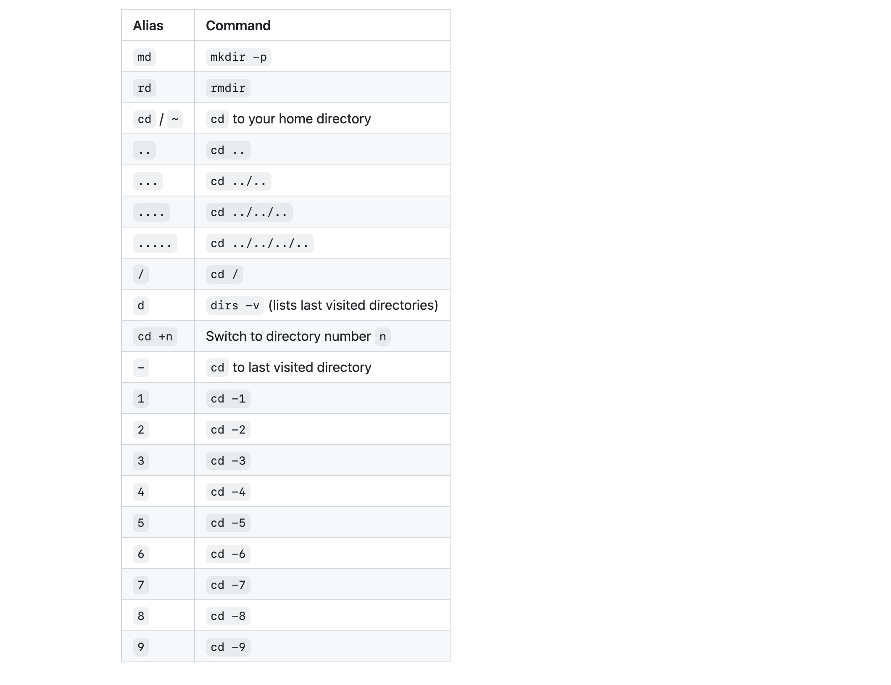

### Mac에서 터미널 여러 개 여는 단축키

`command + T`

### 화면window 분할하기



1. 상하 분할 - `command + shift + d`
2. 좌우 분할 - `command + d`
3. 동시 입력 - `command + option + i`
4. 동시 입력 해제 - `command + shift + option + i`

### 분할 창 이동하기

1. 상하좌우 이동 - `opt + cmd + 방향키`
2. 좌우 이동 - `cmd + [ 또는 ]`

### zsh 단축키

zsh는 다양한 단축키들을 제공해준다.

[Cheatsheet](https://github.com/ohmyzsh/ohmyzsh/wiki/Cheatsheet)



### 단축키 설정하기

`vim ~/.zshrc`을 통해 .zshrc 파일에 아래와 같은 명령어들을 alias로 등록해준다.

```bash
alias gs="git status"
alias gl="git log"
alias gd="git diff"
alias gc="git checkout"
alias gcm="git checkout master"
alias gp="git pull"
alias ys="yarn start"
alias vblog="cd Desktop/source/toy/blog"
alias vd="vuepress dev"

```

그리고 나서, `source ~/.zshrc`로 업데이트해주면 된다.

- vscode를 쓴다면, 그냥 `code ~/.zshrc`로 열어서 수정하는 게 편할 수도 있다.

## 참고자료

- [Mac Terminal 여러 탭 여는 방법](https://wakestand.tistory.com/821)
- [[Iterm2] 화면 분할을 해봐요. 전문가처럼 보이도록](https://yoonandro.tistory.com/101)
- [[iTerm2] 화면분할 단축키](https://peterica.tistory.com/49)
- [alias (단축키) 설정하기](https://kyounghwan01.github.io/blog/etc/terminal-alias/)
