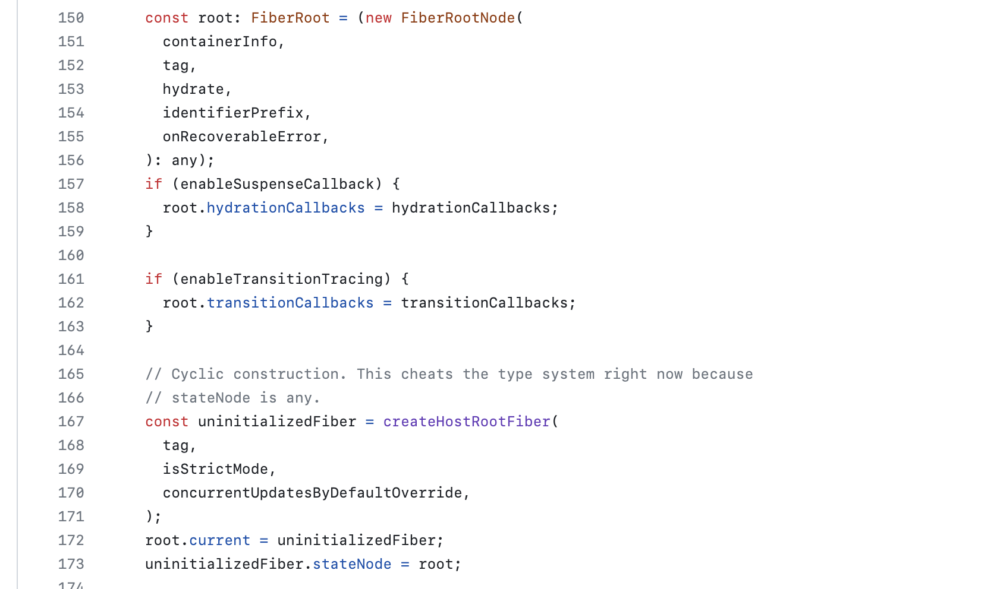
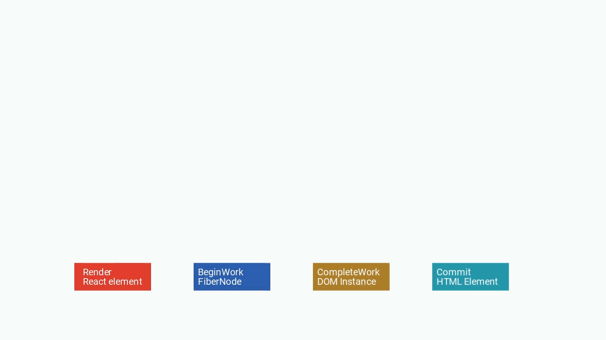
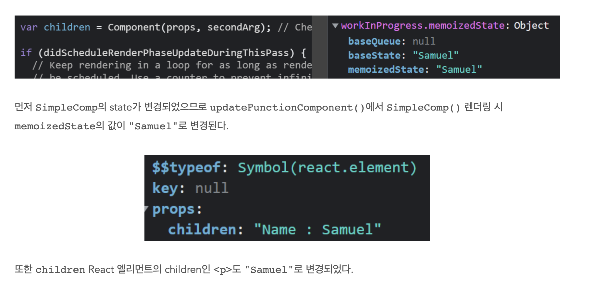
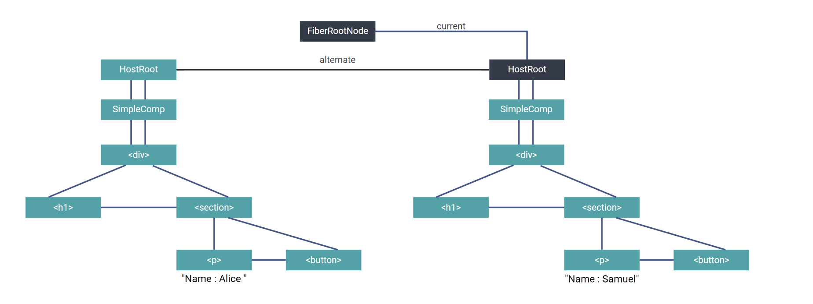

## 기본

react는 jsx를 지원하며, 가상 dom을 사용해 변경된 부분적 dom만 업데이트하는 ui 프레임워크.

fiber는 react 16 버전부터 채택된 리액트의 코어 아키텍쳐.

브라우저 dom 엘리먼트와 달리, react 엘리먼트는 일반 객체(plain object)이므로 쉽게 생성할 수 있다.
<br>react dom은 react 엘리먼트와 일치하도록 dom을 업데이트한다.

- jsx로 선언된 표현식은 react 엘리먼트라는 객체로 치환됨
- react 엘리먼트는 클래스 인스턴스가 아니라 일반 객체.

### 변경된 부분만 업데이트

react dom은 업데이트 시 변경된 부분만 native dom에 반영.

- react 내부의 비교 알고리즘을 사용해 dom 트리 변경을 줄이고, 퍼포먼스 향상을 꾀함.

n개의 엘리먼트를 가지는 트리를 다른 트리로 변환하는 알고리즘의 복잡도는 O(n^3).
<br>아래 2가지 가정을 통해 react는 O(n)인 휴리스틱 알고리즘을 재조정(reconciliation)에 사용한다.

- 엘리먼트마다 타입을 가진다. => 서로 다른 타입을 가진 엘리먼트는 서로 다른 트리를 생성한다. => `이전과 비교해 다른 타입의 react 엘리먼트로 변경되었다면, 하위트리를 비교하지 않고 전체를 교체한다.`
- key prop이 없다면 index를 기반으로 한다. key prop 사용을 권장한다. => `key prop을 통해 자식 요소 중 렌더링해야 할 자식과 그렇지 않을 자식을 구분한다.`

### ref 바람직한 사용 사례

react에서 컨트롤 가능한 태그 이름, 어트리뷰트, 자식이 아니라 native DOM API 등을 직접 컨트롤해야 할 때, ref를 사용한다.

- 포커스, 텍스트 선택 영역, 혹은 미디어의 재생을 관리할 때
- 애니메이션을 직접 실행시킬 때
- 서드 파티 DOM 라이브러리를 React와 같이 사용할 때

React는 JSX 표현식이 치환된 React 엘리먼트의 props, states를 통해 React DOM을 갱신하므로, Ref를 통해 native DOM을 직접 조작하면 이 변경 사항을 React가 유지할 수 없기 때문이다.

### virtual DOM과 internals

virtual DOM (VDOM)은 UI의 이상적인 또는 “가상”적인 표현을 메모리에 저장하고 React DOM과 같은 라이브러리에 의해 “실제” DOM과 동기화하는 프로그래밍 개념. 이 과정을 재조정이라 한다.

React 내부에는 native DOM과 동기화하기 위한 가상의 virtual DOM이 존재한다.

- virtual DOM은 이름 그대로 react 내부에 존재하는 어떤 구체적인 인스턴스나 값은 아니다. react가 react 엘리먼트와 native DOM을 동기화하기 위한 패턴의 이름 정도.

리액트 공식 문서에서는 파이버 재조정에 대한 공식 설명은 없으며, 코어 팀 Andrew Clark이 작성한 문서 정도만 존재.

- [react-fiber-architecture](https://github.com/acdlite/react-fiber-architecture)

### react가 하는 일

react는 jsx로 작성된 react 엘리먼트를 html 엘리먼트로 변환하여 DOM에 렌더링한다.
<br>변경이 발생했을 때, 정확히 변경된 부분만 파악해 적용한다.

- 어트리뷰트나 값의 변경 등은 핀 포인트로 적용하고, 엘리먼트 타입의 변경은 하위 트리 전체를 변경한다.

## react 말고, 프론트엔드 전반을 둘러싼 배경 지식

### 모니터의 주사율

브라우저의 js 엔진은 싱글 스레드.
<br>js 스레드가 코드를 실행하는 중에는 브라우저는 ui 업데이트 불가능하다.

현대 일반적인 모니터는 초당 60회 주기로 화면을 갱신한다.
<br>한번 화면을 갱신하고, 그 다음까지 1/60초(16ms)가 걸린다.

우리가 작성한 어떤 코드가 16ms 이상 걸린다면, 모니터의 주사율을 따라갈 수 없게 되어 버벅인다.
<br>이를 극복하려면, 개발자가 코드의 동시성을 적절히 조절해야 했다.

react 파이버 구조에서는 ui 갱신 작업 단위를 작은 단위로 쪼개, 내부적으로 스케쥴링함으로써 대규모 ui 갱신에도 16ms를 초과하지 않도록 한다.

### 동시성 스케쥴링

리액트의 파이버가 기존 스택 재조정자와 근본적으로 다른 점은 동시성이다.
<br>dom 업데이트, 렌더링 로직을 작업 단위로 구분하고 이를 비동기로 실행해 최대 실행 시간이 16ms를 넘지 않도록 제어한다.

파이버는 단순히 작업을 chunk로 분리하여 실행 시간만을 관리하는 것이 아니라 작업의 유형에 따라 우선순위를 부여하고, 기존에 수행 중인 작업보다 더 우선순위가 높은 작업이 인입될 경우 기존의 작업을 일시 중단하고 인입된 작업을 처리 후 다시 돌아오는 기능이 있다.

## react 동작 단계

react 내부 동작

- render 단계 : jsx 선언 또는 React.createElement()를 통해 일반객체인 react 엘리먼트 생성
- reconcile 단계 : 이전에 렌더링된 실제 dom 트리와 새로 렌더링할 react 엘리먼트를 비교해 변경점을 적용
- commit 단계 : 새로운 dom 엘리먼트를 브라우저 view에 commit한다.
- update 단계 : props, state 변경 시 해당 컴포넌트와 하위 컴포넌트에 대해 위 과정 반복

일반적으로 생각하는 dom 렌더링 동작은 react 내에서는 commit이며,
<br>react에서의 렌더링이란 react 엘리먼트를 생성하는 것으로 여겨진다.

### 루트 생성


간단한 형태의 react 컴포넌트가 처음 루트에 어떻게 렌더링되고 내용이 변경되었을 때,
<br>재조정자가 어떻게 변경사항을 감지해 DOM에 반영할까.

```js
window.onload = () => {
  const root = ReactDOM.createRoot(document.querySelector("#container")!);

  root.render(<SimpleComp />);
};
```

렌더링은 createRoot부터 시작한다.

createRoot는 [createFiberRoot를 호출해](https://github.com/facebook/react/blob/v18.2.0/packages/react-reconciler/src/ReactFiberRoot.new.js#L134) 고유한 FiberRootNode를 생성한다.

FiberRootNode와는 별개로 createHostRootFiber를 호출해 일반 FiberNode를 생성하고,
<br>FiberRootNode로 생성한 root의 current(root.current)에 이 일반 FiberNode를 할당한다.

그리고 uninitializedFiber.stateNode에 또 root를 할당해 순환 참조가 가능하도록 한다.



그리고 나서, root.current를 DOM엘리먼트에 React 루트로 저장한다.

그리고 root:FiberRootNode를 ReactDOMRoot 클래스로 래핑하여 전달한다.

### Render 단계

렌더링이라는 용어는 일반적으로 마크업 언어 등을 브라우저 화면에 최종적으로 보여주는 과정 전반을 의미하나 프런트엔드 기술 스택 전반에 걸쳐 다양한 의미로 사용한다. React public API의 ReatRootDOM.render()는 JSX 등으로 작성된 코드가 실제 DOM으로 커밋되기까지 모든 과정을 의미한다.

React 내부에서 Render 단계는 더 좁은 의미로, JSX 또는 React.createElement()로 작성된 코드를 React 엘리먼트로 변경하는 작업만을 의미한다. React 엘리먼트는 클래스가 아닌 일반 객체로, 사용자가 작성한 컴포넌트 또는 엘리먼트 타입과 어트리뷰트, 자식에 관한 정보를 담고 있는 객체이다.

[ReactElement()를 보면](https://github.com/facebook/react/blob/v18.2.0/packages/react/src/ReactElement.js#L149-L161), React 엘리먼트는 일반적인 객체 형태를 갖는다.

[createElement() 내부 로직을 보면](https://github.com/facebook/react/blob/v18.2.0/packages/react/src/ReactElement.js#L403-L409), 자식 개수만큼 반복문을 돌려서 props.children에 React.createElement로 만든 React 엘리먼트를 할당한다.

- 게다가, 내부 로직을 보면, prop.children에 할당만 할뿐, 하위 컴포넌트들에 대해 각각 render 함수를 호출하지 않는다.
- render 단계에서 createElement가 호출되어 모든 하위 태그들이 ReactElement가 되지만, 실행되지는 않은 상태로 반환된다.

### Reconcile 단계

`root.render(<컴포넌트/>)`를 실행하면 React 엘리먼트만 생성하고, reconcile 단계로 진입한다.

재조정자는 FiberNode를 하나의 작업 단위(unitOfWork)로 취급한다. FibderNode는 자체로 렌더링에 필요한 정보를 담고 있는 객체이자, 재조정 작업 단위다.

[performUnitOfWork](https://github.com/facebook/react/blob/v18.2.0/packages/react-reconciler/src/ReactFiberWorkLoop.new.js#L1836-L1862) 함수는 FiderNode를 작업단위로 처리하는 함수다.

reconcile 단계는 크게 beginWork 단계와, completeWork(completeUnitOfWork) 단계로 나뉜다.
<br>이 함수가 React와 Fiber 재조정자의 핵심이다.

첫번째 unitOfWork는 루트 컨테이너 FiberNode다.

[HostRoot](https://github.com/facebook/react/blob/v18.2.0/packages/react-reconciler/src/ReactFiberBeginWork.new.js#L3828-L3829)

리액트 내부에서 루트 FiberNode를 HostRoot 컴포넌트라고 부른다.

[updateHostRoot](https://github.com/facebook/react/blob/v18.2.0/packages/react-reconciler/src/ReactFiberBeginWork.new.js#L1278-L1287)는 컴포넌트 내부를 갱신하는 함수다. 최초 렌더링이므로, prevState, prevChildren은 비어있다. props도 주어지지 않았으므로 nextProps도 비어있다.

HostRoot가 갱신해야 할 것은 유일한 자식인 `<SimpleComp />`다.

[processUpdateQueue()](https://github.com/facebook/react/blob/v18.2.0/packages/react-reconciler/src/ReactFiberClassUpdateQueue.new.js#L458-L467)로 진입한다.

```js
// [[Link]](https://github.com/facebook/react/blob/v18.2.0/packages/react-reconciler/src/ReactFiberClassUpdateQueue.new.js#L458-L467)
export function processUpdateQueue<State>(
  workInProgress: Fiber,
  props: any,
  instance: any,
  renderLanes: Lanes,
): void {
  // This is always non-null on a ClassComponent or HostRoot
  const queue: UpdateQueue<State> = (workInProgress.updateQueue: any);

  hasForceUpdate = false;
```

`workInProgress.updateQueue.shared.pending.payload`에 컴포넌트가 element 필드로 존재한다.

```js
function processUpdateQueue(){
...
    // [[Link]](https://github.com/facebook/react/blob/v18.2.0/packages/react-reconciler/src/ReactFiberClassUpdateQueue.new.js#L588)
    newState = getStateFromUpdate(
              workInProgress,
              queue,
              update,
              newState,
              props,
              instance,
                        );
    ...
    // [Link]
    workInProgress.memoizedState = newState;
...
}
```

그리고 getStateFromUpdate()에서 newState를 반환하면 안에 element 필드에 SimpleComp가 있으며 이를 workInProgress.memoizedState에 할당한다.

```js
function updateHostRoot(){
...
    // [[Link]](https://github.com/facebook/react/blob/v18.2.0/packages/react-reconciler/src/ReactFiberBeginWork.new.js#L1306-L1307)
  const nextChildren = nextState.element;
  if (supportsHydration && prevState.isDehydrated) {
        ...
    } else {
        // [[Link]](https://github.com/facebook/react/blob/v18.2.0/packages/react-reconciler/src/ReactFiberBeginWork.new.js#L1397)
    // Root is not dehydrated. Either this is a client-only root, or it
    // already hydrated.
    resetHydrationState();
    if (nextChildren === prevChildren) {
      return bailoutOnAlreadyFinishedWork(current, workInProgress, renderLanes);
    }
    reconcileChildren(current, workInProgress, nextChildren, renderLanes);
  }
```

그럼 이제 루트는 이미 [HydrateRoot](https://react.dev/reference/react-dom/client/hydrateRoot) 상태가 되므로,
[reconcileChildren()에 진입](https://github.com/facebook/react/blob/v18.2.0/packages/react-reconciler/src/ReactFiberBeginWork.new.js#L288)한다.

HostRoot는 current가 존재하므로 [reconcilChildFibers()에 진입](https://github.com/facebook/react/blob/v18.2.0/packages/react-reconciler/src/ReactChildFiber.new.js#L1245-L1279)한다.

newChild가 React 엘리먼트이므로 [reconcileSingleElement에 진입](https://github.com/facebook/react/blob/9e3b772b8cabbd8cadc7522ebe3dde3279e79d9e/packages/react-reconciler/src/ReactChildFiber.new.js#L1129)한다.

기존 child가 있는 경우 변경점을 갱신하기 전 정리 작업을 한다.<br>
createFiberFromElement()를 호출하여 SimpleComp 컴포넌트의 FiberNode를 생성한다.

Reconcile이라는 작업은 좁은 의미로 FiberNode를 생성하고 기존과 생성된 FiberNode를 보면 alternate, child, memoizedProps, memoizedState 모두 null이다. FiberNode만 생성했을 뿐 SimpleComp()는 호출하지 않는다.

생성된 SimpleComp FiberNode는 updaeHostRoot()의 마지막에 다음 작업 단위로 반환된다.

```js
// [[Link]](https://github.com/facebook/react/blob/v18.2.0/packages/react-reconciler/src/ReactFiberWorkLoop.new.js#L1741)
function workLoopSync() {
  // Already timed out, so perform work without checking if we need to yield.
  while (workInProgress !== null) {
    performUnitOfWork(workInProgress);
  }
}

// [Link]
function performUnitOfWork(unitOfWork: Fiber): void {
...
    next = beginWork(current, unitOfWork, subtreeRenderLanes);
...
  if (next === null) {
    // If this doesn't spawn new work, complete the current work.
    completeUnitOfWork(unitOfWork);
  } else {
    workInProgress = next;
  }

  ReactCurrentOwner.current = null;
}
```

next === workInProgress.child(SimpleComp)이기 때문에 completeUnitOfWork()로 넘어가지 않고 child(SimpleComp)를 대상으로 다시 [beginWork()로 진입](https://github.com/facebook/react/blob/v18.2.0/packages/react-reconciler/src/ReactFiberBeginWork.new.js#L3780-L3788)한다. 즉, 재조정은 깊이 우선 탐색(depth-first search, 이하 DFS)이다.

SimpleComp의 tag는 IndeterminateComponent(컴포넌트 타입이 결정되지 않음) 상태로 mountIndeterminateComponent() 진입한다. 내부에서 [renderWithHooks()로 진입](https://github.com/facebook/react/blob/v18.2.0/packages/react-reconciler/src/ReactFiberHooks.new.js#L374)하고 여기서 SingleComp()를 호출해 SinglComp 컴포넌트를 렌더링한다.

다시 mountIndeterminateComponent()로 돌아오면 reconcileChildren()을 호출한다.

여기서는 위와 같이 SimpleComp의 루트 child인 `<div />`의 FiberNode가 생성된다.
다시 `<div />` React 엘리먼트를 대상으로 beginWork()를 실행하여 child인 `<h1 />`의 FiberNode를 생성할 것을 예상할 수 있다.

`<h1 />`의 child는 없으므로 next === null이 성립하여 completeWork에 진입한다. completeWork는 completeUnitOfWork()가 [completeWork()](https://github.com/facebook/react/blob/v18.2.0/packages/react-reconciler/src/ReactFiberCompleteWork.new.js#L849)를 감싸고 있다.

```js
// [[Link]](https://github.com/facebook/react/blob/v18.2.0/packages/react-reconciler/src/ReactFiberCompleteWork.new.js#L849)
function completeWork(
  current: Fiber | null,
  workInProgress: Fiber,
  renderLanes: Lanes,
): Fiber | null {
    ...
  switch (workInProgress.tag) {
        ...
      // [[Link]](https://github.com/facebook/react/blob/v18.2.0/packages/react-reconciler/src/ReactFiberCompleteWork.new.js#L959)
    case HostComponent: {
            ...
            // 렌더링된 FiberNode가 있거나 `stateNode`에 DOM 인스턴스가 생성되었다면
      if (current !== null && workInProgress.stateNode != null) {
                // Update 로직
        updateHostComponent(
          current,
          workInProgress,
          type,
          newProps,
          rootContainerInstance,
        );
                ...
      } else {
                // 없다면 DOM 인스턴스 생성
                    ...
          const instance = createInstance(
            type,
            newProps,
            rootContainerInstance,
            currentHostContext,
            workInProgress,
          );

          appendAllChildren(instance, workInProgress, false, false);

          workInProgress.stateNode = instance;
                    ...
      return null;
    }
```

completeWork는 beginWork보다 간단하다. 최초 렌더링 시에는 createInstance()를 호출하여 DOM 인스턴스를 생성한다. createInstance() 내부에서는 react-dom 렌더러에서 document.createElement(h1)를 호출하여 h1 인스턴스를 생성한다. 그리고 appendAllChildren()에서 child FiberNode.stateNode를 생성된 DOM 인스턴스에 부착한다. 다시 말해 completeWork는 FiberNode로부터 DOM 인스턴스를 완성시키는 과정이다.

```js
function completeUnitOfWork(unitOfWork: Fiber): void {
    ...
        // [[Link]](https://github.com/facebook/react/blob/v18.2.0/packages/react-reconciler/src/ReactFiberWorkLoop.new.js#L1945)
    const siblingFiber = completedWork.sibling;
    if (siblingFiber !== null) {
      // If there is more work to do in this returnFiber, do that next.
      workInProgress = siblingFiber;
      return;
    }
    // Otherwise, return to the parent
    completedWork = returnFiber;
    // Update the next thing we're working on in case something throws.
    workInProgress = completedWork;
  } while (completedWork !== null);

  // We've reached the root.
  if (workInProgressRootExitStatus === RootInProgress) {
    workInProgressRootExitStatus = RootCompleted;
  }
}
```

completeUnitOfWork()의 다음 동작을 살펴보면, completedWork.sibling이 있다면 workInProgress로 지정하고 반환한다. beginWork가 DFS이므로 sibling은 아직 beginWork()를 수행하지 않았기 때문이다. sibling이 없다면 returnFiber, 즉 부모를 workInProgress로 지정하고 completeWork()를 다시 호출한다. completeUnitOfWork()를 벗어나지 않은 채 completeWork()를 부모 FiberNode에 대해서 반복적으로 호출하여 DOM 트리를 완성시켜 나간다.

```html
<div>
  <h1>Hello react!</h1>
  <section>
    <p>{`Name : ${name}`}</p>
    <button
      onClick={(e) => setName(name === "Samuel" ? "Alice" : "Samuel")}
    >
      Click me
    </button>
  </section>
</div>
```

`<h1>`의 형제는 `<section>`이므로 `<section>`에 대해 beginWork, `<p>` beginWork, `<p>` completeWork, `<button>` beginWork, … 순서로 루트 `<div>`를 completeWork할 때 까지 순차적으로 탐색할 것을 예측할 수 있다.

### Commit 단계

Reconcile 단계가 모두 끝나면 RootComplete status로 Commit 단계에 돌입한다.

- [finishConcurrentRender](https://github.com/facebook/react/blob/v18.2.0/packages/react-reconciler/src/ReactFiberWorkLoop.new.js#L1024)
- [commitRoot](https://github.com/facebook/react/blob/v18.2.0/packages/react-reconciler/src/ReactFiberWorkLoop.new.js#L1963)
- [commitRootImpl](https://github.com/facebook/react/blob/v18.2.0/packages/react-reconciler/src/ReactFiberWorkLoop.new.js#L1990)

[commitMutationEffects](https://github.com/facebook/react/blob/main/packages/react-reconciler/src/ReactFiberCommitWork.js#L2492) 함수가 본격적으로 변경 내용을 커밋한다.

최초는 HostRoot이므로 [recursivelyTraverseMutationEffects()로 바로 진입](https://github.com/facebook/react/blob/v18.2.0/packages/react-reconciler/src/ReactFiberCommitWork.new.js#L2052)한다.

recursivelyTraverseMutationEffects()는 다시 child를 매개변수로 commitMutationEffectsOnFiber()를 호출한다. 즉, FiberNode 트리를 DFS하여 호출한다.

루트의 child인 SimpleComp는 FunctionComponent이므로 마찬가지로 recursivelyTraverseMutationEffects()로 진입한다.

...

모든 커밋이 끝나면, root.current를 finishedWork로 변경한다. 즉, current는 마지막으로 커밋이 끝난 HostRoot FiberNode인 것이다.



### update 단계

```js
// [[Link]](https://github.com/facebook/react/blob/v18.2.0/packages/react-reconciler/src/ReactFiberWorkLoop.new.js#L1663)
function renderRootSync(root: FiberRoot, lanes: Lanes) {
    ...
    // [[Link]](https://github.com/facebook/react/blob/v18.2.0/packages/react-reconciler/src/ReactFiberWorkLoop.new.js#L1688)
    prepareFreshStack(root, lanes);
    ...
}

// [[Link]](https://github.com/facebook/react/blob/v18.2.0/packages/react-reconciler/src/ReactFiberWorkLoop.new.js#L1451)
function prepareFreshStack(root: FiberRoot, lanes: Lanes): Fiber {
    ...
    // [[Link]](https://www.notion.so/What-does-Fiber-really-do-ddda841fecb6410188ae1efdcb33eafa)
    const rootWorkInProgress = createWorkInProgress(root.current, null);
    ...
}

// [[Link]](https://github.com/facebook/react/blob/v18.2.0/packages/react-reconciler/src/ReactFiber.new.js#L249)
export function createWorkInProgress(current: Fiber, pendingProps: any): Fiber {
    let workInProgress = current.alternate;
    ...
}
```

renderRootSync()를 시작하면 createWorkInProgress()에서 current(HostRoot FiberNode).alternate를 workInProgress로 사용한다. 즉, React는 업데이트할 때마다 FiberNode.alternate:FiberNode를 사용하여 더블 버퍼링 구조를 가진다는 것을 알 수 있다. 최초 렌더링 후 첫 번째 mutation이므로 이전 current.alternate === null로 새로운 FiberNode를 생성할 것을 예상할 수 있다.

이후 Reconcile 단계의 탐색 과정은 첫 렌더링과 동일하며 state 변경으로 인해 갱신되는 부분만 다르다.



```js
// [[Link]](https://github.com/facebook/react/blob/v18.2.0/packages/react-reconciler/src/ReactChildFiber.new.js#L736)
function reconcileChildrenArray(
    returnFiber: Fiber,
    currentFirstChild: Fiber | null,
    newChildren: Array<*>,
    lanes: Lanes,
  ): Fiber | null {
    ...
    // [[Link]](https://github.com/facebook/react/blob/v18.2.0/packages/react-reconciler/src/ReactChildFiber.new.js#L784-L789)
    const newFiber = updateSlot(
        returnFiber,
        oldFiber,
        newChildren[newIdx],
        lanes,
      );
    ...
}
```

변경된 props는 `<section>`의 Reconcile 단계에서 `<p>`의 FiberNode의 pendingProps에 할당된다.

첫 렌더링 시 completeWork()에서 DOM 인스턴스를 생성했으므로 state 변경 시에도 completeWork()에서 DOM 인스턴스를 변경할 것이라 생각할 수 있다.

```js
// [[Link]](https://github.com/facebook/react/blob/v18.2.0/packages/react-reconciler/src/ReactFiberCompleteWork.new.js#L277-L284)
const updatePayload = prepareUpdate(
  instance,
  type,
  oldProps,
  newProps,
  rootContainerInstance,
  currentHostContext
);
// updatePayload === ['children', 'Name : Samuel']
workInProgress.updateQueue = updatePayload;
```

그러나 실제로는 위와 같이 oldProps와 newProps를 비교하여 children 갱신 사항만 updateQueue에 저장한다.

```js
function commitMutationEffectsOnFiber(
  finishedWork: Fiber,
  root: FiberRoot,
  lanes: Lanes,
) {
    ...
    switch (finishedWork.tag) {
        ...
        case HostComponent: {
            ...
            // [[Link]](https://github.com/facebook/react/blob/v18.2.0/packages/react-reconciler/src/ReactFiberCommitWork.new.js#L2199-L2210)
            const updatePayload: null | UpdatePayload = (finishedWork.updateQueue: any);
        finishedWork.updateQueue = null;
        if (updatePayload !== null) {
          try {
            commitUpdate(
              instance,
              updatePayload,
              type,
              oldProps,
              newProps,
              finishedWork,
            );
    ...
}
```

updateQueue가 있으므로 stateNode를 insert하는 대신 commitUpdate()로 진입한다.

```js
function updateDOMProperties(
  domElement: Element,
  updatePayload: Array<any>,
  wasCustomComponentTag: boolean,
  isCustomComponentTag: boolean,
): void {
    ...
    // [[Link]](https://github.com/facebook/react/blob/v18.2.0/packages/react-dom/src/client/ReactDOMComponent.js#L362)
    } else if (propKey === CHILDREN) {
      setTextContent(domElement, propValue);
    ...
}
```

최종적으로 updateDOMProperties()에서 setTextContent()를 호출하여 DOM의 text 값을 변경한다.

모든 커밋이 완료되면 첫 렌더링과 마찬가지로 root.current를 작업이 끝난 HostRoot FiberNode로 변경하여 다음 업데이트를 준비한다.

Update 단계가 완료된 후 FiberNode의 구조는 아래와 같다.



## virtual DOM은?

virtual DOM이 결국 무엇을 칭하는지 애매하다.

- React 엘리먼트인가? FiberNode인가? 아니면 Commit 단계의 updateQueue인가?

이미 React 개발자인 [Dan Abramov가 virtual DOM이라는 용어 자체를 폐기할 것을 권고하고 있었다.](https://twitter.com/dan_abramov/status/1066328666341294080) virtual DOM은 React가 렌더링할 때마다 DOM을 생성하지 않는다는 점을 명확히 하기 위해 도입했지만 현재는 사용자들이 더 이상 그러한 오해를 하지 않으며 오히려 DOM의 이슈를 극복하기 위해 virtual DOM을 도입했다는 오해를 하고 있어 React의 의도와 다르게 해석되고 있기 때문이라고 한다. 대신에 UI를 값으로 다룬다는 의미에서 “value UI”라 표현하기를 권고한다.

## 마치며

파이버 재조정은 동시성 렌더링을 위해 개발했다고 했는데, FiberNode는 모두 sync로 탐색한다. 이상하다.

```js
// [[Link]](https://github.com/facebook/react/blob/v18.2.0/packages/react-reconciler/src/ReactFiberWorkLoop.new.js#L1741)
function workLoopSync() {
  // Already timed out, so perform work without checking if we need to yield.
  while (workInProgress !== null) {
    performUnitOfWork(workInProgress);
  }
}
```

## 참고자료

- [React 파이버 아키텍처 분석](https://d2.naver.com/helloworld/2690975)
- [react packages](https://github.com/facebook/react/tree/v18.2.0/packages)
