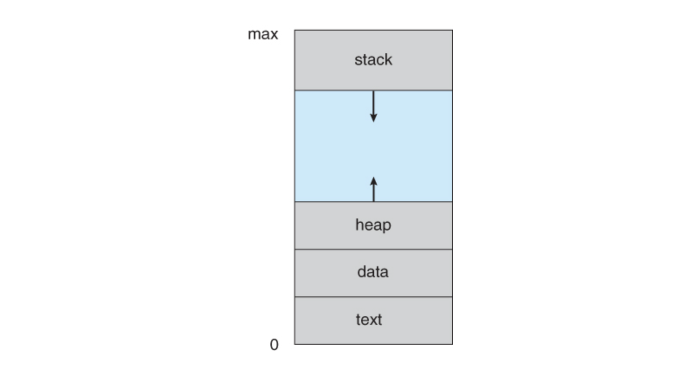

## 프로세스란

실행중인 프로그램.

운영체제가 프로그램을 실행하기 위해 필요한 작업의 단위. 운영체제는 자원들을 작업(프로세스)에 자원들을 적절히 분배한다.

좀 더 자세히 보자면, 0과 1로 이루어진 파일(코드 이미지 혹은 바이너리)을 실행하면 데이터가 메모리에 올려지고, 이걸 CPU가 한줄씩 읽어가면서 실행하게 된다. 이때 메모리에 올려진 데이터를 바로 프로세스라고 한다. 어떤 응용 프로그램은 코드 이미지 하나에 여러 개의 프로세스가 구성될 수도 있다.

그리고 운영체제가 프로세스를 언제 어떻게 실행시킬 것인지에 관한 기능을 프로세스 스케줄링이라고 한다.

## 프로세스 구조

프로세스는 운영체제로부터 각각 독립된 메모리 영역(code, data, stack, heap)을 할당 받아 메모리에 올려진다. 즉, 프로세스 메모리는 아래와 같이 4개의 섹션으로 나뉜다.

- `코드(텍스트)` 영역에는 우리가 작성한 코드가 0과 1로 들어간다. (컴파일된 프로그램 코드)
- `데이터 영역`에는 코드에서 선언한 변수 중 전역변수 혹은 초기화된 데이터들이 들어간다.
- `스택` 영역에는 함수를 호출한다든지 할 때 함수 내부에서 사용한 지역변수 등 임시 데이터가 들어간다.
- `힙` 영역은 코드에서 동적으로 만들어지는 데이터가 있을 경우, 그 데이터가 저장되는 공간이다. 필요에 따라 만들어지는 객체나 데이터들이 여기에 해당된다.

아래 그림에서 보이듯, 스택과 힙은 프로세스 여유 공간의 반대쪽 끝에서 시작해 서로를 향해 커진다. 둘이 만나게 되면 스택오버플로우 오류가 발생하거나 사용 가능한 메모리가 부족해 함수 호출이 실패하게 된다.

## 참고자료

- [프로세스의 개념](https://pages.cs.wisc.edu/~remzi/OSTEP/Korean/04-cpu-intro.pdf)
- [Processes](https://www.cs.uic.edu/~jbell/CourseNotes/OperatingSystems/3_Processes.html)
