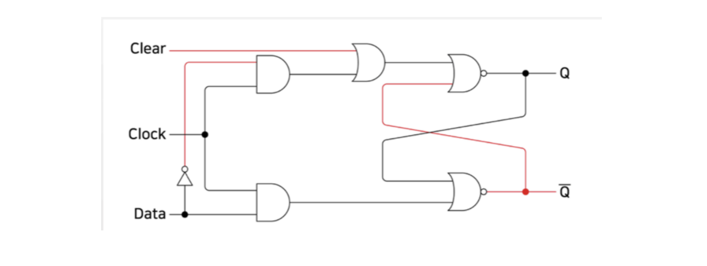
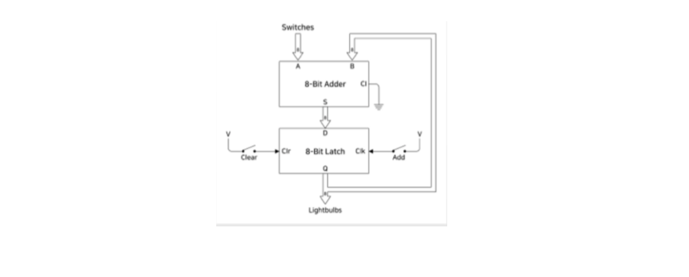
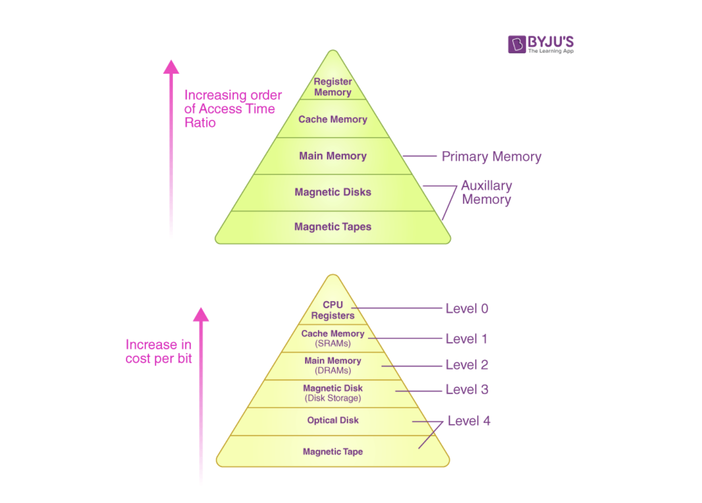

## Accumulator

Accumulator는 CPU에서 산술/논리 데이터를 잠깐 동안(단기적으로 혹은 중간에) 저장하기 위한 register이다. accumulator라는 용어 자체는 자주 사용되지 않으며 register라는 용어로 대체되었다. 최신 컴퓨터에서는 모든 레지스터가 Accumulator 역할을 수행할 수 있다.

Accumulator의 가장 기본적인 용도는 일련의 숫자를 추가하는 것이다. 각 숫자가 추가될 때마다 Accumulator의 숫자 값이 증가하다가, sum이 결정되면 main memory 또는 another register로 쓰여진다.

Accumulator는 앞서 배운 adder와 혼동하기 쉬운데, 
adder가 덧셈 과정 그 자체라면 
Accumulator는 이 adder를 가지고 실제로 컴퓨터에서 계산을 수행한다.

위 diagram을 보면, 
플립플롭 구조에 clear라는 입력이 하나 추가된 걸 볼 수 있다. 
clear 버튼을 누르면(즉 1이면) 무조건 Q의 output은 0일 수밖에 없게 된다. 
이 logic을 통해 데이터가 삭제된다는 개념이 가능해진다.

Accumulator을 diagram으로 살펴보면 위와 같다.

1. 처음에 스위치를 눌러 A로 값이 들어가면, B는 input이 없으므로 `A+0=A`
2. latch에서 Add 스위치를 누르면 A가 B로 다시 들어가고, 이 상태에서 A 위치에 B를 넣으면 B+A라는 연산이 가능해진다.
3. 또 다른 연산이 필요하면 latch의 clear 스위치를 눌러서 초기화해준다.

위 그림을 통해 폰노이만 구조에서 Accumulator의 위치를 확인해볼 수 있다.

## Memory Hierarchy

앞서 accumulator에서 먼저 들어간 A를 임시로 저장하는 공간인 latch가 있어야만 연산이 가능하다는 걸 배웠다. 이렇듯 CPU 안에는 여러가지 데이터를 처리하기 위한 임시적인 데이터 공간들이 존재한다. 이러한 임시 데이터 공간을 Register라고 부른다.

CPU 내부에 있는 레지스터 공간은 CPU 내부에 있으므로 데이터를 가져오는 데 오랜 시간이 걸리지 않는다. 반면 외부 메모리를 갔다오려면 보다 많은 시간이 필요하다. 이때 메모리 계층 구조를 이해하고 엑세스 시간을 최대한 줄이는 게 중요하다.

1. 레지스터는 CPU 안에 임시로 데이터를 보관하는 공간이고
2. SRAM은 자주 사용하는 메모리를 넣어놔도 이후에는 멀리 가지 않고 바로 꺼내 쓸 수 있도록 만든 공간이다. 흔히 캐시라고 부른다.
3. DRAM은 우리가 흔히 부르는 RAM이다. 메인 메모리.
4. 하드디스크 : 컴퓨터를 꺼도 데이터를 저장할 수 있는 공간들.

## DMA (Direct Memory Access)

기본적으로 CPU는 메모리에 가서 데이터를 가져와 실행한다. 데이터를 가져오는 시간이 너무 오래 걸리면 성능이 떨어질 수 있으므로, CPU는 특정 부품에게 데이터를 가져오는 동작을 위임하는데 이런 방식을 DMA라고 한다.

DMA는 특정 하드웨어 하위 시스템이 CPU와는 독립적으로 메인 시스템 메모리에 접근하게 해주는 컴퓨터 시스템의 기능이다. (PIO는 DMA의 반대 개념으로, 모든 데이터 접근에 CPU가 관여하는 방식이다. DMA는 PIO의 단점을 보완한 기능이다)

## 참고자료

- [What is an accumulator in computer science?](https://www.quora.com/What-is-an-accumulator-in-computer-science)
- [Design and Characteristics of Memory Hierarchy](https://byjus.com/gate/design-and-characteristics-of-memory-hierarchy-notes/)
