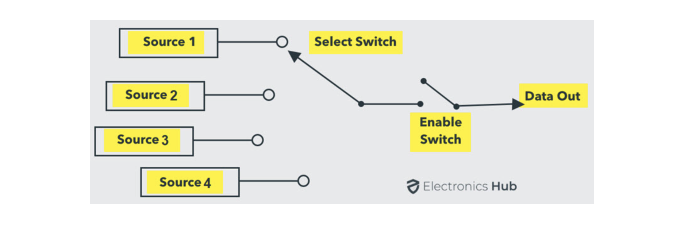
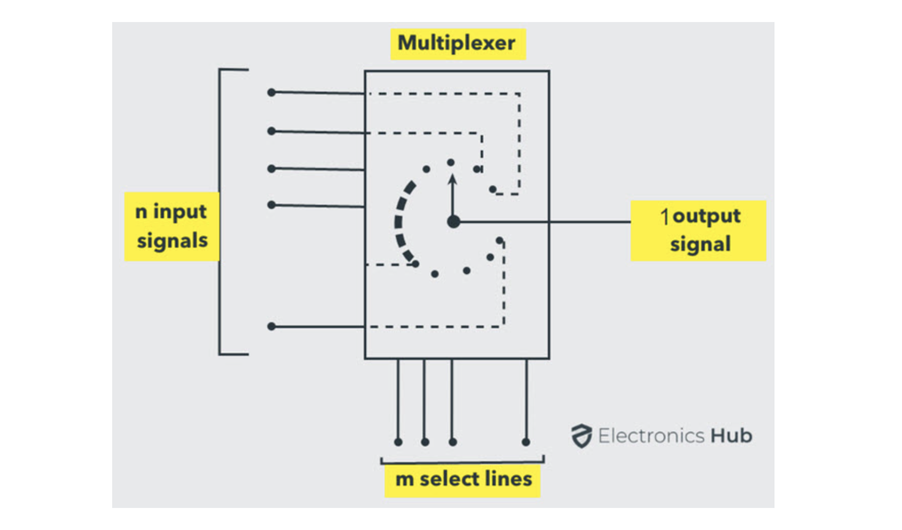
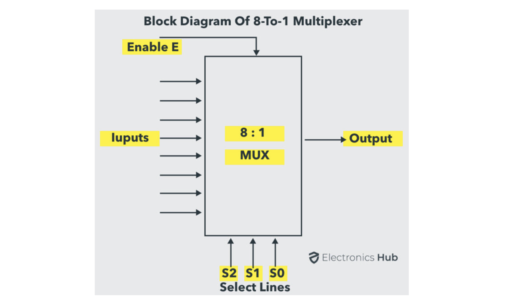
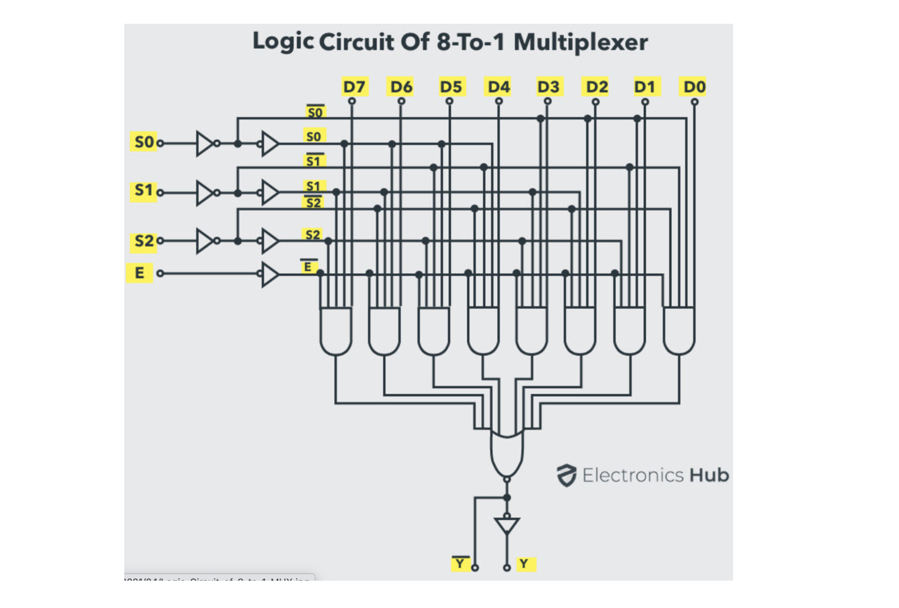
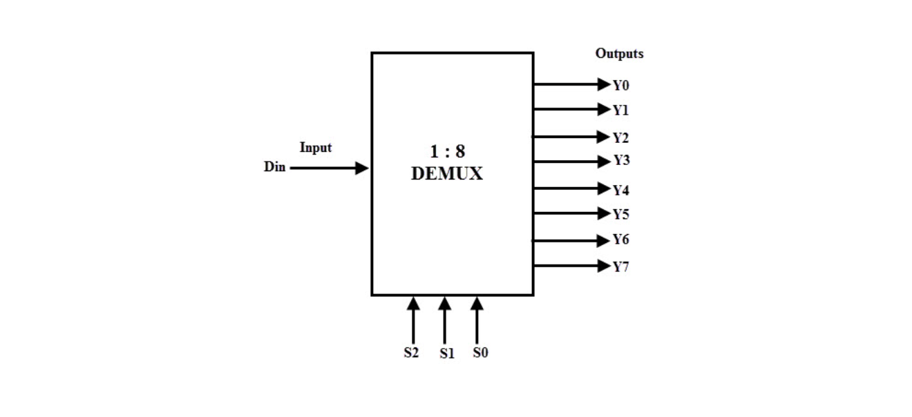
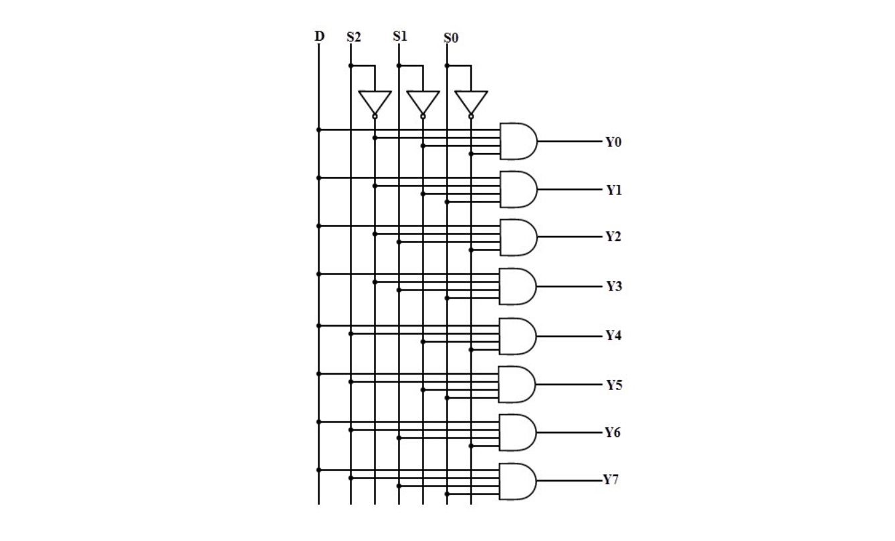
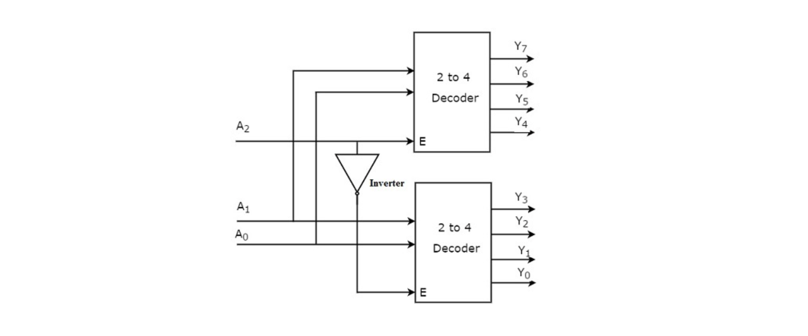
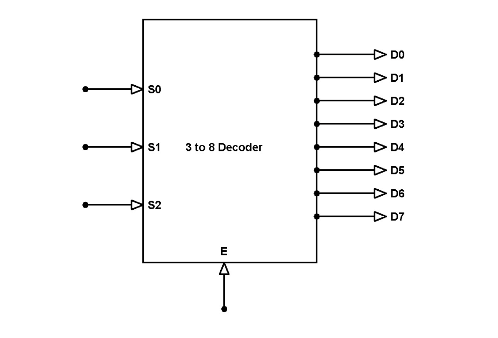
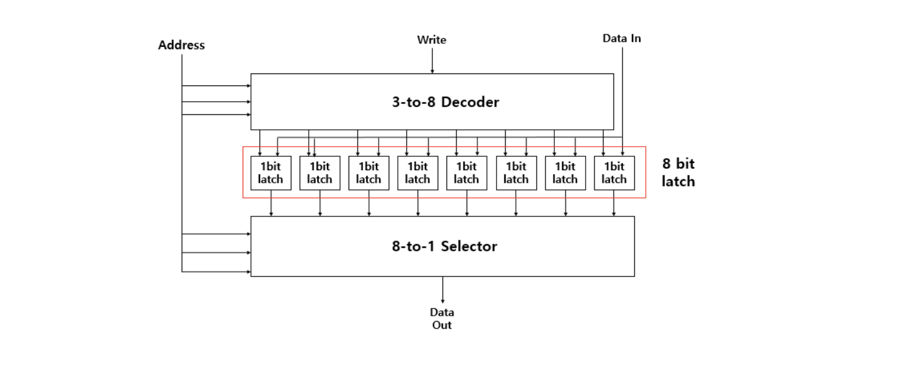
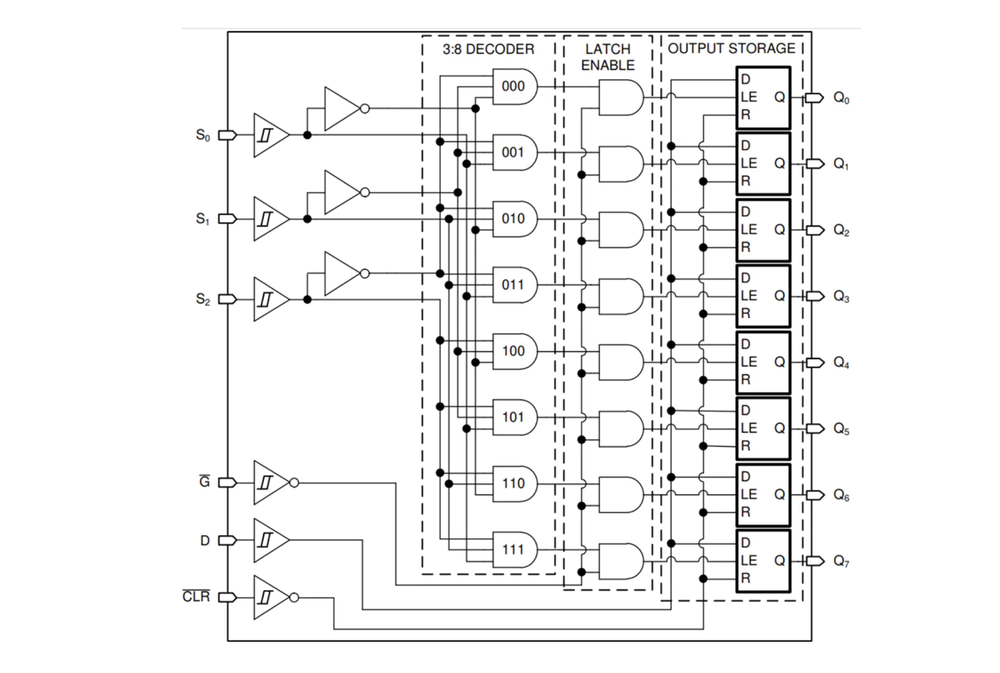

이전 시간에 데이터를 저장할 수 있다는 걸 배웠다. 
그렇다면 이제 데이터를 어디에 저장할 것인가?

데이터의 위치 개념이 있어야, 
그 위치에 데이터를 저장하거나 그 위치에서 데이터를 읽어올 수 있다. 그걸 컴퓨터에서는 주소(Address)라고 부른다. 우리가 특정 데이터를 변수에 저장할 때, 사실 컴퓨터 내부적으로는, 그 변수가 특정 주소를 가리키도록 한다.

## Multiplexer (MUX)

Multiplexer(MUX)는 data selector라고도 불리는 digital switch이다.

MUX는 1개 이상의 input line, 1개 이상의 output line, 1개 이상의 select line을 갖는 조합논리회로이다.

여러 개의 input line 또는 source에서 이진 정보를 받아서, output line으로 route된다.

위 그림은 n개의 input line과 m개의 select line, 그리고 하나의 output line으로 구성된 Multiplexer의 block diagram이다. select line이 m일 때, 가능한 input line의 개수는 `2^m`개가 된다.

결국 input line이 n이므로 n == 2^m이 된다. n개 중에서 하나를 select하려면 m개의 select line이 필요하게 되는 것이다.

이러한 유형의 MUX를 `2^n`-to-1 Multiplexer 또는 `2^n` x 1 Multiplexer라고 한다. 예를 들어 input line(source)이 4개인 경우, 2개의 select line이 필요하다.

아래 그림은 8-to-1 Multiplexer(혹은 selector)이다.

8 bit의 데이터 중에서 특정 bit를 뽑아내려면 3개의 select line이 필요하다.

`000, 001, 010, 011, 100, 101, 110, 111` 
이와 같이 8개이 고유한 신호(2진수)를 만들 수 있는 것이다.

3개의 select line으로 8개의 신호를 만들고 연결해놓은 뒤, AND 게이트로 연결해놓으면 결과적으로 이중에서 특정 bit만 선택할 수 있게 된다. 8개의 주소 중에서 하나의 주소를 선택해서 읽어내는 방식이며, 이는 일종의 주소(Address)를 선택하는 동작과 같다.

Multiplexer는 수많은 입력 중 하나를 선택해 단일 output으로 전달하는 간단한 조합논리회로이다.

## Demultiplexer (Demux)

Demultiplexer의 동작은 Multiplexer의 동작과 정반대이다. MUX와 반대로 Demux는 one-to-many circuit이다. Demultiplexer는 하나의 input data를 여러 output data line들 중 하나로 전달시킨다.

Demultiplexer들은 주로 Boolean function generators과 decoder circuits에 사용된다.

Demultiplexer는 하나의 input line에서 data를 받아서 n개의 수신 가능한 output line들 중에서 하나로 data를 전송하는 조합논리회로이다.

Multiplexer가 Data Selector라면, Demultiplexer는 Data Distributor와 같다. 즉, Demultiplexer는 1:N 장치이고, Multiplexer는 N:1 장치이다.

아래 그림은 단일 input line인 D, 3개의 select line, 8개의 output line으로 구성된 1-to-8 Demultiplexer의 block diagram이다.

demultiplexer의 logic diagram은 아래와 같은데, 
4개의 input line을 갖는 AND 게이트가 8개와 3개의 NOT 게이트를 사용해 구현할 수 있다.

## Decoder

decoder는 코드를 일련의 신호로 변경하는 데 사용되는 조합논리회로이다. 
(Demultiplexer가 이 decoder에 사용된다)

decoder는 여러 input을 받아서 여러 output을 제공한다. 
`n`개 input의 이진 데이터를 `2^n`의 고유 output으로 제공한다.

### 3-to-8 decoder

3-to-8 decoder는 2개의 2-to-4 decoder를 사용해서 구현한다.

3-to-8 decoder의 block diagram은 아래와 같다.

여기서 8개의 output을 하나로 묶으면, 
8개의 공간 중에서 하나의 공간을 선택하는 것과 같게 된다. 
decoder를 사용해서 데이터 write 기능을 구현할 수 있다.

### 8 bit latch에 decoder와 selector를 연결하면

8-to-1 selector와 3-to-8 decoder를 위 그림과 같이 연결하면, 
데이터를 쓰고 읽을 수 있다.

write 신호와 data input이 있으면 3-to-8 decoder를 통해 데이터가 하나씩 쓰여진다. 이렇게 각각 쓰여지는 8개의 데이터 output이 8-to-1 selector로 들어가게 된다. 이 각각의 8개 데이터들은 3개의 select line을 갖는다(000 ~ 100). 8-to-1 selector를 거쳐서 하나의 data out으로 나오게 된다.

이를 통해 특정 8개의 latch 중에서 특정 address에 특정 data를 쓰고, 그 data를 읽어올 수도 있게 된다. 이렇게 8 bit latch 회로가 완성된다.

아래 그림은 8-Bit Addressable Latche의 functional block diagram이다.

## 참고자료

- [Multiplexer (MUX) and Multiplexing](https://www.electronicshub.org/multiplexerandmultiplexing/)
- [What is a Demultiplexer (Demux)?](https://www.electronicshub.org/demultiplexerdemux/)
- [Designing of 3 Line to 8 Line Decoder and Demultiplexer](https://www.elprocus.com/designing-3-line-to-8-line-decoder-demultiplexer/)
