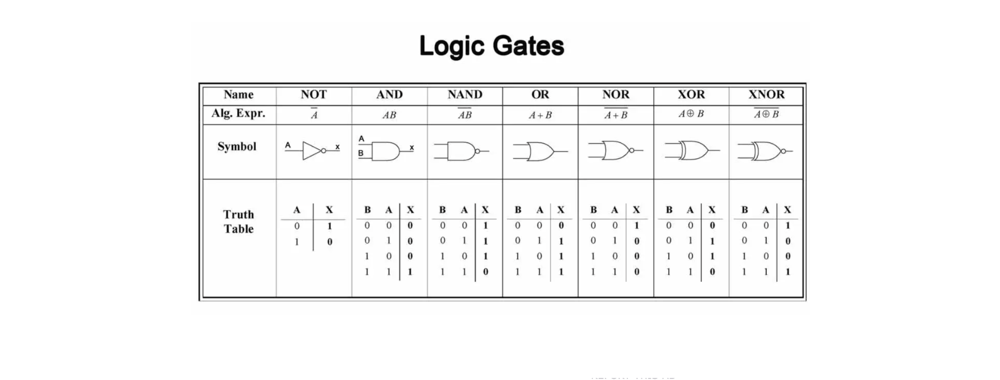
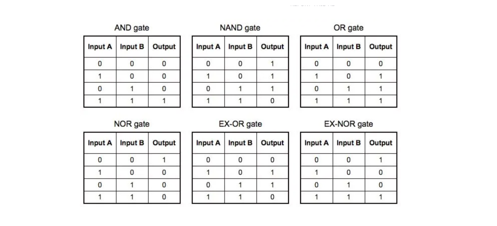
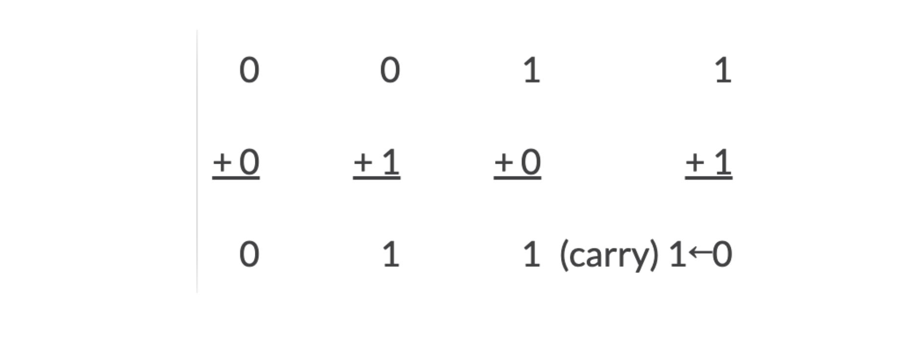
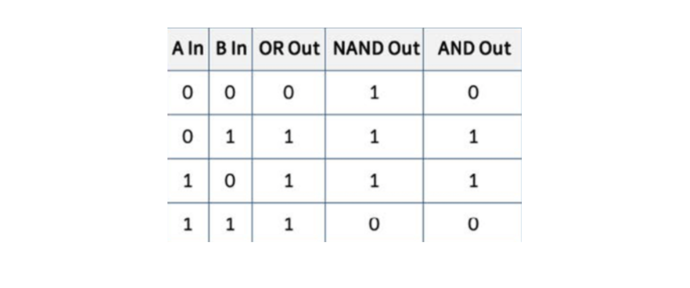
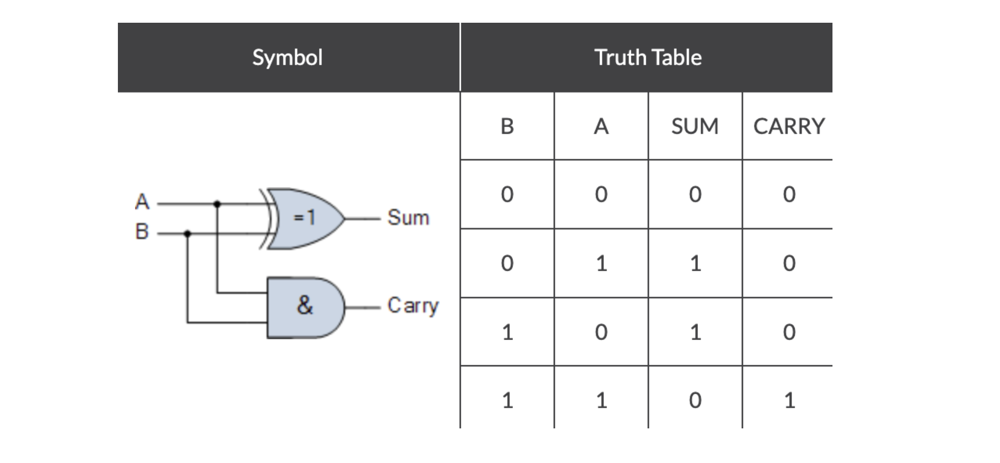
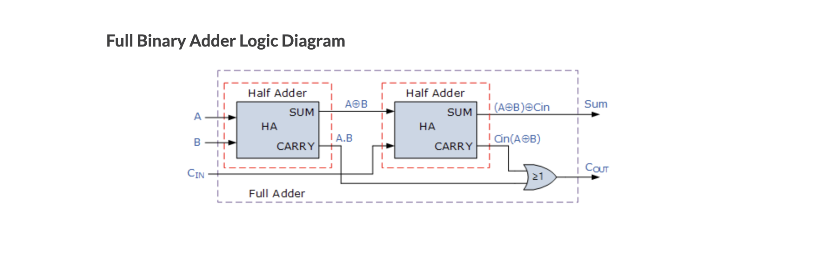
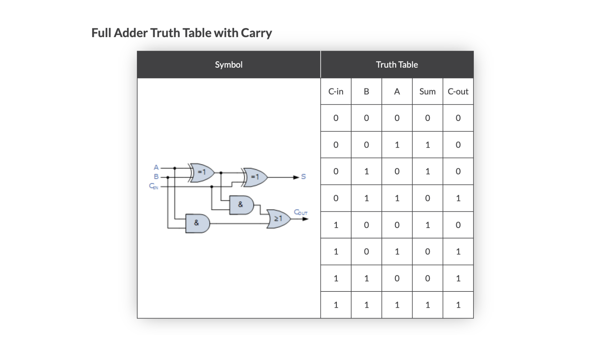
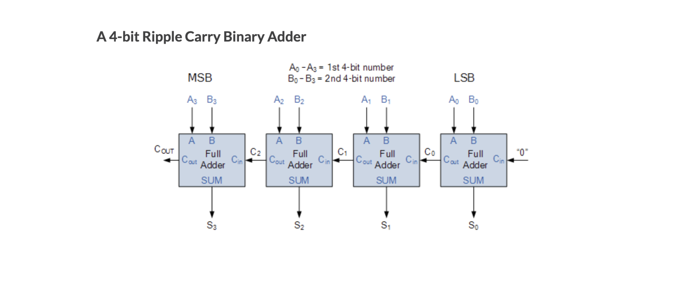

## 논리 게이트

컴퓨터의 동작은 전기를 끄고 키는 것(0과 1)으로 설명된다. 
0과 1로 의사소통을 할 수 있고 연산을 할 수 있다.

### Adder 이해하기

논리 게이트를 사용해서 Binary Adder를 만들 수 있다. 
OR 게이트로 덧셈을 할 때, 자릿수가 넘어가는 경우를 고려해야 한다.

첫번째 자릿수를 sum bit로 표현하고 
자릿수가 넘어가는 경우는 carry(또는 carry-out) bit로 표현한다.

예를 들어 sum bit는 
0 + 0 = 0 
0 + 1 = 1 
1 + 0 = 1 
1 + 1 = 0 ⇒ 자릿수가 넘어가는 걸 표현해야 하는데, 이때 사용하는 게 캐리 비트(carry bit)이다.

sum bit와 carry bit로 다시 표현하면 다음과 같다. 
0+0 = 0(sum), 0(carry) 
0+1 = 1(sum), 0(carry) 
1+0 = 1(sum), 0(carry) 
1+1 = 0(sum), 1(carry) 

즉, sum bit가 1+1일 때 캐리아웃이 생성된다.

sum bit를 논리게이트로 표현하려면, 
XOR 게이트를 사용하면 된다(OR 게이트 + NAND 게이트 + AND 게이트 조합으로도 가능하다).

### Half Adder

위에서 살펴봤듯이 두 개의 비트를 덧셈할 경우 캐리 비트를 무시할 수 없다.

sum bit를 구현할 수 있는 XOR(EXclusive-OR) 게이트와 AND 게이틀르 결합하면 Half Adder라고 알려진 simple digital binary adder circuit이 완성된다.

half adder는 2개의 Input과 2개의 Output를 갖는 조합논리회로이다.

각각 하나의 bit인 A와 B가 input이며, 
A와 B를 더한 sum bit와 합인 sum의 자리올림인 carry bit가 output이다.

### Full Adder

full adder와 half adder의 주요한 차이점은 full adder의 input이 3개라는 점이다.

half adder와 동일하게 2개의 single bit input과 이전 단계에서의 carry를 수신하기 위한 carry-in input이 추가적으로 존재한다.

전가산기는 기본적으로 반가산기 2개를 조합해서 만들 수 있다.

전가산기를 사용하면 여러 자릿수를 계산할 수 있다.

예를 들어, 전가산기를 4개 연결하면 4자리의 2진수 간 덧셈을 할 수 있다. 2^4 숫자 간 덧셈이 가능하다는 의미이다.

4비트 전가산기를 2개 연결하면 8비트 전가산기가 되고, 또 2개를 연결하면 16비트 전가산기가 된다. 이런 식으로 32비트, 64비트 .. 등으로 확장할 수 있다.

### 정리하자면

전기를 껐다가 키는 행위로 논리 게이트를 구성할 수 있다. 
이 논리 게이트들을 조합해서 반가산기, 전가산기를 구성할 수 있다. 
덧셈이 가능해졌으므로(adder가 있으므로) 뺄셈, 곱셈 등 사칙연산으로 확장이 가능하다.

## 참고자료

- [Logic gates and logic circuits](https://frankcomputerscience.wordpress.com/chapter-3/)
- [Exclusive OR gate](https://byjus.com/neet/exclusive-or-gate/)
- [Binary Adder and Binary Addition using Ex-OR Gates](https://www.electronics-tutorials.ws/combination/comb_7.html)
