## 7 layer of OSI model

컴퓨터는 다른 컴퓨터와 데이터를 주고 받을 수 있다. 즉, 통신을 할 수 있다. 통신에는 범위가 존재한다.

- LAN(Local Area Network) : 컴퓨터 간 근거리 통신이 가능하다.
- WAN(Wide Area Network) : 컴퓨터 간 광역으로 통신할 수 있다. 인터넷 서비스 제공자(ISP)이 네트워크를 제공하곤 한다.

이외에도 여러가지 범위가 존재한다. 어쨌든 예를 들어 우리는 컴퓨터로 와이파이 LAN카드로 와이파이 허브와 통신을 한다. 그리고 통신사에 일정 요금을 지불하고 인터넷을 사용한다. 각종 통신사가 케이블을 깔아서 유선 광역 네트워크를 제공해주는 것이다. 당연히 무선도 존재한다.

이런 환경에서 컴퓨터 간 데이터를 주고 받는데, 그냥 주고 받는 게 아니고 일정 규칙을 지키며 통신을 한다. 이 일정한 규칙을 프로토콜(Protocol)이라고 한다. 이중에서 ISO(국제표준화기구)에서 표준으로 지정한 프로토콜이 존재하는데, 이걸 OSI Model이라고 한다. 계층 형태로 존재하기 때문에 흔히 OSI 7 계층이라고 부른다. 다양한 컴퓨터 간 통신(데이터 송수신)을 지원하는 추상 모델을 표준화한 것이다.

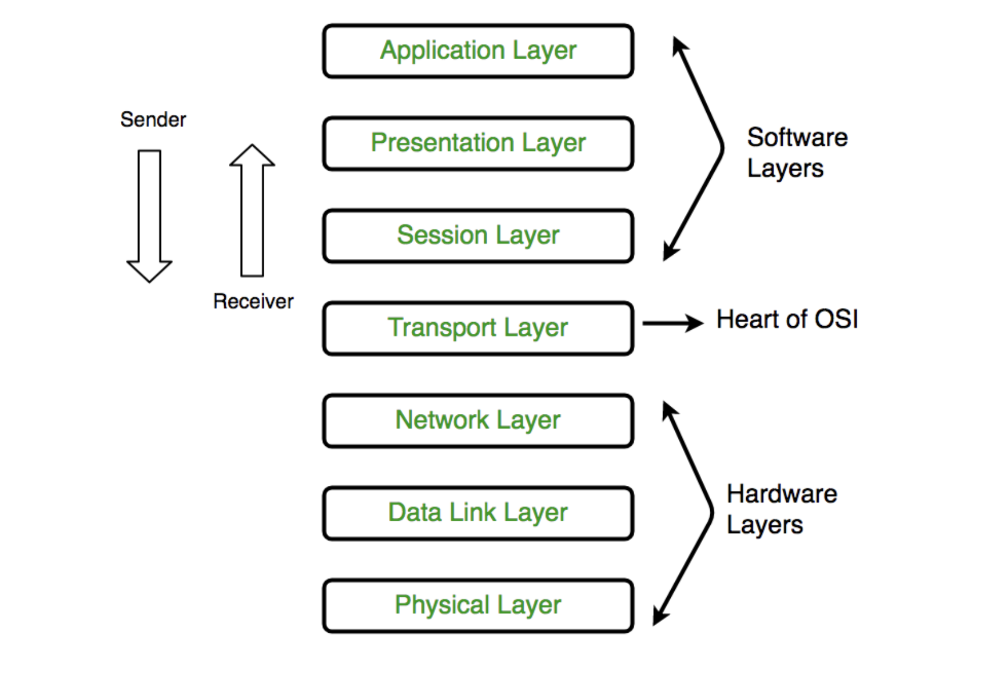

보통 컴퓨터 어플리케이션에서 데이터를 전송하면 다른 컴퓨터 어플리케이션이 데이터를 수신한다. send할 때는 Application layer부터 아래로 쭉 내려가서 Physical layer에서 다른 컴퓨터의 Physical layer로 이동한다. 그 다음 맨 밑에서부터 다시 쭉 올라가서 다른 컴퓨터의 application layer에 도달해서 데이터를 수신한다.

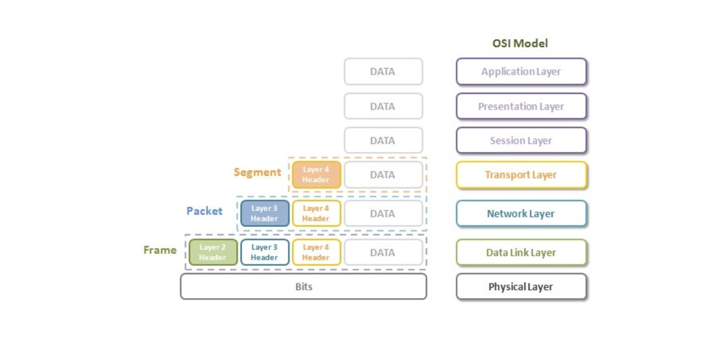

프로토콜은 header와 body(data) 부분으로 구분되는데, 여러 계층을 거치면서 각 layer의 정보들을 header에 넣어서 차곡차곡 쌓는다. 이 전체를 network stack이라고 표현한다.

### Encapsulation and Decapsulation

데이터를 보내는 쪽

- 각 layer를 거치며 필요한 정보들을 header에 넣고 body에는 실제 data가 담기게 된다. 이 과정을 캡슐화(Encapsulation)이라고 한다. 그리고 Physical layer까지 거쳐서 모든 layer에서 각 layer의 정보를 header에 담은 걸 보통 통칭해서 패킷이라고 한다.

데이터를 받는 쪽

- 전송받은 패킷을 반대로 분해한다. 즉, header 부분에 대해 역캡슐화(Decapsulation) 과정을 거친다. 헤더에 쌓인 부분을 각 layer을 거치며 벗겨내고 어플리케이션 계층에서 data를 확인하는 것이다.

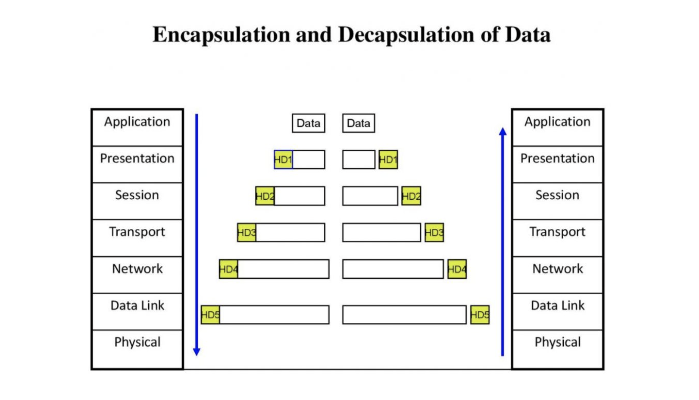

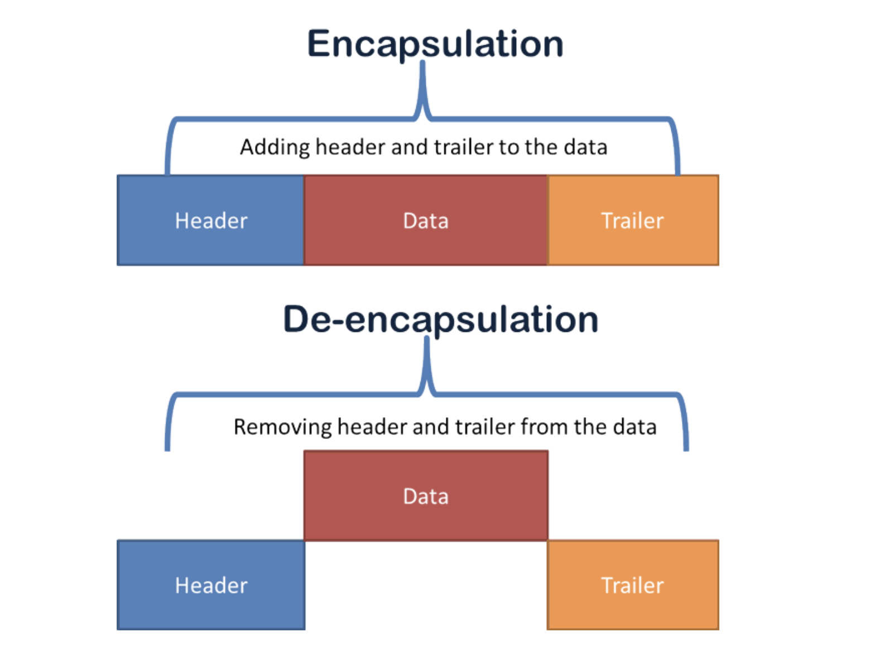

### 1. Physical Layer (Layer 1)

OSI 모델의 최하위 계층은 물리 계층이다. 장치 간 실제 물리적 연결을 담당한다. 물리 계층은 비트 형태의 정보를 포함하는데, 데이터링크 계층으로부터 신호를 수신해 0과 1로 변환하고 데이터 링크 계층으로 보내 프레임을 다시 결합한다.

Hub, Repeater, Modem, Cables은 모두 물리 계층 장치이다.

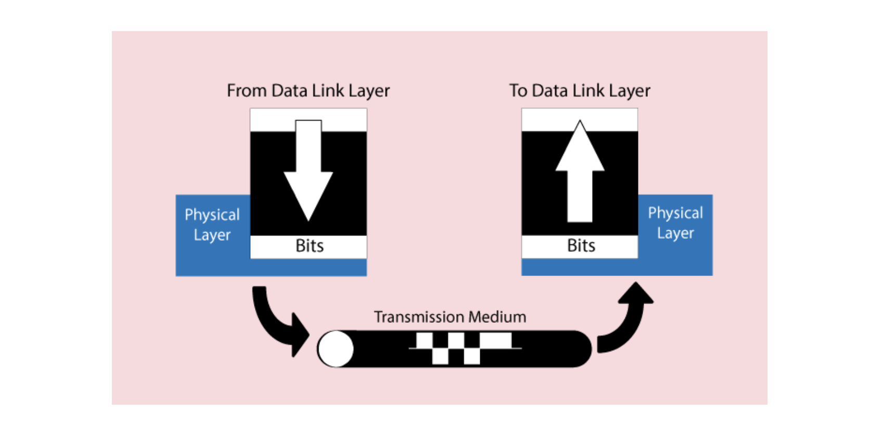

### 2. Data Link Layer (DLL) (Layer 2)

데이터 링크 계층은 메시지의 노드 간 전달을 담당한다. 물리 계층을 통한 노드 간 데이터 전송에 오류가 없는지 확인하는 역할을 한다. 패킷이 네트워크에 도착하면 DLL은 이를 MAC 주소를 사용해 호스트로 전달해야 한다.

DLL은 2개의 하위 계층을 갖는다.

- Logical Link Control (LLC)
- Media Access Control (MAC)

네트워크 계층에서 받은 패킷은 NIC(Network Intetface Card)의 프레임 크기에 따라 다시 프레임으로 나뉜다. DLL은 또한 송신자와 수신자의 MAC 주소를 헤더에 캡슐화한다.

데이터 링크 계층의 패킷을 프레임이라고 한다.

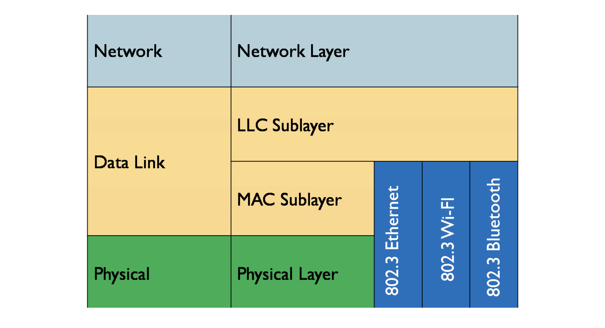

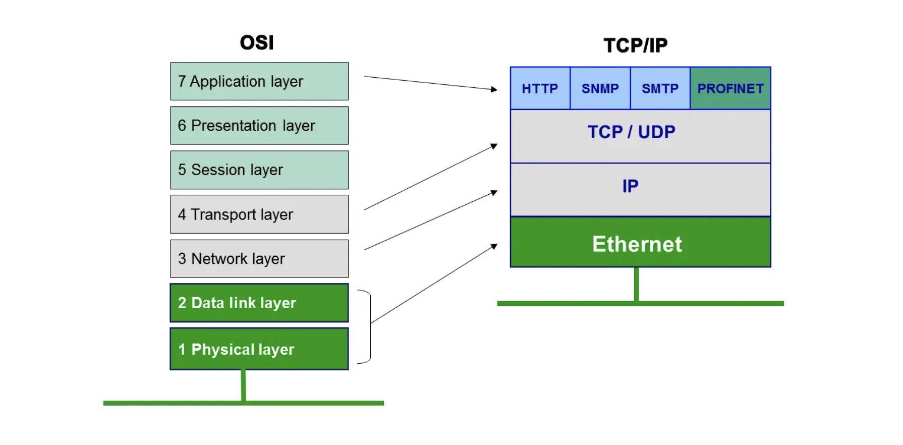

물리 계층과 데이터 링크 계층 모두 하나의 프로토콜을 사용한다. 이더넷 프로토콜(ethernet protocol). 우리가 사용하는 하드웨어 장치의 각각의 랜카드에는 MAC 주소가 정의되어 있고, 이 MAC 주소는 하드웨어마다 유일한 주소로 정의되어 있다.

이더넷 헤더에 송신할 MAC 주소(Source MAC Address)와 수신할 MAC 주소(Destination MAC Address)를 같이 넣어서 전송하고, 수신 컴퓨터에서 두 MAC 주소를 확인 후 일치하면 데이터를 위로 올려보낸다.

### 3. Network Layer (Layer 3)

네트워크 계층은 한 호스트에서 다른 네트워크에 있는 호스트에게로 데이터를 전송하는 데 사용된다. 즉, 사용 가능한 경로 수에서 패킷을 전송할 최단 경로 선택을 처리한다(packet routing). 수많은 컴퓨터 간 논리적인 연결을 위해 네트워크 계층이 필요하다.

네트워크 계층의 기능

- 1.  Routing 기능 : 네트워크 계층 프로토콜은 source에서 destination까지 적합한 경로를 결정한다.
- 2.  Logical Addressing 기능 : 네트워크 간 각 장치를 고유하게 식별하기 위해 네트워크 계층은 주소 지정 체계(an addressing scheme)를 정의한다. 발신자와 수신자의 IP 주소는 네트워크 계층에 의해 헤더에 배치된다.

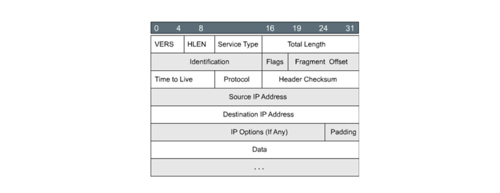

네트워크 계층에서의 Segment를 패킷(Packet)이라고 한다. 데이터 링크 계층 이하에 있는 데이터는 프레임, 네트워크 계층까지 포함한 데이터를 패킷이라고 하는데, 네트워크 계층까지가 물리적 처리를 담당하므로 7개 layer가 있는 데이터도 보통 패킷으로 통칭하기도 한다.

네트워크 계층은 routers와 같은 네트워킹 장치에 의해 구현된다. 네트워크 계층의 대표적인 프로토콜이 IP 프로토콜이다.

### 4. Transport Layer (Layer 4)

전송 계층은 네트워크 계층에서 services를 받아서 어플리케이션 계층에 services를 제공한다. 전송 계층의 데이터를 Segments라고 한다. 전송 계층은 운영체제에서 동작한다. 운영체제의 일부이며 system calls을 통해 어플리케이션 계층과 통신한다. 전송 계층은 OSI 모델의 심장이라고 불린다.

- 성공적인 데이터 전송에 대한 승인을 제공하고 오류가 발견되면 데이터를 재전송한다. 즉, 데이터 전송 중 손상/유실에 대해 점검을 할 수 있다(checksum).
- 수많은 어플리케이션 중 정확히 특정 어플리케이션에 전달하기 위해 port 번호를 통해 식별한다.

발신자 쪽에서는 상위 계층에서 데이터를 받아 Segmentation 과정을 통해 안전한 데이터 전송을 보장하고, 헤더에 Source Port와 Destination port 번호를 추가해 segmented data를 네트워크 계층으로 보낸다. 즉, 발신 측에서 수신자 어플리케이션 쪽의 port 번호를 알아야 하지만 일반적으로 통용되는 번호를 사용한다.

=> 예를 들어, 웹 서버는 보통 80번을 사용하고, 이메일은 110번 등을 사용한다.

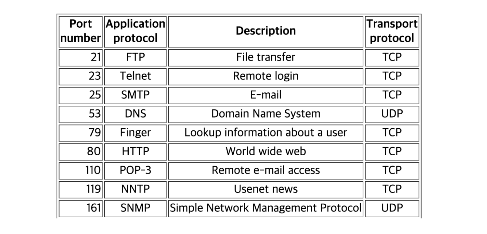

수신자 전송 계층에서는 헤더에서 port 번호를 읽고, segmented data를 시퀀싱, 재조립해서 수신한 데이터를 어플리케이션 계층으로 보낸다.

대표적인 전송 계층의 프로토콜로는 TCP와 UDP가 있다.

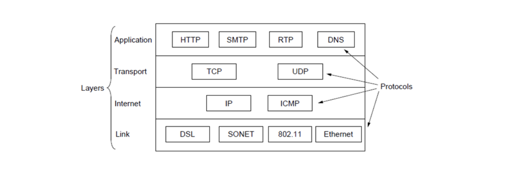

checksum은 일종의 계산식이다. 
예를 들어 16비트의 checksum field를 사용한다면, 아래 그럼처럼 0과 1로 된 데이터들을 전부 더해서 합산값을 비교하는 식으로 데이터 손실을 감지한다.

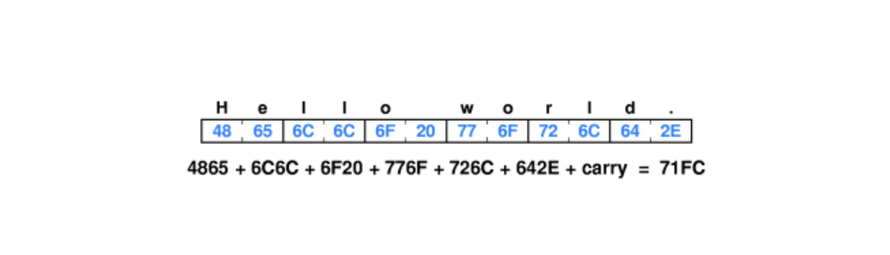

물론 아래와 같이 checksum이 실패할 수도 있다. 중간에 변동/손실값은 있지만 합산값은 동일해서 오류를 감지하지 못하기도 한다. 그렇기에 checksum 계산식은 다양하며, 복잡하게 만들면 만들수록 이런 오류를 막을 수 있다.

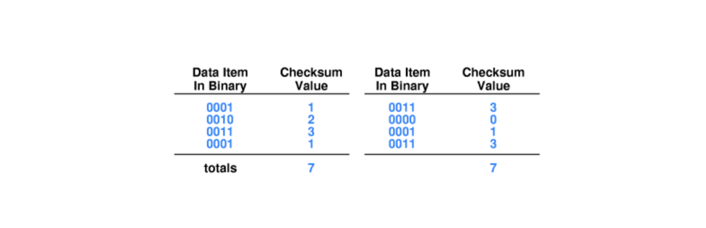

### 4. TCP와 UDP

TCP는 연결형 프로토콜로서, 데이터 전송의 순서를 보장하고 데이터 신뢰성을 보장한다. 데이터를 수신 받을 때, 어떤 이유로 데이터가 제대로 전송되지 않으면 재전송을 요청하기도 한다. 채팅 앱과 같이 데이터 신뢰성이 보장되어야 하는 어플리케이션의 경우 TCP를 쓴다.

아래 그림은 TCP segment format이다.

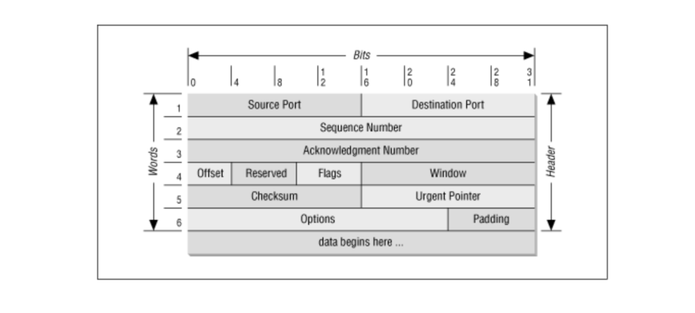

UDP 비연결형 프로토콜로서, TCP보다 전송 속도가 빠르다. UDP 데이터는 패킷이 아니라 데이터그램이라고 부른다(그럼에도 패킷으로 통칭할 수도 있다.). 주로 스트리밍/브로드캐스팅 서비스에 사용된다.

아래 그림은 UDP message format이다

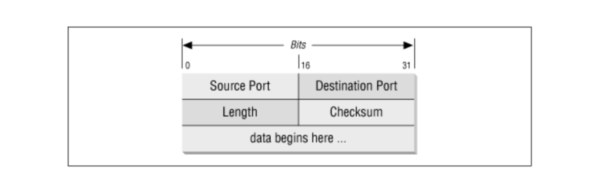

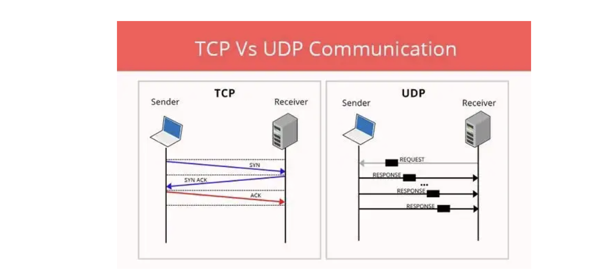

### 5. Session Layer (Layer 5)

세션 계층은 연결 설정, 세션 유지 관리, 인증을 담당하고 보안도 보장한다.

데이터를 논리적인 구분을 통해 여러 개의 세션으로 나누고, 여러 세션이 개별적으로 동작하면서 동일한 데이터 망으로 전달될 수 있게 도와준다.

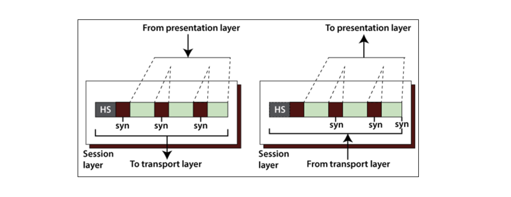

여기 세션 계층을 포함해 5~7 계층은 모두 TCP/IP 모델에서는 단일 계층으로서, 응용 계층으로 통합된다. 이 3개 계층의 구현은 네트워크 어플리케이션 자체에서 수행된다. Upper Layers 또는 Software Layers로 불린다.

### 6. Presentation Layer (Layer 6)

변환 계층(Translation layer)이라 불리기도 한다.

Translation하거나 
Encryption/Decryption를 통해 데이터를 암호화하고, 해독한다. 
Compression 과정을 거쳐 네트워크에서 전송해야 하는 비트 수를 줄인다.

### 7. Application Layer (Layer 7)

응용 프로그램 수준에서 데이터를 처리하기 위한 프로토콜이 위치하는 곳이 응용 계층.

응용 프로그램은 네트워크를 통해 전송되어야 하는 데이터를 생성한다. 이 데이터를 처리하기 위해 별도의 프로토콜을 사용할 필요가 있을 때가 있다. 대표적인 게 바로 HTTP.

> 요약하자면,
> Physical Layer => 시스템 간 물리적 연결과 전기신호 변환 및 제어를 담당한다.
> Data Link Layer => 네트워크 기기 간 데이터 전송 및 물리 주소 결정을 담당한다.
> Network Layer => 다른 네트워크와 통신을 위한 경로 설정 및 논리 주소 결정을 담당한다.
> Transport Layer => 신뢰할 수 있는 통신을 구현한다.
> Session Layer => 세션 체결, 통신 방식 등을 결정한다.
> Presentation Layer => 문자코드, 압축, 암호화 등의 데이터 변환을 담당한다.
> Application Layer => 이메일, 파일전송, 웹사이트 열람 등 어플리케이션에 대한 서비스를 제공한다.

## 참고자료

- [Layers of OSI Model](https://www.geeksforgeeks.org/open-systems-interconnection-model-osi/)
- [Understanding 7 layers of OSI model](https://networkhunt.com/understanding-7-layers-osi-model/)
- [What is Datalink Layer ?](https://networkustad.com/2019/05/30/what-is-datalink-layer/)
- [What is the application layer in an industrial network?](https://www.motioncontroltips.com/what-is-the-application-layer-in-an-industrial-network/)
- [10. Transport Layer](https://www.dcs.bbk.ac.uk/~ptw/teaching/IWT/transport-layer/notes.html)
- [1.6 Transport Layer](https://www.cs.ait.ac.th/~on/O/oreilly/tcpip/tcpip/ch01_06.htm)
- [Building TCP and UDP Client-Server Interactions](https://blog.devgenius.io/building-tcp-and-udp-client-server-interactions-eb8228644da2?gi=caec8bb65eb7)
