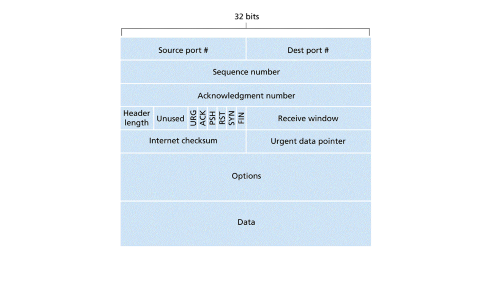
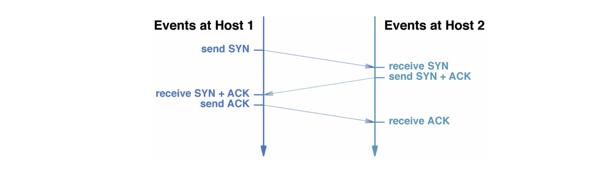
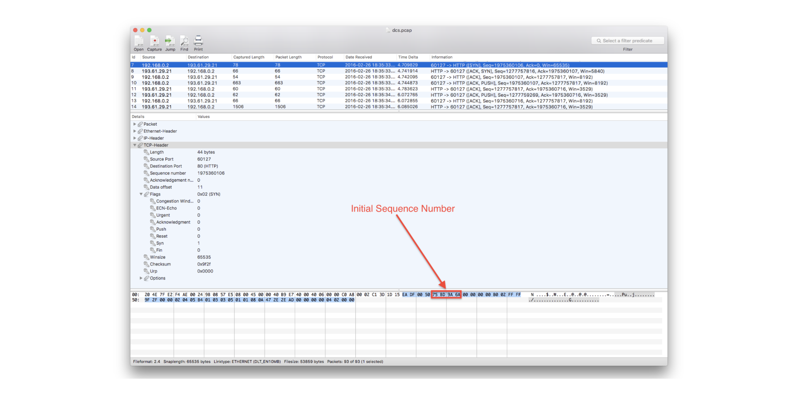
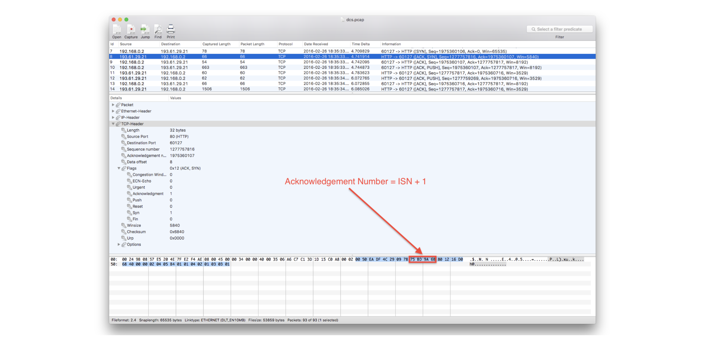
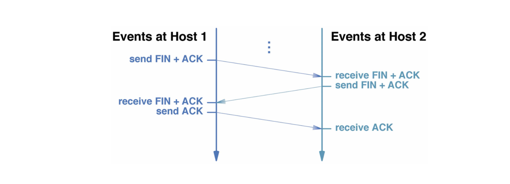
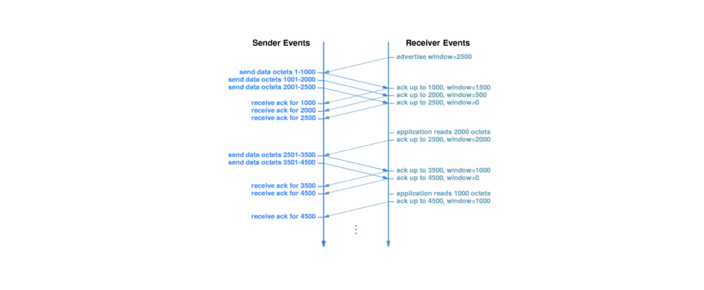
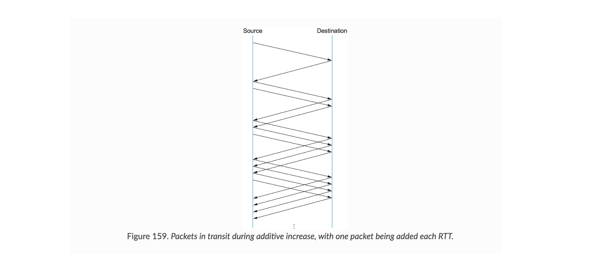
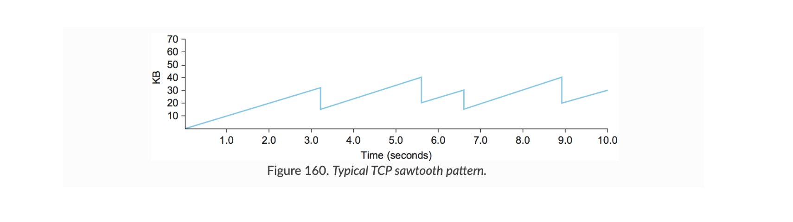
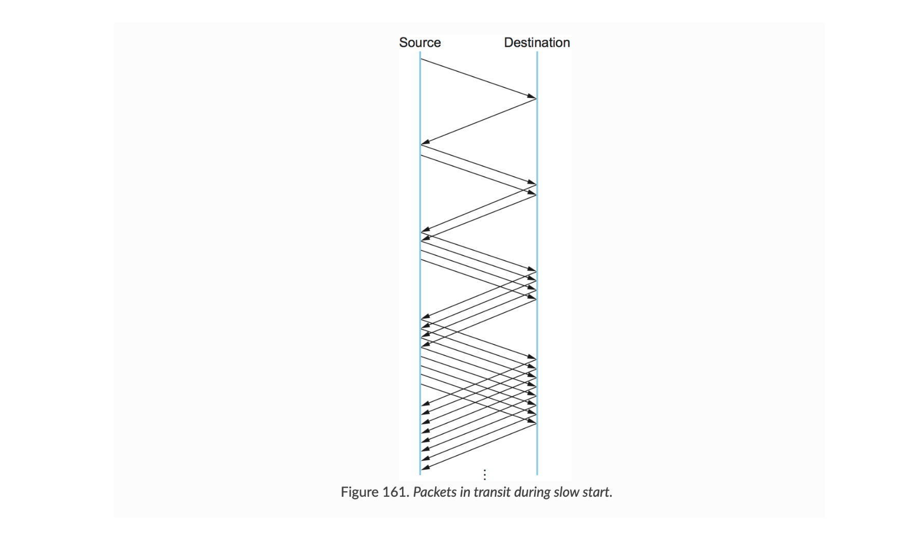

## 전송 프로토콜 (Transport Protocols)

IP(Internet Protocol)는 인터넷을 통해 패킷을 전달해준다. 하지만 IP는 동일한 컴퓨터에서 실행되는 여러 프로세스(응용 프로그램)을 구분할 수 없다. IP datagram 영역은 오직 컴퓨터 안에서만 식별된다. 전송 프로토콜은 end-to-end(양 끝단)의 사용자들이 안전하게 데이터를 주고 받을 수 있도록 해준다. TCP/IP 프로토콜은 2가지 전송 프로토콜(TCP/UDP)을 제공한다.

## TCP (Transmission Control Protocol)

TCP/IP에서 안정성을 제공하는 전송 프로토콜이다.

응용 프로그램 관점에서 TCP는 다음과 같은 특징을 갖는다.

- connection-oriented : 연결을 요청한 다음에야 데이터를 전송한다.
- reliable startup : 새 연결이 설정되기 전에 두 어플리케이션은 새로운 연결에 동의해야 한다.
- point-to-point communication : TCP 연결에는 정확히 2개의 end points가 존재한다.
- reliability : TCP는 연결을 통해 전송된 데이터가 누락되거나 중복된 데이터 없이 전달되도록 보장한다.
- full-duplex connection : TCP 연결은 데이터가 언제든 양방향으로 흐를 수 있도록 한다.
- stream interface : TCP는 연결을 통해 어플리케이션이 지속적인 stream of bytes을 보낼 수 있도록 한다.
- graceful shutdown : TCP는 연결을 닫기 전에 모든 데이터를 언정적으로 전달하는 걸 보장한다.

### TCP 세그먼트 구조



TCP는 header와 body 부분으로 나뉠 수 있고, header 부분은 위 그림과 같은 Segment Structure를 갖는다.

- source port와 dest port, internet checksum은 UDP와 동일하다. source port와 dest port는 길이가 16비트이다.
- sequence number와 acknowledgement number는 안정적인 전송을 구현하는 데 사용되며, 각각 32비트 길이를 갖는다. 송신하는 쪽에서 sequence number를 보내주면 수신하는 쪽에서 데이터를 잘 받았으면 acknowledgement number를 같이 보내준다.
- URG, ACK, PSH, RST, SYN, FIN는 TCP flag들(code bits in TCP header)이다. 각각 1비트씩 길이를 가져 총 6비트의 길이가 된다. 말 그대로 TCP가 데이터를 주고 받으면서, 어떤 flag를 1로 만드느냐를 갖고 송신측과 수신측이 의사소통을 한다.
  ⇒ URG flag는 보낸 쪽에서 일부 데이터를 긴급으로 표시했다는 걸 알려준다.
  ⇒ ACK flag는 acknowledgement number field가 유효하다는 걸 알려준다. 즉, 세그먼트가 승인되었다는 걸 알려준다. 데이터를 잘 받았는 신호.
  ⇒ PSH flag는 buffered되지 않고 데이터가 즉시 전달되어야(PUSH) 한다는 신호이다.
  ⇒ RST flag는 reset 연결을 말한다. confused or refused connection를 의미한다.
  ⇒ SYN flag는 연결을 establish하는 데 사용된다.
  ⇒ FIN flag는 연결을 terminate하는 데 사용된다.
- Receive window는 들어오는 데이터에 얼마나 많은 uffer space를 사용할 수 있는지 식별해준다. 흐름 제어에 사용된다.

### TCP 연결 방식

TCP에서는 기본적으로 three-way handshake을 통해 연결을 설정한다.

예를 들어, 클라이언트에서 서버로 데이터를 보내는 상황이라면

- 맨처음 클라이언트에서 서버에 데이터를 보내기 전에 SYN flag를 1로 설정하고 임의로 설정한 (ISN)Initial Sequence Number와 window size를 서버로 보낸다.
- 서버쪽에서 SYN flag가 1인걸 보고 연결 요청임을 확인하고,
  SYN flag와 ACK flag를 모두 1로 설정하고, 받은 ISN에 1을 더한 값을 acknowledgement number로 설정하고, 또 다시 Sequence Number를 임의의 숫자로 설정한다.
- SYN, ACK flag가 모두 1로 설정된 걸 확인 후 클라이언트는 연결 요청에 대한 승인임을 확인한다. 그리고 서버로 부터 받은 Sequence Number에 1을 더한 값을 acknowledgement number로 설정해 서버에 보낸다.



이렇게 하면,<br>
데이터가 얼만큼 안정적으로 전송되었는지 명확히 확인할 수 있다. 예를 들어 TCP는 일정 단위로 데이터를 분할해 전송하는데, sequence number는 해당 데이터가 몇번째 데이터인지를 알려준다(해당 패킷 데이터의 첫번째 번호, 여기에 데이터 길이를 더해 계산한다). 그리고 수신 쪽에서 여기에 +1을 더해서 acknowledgement number로 다시 돌려주면, 해당 번호 전까지 잘 받았다는 걸 확인하고 다음 번호를 sequence number로 설정해서 데이터를 또 보내는 것이다.

### SYN와 ACK 예시

패킷 분석 프로그램을 사용하면 직접 확인해볼 수 있다.

아래 그림을 보면, ISN에 +1을 해서 acknowledgement number로 넘겨주는 걸 볼 수 있다.





### TCP 연결 해제

TCP 연결을 해제할 때는 FIN flag를 사용한다.

- 송신 쪽에서 ACK flag와 함께 FIN flag도 1로 설정해 세그먼트로 같이 보낸다.
- 수신 쪽에서 ACK flag 1을 먼저 보낸다(데이터 잘 받음).
- 또 수신 쪽에서 FIN flag를 확인하고 자신의 FIN flag를 보낸다(끊을 준비가 되었다는 의미).
- 그걸 받은 송신 쪽에서 ACK flag를 보내 연결을 종료한다.

이렇게 4번을 주고 받는다고 해서 four-way handshake이라고 한다. 하지만 수신 쪽에서 FIN, ACK flag를 함께 보내서 three-way handshake로 구현할 수 있다.



### 흐름 제어(flow control)

데이터를 너무 많이 보내면 부하가 걸린다. 그 과정에서 데이터가 유실될 수도 있다. 데이터 흐름을 제어하는 가장 기본적인 방법은 stop and wait이다. 데이터를 보내면 잘 받았는지를 매번 확인하는 과정을 거치는 방법이다. 하지만 데이터 패킷을 보낼 때마다 확인 절차를 거치므로 비효율적이다. 한번에 가능한 최대한 보내는 게 효율적일 것이다.

이를 위해 TCP는 window mechanism(sliding window)을 사용해 데이터 흐름을 제어한다. (3-way handshake 과정에서 윈도우 사이즈를 주고 받는다)

- 송신측과 수신측 간 연결이 설정되면 수신측은 데이터를 보관할 buffer 공간(윈도우사이즈)을 설정하고 버퍼의 크기를 보내준다(window advertisement라고도 한다).
- 다시 데이터를 받으면, 다시 사용 가능한 buffer 공간의 양을 acknowledgements와 함께 보내준다. 이렇게 수신측은 얼만큼 가능한지, 즉 윈도우 사이즈를 보내주면 송신측에서도 전송량을 설정해서 윈도우 사이즈보다 전송량이 작다면 윈도우사이즈만큼 한번에 데이터를 보내는 것이다.



예를 들어 위 그림을 보면, 윈도우 사이즈를 2500으로 설정하고 알려준다. 송신측에서 2500을 넘지 않는 선에서 데이터를 한번에 쭉쭉 보낸다. 수신측에서도 해당 데이터들에 대해 ack를 보내준다.<br>
그리고 송신과 수신 간 왕복시간, 즉 RTT(Round Trip Time)을 측정해서, 이를 기반으로 윈도우 사이즈를 재설정해서 같은 과정을 또 반복한다.

### 혼잡 제어(congestion control)

수신측에서 수용 가능한 윈도우 사이즈(버퍼 공간)을 advertise해주면, 송신측에는 윈도우 사이즈가 2개가 있게 된다. 하나는 수신측으로부터 받은 Advertised Window(혹은 Receiver Window)가 있고, 다른 하나는 네트워크 혼잡 제어를 위한 Congestion Window가 있게 된다. 이때 송신측에서는 이 2가지 윈도우 중에서 작은 윈도우 값을 최종 윈도우 사이즈로 결정하게 된다.

```bash
MaxWindow = MIN(CongestionWindow, AdvertisedWindow)
EffectiveWindow = MaxWindow -  (LastByteSent - LastByteAcked)
```

congestionWindow의 초기값은 1(MSS)로 되어 있다. 이 MSS는 최대 전송 가능 단위(MTU, Maximum Transmission Unit)에서 IP헤더길이와 TCP헤더길이를 뺀 값을 말한다.

### AIMD (Additive Increase/Multiplicative Decrease)

초기값 1에서 시작해서, ACK가 잘 도착하면 congestionWindow에 +=1을 해준다. 반대로 ACK가 일정 시간 동안 도착하지 않으면 congestionWindow를 나눠준다(윈도우 사이즈가 너무 크다고 판단해 줄이는 것이다).

```bash
Increment = MSS x (MSS/CongestionWindow)
CongestionWindow += Increment
```

그러다 보면 sawtooth 패턴이 나타나게 된다. 즉, 일정하게 증가하다가 뚝 떨어지고 ...를 반복한다.





### slow start

AIMD는 네트워크 가능한 용량에 가깝게 작동할 수 있는 적절한 접근 방식이지만 처음부터 시작할 때 1씩 증가시키므로 가능한 용량까지 도달하는 데 있어 너무 오래 걸린다. 이를 해결해주는 게 slow start이다. slow start는 선형이 아니라 기하급수적으로 증가시킨다. 대신 ack가 도착하지 않으면 1로 다시 초기화한다.



### Congestion Avoidance

여기서 congestionWindow가 일정 크기에 도달하면 slow start처럼 바로 1로 초기화하는 게 아니라 이 지점부터 AIMD처럼 선형적으로 동작하도록 해서 과격한 동작을 개선할 수도 있다.

## UDP (User Datagram Protocol)

HTTP 등 대부분 데이터 송수신은 TCP를 사용한다. 하지만 스트리밍이나 일부 네트워크 프로그램에서는 UDP를 사용한다. UDP는 클라이언트가 서버에 짧은 요청을 보내고 짧은 응답을 기대하는(데이터 유실이 있을 수 있어도 빠른 전송이 필요하거나) 클라이언트-서버 상황에서 특히 유용하다. DNS 같은.

UDP는 TCP와 달리,<br>
연결 설정/해제도 없고 데이터 신뢰성도 보장하지 않는다. 데이터 효율성을 중요시하며 세그먼트 구조도 단순하다.


## 참고자료

- [10. Transport Layer](https://www.dcs.bbk.ac.uk/~ptw/teaching/IWT/transport-layer/notes.html)
- [6.3 TCP Congestion Control](https://book.systemsapproach.org/congestion/tcpcc.html#)
