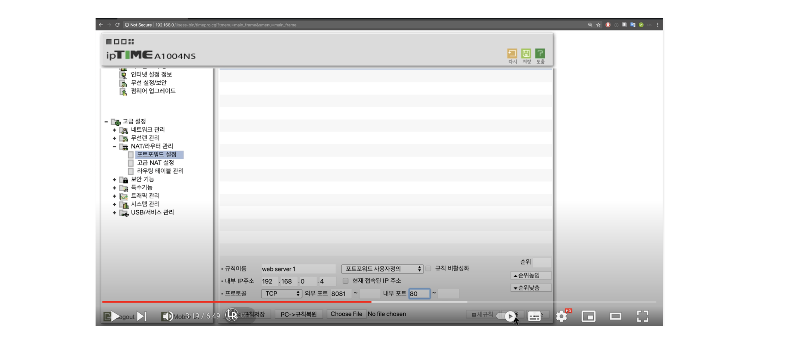

인터넷 위에 있는 컴퓨터 간 통신을 하기 위해서는 IP 주소가 필요하다.

초기 IPv4라는 통신 규칙에서 사용하는 IP 주소는 42억개의 주소를 표현할 수 있다(`0.0.0.0 ~ 255.255.255.255`). 하지만 인터넷에 연결되는 컴퓨터가 기하급수적으로 늘어나며 문제가 된다.

IPv6 체계에서는 새로운 주소 체계를 사용해서 엄청난 수의 주소를 표현할 수 있지만, 주소를 바꾸는 건 쉽지 않은 일이기에 IPv4를 아껴 쓰기 위한 대책으로 사용한 것 중 하나가 공유기다. 공유기를 사용하면 하나의 IP 주소에 여러 대의 컴퓨터가 나눠 쓸 수 있다.

## 공유기 (router)

집마다 있는 공유기를 router 라고 한다.

IP(Internet Protocol) address.

- 인터넷을 사용하려면(다른 컴퓨터와 통신하려면) 컴퓨터가 IP 주소를 가지고 있어야 한다. 서로 정보를 주고 받아야 하기 때문이다. 
  통신사랑 계약을 해서 회선을 받고 그 케이블을 컴퓨터에 꽂거나 와이파이를 연결하는 순간 IP가 부여된다. 컴퓨터 1대만 있으면 상관없지만, 휴대폰 등 여러 개가 모두 인터넷이 필요하다면? 통신사와는 하나의 계약만 하고, 공유기를 설치하게 된다. 

공유기 뒷편에 WAN, LAN이 있는데 
통신사에게 받은 케이블을 공유기 WAN에 꽂고, 
그리고 각각의 device들은 LAN에 각각 연결한다. 
무선 기기는 공유기의 안테나를 통해서 연결한다. 

공유기를 중심으로 여러 기기가 연결되는데, 이걸 지역 네트워크라고 한다. 
LAN은 Local Area Network의 약자다. 
동시에 이 공유기는 인터넷이라고 하는 광역 네트워크에 소속되어 있다. 
이 광역 네트워크를 WAN, Wide Area Network라고 한다. 

공유기(router)는 이렇듯 WAN와 LAN 사이에 있는 중개자와 역할을 한다.

각각의 기기들은 무/유선으로 공유기와 연결되는 순간, 
각각의 컴퓨터들은 IP를 부여 받는다. (당연히 공유기도 네트워크이므로 공유기도 별도로 IP를 부여 받는다.) 공유기에 부여된 IP는 이름이 있다. Gateway address, Router address 등.

이 라우터 기기는 WAN이라는 광역 네트워크 안에 접속하게 해줄 수 있는 IP를 별도로 가지고 있는데 이 IP는 누구나 접속 가능하다는 의미에서 public IP address, 공용 IP라고 부른다. 
그리고 이 지역 네트워크 안에 있는 개별 기기들에게 부여된 IP는 회사의 내선번호와 같은 거다. 이 IP를 private IP address, 사설 IP라고 부른다.

IPv4 시대의 IP는 42억개의 주소가 있다고 했는데, 
그중에서 특정 구간을 사설 IP로 쓰겠다고 약속을 해놓은 것이다. 개수가 한정되어 있기 때문에 IP만 봐도 public인지 private인지 파악할 수 있다.

- 10.0.0.0 ~ 10.255.255.255 : 16,777,216개
- 172.16.0.0 ~ 172.31.255.255 : 1,048,576개
- 192.168.0.0 ~ 192.168.255.255 : 65,536개

작은 네트워크를 구축한다면 192.168로 시작하는 걸 쓰면 되고 
큰 네트워크를 구축한다면 10.0.0.0~ 를 쓰면 되는 것이다.

## NAT (Network address translation)

NAT라는 기술 덕분에 사설IP를 쓰고 있는 각각의 컴퓨터들이 외부 인터넷에 접속할 수 있게 된다.

예를 들어 우리가 사설IP를 가지고 있는 상태에서 위키피디아 사이트에 접속한다면?

먼저 우리의 컴퓨터는 Gateway address에 해당하는 공유기의 IP에 신호를 보낸다. 그럼 공유기가 그 신호를 받아서 이 요청이 내부 네트워크 안에서의 요청인지 아닌지 판단한다. 위키피디아는 내부 네트워크에 대한 요청이 아니므로 공유기는 이 요청을 WAN으로 넘겨서, WAN을 통해 외부로 보낸다.

근데 외부로 보내기 전에 2가지를 한다.

- 먼저, 이 요청(위키피디아로 보내는 요청) 내 사설 IP의 요청이다라는 걸 이 공유기 안에다가 기록해놓는다. 그래야 나중에 연결할 수 있기 때문에.
- 내 컴퓨터의 사설 IP는 외부에서 접근할 수 없는 주소이므로, 공유기에 NAT라는 기술이 요청한 데이터를 변경한다. 어떻게? 공유기에 달려 있는 공용 IP로 변경한 다음에 이 변경된 데이터(IP주소)를 위키피디아에 쏴주는 것이다. 그럼 위키피디아가 요청을 받아서 작업을 처리하고 응답을 보내준다. 공용 IP로 응답을 보내는 것이다.

그럼 공유기는 이 응답 받은 정보를 보고 그 정보가 사설 IP가 요청했었던 정보라는 걸 파악한 다음에(기록해놨으니까) 응답해준다.

이 과정을 통해서 사설 IP를 쓰고 있는 개별 컴퓨터가 외부에 접속할 수 있게 되고 이때 사용하는 게 NAT인 것이다.

이 과정은 내 컴퓨터를 클라이언트로 사용했을 경우, NAT가 어떻게 동작할 지를 본 것이다.

그럼 내 컴퓨터를 home server로 활용하기 위해서는 어떻게 처리를 해야 외부에 있는(같은 네트워크에 있지 않은) 사용자가 접속 가능하게 할 수 있는가?

## 내 컴퓨터의 IP 주소 알아내기 (MacOS 버전)

시스템 설정에서 네트워크 탭을 들어가 보면, 
초록색으로 되어 있는 게 현재 연결되어 있는 연결 네트워크 방법이다.

선택하고 고급 옵션을 들어가 보면(또는 특정 와이파이의 세부사항), TCP/IP 탭이 있다. 이중에서 IPv4 address가 바로 내 컴퓨터의 IP주소다. 그리고 라우터라고 되어 있는 부분이 공유기의 IP주소다.

그래서 이 공유기 IP주소를 주소창에 입력해보면 공유기로 접속할 수 있다. 여기서 로그인하고 관리자 설정을 들어가보면 라우터의 동작 방법 같은 걸 셋팅할 수 있게 된다.

그리고 WAN 상에서 IP주소가 어떻게 되는지(우리 네트워크가 결과적으로 어떤 public IP address를 가지고 있는지) 확인하려면?

공유기 관리자 설정에서 외부 IP주소라고 되어 있다.

단순히 구글에 my ip라고 검색해보면

[What Is My IP Address](https://whatismyipaddress.com/)

쉽게 알려준다. 내부 네트워크 기기들로 각각 접속해보면 똑같이 나올 것이다. 모두 똑같은 public IP address를 사용하고 있기 때문이다.

## 포트 (port)

지금부터는 내 컴퓨터를 서버로 사용하고 싶은 경우 어떻게 해야 할지 알아볼 것이다.

지금 상태로는 불가능하다. 라우터의 공용 IP로 접속해봤자, 그 안에서 어떤 개별 기기에 접속하려는 건지 구분할 수 없기 때문이다.

사용자가 접속했을 때, 여러 기기 중 누가 서버로 응답하게 할 것인지 라우터(공유기)가 연결해줄 수 있게 만들어야 한다.

이를 위해서는 port forwading이라는 기술을 사용해야 한다. 그 전에 port라는 게 뭔지 알아야 한다.

우리 컴퓨터에는 port라는 개념이 있다. 
하나의 컴퓨터에는 웹 서버가 여러 개 설치될 수 있다. 심지어 웹이 아닌 서버도 다양하게 설치될 수 있다.

이 수많은 서버 중 어떤 서버와 상호작용할 지 컴퓨터에게 알려줘야 한다. 그때 사용하는 게 port 번호다.

port 번호는 0 ~ 65535 까지 있다. 
이중에서 80번은 http. 웹페이지를 주고 받을 때 사용하는 통신규약. 웹은 이 http를 이용하고 있는 통신 시스템이다. 80번은 웹이 사용하도록 정해져 있다.

0 ~ 1023번 까지의 port는 Well-known port라고 한다. 예약된 port들이라서 막혀 있다.

우리 컴퓨터에 웹서버를 깔면 기본적으로 80번 port에 연결되도록 약속되어 있다. 연결된다는 걸 정확히는 listening이라는 단어로 표현한다. 서버는 듣고 있다가 요청이 들어오는 응답하는 기계이므로.

경우에 따라 서버를 하나 더 깔려고 하면, 80번 port는 못 쓴다. 다른 port를 써야 한다. 관습적으로 80번과 닮아서 8000, 8080번을 많이 쓴다. 사실 well-known port 외에 다른 포트 안에 비어 있는 곳에 listening 하게만 하면 된다.

어쨌든 웹서버가 깔려 있는 상태에서 
누구와 상호작용할 것인지 정하냐면, URL을 사용한다.

http로 url이 시작되면 80번 port에 연결해준다.(80은 생략된다) 
만약 이 웹서버가 아니라 8080에 있는 웹서버에 연결하고 싶으면, 주소 뒤에 /8080을 붙여주면 된다.

구글에 url format이라고 검색해보면 : URL

- URI = scheme ":" ["//" authority] path ["?" query] ["#" fragment]
- authority = [userinfo "@"] host [":" port]

맨 앞에는 통신규약이 들어온다. http, ftp 등. 
host가 주소다. 도메인 이름 등. 
이 뒤에 port가 위치한다. 

port에 따라 여러 서버에 연결해주는 것이다.

## 포트 포워딩 (port forwading)

서버를 만들고 사람들한테는 내 컴퓨터의 사설 IP를 알려주는 게 아니라 라우터의 공유 IP를 알려주면, 사용자가 내 사설 IP로 접속할 수 있게 해주면 된다.

이때 port라는 걸 사용하면 된다.

예를 들어, 라우터의 공유 IP가 59.6.66.238이고 
내 컴퓨터의 사설 IP가 192.168.0.4일 때,

사용자가 만약 59.6.66.238:8081로 접속하면 
192.168.0.4:80으로 접속할 수 있게 바꿔주는 것이다. 누가 바꿔주냐면, 공유기(라우터)가 바꿔준다.

이렇게 라우터가 바꿔주는 역할을 하려면 라우터 설정을 바꿔주면 된다.

UI는 다를 수 있지만 잘 찾아보면, 주소창에 본인 public IP address를 입력해서 들어간 페이지에서 포트포워드 설정하는 탭이 있다.

예를 들어 위 예시처럼 외부 포트를 8081로 하고 내부 포트를 80으로 해서 사용자 규칙을 등록하면 된다.

만약 59.6.66.238:8081 으로 접속하는 걸 59.6.66.238만 입력해도 8081로 접속하게 하고 싶다면, 
기본값이 80이니까 외부 포트를 8081로 하는 게 아니라 80으로 바꿔주면 된다.

## 유동 IP와 고정 IP (Dynamic & Static IP address)

부족한 IP를 효율적으로 사용하기 위해 도입한 방법 중 또 다른 하나가 유동 IP다.

집에서 인터넷을 쓰려면 통신사(ISP, Internet Service Provider)와 계약을 맺어야 한다. 케이블을 받아서 꽂으면 IP 주소를 갖게 된다.

그럼 내 컴퓨터에 웹 서버를 깔고 누군가에게 이 IP 주소를 알려준다. 그럼 그걸 받은 그 누군가가 웹 브라우저와 같은 클라이언트에 이 IP 주소를 입력하면, 이 IP에 해당하는 컴퓨터를 찾아간다. 그럼 내 컴퓨터에 요청이 온 거니까 이에 맞게 응답을 하면 된다.

문제는, 집마다 IP를 하나씩 주다 보면, IP 주소가 부족하다. 그래서 유동 IP를 준다. 우리집 IP가 조금씩 변하는 것이다. 돌려 막는 것이다.

예를 들어 오랜 기간 IP를 안 쓰면 ISP가 우리 IP 주소를 회수한다. 그리고 새로운 가입자에게 내 IP 주소를 주는 것이다. 그러다가 한 달 뒤에 공유기를 켜면 그때 ISP가 또 새로운 IP를 부여하는 것이다.

모든 사람들이 동시에 인터넷을 안 쓰니까, 계속 분배하는 것이다. 앞에서 한 것처럼 고정 IP를 주면 사용자는 그 다음에는 접속을 못하게 되는 문제가 발생한다. 이게 동적 IP의 문제이다.

여기서 통신사에 비용을 부담하면 고정된 IP를 준다. 이게 static IP다.

## DHCP (Dynamic Host Configuration Protocol)

원래 컴퓨터를 사서 공유기에 연결하면, 
이 컴퓨터로 인터넷을 쓰려면 IP 주소를 직접 지정해야 한다. 기본적으로 자동으로 IP 주소를 지정하도록 되어 있다. 직접할 수도 있다.

그럼 일단 겹치면 안 되는데, 엄청 복잡하다. 
이걸 자동으로 해주는 게 있는데 그게 DHCP다.

일반적으로 케이블을 꽂거나 와이파이 연결만 하면, 
그 순간 각자의 기기에 동적 IP주소, DNS, SUBNET, GATEWAY 주소와 같은 정보들이 자동으로 설정된다.

이게 가능하려면 DHCP 서버라는 게 필요하다. 
그리고 보통 우리들의 공유기는 이 DHCP 서버를 내장하고 있다. 
동시에 인터넷 사용하는 기기들에는 DHCP 클라이언트라는 프로그램이 자동으로 깔려 있다.

우리가 사용하는 통신부품들은 부품마다 공장에서 기록된 고유한 식별자를 가지고 있다. 컴퓨터든 공유기든.

이런 식별자를 MAC address(media access control address)라고 하거나 또는 물리주소라고도 한다.

케이블을 꽂거나 무선으로 연결을 하는 순간, 
우리의 DHCP 클라이언트가 자신이 MAC 주소를 알려주면서 DHCP 서버가 이 네트워크 안에 있는지 찾는다. IP 주소를 달라고 요청을 보내는 것이다.

그럼 DHCP 서버가 이 정보를 받고 자신의 MAC주소를 알려주면서 사용 가능한 IP를 알려주면서 응답을 보낸다. (DHCP 서버는 누가 어떤 IP를 가져갔는지 안에서 기억하고 있다)

그럼 DHCP 클라이언트가 보내준 그 IP를 쓰겠다고 응답을 보낸다. 그럼 DHCP 서버가 해당 통신장비가 해당 IP를 가져갔다고 기록해놓는다. 그리고 몇시간 동안 임대 가능하다는 ok 응답을 보낸다.

그럼 이제 DHCP 클라이언트가 동적 IP주소, DNS, SUBNET, GATEWAY 주소와 같은 정보들을 설정하는 것이다.

이런 메커니즘으로 각각의 기기가 케이블을 꽂거나 무선을 연결하자마자 IP를 받는 것이다.

본인 공유기에 접속을 해서(public IP 주소를 주소창에 입력해서) 내부 네트워크 설정 탭을 보면, 여기가 DHCP 서버를 제어하는 곳이다.

- DHCP 서버 동작 여부를 설정하거나
- 동적 IP 주소 범위를 지정하거나
- IP 대여 시간을 지정하거나 (무한정 주지 않는다. 내부 네트워크 안에 기기가 많으면 시간을 짧게 해서 빨리빨리 돌려 막을 수 있게 하면 된다)
- 사용 중인 IP 주소 정보도 지정하거나

이런 원리로 우리 공유기(라우터)에 들어온 public IP 주소도 통신사에서 주는 유동 IP다. 즉, 외부에서도 이 라우터에게 IP 주소를 제공하는 DHCP 서버가 존재한다라는 걸 암시하는 것이다.

## 추가 공부할 만한 것들

1. NAS(Network Attached Storage)
   네트워크를 통해 사용하는 저장 장치라고 할 수 있다.
   dropbox, goggle drive 같은 서비스들을 직접 운영할 수도 있다. 집에서 웹 서버를 운영하는 것과 같지만, 데이터 저장/백업 과 같은 걸 쉽게 해주는 기능들이 포함되어 있다.

2. Domain name
   사용자가 IP주소가 아니라 도메인을 통해 접속하게 한다면, 도메인은 고정하고 IP를 변경함으로써 보다 유연하게 서버를 운영할 수 있다.

3. HTTPS
   HTTP는 중간에 누가 몰래 들을 수 있다. 그래서 도입된 통신방법이 HTTPS다. S가 Secure의 약자다. https를 사용하면 서버와 클라이언트가 안전하게 정보를 주고 받을 수 있다.

## 참고자료

- [생활코딩 WEB2 - Home Server](https://opentutorials.org/course/3265)
