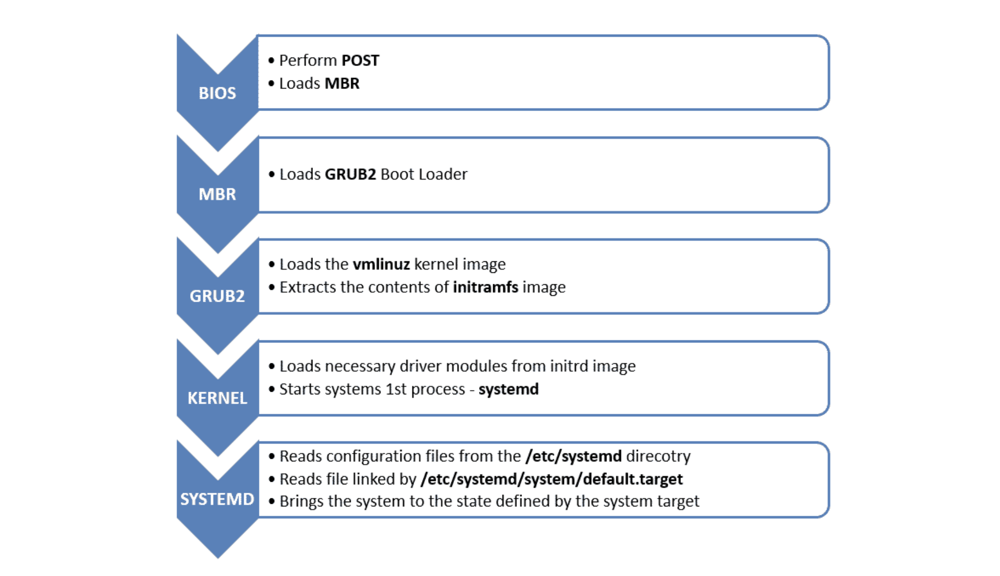
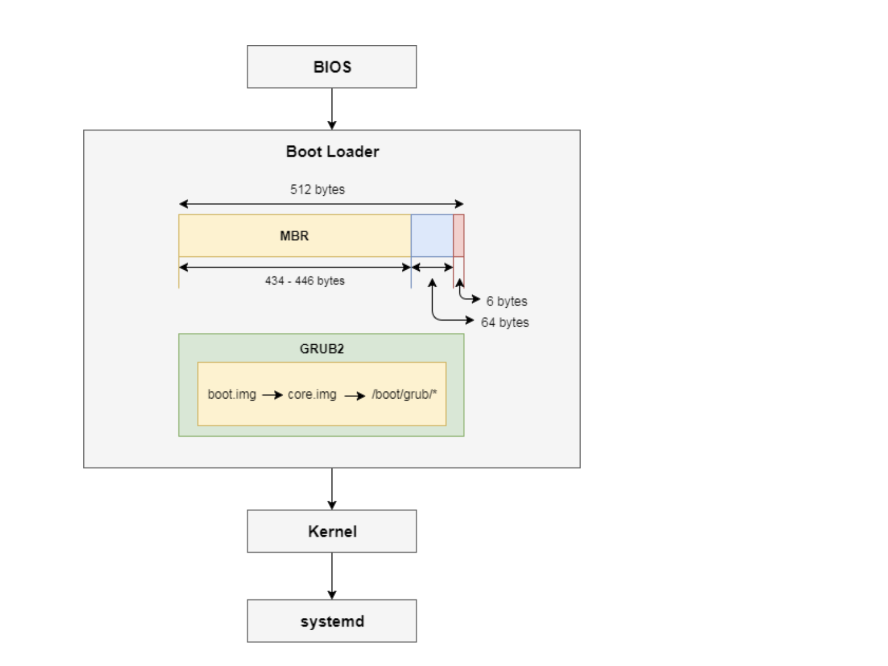
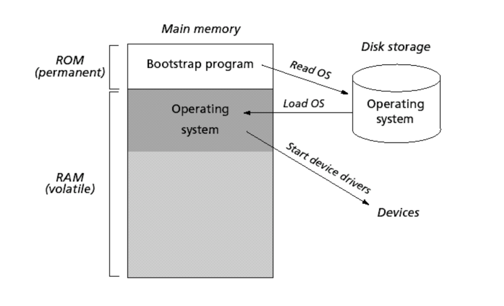

컴퓨터가 켜지면,

1. CPU가 ROM에 저장되어 있는 BIOS를 실행한다(CPU가 ROM의 특정 주소에 있는 BIOS 코드를 메모리에 로드해서 실행).

주기억장치(메모리)는 2가지(ROM과 RAM)로 나뉘는데, ROM은 Read-Only-Memory로서 읽기만 가능한 비휘발성 데이터들(컴퓨터를 꺼도 남아 있는 데이터들)이 여기에 저장된다.

2. 메모리에 로드된 BIOS 프로그램이 실행되는데, BIOS 프로그램은 저장매체에 있는 MBR로 가서 Boot Loader 프로그램의 코드를 메모리에 로드해와서 Boot Loader 프로그램을 실행한다.

BIOS는 미리 POST(Power On Self Test)를 통해 각종 하드웨어 장치를 검사한 후에 MBR로 가서 Boot Loader 코드를 로드해온다.

3. Boot Loader 프로그램이 저장매체에 있는 커널 이미지(바이너리 코드)를 메모리에 로드한다. 그럼 커널이 실행되면서 시스템이 동작하게 된다.

## 참고자료

- [부트로더 부트스트랩, 부팅 과정, 펌웨어, BIOS, POST, MBR 자세히!](https://mamu2830.blogspot.com/2020/04/bios-post-mbr.html)
- [System Boot](https://padakuu.com/system-boot-51-article)
- [Linux boot sequence](https://asirihewage.medium.com/linux-boot-sequence-wikibot-d1aab0aa79d3)
