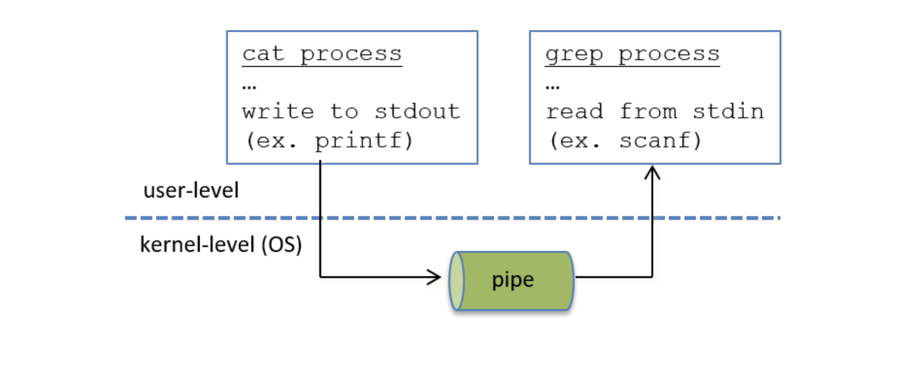
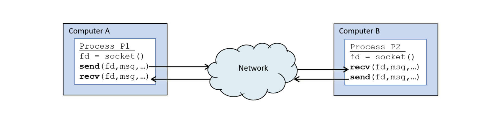
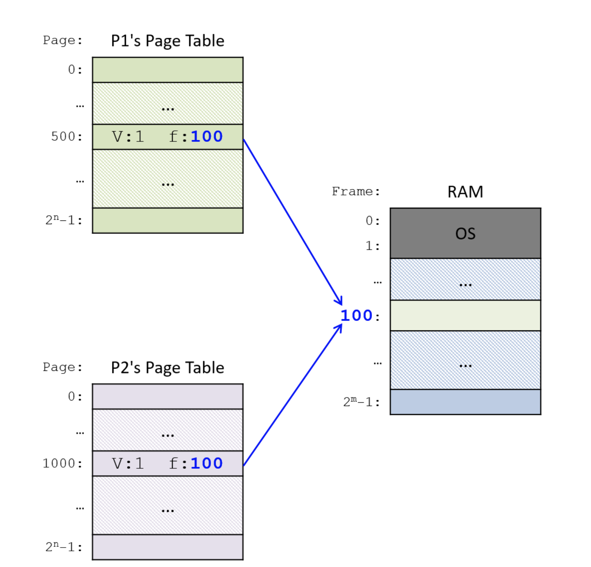
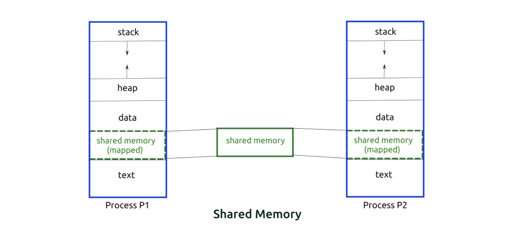

성능이 좋은 프로그램을 만들려면 병행 작업이 동반되어야 한다. 예를 들어 하나의 작업을 한명씩 한명씩 차례대로 수행하는 것보다는 하나의 작업을 여러 명이서 동시에 수행하는 게 더 효율적이다. 이때 여러 명이서 동시에 작업을 수행했다면 작업 결과를 한 데 모아 결과를 도출해야 하므로 통신은 필수적이다. 일부 작업을 완료한 후 작업 상태를 공유하거나, 데이터를 주고 받아야 한다면 통신을 해야 하기 때문이다.

컴퓨터에서도 프로세스를 여러 개 띄워서 작업하거나, 스레드를 여러 개 띄워서 작업할 수 있다. 이때, 스레드의 경우 각 스레드가 코드 레벨에서 서로의 변수 등에 접근할 수 있지만, 이와 달리 프로세스는 서로가 개별적으로 분리된 공간 개념이다. 이때 그렇다면 프로세스 간 통신(응답과 요청)을 어떻게 해야 할까?에 대한 이야기가 바로 `IPC(Interprocess Communication)`이다.

## Interprocess Communication

IPC는 컴퓨터 시스템의 여러 프로세스가 정보를 공유할 수 있도록 하는 방법이다. IPC를 사용하면 서로 다른 프로세스를 병렬로 실행하고 데이터를 공유하며 작업을 동기화하고 서로 통신할 수 있다.

### 1. Signals

한 프로세스가 다른 프로세스에 신호를 보내(notify it of some event) 이벤트를 알릴 수 있는 굉장히 제한된 형태의 프로세스 간 통신이다. 운영체제가 프로세스에게 신호를 줄 수도 있고, 혹은 함수를 통해 특정 프로세스가 다른 프로세스에게 신호를 줄 수도 있다.

Signals는 하드웨어의 인터럽트(interrupts) 또는 트랩(traps)와는 다르다. 트랩은 프로세스가 명시적으로 시스템 호출을 할 때 발생하는 동기적인 소프트웨어 인터럽트인 반면, Signals은 비동기적이다. 즉, 프로세스가 어느 시점이든 신호를 수신해서 인터럽트될 수 있다. 또한 Signals은 하드웨어 장치가 아닌 소프트웨어에 의해 트리거된다는 점에서도 다르다.

### 2. message passing

운영체제는 프로세스 간 메시지를 교환하는 데 사용하는 메시지 통신 채널을 구현하고 있다.

Signals은 미리 정의된 작은 메시지 집합인 반면, message passing은 임의의 데이터를 교환하는 방식이다.

운영체제에서 메시지 통신 채널을 할당하면, 프로세스는 메시지 채널을 사용해 서로에게 메시지를 주고 받고, 사용이 끝나면 프로세스가 메시지 채널을 닫는 식으로 동작한다. 메시지 채널의 유형으로는, "pipes for one-way communication"과 "sockets for two-way communication"이 있다.

위 그림에선 
`$ cat foo.c | grep factorial` cat 프로세스와 grep 프로세스가 파이프(pipes) 채널을 통해 통신을 하는 걸 보여준다.

소켓(sockets)은 파이프와 달리 양방향 채널이며 원래 컴퓨터 간 통신할 때 사용하는 함수이다. 이 소켓을 동일한 컴퓨터에서 실행되거나 네트워크로 연결된 다른 컴퓨터에서 실행되는 프로세스 간 통신에 사용할 수 있다.

각 개별 컴퓨터는 자체 시스템(하드웨어와 운영체제)이므로 다른 시스템의 리소스를 알지 못하거나 관리하지 않으므로 이와 같은 message passing 방식은 서로 다른 컴퓨터의 프로세스가 통신할 수 있는 방법이 된다. 이러한 유형의 통신을 지원하려면 운영체제에서 네트워크를 통해 메시지를 주고 받기 위한 공통 메시지 전달 프로토콜을 구현해야 하며, TCP/IP는 인터넷을 통해 메시지를 보내는데 사용할 수 있는 messaging protocol의 한 예시인 것이다.

### 3. shared memory

프로세스가 가상 주소 공간의 전체 혹은 일부를 다른 프로세스와 공유할 수 있다. 공유 메모리가 있는 프로세스는 서로 통신하기 위해 공유 공간의 주소를 읽고 쓸 수 있다.

위에서 소켓을 통해 동일한 시스템에서 실행되는 프로세스 간 혹은 다른 시스템에서 실행 중인 프로세스 간 양방향 통신을 할 수 있었지만, 두 프로세스가 동일한 시스템에서 실행된다면 공유 시스템 리소스를 활용하면 message passing보다 더 효율적일 수 있다.

예를 들어, 운영체제는 프로세스가 가상 주소 공간의 전체 혹은 일부를 공유할 수 있게 프로세스 간 통신을 지원할 수 있다.

운영체제는 위 그림처럼, 공유 프로세스의 페이지 테이블 항목을 동일한 물리적 프레임 번호로 설정해서 가상 주소 공간의 페이지 공유를 지원할 수 있다.

예를 들어, 리눅스는 프로세스를 생성하면 0~4GB 메모리 주소를 갖는다. 이중에서 3~4GB는 커널 영역을 사용하는데, 각각의 주소를 진입하면 커널 공간에 접근하게끔 하는 것이다. 프로세스 별로 분리되어 보이지만, 실질적으로 커널 공간을 각 프로세스가 접근 가능한 공간인 것이다.

프로세스는 항상 부모 프로세스를 갖는다. 운영체제가 boot하면 init을 통해 최초의 프로세스를 생성하고, 그 이후로는 이 프로세스를 fork()를 통해 복사하는 방식으로 프로세스를 생성한다.

이때 생성한 프로세스는 부모 프로세스와 동일하므로, 3-4GB 주소의 페이지 테이블은 업데이트하지 않는다. 그러면 자연스럽게 3-4GB는 페이지 테이블을 통해 같은 주소 공간을 가리키게 되고, 결과적으로 프로세스들이 커널 공간을 공유하는 셈이 된다. 이 공간에서 별도 공간을 만들면 IPC 통신도 가능한 것이다.

정리하자면,

프로그래머가 코드를 작성하면 그 코드는 컴파일 과정을 거쳐서 실행 파일(binary code)로 변환된다. 이 파일을 실행하면 프로세스가 생성되고(바이너리 코드는 코드 영역으로, 전역 변수는 데이터(혹은 텍스트) 영역으로 ...), 이 프로세스는 ready queue에 들어가 실행을 기다리게 된다.

특정 스케줄러에 의해 해당 프로세스가 선택되어 실행되면 프로세스가 running queue에 들어가게 되고, CPU가 코드를 한줄한줄 읽어나간다. 평소에는 사용자모드에서 읽다가, 특정 코드(시스템콜을 호출한다든지 ...)에서 커널 모드로 전환되어 작업을 처리한 후 사용자모드로 다시 전환되는 식으로 매우 빈번하게 사용자모드-커널모드를 오고 가며 코드가 읽혀진다.

해당 프로세스가 중간에 저장매체를 사용해야 한다면 block queue로 들어간 뒤, 대기하다가 저장매체에서 데이터를 다시 가져오면 다시 ready queue로 들어가 코드가 계속 읽혀진다. 이 과정들 모두가 프로세스 스케줄링 과정.

또는 스케줄러에 의해 프로세스가 바뀌면 현재 실행하던 프로세스의 PC, SP 등 정보를 해당 프로세스의 PCB에 저장한 뒤 변경할 프로세스의 PCB에서 정보를 가져와 수행한다. 이 과정을 컨텍스트 스위칭 과정이라고 한다.

만약 프로세스를 여러 개 만들어서 병렬적으로 수행한다면, 프로세스 간 통신이 필요할테고 이때 IPC 기법을 사용해 통신한다.

## 참고자료

- [Interprocess communication in Operating System](https://www.shiksha.com/online-courses/articles/interprocess-communication-in-operating-system/)
- [13.4. Interprocess Communication](https://diveintosystems.org/book/C13-OS/ipc.html)
- [System V Shared Memory in Linux](https://www.softprayog.in/programming/interprocess-communication-using-system-v-shared-memory-in-linux)
