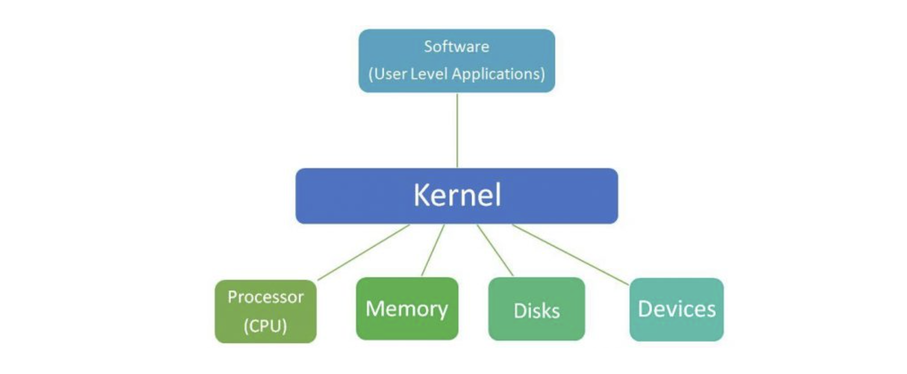
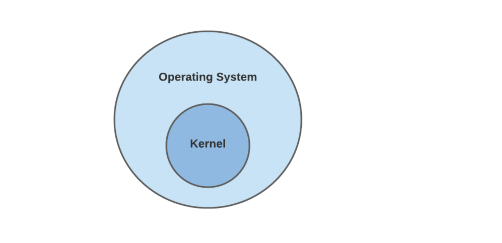
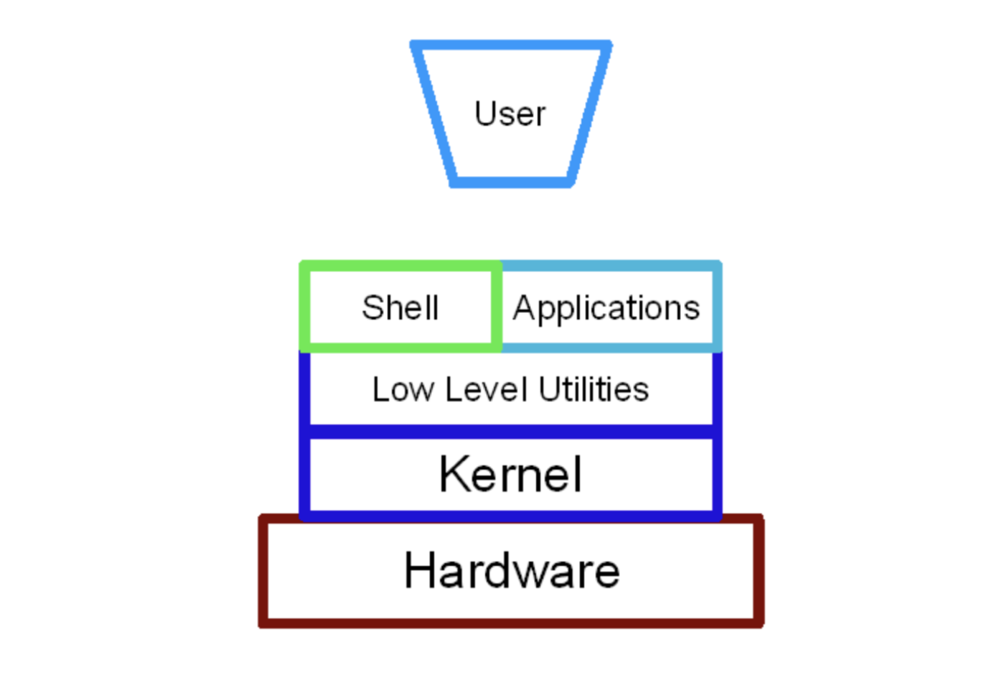

## 커널 kernel

커널은 컴퓨터와 하드웨어의 작동을 관리하는 운영체제의 핵심 구성 요소이다. 커널은 프로세스 간 통신과 시스템콜(system calls)을 통해, 응용 프로그램과 하드웨어 수준에서의 데이터 처리 간 중간다리 역할을 한다.

커널은 운영체제가 로드될 때 먼저 메모리에 올려지고 운영체제가 다시 종료될 때까지 메모리에 남아 있게 된다. disk, task, memory 등 의 관리를 담당한다.

커널은 기본적으로 사용자 수준의 응용 프로그램과 하드웨어 간 인터페이스 역할을 하며, 커널의 주요 목표는 이들 사이의 통신을 관리하는 것이다.

일반적으로 커널에 여러가지 프로그램들을 포함해서 운영체제(OS)라고 칭한다.

## 쉘 shell

커널 위에서 동작하는 프로그램 중 대표적인 게 쉘 프로그램이다. 운영체제의 대표적인 역할 중 하나가 사용자가 컴퓨터를 쓸 수 있게끔 하는 것인데, 이와 관련한 인터페이스를 제공해주는 프로그램이 바로 쉘이다. 즉, 쉘은 기본적으로 커널과 사용자 사이에 존재하는 인터페이스이다.

쉘 타입은 크게 2가지로 구분된다. 터미널 환경(Command Line Interface)와 GUI 환경(Graphical User Interface). 어쨌든 쉘도 응용 프로그램 중 하나이므로 아래와 같은 구조를 가진다.

## 쉘과 커널 비교

1. 쉘은 기본적으로 커널과 사용자 사이에 존재하는 인터페이스이고, 커널은 일반적인 OS의 핵심이다.
2. 쉘을 사용하면 모든 사용자가 커널과 통신할 수 있다. 커널은 시스템과 함께 제공되는 모든 작업을 제어한다.
3. mkdir, ls 등 쉘 명령을 사용해 운영체제에 특정 작업을 요청할 수 있다. 반면 커널은 다양한 파일 그룹에서 명령을 수행한다.
4. 쉘은 메모리 관리를 수행하고, 커널은 프로세스 관리를 수행한다.
5. 쉘은 운영체제의 외부 계층을 형성하고, 커널은 운영체제의 내부 계층을 형성한다.
6. 쉘은 사용자와 상호작용한 다음, 기계어로 해석한다. 커널은 쉘에서 기계어롤 받아서 하드웨어와 직접 상호작용한다.

## 참고자료

- [Kernel in Operating System](https://www.geeksforgeeks.org/kernel-in-operating-system/)
- [What is an OS Kernel?](https://www.baeldung.com/cs/os-kernel)
- [Difference Between Kernel and Shell](https://byjus.com/gate/difference-between-shell-and-kernel/)
- [Difference between application and shell](https://stackoverflow.com/questions/12088998/difference-between-application-and-shell)
