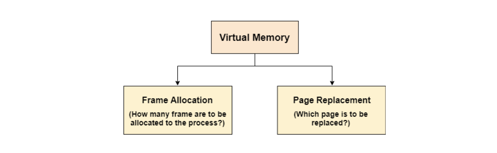
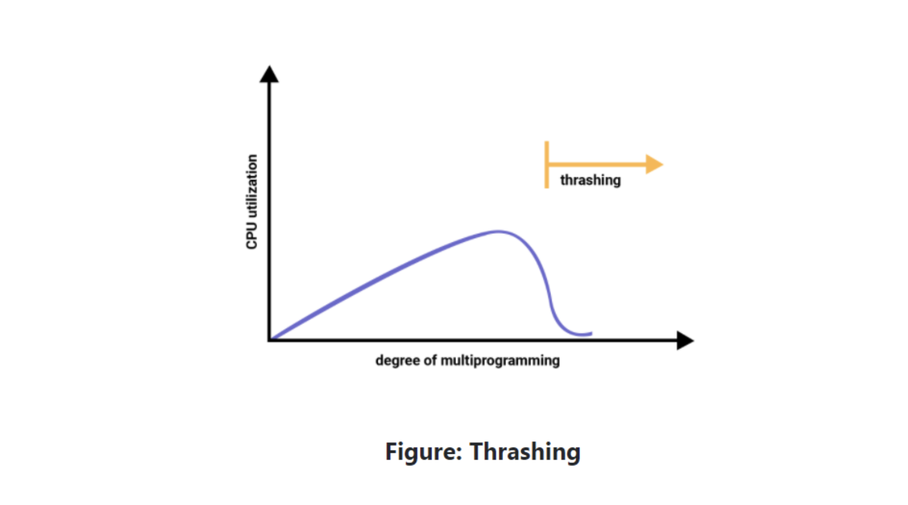

MMU가 페이지 테이블을 확인했을 때, invalid라면 page fault trap이 발생한다. 운영체제는 backing store에 가서 페이지가 있는지 확인한 후, 페이지가 backing store에 있다면 비어 있는 frame에 페이지를 올린다.

이때 비어 있는 프레임이 없다면? 메모리는 한정된 자원이므로 기존 페이지들을 삭제해야 한다. 이때 향후에도 쓸 페이지를 삭제해버리면 또 페이지 폴트 trap이 발생하므로(또 backing store에 다녀와야 하므로 성능에 좋을 리가 없다) "잘" 삭제해야 한다.

나중에도 사용하지 않을 법한 페이지를 삭제하려면 어떤 페이지들을 삭제하고 올려야 하는지에 대한 게 바로 페이지 교체 정책(page replacement(swapping) policy)이다.

페이지 폴트 수를 줄이는 게 페이지 교체 알고리즘의 목표이다.

### 가상 메모리에서 중요한 2가지 : 프레임 할당과 페이지 교체

최적의 프레임 할당과 최적의 페이지 교체 알고리즘을 갖는 건 매우 중요하다. 프레임 할당이 프로세스에 얼마나 많은 프레임을 할당해야 하는지에 관한 것이라면 페이지 교체는 요청된 페이지를 위한 공간을 만들기 위해 교체해야 하는 페이지 번호를 결정하는 걸 말한다.



### thrashing

페이지 폴트가 과도하게 발생해서 오히려 CPU 사용률이 떨어지는 걸 말한다.

1. 프로세스에 할당된 프레임 수가 충분하지 않거나 정확하지 않은 경우 스레싱 문제가 발생할 수 있다. 페이지 폴트가 너무 많이 발생하기 때문이다. 물론 그렇다고 해서 프레임을 또 너무 많이 할당하면 internal fragmentation가 발생할 수도 있다.

2. 페이지 교체 알고리즘이 최적이 아닌 경우에도 스레싱 문제가 발생한다. 마찬가지로 페이지 폴트가 많이 발생하므로 성능에 좋지 않다.



### FIFO

FIFO 페이지 교체 알고리즘 (First In First Out Page Replacement Algorithm)

가장 먼저 들어간 페이지를 먼저 삭제하는 알고리즘.

### OPT

최적 페이지 교체 알고리즘(OPTimal Page Replacement Algorithm)

미래를 예측해 앞으로 사용하지 않을 페이지를 내리는 알고리즘. 구현하기가 어려워 현실성은 없지만 다른 페이지 교체 알고리즘에 대한 참고 개념으로 존재한다.

### LRU

LRU 페이지 교체 알고리즘(Least Recently Used Page Replacement Algorithm)

OPT처럼 미래를 예측하는 건 어려우니 과거 기록을 기반으로, 오랫동안 사용하지 않았다면 앞으로도 사용하지 않을 수 있다는 아이디어. (메모리 지역성)

### LFU

LFU 페이지 교체 알고리즘(Least Frequently Used Page Replacement Algorithm)

최소 빈도 사용. 가장 적게 사용한 페이지를 내리는 개념.

### NRU

NUR 페이지 교체 알고리즘(Not Recently Used Page Replacement Algorithm)

각 페이지마다 Referenced bit와 Modified bit를 두고
4가지 경우의 수로 나눠서 최근에 사용하지 않은 페이지를 내리는 개념(LRU와 유사하다).

경우의 수

```bash
0:- Not Referenced, Not Modified (0,0)
1:- Not Referenced, Modified (0,1)
2:- Referenced, Not Modified (1,0)
3:- Referenced, Modified (1,1)
```

## 참고자료

- [Page Replacement Algorithms](https://www.javatpoint.com/os-page-replacement-algorithms)
- [Not Recently Used (NRU) page replacement algorithm](https://www.geeksforgeeks.org/not-recently-used-nru-page-replacement-algorithm/)
- [Techniques to handle Thrashing](https://www.geeksforgeeks.org/techniques-to-handle-thrashing/)
