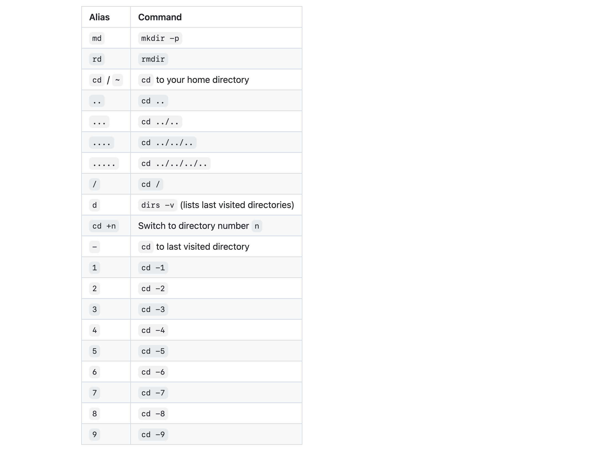

### Mac에서 터미널 여러 개 여는 단축키

`command + T`

### 화면window 분할하기


1. 상하 분할 - `command + shift + d`
2. 좌우 분할 - `command + d`
3. 동시 입력 - `command + option + i`
4. 동시 입력 해제 - `command + shift + option + i`

### 분할 창 이동하기

1. 상하좌우 이동 - `opt + cmd + 방향키`
2. 좌우 이동 - `cmd + [ 또는 ]`

### zsh 단축키

zsh는 다양한 단축키들을 제공해준다.

[Cheatsheet](https://github.com/ohmyzsh/ohmyzsh/wiki/Cheatsheet)



### 단축키 설정하기

`vim ~/.zshrc`을 통해 .zshrc 파일에 아래와 같은 명령어들을 alias로 등록해준다.

```bash
alias gs="git status"
alias gl="git log"
alias gd="git diff"
alias gc="git checkout"
alias gcm="git checkout master"
alias gp="git pull"
alias ys="yarn start"
alias vblog="cd Desktop/source/toy/blog"
alias vd="vuepress dev"

```

그리고 나서, `source ~/.zshrc`로 업데이트해주면 된다.

- vscode를 쓴다면, 그냥 `code ~/.zshrc`로 열어서 수정하는 게 편할 수도 있다.

### fan speed 알고 싶을 때

`sudo powermetrics -i 200 -n1 --samplers smc`

- powermetrics: 이 명령어는 macOS에서 시스템의 전력 사용 및 성능 관련 데이터를 수집하는 명령어. 시스템 성능 모니터링 및 문제 해결에 유용.
- -i 200: 이 부분은 powermetrics 명령어의 옵션 중 하나. -i는 데이터 수집 간격을 설정하는 옵션으로, 여기서는 200 밀리초 (0.2 초)마다 데이터를 수집하도록 설정한다. 이 간격은 데이터 포인트가 수집되는 빈도를 제어한다.

- -n1: 이 부분은 powermetrics 명령어의 다른 옵션으로, 데이터를 1회만 수집하고 실행을 종료하도록 지시한다. 이것은 일회성 측정을 실행하도록 하는 옵션이다.

- --samplers smc: 이 부분은 powermetrics 명령어의 또 다른 옵션으로, 사용할 데이터 샘플러를 선택하는 옵션이다. 여기서 "smc"는 System Management Controller의 데이터를 수집하도록 선택한 것으로, 시스템의 전력 및 성능 데이터 중 일부를 수집한다. SMC 데이터는 전력 관리와 성능 조절과 관련이 있다.


### forked repo를 잔디에 남기려면

forked repo를 잔디에 남기려면,

1. 커밋 복사할 새로운 Repo 생성
2. 로컬에서 가벼운 복제본 생성

- `git clone --bare <복사할 forked repo 링크>`

3. mirror push

- `cd forkedRepository.git`
- `git push --mirror <커밋 복사하기 위해 새로 생성한 Repo 링크>`

### 원격 저장소에 올라간 거 되돌리기

원격저장소에 올라간 커밋 지우는 방법

1. 로컬에서 커밋 되돌린 후 강제 push

```bash
git reset --hard {커밋해시}
git push -f origin {브랜치명}
```

2. git revert 사용해서 커밋에 기록 남기기

```bash
git revert {되돌리고 싶은 커밋해시}
```

위 명령어의 경우 하나 되돌릴 때마다 하나의 revert 메시지이므로 비효율적.<br>
여러 개 되돌릴 때, revert 메시지는 하나이려면,

```bash
git revert --no-commit {되돌리고 싶은 커밋해시}
git revert --no-commit {되돌리고 싶은 커밋해시1}
git revert --no-commit {되돌리고 싶은 커밋해시2}
```

위와 같이 명령어를 사용하면, revert 커밋이 바로 생성되지 않고, working tree와 index(staging area)에만 반영되므로 커밋을 하나만 남길 수 있다.

여러 개를 묶어서 사용하려면 아래와 같이 입력하면 된다.

```bash
git revert --no-commit HEAD~3.. # 또는 main~3..main
```

### 커밋 메시지 수정

1. rebase로 에디터 들어가기

```bash
git rebase HEAD~1 -i
git rebase {수정하려는 특정 커밋해시의 바로 직전 커밋해시} -i
```

이때, `HEAD~1`은 바로 직전 commit, n번 직전이면, `HEAD~n`으로 진행되며,<br>
특정 커밋해시를 수정하고 싶다면 그 특정 커밋 해시 바로 직전 커밋 해시를 입력해주면 된다.

2. pick을 reword로 바꾼 후, `esq => :wq! => enter`

이 과정을 거치고 나서, 커밋 메시지를 수정하는 창이 나온다.

3. 커밋 메시지 수정 후 `esq => :wq! => enter`

4. 강제 Push `git push origin -f <브랜치>`

### 좋은 commit 메시지 작성

1.  제목과 본문을 한 줄 띄워 분리하기
    - `git log --oneline`로 찍어보면 명확하게 알 수 있다.
2.  제목은 영문 기준 50자 이내로
3.  제목 첫글자를 대문자로
4.  제목 끝에 . 금지
5.  제목은 명령조로
    - 예를 들어, 메시지 앞에 (If applied, this commit will)가 있다고 가정하고 문맥을 고려하기
    - (If applied, this commit will) Refactor subsystem X for readability
6.  Github - 제목(이나 본문)에 이슈 번호 붙이기
    - `{동작} #번호 - 내용`
    - 예시 : `Refactor #28 - getPersonID()`
7.  본문은 영문 기준 72자마다 줄 바꾸기
8.  본문은 어떻게보다 무엇을, 왜에 맞춰 작성하기
9.  커밋 메시지로 github 이슈 자동 종료 - `키워드 #번호`

close 계열은 일반 개발 이슈, fix 계열은 버그 픽스나 핫 픽스 이슈, resolve 계열은 문의나 요청 사항에 대응한 이슈에 사용하면 적당

```bash
    close
    closes
    closed
    fix
    fixes
    fixed
    resolve
    resolves
    resolved
```
