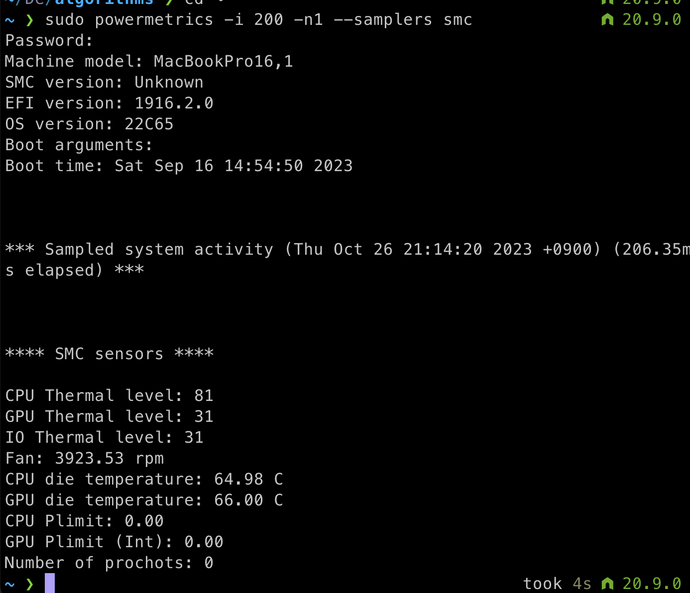

### fan speed 알고 싶을 때

`sudo powermetrics -i 200 -n1 --samplers smc`

- powermetrics: 이 명령어는 macOS에서 시스템의 전력 사용 및 성능 관련 데이터를 수집하는 명령어. 시스템 성능 모니터링 및 문제 해결에 유용.
- -i 200: 이 부분은 powermetrics 명령어의 옵션 중 하나. -i는 데이터 수집 간격을 설정하는 옵션으로, 여기서는 200 밀리초 (0.2 초)마다 데이터를 수집하도록 설정한다. 이 간격은 데이터 포인트가 수집되는 빈도를 제어한다.

- -n1: 이 부분은 powermetrics 명령어의 다른 옵션으로, 데이터를 1회만 수집하고 실행을 종료하도록 지시한다. 이것은 일회성 측정을 실행하도록 하는 옵션이다.

- --samplers smc: 이 부분은 powermetrics 명령어의 또 다른 옵션으로, 사용할 데이터 샘플러를 선택하는 옵션이다. 여기서 "smc"는 System Management Controller의 데이터를 수집하도록 선택한 것으로, 시스템의 전력 및 성능 데이터 중 일부를 수집한다. SMC 데이터는 전력 관리와 성능 조절과 관련이 있다.

## 참고자료

- [Get fan speed from terminal without spindump or third party software](https://apple.stackexchange.com/questions/304949/get-fan-speed-from-terminal-without-spindump-or-third-party-software)
