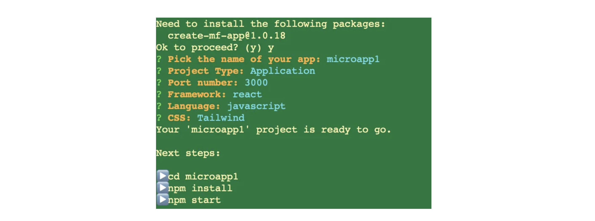
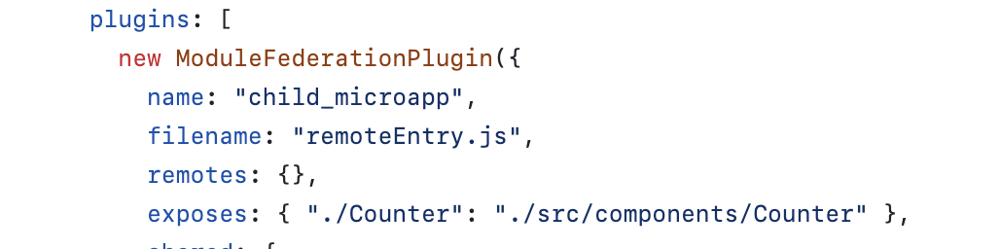

## 튜토리얼 저장소

[Simple Micro Front-End](https://github.com/wooleejaan/yw-frontend/tree/main/microFrontend/simpleMicroFE)

## 설명

마이크로 프론트엔드란, 프론트엔드 어플리케이션을 여러 개의 독립적인 마이크로 fe 어플리케이션으로 쪼개는 디자인/아키텍쳐다.<br>
각각의 독립적인 마이크로 앱들은 느슨하게 동작하며, 각각 고유한 UI 비즈니스 기능/책임을 담당한다.

프론트엔드의 경우, 비즈니스 도메인 영역에 따라 구성되고, 그룹화될 수 있으므로 이러한 마이크로 프론엔드를 사용하면, 도메인 중심의 아키텍쳐를 설계할 수 있게 된다.

- 다양한 언어로 구축한 UI라면 iframe을 사용해 구현하는 게 좋고,
- 단일 언어/프레임워크라면 webpack의 Module Federation가 좋은 대안일 수 있다.

### Step 1: Create your micro frontend apps

microapp에 사용할 2개 이상의 리액트 프로젝트를 생성해준다.<br>
이때 `create-react-app`이 아닌 `create-mf-app`을 사용해서 간단하게 micro fe를 경험해볼 수 있다.

- port는 부모,자식 각각 3000, 3001로 설정한다.

```bash
npx create-mf-app child-microapp
cd child-microapp npm install
cd ..
npx create-mf-app child-microapp
cd child-microapp npm install
```

각각 terminal prompt는 다음과 같이 설정해주면 된다.



### Step 2: Configure Module Federation Plugin

플러그인 설정을 해주면 되는데,

Parent가 child의 컴포넌트를 import해오는 걸 가정하고 코드를 작성할 예정이다.

부모 리액트 플젝에서는 다음과 같이 설정해준다.

- remotes를 설정해서, 어디에서 어떤 걸 가져올지 정하는 개념이다.
- 가져오는 이름의 경우, import해올 child_microapp에서 설정한 name으로 해야 한다.

```js
// parent-microapp/webpack.config.js

plugins: [
  new ModuleFederationPlugin({
    name: "parent_microapp",
    filename: "remoteEntry.js",
    remotes: {
      child_microapp: "child_microapp@http://localhost:3001/remoteEntry.js",
    },
    exposes: {},
    shared: {
      ...deps,
      react: {
        singleton: true,
        requiredVersion: deps.react,
      },
      "react-dom": {
        singleton: true,
        requiredVersion: deps["react-dom"],
      },
    },
  }),
  new HtmlWebPackPlugin({
    template: "./src/index.html",
  }),
];
```

가져올 child-microapp에서 name을 아래와 같이 child_microapp로 설정했기 때문에, 위와 같이 remotes를 작성한 것이다.



가져올 child에서는 위 그림과 같이 exposes에 내보낼 것들의 경로를 작성해준다.

이렇게 webpack 설정파일에서 연결을 했다면,

부모 프로젝트의 App.js에서 아래와 같이 import 해올 수 있다.

```js
// parent-microapp/src/App.jsx

import React from "react";
import ReactDOM from "react-dom";

import { Counter } from "child_microapp/Counter";

import "./index.css";

const App = () => (
  <div className="container">
    <div>Name: parent-microapp</div>
    <div>Framework: react</div>
    <div>Language: JavaScript</div>
    <div>CSS: Empty CSS</div>
    <Counter />
  </div>
);
ReactDOM.render(<App />, document.getElementById("app"));
```

이렇게 보면, parent-microapp 플젝 내부에는 child_microapp의 경로에 아무 것도 존재하지 않는다.<br>
그럼에도 child에서 제작한 컴포넌트를 가져와서 쓸 수 있는 것이다.

## 참고자료

- [Micro Frontend components with React Module federation](https://medium.com/@ian.rolfe/micro-frontend-components-with-react-module-federation-cc2b701058a6)
