[Setting up the development environment](https://reactnative.dev/docs/environment-setup?guide=native)

react native cli로 시작하기

설치 후 안 뜨면 터미널 재시작.

## Windows

window라면, Chocolatey, nvm-windows, Java SE Development Kit(JDK)를 설치해야 한다.
`choco install -y nodejs-lts microsoft-openjdk11`
</br>
android studio도, 맥이라면 Xcode 설치해야 한다.

- Android SDK
- Android SDK Platform
- Android Virtual Device
- If you are not already using Hyper-V: Performance (Intel ® HAXM) (See here for AMD or Hyper-V)

git bash로 경로 설정 및 확인하기</br>
(명령어를 입력한다는 건, 그 which에 실행 파일이 있어야 가능한 것이고, 거기에 실행파일을 넣어주는 작업은 필연적이다.)

## Mac

맥북 있어야 하고, 아이폰도 있으면 좋다.
</br></br>
Android, iOS 전부 설정해줘야 한다.

### homebrew

homebrew가 설치되어 있는지 확인해준다. `which brew`

brew 설치 확인했으면,

### node, watchman

```bash
brew install node
brew install watchman
```

### Java 11

그리고 나서 Java 11버전도 설치해준다. brew로 설치하면서 command line 같은 것들도 같이 설치해주면 좋다.
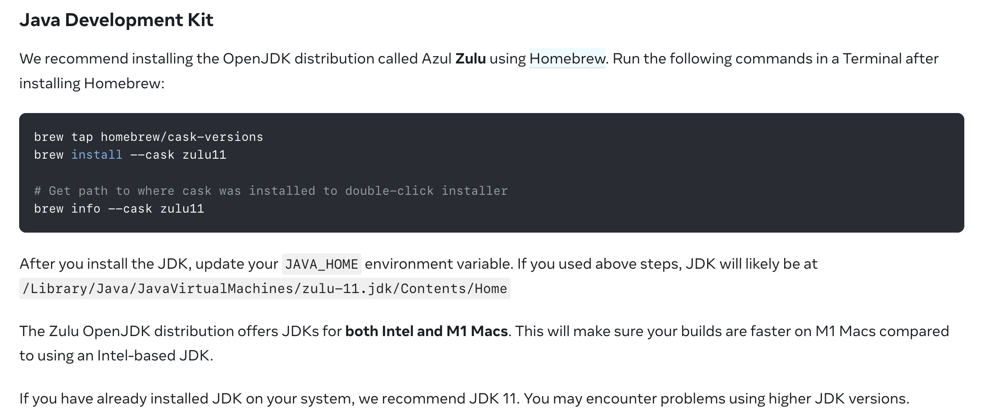

JAVA 환경변수도 [링크](https://stackoverflow.com/questions/22842743/how-to-set-java-home-environment-variable-on-mac-os-x-10-9/59151321#59151321)을 참고해서 설정해준다.
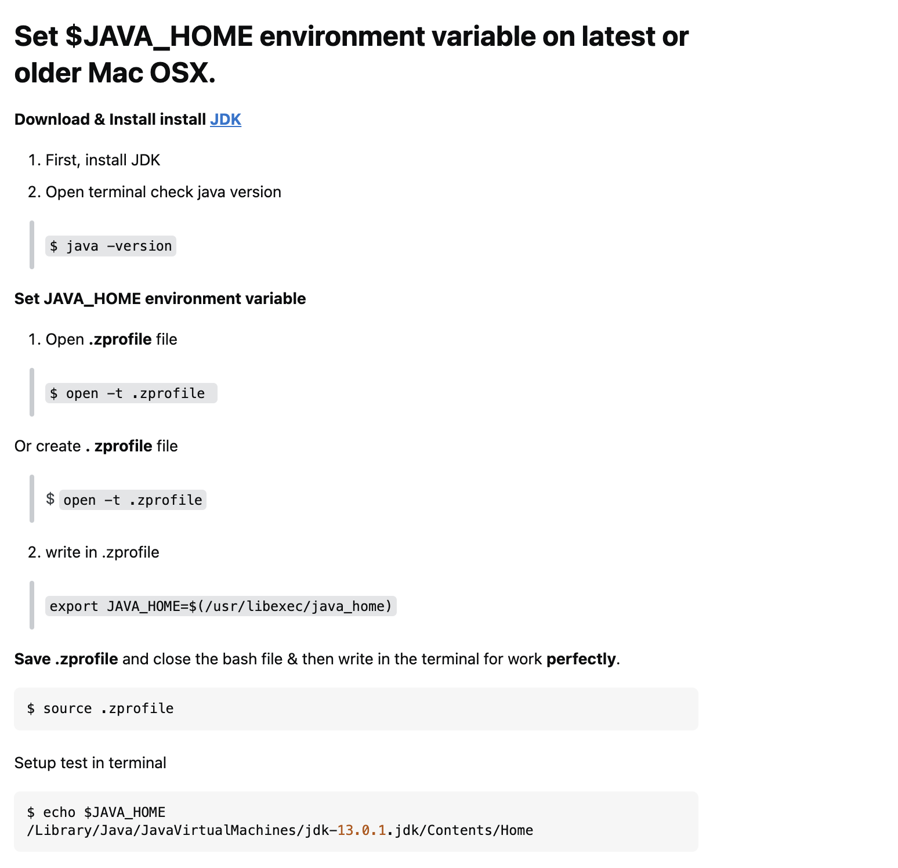

### Xcode

그리고 동시에 앱스토어에서 xcode도 설치해준다.</br>

### ADB

그리고 맥에서도 안드로이드 스튜디오 [설치](https://developer.android.com/studio)해줘야 한다.
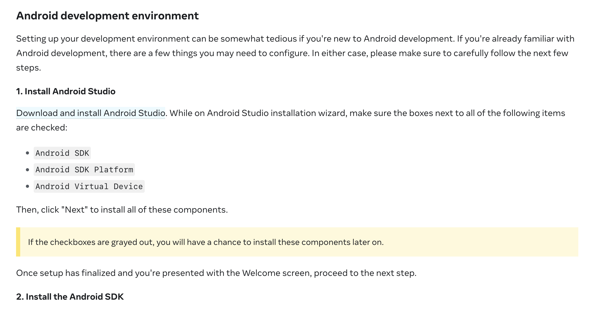

환경 변수 설정해줘야 하고, SDK는 30버전으로 (강의용 플젝 라이브러리 중 30버전에 의존하는 게 있어서)
설치 후 앱 실행해서 Next 눌러가며 설치하는 것임.

- Android SDK
- Android SDK Platform
- Android Virtual Device

아래처럼 settings에서 32버전이 아니라 30버전(R이라고 쓰여있는 것)으로 체크해줘야 돌아간다.
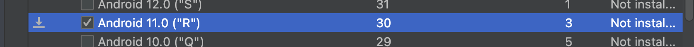
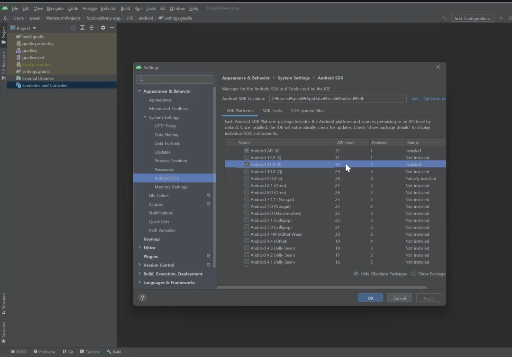
Android SDK Platform Tools도 설치해줘야 한다.

아래와 같이 SDK Tools 탭에서 확인 가능
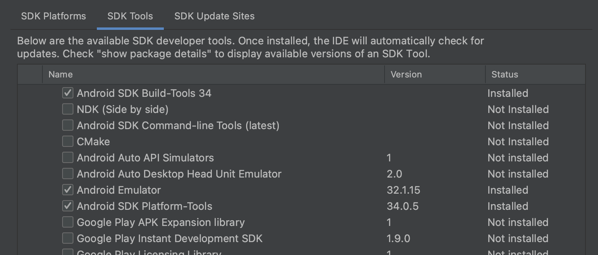
Intel x86~ 도 설치가 되어 있어야 한다. (Emulator만 있으면 되는 것 같기도)
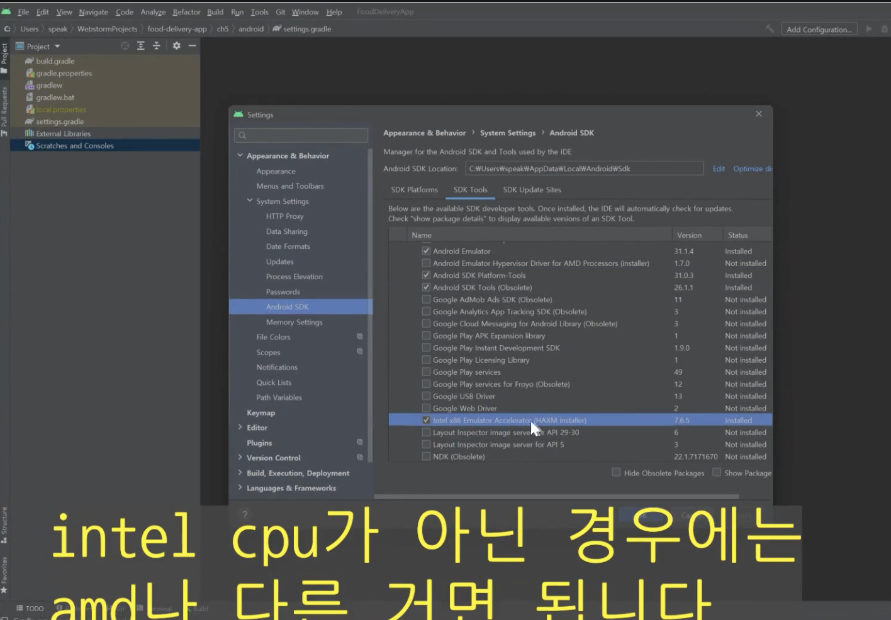

터미널에서 `adb` 혹은 `which adb` 입력해서 뜨면 정상
에디터에도 볼 수 있지만, 확실하게 디렉토리로 보는 게 정확하다.

- Mac의 경우 /Users/이름/Library/Android
  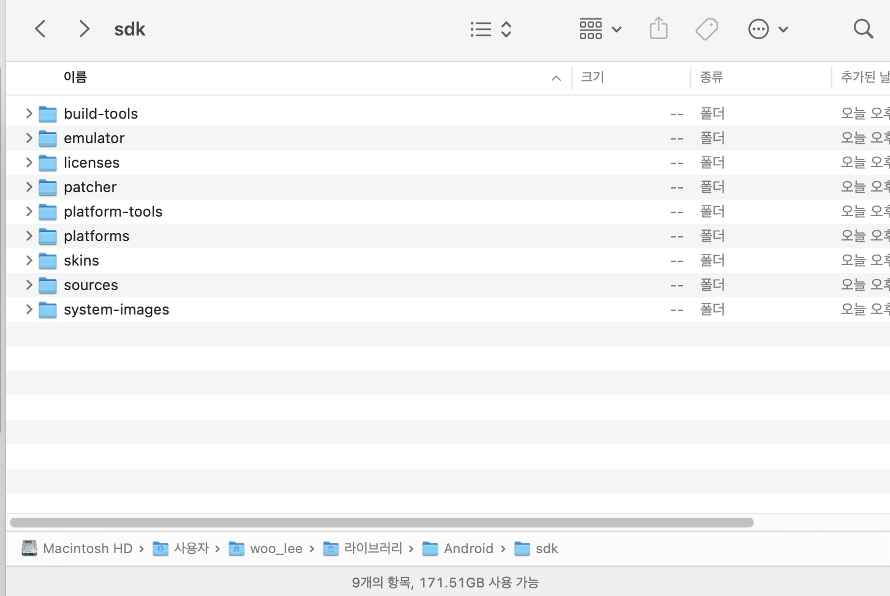
  platform-tools 같은 폴더가 있어야 하고, platform-tools 안에는 adb가 있어야 한다.

중간에 한번 꼬이면 그냥 지웠다가 다시 다운로드하는 게 빠르다.

### adb 환경변수 설정 방법

아래 이미지가 Mac에서 환경변수 설정하는 방법이다.
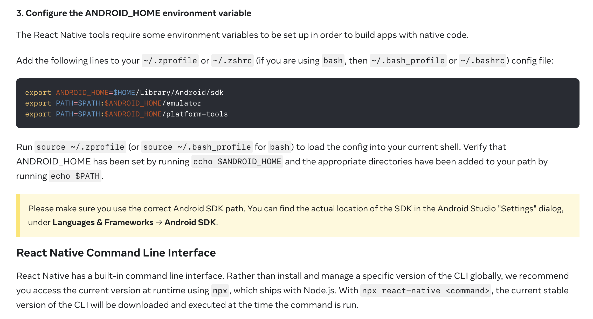
`$home`은 users/{우리계정이름} 이렇게 환경변수 설정이 된 것.</br>
게다가 여기서 bash를 쓸지 zsh를 쓸지... 선택할 수 있다.

```bash
export ANDROID_HOME=$HOME/Library/Android/sdk
export PATH=$PATH:$ANDROID_HOME/emulator
export PATH=$PATH:$ANDROID_HOME/platform-tools
```

PATH=$PATH..는 기존 PATH에 추가적인 PATH를 넣는 개념.

bash에서 which로 작성된 거 실행파일 확인하듯이 ~/.zshrc 같은 곳에 작성되어 있어야 실행할 수 있다.<br>
vscode를 사용하면 `code ~/.zshrc`가 제일 편하고, 아니면 open 같은 명령어로 열어서 수정하면 된다.

`cat ~/.zshrc` 로 확인할 수 있고, `source ~/.zshrc` 로 반영할 수 있다.

### ios

[공식 문서](https://reactnative.dev/docs/environment-setup?guide=native&os=macos&platform=ios#command-line-tools)
xcode 설치했으면, Command Line Tools를 설치 받아야 한다.
보통은 xcode 설치할 때 같이 받는다. 안 받았다면 수동으로 설치. (최신 버전)

그리고 components(혹은 Platforms) 가서 시뮬레이터 설치.<br>
시뮬레이터는 따로 설치 안 해도 되긴 한다. 나중에 선택하면 바로 설치됨.

아이폰용 라이브러리 받을 떄 cocoapods를 사용한다.
`sudo gem install cocoapods`

**ruby 버전이 낮아서 cocoapods 설치 불가능한 경우가 있다.**

`brew install rbenv ruby-build`

`rbenv install --list` 명령어를 통해 버전 리스트를 확인하고 최신 버전을 받는다.<br>
예를 들어, `rbenv install 3.0.6`

하지만 `ruby -v`를 했을 떄 제대로 버전이 반영이 안 되고, `rbenv versions`을 확인했을 때는 버전이 제대로 뜰 경우?

`which ruby`를 해보면 Path 설정이 부족해서 그렇다고 한다.

```bash
$ rbenv init
eval "$(rbenv init -)" #이 내용을 복사해서~/.bash_profile에 추가
```

~/.bash_profile에 위 코드를 복사해준다.

```bash
code ~/.bash_profile
source ~/.bash_profile
```

참고로, 나는 zsh를 쓰고 있으므로 ~/.zshrc에도 위 코드를 똑같이 복사해줘야 한다.

다시 루비 버전을 확인해보면 잘 뜬다. 이제 다시 cocoapods를 설치하면 된다.

```bash
ruby -v
which ruby
```

### package, pod, ...

참고로 xcode를 설치했다면, 프로젝트 생성하고, xcode로 프로젝트를 열 수 있다.

- 처음에 가장 실수 많이 하는 게, 설치한 폴더에서 xcode라고 해도 xcworkspace 파일을 열어야 한다.
- 프로젝트 파일을 열면 안 된다.

파일의 경우 버전 문제가 있을 수 있으므로 강의용 git clone 받고,<br>
`npm install`하고 난 뒤에, ios용 라이브러리를 받기 위해 `npx pod-install`(cocoapod으로 설치하는 명령어)도 해줘야 한다.

- 원래 명령어는 `pod install`인데 이 경우 ios 폴더로 가서 입력해야 한다. 어디서나 입력하고 싶을 때는 위 명령어를 사용하면 된다.
- settings/ 에 가서 입력하면 될 듯 하다..?

pod들 설치하다가 에러나는 경우, ios로 들어가서

- `pod deintegrate`로 Pod 폴더를 지우고 다시 pod install하면 설치 중 꼬이는 건 지울 수 있다.
- 지우는 또 다른 방법은, xcode > product에서 `clean build folder`도 해보면 좋다.

그래도 안 되면, 아래 명령어를 통해 activesupport를 설치하면 된다.

```bash
sudo gem uninstall activesupport
sudo gem install activesupport --version 7.0.8
```

그리고 나서

```bash
cd ios
pod install
```

설치를 완료했다면, `npm run ios`로 실행해도 좋지만,
xcode에서 시뮬레이터(안드로이드는 에뮬레이터) 선택하고(뭐 기기 선택하는 거랑 비슷한듯), 실행 버튼을 누르면 된다.

- 에뮬레이터가 기능이 더 많다. 시뮬레이터는 애뮬레이터를 흉내낸 정도.

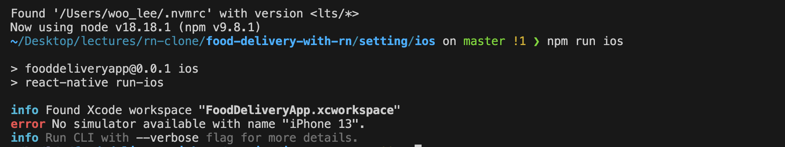
보통 위와 같이 뜨는 건 시뮬레이터가 없어서 그런 거라서, xcode에서 실행하는 게 편하다.

- 사진에서도 보이듯 xcworkspace를 참조하는 걸 확인할 수 있다.

시뮬레이터가 없다면,

- xcode 켜고, window > devices and simulators > simulators 탭에서 + 버튼을 눌러 기종을 추가해주면 된다.

**주의할 점**

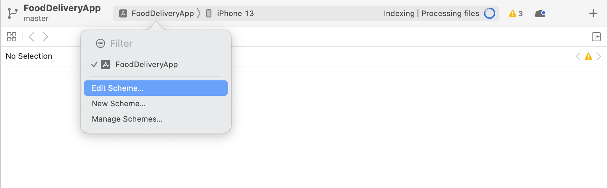
위 그림처럼, edit scheme을 눌렀을 때
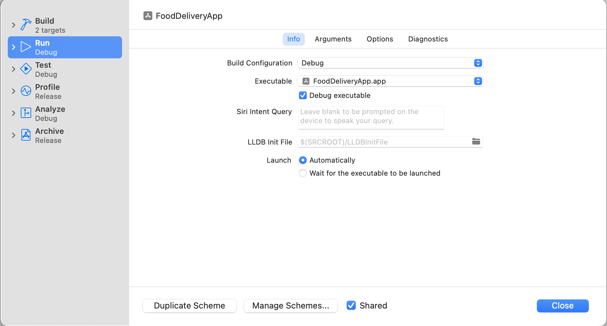
run 상태여야 한다. 지금은 개발모드니까 debug.

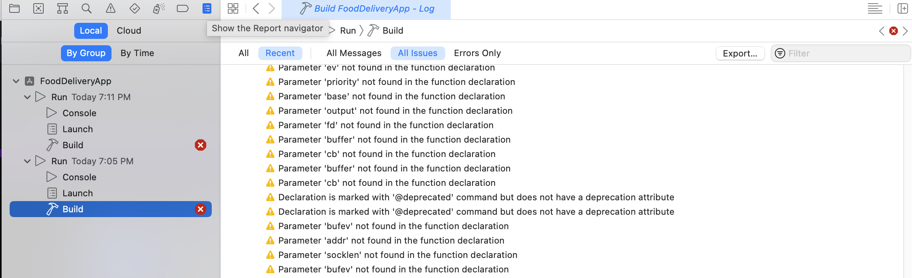
오른쪽 끝 아이콘을 눌러서 build 상황을 확인할 수 있다.
노란색 경고까지는 괜찮고, 이미지처럼 빨간색만 안 뜨면 된다.

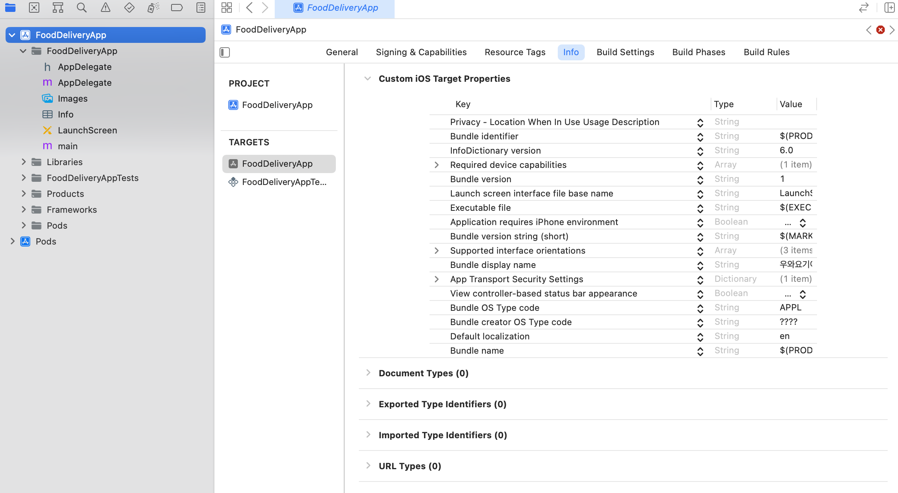
info라고 적혀 있는데, 여기서 정보들을 바꾸면 된다.

general에 있는 bundle identifier의 경우 고유한 이름이어야 하므로 바꿔줘야 한다. 대신 안드로이드와는 동일한 이름이어야 한다. 이게 앱 출시할 때, 앱의 id 역할을 한다.

프로젝트를 열 때는 workspace를 열지만, 우리가 수정한 것들은 pbproj에 반영된다.
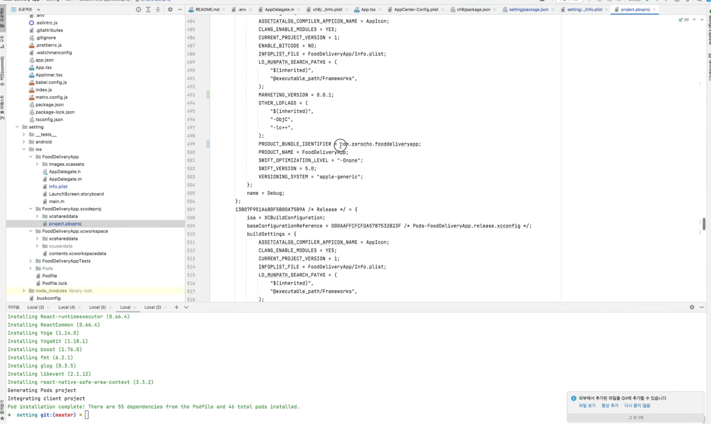

### 프로젝트 시작하기

react-native를 전역 설치해준다.
`npm i -g react-native`

그리고 나서, `npx react-native init <원하는 디렉토리명> --template react-native-template-typescript` 로 설치를 해준다.
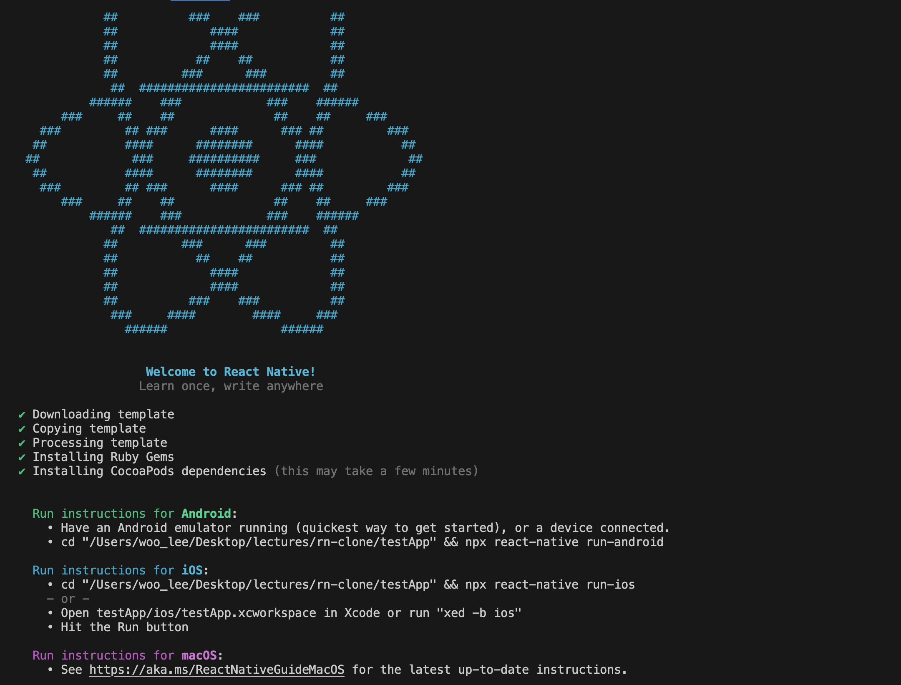

`cd <만든 디렉토리명>`으로 이동한 뒤, 안드로이드부터 실행을 해보려면 `npm run android`<br>
그럼 이제 shell(정확히는 메트로 서버라고 한다. 이게 계속 켜져 있어야 한다. 일종의 webpack dev server 역할을 해준다.) 같은 게 새로 뜨면서 실행된다.

메트로 서버와 함께 화면이 뜨는데, 이건 안드로이드 스튜디오에서 AVD Manager에서 확인할 수 있다.

- Create Virutal Device로 켤 수 있다. 안드로이드는 Nexus 5 자주 사용한다.
- 화면 작을 걸 써야 깨지는 거 대응하기 쉽다.

R(30버전)을 받으면 된다.
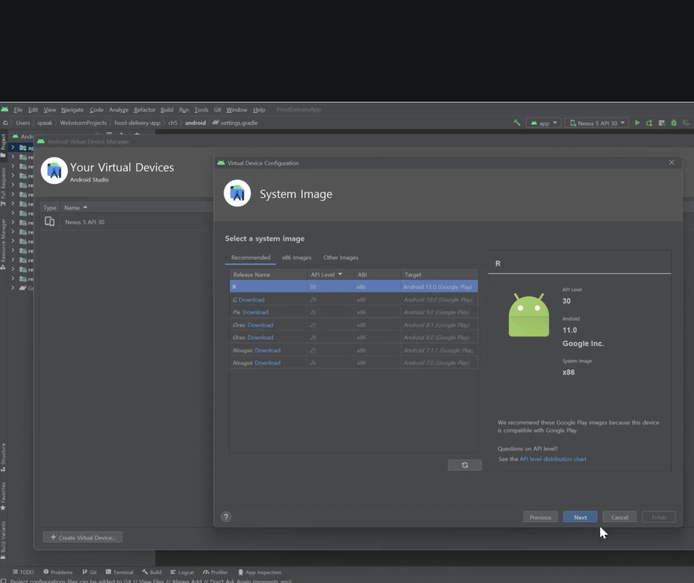


위 화면에서 Create Devices를 누르고, R(30) 버전을 받으면 된다.

다운로드 받았으면, 아래와 같이 Finish를 눌러주면 된다.
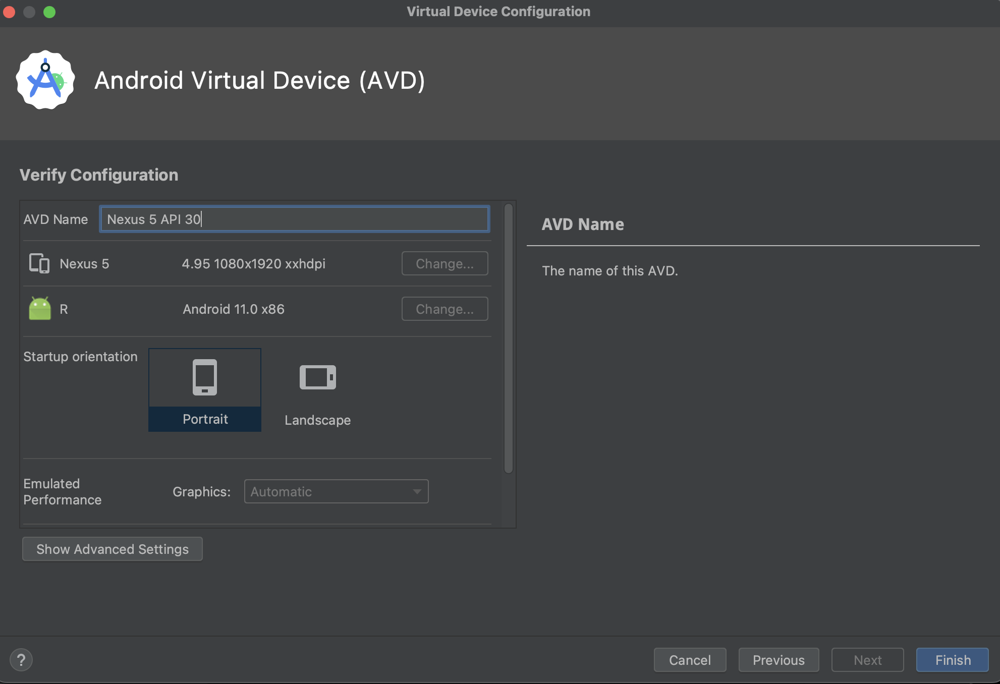

처음엔 화면이 뜨기까지 굉장히 오래 걸린다.

아래와 같이 화면이 뜨면, 빌드가 성공한 것이다.
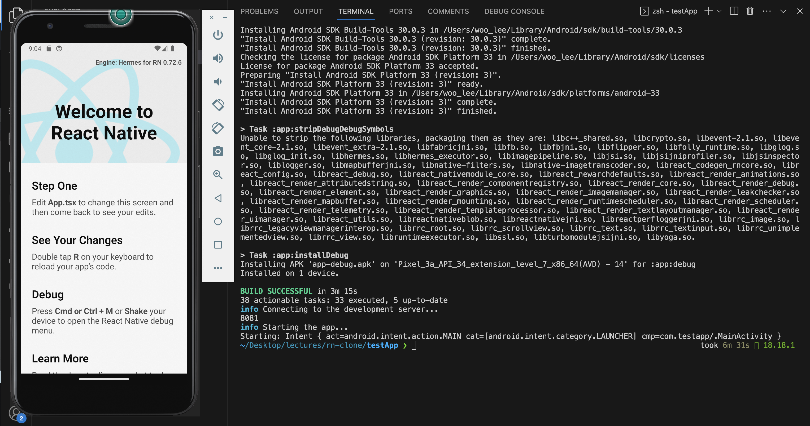
