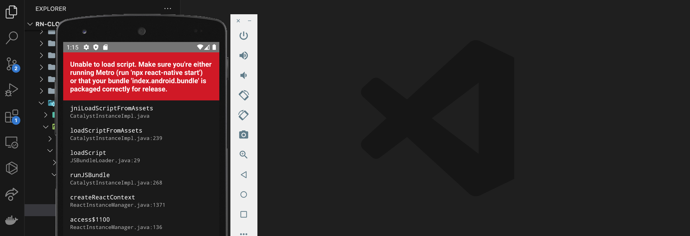
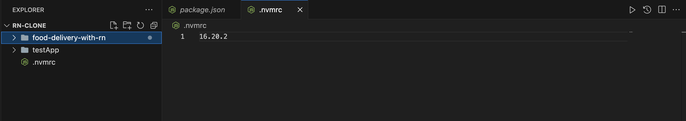
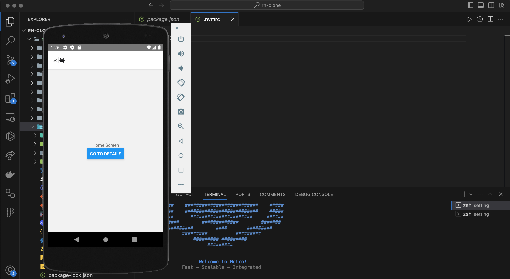
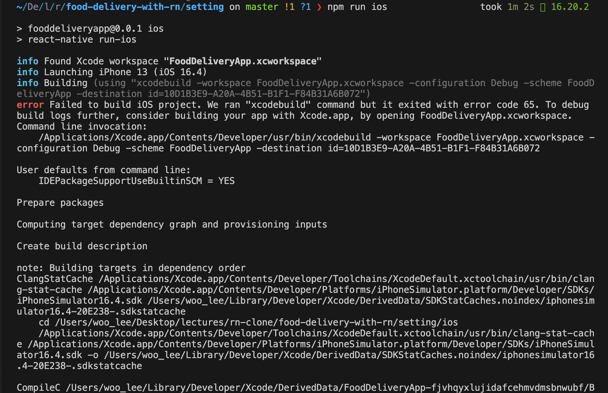
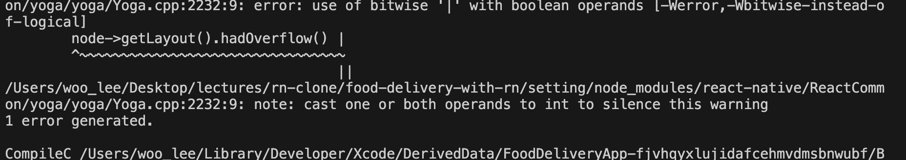
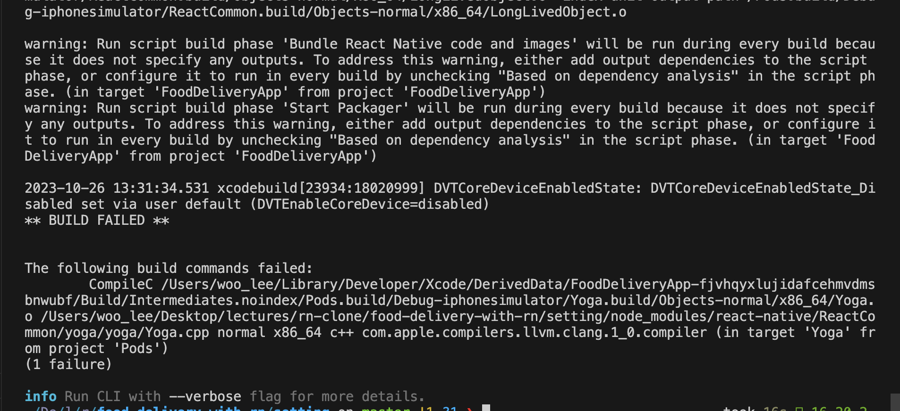
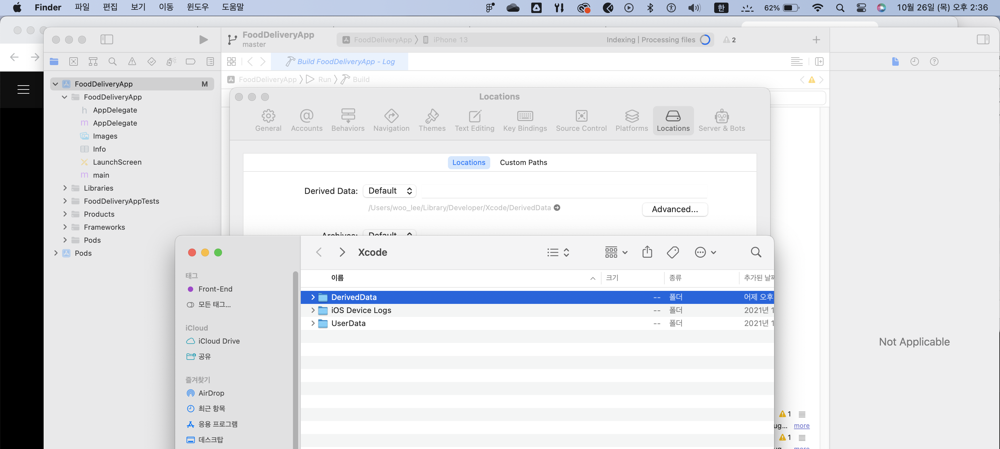
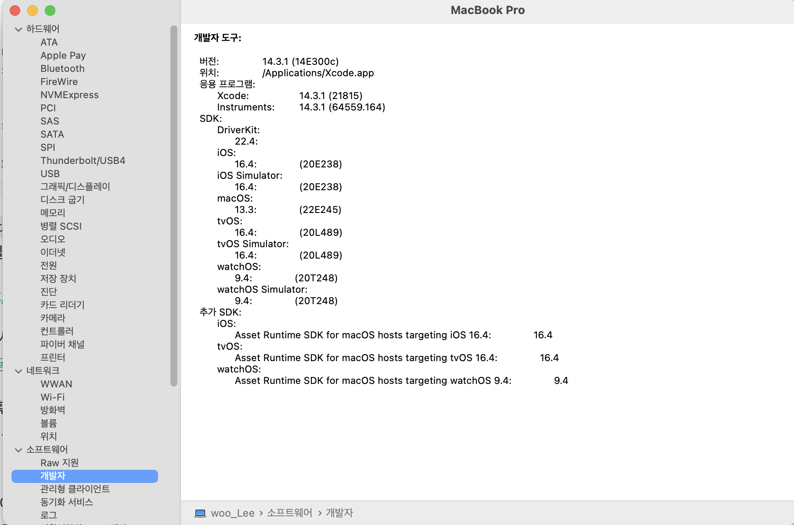
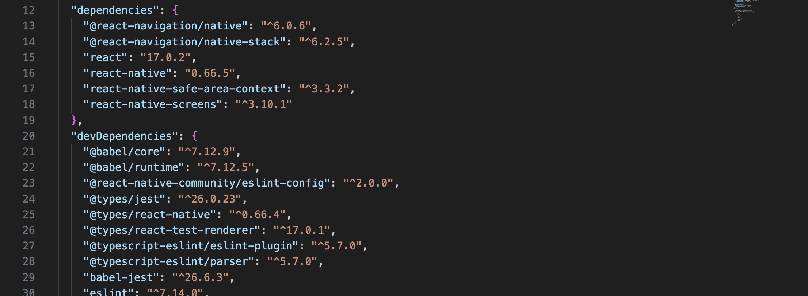
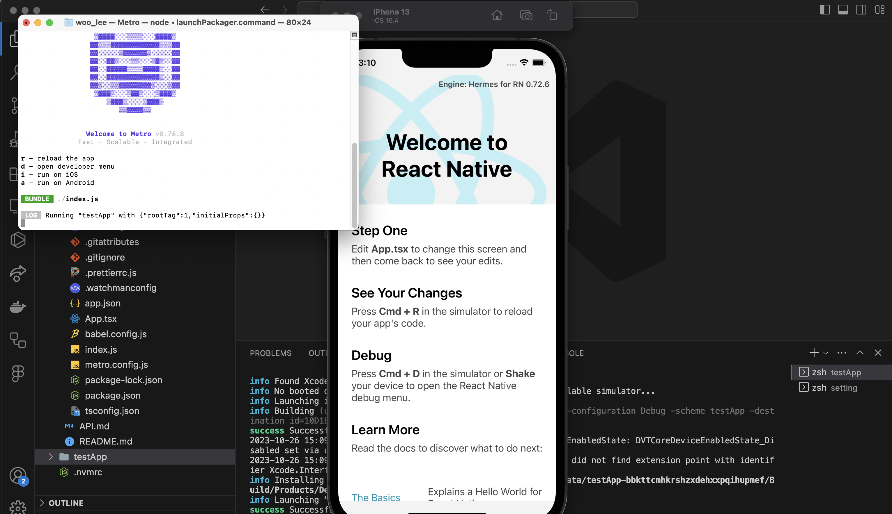

## react-native 최초 실행 시 (npm run android)

### react-native 설치

react-native를 전역으로 설치하지 않아서 발생하는 오류일 수 있다.
`npm i -g react-native`

강의의 settings 디렉토리에서 `npm run android`를 실행했더니 아래와 같이 에러가 발생했다.


### node 버전 확인

이 경우 보통은 노드 버전이 안 맞아서 발생하는 경우가 대부분이다.

node 버전을 프로젝트에 맞게 설정해주자.

```bash
nvm install 16.20.2 # 원하는 노드 버전을 설치해준다.
```

노드 버전을 받았으면, 아래와 같이 루트 디렉토리 .nvmrc 파일에 버전을 명시해준다. 그럼 끝.


터미널을 2개 열어서, 하나는 `npm start`를 통해 메트로 서버를 열어주고, 다른 하나로는 `npm run android`를 열어준다.<br>
그럼 아래와 같이 화면이 잘 뜨는 걸 볼 수 있다.


## npm run ios 안 될 때

npm run android는 해결했는데, ios에서 안 된다.

### Unable to boot device in current state: Booted 와 같은 메시지가 뜰 경우

Simulator를 열고, settings(또는 preferences)에서 Simulator lifetime에서 `When Simulator starts boots the most recently used simulator` 체크된 걸 해제하면 된다.

### 또 다른 에러





### 65 Error

아래 부분의 에러에서 뭔가 있는 듯 하다.

```bash
Failed to build iOS project. We ran "xcodebuild" command but it exited with error code 65. To debug build logs further, consider building your app with Xcode.app, by opening FoodDeliveryApp.xcworkspace.
Command line invocation:
    /Applications/Xcode.app/Contents/Developer/usr/bin/xcodebuild -workspace FoodDeliveryApp.xcworkspace -configuration Debug -scheme FoodDeliveryApp -destination id=10D1B3E9-A20A-4B51-B1F1-F84B31A6B072

User defaults from command line:
    IDEPackageSupportUseBuiltinSCM = YES

Prepare packages

Computing target dependency graph and provisioning inputs

Create build description
```

### 65 Error - Derived Data 폴더 삭제

이 65 에러는 주로, ached pod file이랑 현재 패키지가 사용하고 있는 pod file이랑 매치가 되지 않아서 발생하는 에러라고 한다. 따라서 이 캐시를 제거해주고 pod을 recreate해주면 된다.

xcode를 열어서 똑같이 프로젝트 폴더를 연 뒤, settings > location으로 들어간 뒤, Derived Data 경로로 가서 Derived Data 폴더를 삭제한다. 그리고 xcode를 다시 열면, 또 derived Data 폴더가 바로 생성되는데 이러고 나서 다시 `npm run ios`를 해본다.


여전히 안 된다. 로그를 확인해보니 65 에러는 해결한 건가? 다른 에러가 남은 건가?

**65 Error - ios/.xcworkspace, Podfile.lock 파일 삭제하기**

.xcworkspace 파일은 Xcode 프로젝트 파일이며, pod install 시에 생성된다.<br>
Podfile.lock 파일로 pod install 시에 생성된다.

### xcode 버전 문제

```bash
2023-10-26 13:59:04.247 xcodebuild[27681:18063093] DVTCoreDeviceEnabledState: DVTCoreDeviceEnabledState_Disabled set via user default (DVTEnableCoreDevice=disabled)
** BUILD FAILED **
```

```bash
warning: Run script build phase 'Start Packager' will be run during every build because it does not specify any outputs. To address this warning, either add output dependencies to the script phase, or configure it to run in every build by unchecking "Based on dependency analysis" in the script phase.

warning: Run script build phase 'Bundle React Native code and images' will be run during every build because it does not specify any outputs. To address this warning, either add output dependencies to the script phase, or configure it to run in every build by unchecking "Based on dependency analysis" in the script phase.

```

위 에러들을 중심으로 검색해보니, xcode 버전 문제 느낌이 난다.<br>
현재 나는 xcode 14.3.1 버전을 사용하고 있다. (시스템 설정 > 일반 > 시스템 리포트 > 소프트웨어 > 개발자 > ... 에서 확인할 수 있다.)


xcode 버전과 rn 버전이 차이가 있어서 그런 듯 하다. (생각해보니 새롭게 최신 버전으로 플젝 켰을 때는 문제가 없었으니)
강의용 rn 버전이 0.66.5다. (안드로이드 13을 타겟팅하려면, 강제로 최소 0.70까지는 올려야 한다.)


xcode로 실행해보니, yoga.cpp에서 발생하는 `Use of bitwise '|' with boolean operands` 에러도 위와 같이 버전 문제 때문에 발생하는 거였다. 코드를 변경하기 꺼려지면 xcode의 버전을 낮출 수도 있겠지만..

새로운 repo에서는 아래처럼 잘 되는 거 보니 rn과 xcode 버전 문제가 확실한 듯 하다.


### 최신 버전으로 업그레이드 하는 방법

[React Native Upgrade Helper](https://react-native-community.github.io/upgrade-helper/)

```bash
npx react-native upgrade
npm i
cd ios
pod install
npx react-native run-ios
```

근데 지금 보니까 강의 git 디렉토리의 rn72가 0.72버전으로 된 거였다.<br>
이걸 그대로 사용해보니 안 된다...
