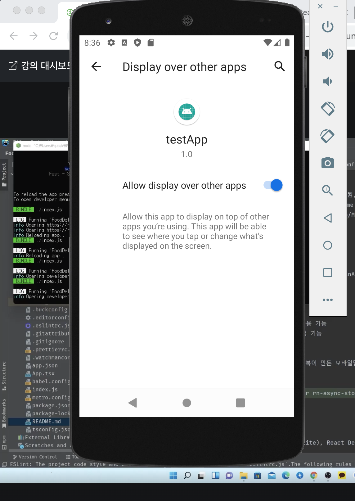
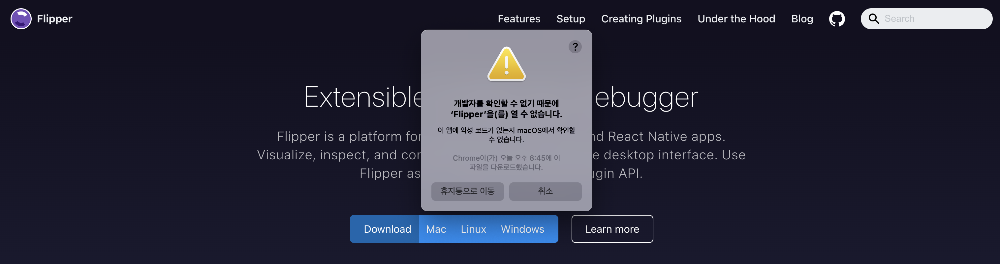

# React Native 프로젝트 시작하기

## 기본 프로젝트 구조

android, ios 폴더는 네이티브 폴더.
<br>코드 작성하는 동안, 여기를 건드려야 하는 문제면 머리가 복잡해진다.

app.json이 앱 이름에 관한 부분.

메트로 서버가 webpack dev server 역할을 한다.
<br>메트로가 웹팩처럼 바벨 같은 걸 사용해서 ts 변환한다든지 기능을 한다.

index.js가 진입점 역할을 한다.

tsconfig.json의 경우 strict: true만 해도 설정 90%는 먹고 들어간다.

개발할 때는 안드로이드 보다는 아이폰 먼저 기준으로 코드 작성하고, 안드로이드 대응하는 게 정신 건강에 이롭다.

- rn을 쓰더라도 결국, 안드로이드/아이폰 너무 달라서 서로 다르게 대응해줘야 한다..

app.json에서는 name은 되도록 변경하지 않아야 한다. 이거 바꾸면, 네이티브 컴포넌트 이름도 전부 변경해야 한다.

- [react-native-rename](https://www.npmjs.com/package/react-native-rename) 라이브러리 같은 거 쓰는 게 좋다.

StyleSheet는 rn에서 제공해주는 스타일. 굳이 스타일드 컴포넌트까지 안 써도 충분하기는 하다.

뭐든지, 폴더를 볼 때는 밑에서부터 봐야 한다. 어떤 걸 Export하는지가 중요하므로.

## rn 기본 컴포넌트 분석

일단 웹에서 쓰는 리액트 코드와 완전히 다르다.
<br>리덕스 같은 애들만 재사용할 수 있고, 컴포넌트 코드는 전혀 다르다고 생각하면 된다.

style은 inline style로 보면 된다.

stylesheet.create로 생성하거나 객체로 만들어서 inline styles처럼 `style={{ ... }}`로 주입하면 된다.

성능적으로 Stylesheet 생성하는 게 좋다(드라마틱한 차이는 아님). 겉보기에는 똑같이 객체처럼 보이지만, rn이 여기에 id 같은 거 부여해서 매칭하는 정도로 이해.

- 일반 객체로 만들어서 inline styles로 주입하는 경우는, 변수가 들어가서 분기점에 따라 다르게 적용해야 하거나 할 때!

단위를 기본적으로 생략한다.

- 웹에서는 단위 생략하면 px이지만, 안드로이드 같은 경우 생략하면 dp 단위이다. (%랑은 다르지만, 화면 비율에 따라 맞춰지는 값이라고 보면 된다.)

웹에서 한번에 쓰는 거 안 된다(예를 들어, `border: 1px solid ...`).

- style 관련된 문서가 자세하지 않아서, 직접 찾아서 쓰거나 타입스크립트 쓰면 자동완성 해주므로 그거대로 작성하면 된다.
  [Core Components and APIs](https://reactnative.dev/docs/components-and-apis)
- 아니면 [여기](https://github.com/vhpoet/react-native-styling-cheat-sheet)처럼 치팅시트 같은 거 찾아보면 좋다.

웹에서는 가로가 우선. 앱은 세로가 길게 가다보니까, flexDirection이 기본값이 column이다.

아래는 튜토리얼 같은 거라 무시해도 좋다.


### 컴포넌트 몇가지.

rn 컴포넌트 중에 우리가 가장 많이 쓸 거는 `View`와 `Text`

- View는 div와 비슷하고, Text는 span과 비슷하다. (유사하지만, 1:1 매칭되는 개념 절대 아니다. 조심해야 한다.)
- 예를 들어 `<div>텍스트입니다</div>` 이런 게 웹에서는 되는데, 앱에서는 텍스트는 무조건 Text로 감싸줘야 한다.

SafeAreaView는, 노치 또는 홀 같은 애들 방지할 때 쓰는 친구다. View를 그냥 쓰면 노치에 가려지는 부분들을 콘텐츠가 채워버린다.


- 그래서 보통 코드 작성할 때 최상단은 SafeAreaView로 감싸면 된다.

`StatusBar`는 배터리 같은 거 표시되는 부분. 여기도 이 컴포넌트로 어느 정도 디자인이 가능하다.

- 높이가 기기마다 달라서, 예를 들어, react-native-status-bar-height 같은 라이브러리로 높이를 구하거나...

`ScrollView`를 안쓰고 View를 쓰면 컨텐츠가 넘치더라도 스크롤이 안 된다.

- 단, ScrollView는 성능 문제가 있다. 많아지면 `FlatList` 써야 한다.

### 스타일에 배열도 가능하다.

배열에 들어 있으면, 아래 코드의 경우 `styles.sectionTitle`가 먼저 적용되고
<br>그 다음에 `{ color: isDarkMode ? Colors.white : Colors.black, }`가 덮어씌운다.

- rn의 스타일시트가 조건문이 불가능하기 때문에, 스타일시트로 뺼 수 있는 건 이렇게 빼고 조건문이 필요한 것만 이렇게 덮어씌우는 방식이다.

```js
<Text
  style={[
    styles.sectionTitle,
    {
      color: isDarkMode ? Colors.white : Colors.black,
    },
  ]}
>
  {title}
</Text>
```

## 데브메뉴와 Flipper

rn 라이브러리 같은 경우, 라이브러리가 제대로 동작 안 할 경우, 직접 소스코드를 까보고 수정해야 하는 경우가 꽤 많다.

- 라이브러리에서 어떤 식으로 접근했는지 참고해서 내가 직접 수정하는 것에 익숙해져야 한다.

rn도 웹뷰 많이 쓴다.
앱은 항상 앱스토어를 거쳐서 배포되기 때문에, 그런 것 때문에 실시간 수정이 가능한 웹뷰를 많이 적용한다.

앱 구동한 상태에서, 매트로 서버 터미널에서 D 누르면 데브메뉴 뜨는데, show perf monitor 누른 다음,
<br>아래 이미지처럼, allow display over other apps 활성화해주면, 현재 내 화면이 몇 프레임인지 체크하면서 개발할 수 있다.

- 애니메이션 같은 거 구현할 때 몇 프레임까지 떨어지는지 체크한다든지..
  

debug 누르면, 콘솔 찍는 거 웹에서 확인할 수 있다.


근데 이렇게 웹으로 Debug 보는 게 간단히 쓸 때는 괜찮은데, 별로 좋지 않다.

- 왜냐면, 앱에서 네트워크 요청 보내는 거 같은 건 이 Debug 웹에서 전혀 안 뜬다.
- redux devTools 같은 것도 못쓴다.

그래서 강의에서는 flipper 라는 걸 쓴다.

- 페이스북에서 만들었기에 호환이 잘 된다. (다만, 악명이 높아서 flipper 때문에 오히려 에러가 더 많이 발생한다.)
- [fbflipper.com](https://fbflipper.com/)
- 다운로드 받고 실행하면 된다.


위와 같이 뜰 경우, 취소하고
<br>시스템 설정 > 개인정보 보호 및 보안 > Filpper에 대해 '확인없이 열기' 클릭 해준다.

앱 실행하고, setup doctor에서 openSSL이 설치되었는지만 확인해주면 된다. (터미널에 openssl 쳐서 안나오면 설치하기)


그리고 Android SDK location 위치를 잡아줘야 한다.

경로는 `vim ~/.zshrc`로 가서 SDK 경로를 확인하면 된다.


그리고 나서 Flipper의 Settings에 들어가서 경로를 직접 수정해주면 된다.
<br>rn 프로젝트를 실행시켰을 때, Flipper가 자동으로 프로젝트를 연결한다.


그럼 아래와 같이 android SDK가 설치되었다고 다시 잘 뜬다.


React DevTools를 눌러보면 아래와 같이 잘 뜬다.


Layout에서 마우스를 갖다대면, 현재 어떤 레이아웃을 건드리고 있는지도 쉽게 확인할 수 있다.


### Flipper 플러그인 추천

flipper-plugin-async-storage (웹에서의 로컬스토리지 같은 개념)
flipper-plugin-redux-debugger (리덕스 디버거)


그리고 패키지도 설치해준다.


아래 처럼 에러나면 그대로 읽고 하라는 대로 수정하면 되는데, 이 경우 보통 Rn이 버전 문제가 많아서 생기는 이슈일 수 있다.


버전 문제면, 그냥 일단 `npm i react-native-flipper redux-flipper rn-async-storage-flipper @react-native-async-storage/async-storage --force`

(RN할 때는 `--force` 붙여야 하는 경우가 상당히 많다.)

## 앱 이름 바꾸기, 강좌 폴더 구조 잡기
