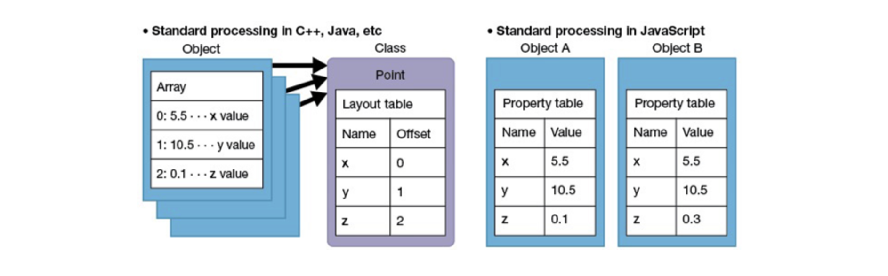
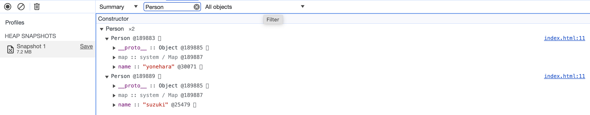
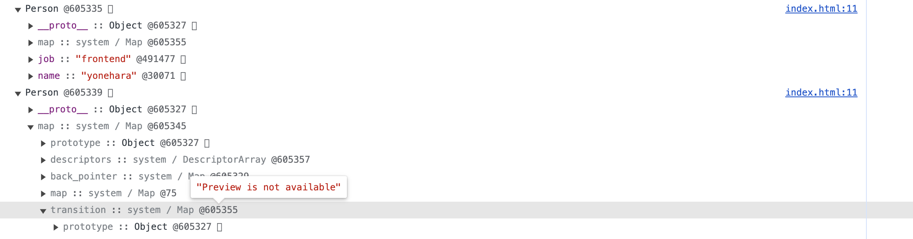
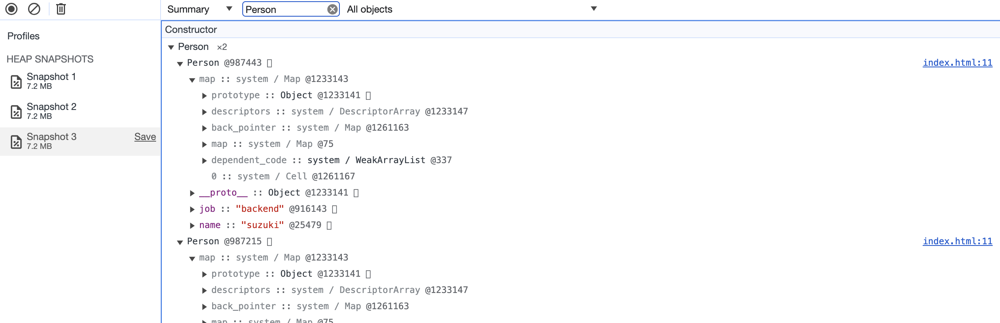

# 자바스크립트의 객체 관리 방식과 프로토타입

## Features

### 동적 타이핑 언어의 문제점

자바스크립트은 동적 타이핑 언어이며, 클래스가 아닌 프로토타입 기반 언어입니다.<br>
클래스 기반 언어에서 같은 클래스에 소속된 객체들은 모두 동일한 필드 구조를 지닙니다. 따라서 어떤 객체의 멤버 변수에 접근할 때, 오프셋 값만 있으면 모든 멤버 변수에 접근할 수 있습니다. 컴파일 단계에서 이미 접근할 수 있는 정보(오프셋)를 지니게 되는 셈입니다. 각각의 인스턴스 객체들은 오프셋 값만 가지고 있으면 됩니다. 메모리 면에서 이점이 있습니다.

반면, 동적타이핑 언어인 자바스크립트는 오프셋 값만으로 충분하지 않습니다. 언제 값이 변경될지 모른다는 예측불가능 측면 때문에 모든 객체들은 `프로퍼티 이름과 값` 세트를 가지고 있어야 합니다. 객체가 n개라면, 이 세트 정보도 n개여야 하므로 메모리 측면에서 매우 불리합니다.



### 히든클래스(hidden class)

자바스크립트의 이러한 단점을 v8에서는 히든클래스 개념을 통해 해결합니다. V8은 히든클래스 개념을 통해 동적탐색을 회피합니다.<br>

히든클래스는 다음과 같은 특징을 지닙니다.

- 우리가 생성한 객체는 반드시 하나의 히든 클래스를 지닙니다.
- 히든클래스는 각 프로퍼티에 대한 오프셋을 가지고 있습니다.
- 동적으로 새로운 프로퍼티가 생성되거나 변경되면, 새로운 히든클래스가 생성됩니다.
- 히든클래스는 프로퍼티 변경시 변경할 transition 히든클래스 정보를 가지고 있습니다.

즉, 각 객체는 생성 시 히든클래스를 생성합니다.<br>
각 객체에 프로퍼티가 추가될 때마다 또 새롭게 히든클래스를 생성합니다. 새로운 히든 클래스 생성과 함께, 기존 히든클래스에 transition 정보를 추가합니다.<br>
동일한 프로퍼티를 사용한다면, 히든클래스를 생성하지 않고 재활용합니다. 동일한 프로퍼티인지 판단할 때, 처음 생성된 히든클래스부터 시작해서 transition 정보를 참조하며 탐색합니다.<br>

히든클래스 개념을 통해 자바스크립트는 객체가 n개 있더라도 n개의 정보테이블을 생성해야 한다는 문제점을 해결합니다.<br>
히든클래스와 transition 정보를 통해 불필요한 히든클래스 생성을 방지합니다.

### 히든클래스 실제 예제코드

크롬 개발자 도구를 사용합니다.

아래 코드를 실행하고, 개발자도구 메모리 탭에서 스냅샷을 촬영합니다.<br>
그리고 Constructor에서 Person 객체를 검색합니다.

```js
function Person(name) {
  this.name = name;
}

var foo = new Person("yonehara");
var bar = new Person("suzuki");
```

아래 그림을 보면, 두 Person 인스턴스 객체가 나옵니다.<br>
히든클래스는 코드상에서 Map이라고 불립니다. foo, bar는 모두 동일한 @189887이라는 id를 사용하는 걸 확인할 수 있습니다.



처음 Person이라는 객체가 생성될 때, 처음 히든클래스 C0에는

- 오프셋이 없습니다.
- new 키워드와 함께 생성하는 순간, C0에 "name을 추가하면 히든클래스 C1으로 전환한다"는 정보가 있습니다.
- 히든클래스 C1에는 name에 오프셋값이 존재합니다.

처음 foo를 생성하면서 C0에 transition 정보가 추가되며,<br>
이후 bar을 생성할 때는 해당 transition 정보를 참고해 새로운 히든클래스를 생성하는 대신, foo에서 사용한 히든클래스 C1을 재활용합니다. 그래서 Map ID가 동일합니다.

이제 새로운 프로퍼티를 추가해봅시다.

```js
function Person(name) {
  this.name = name;
}

var foo = new Person("yonehara");
var bar = new Person("suzuki");
foo.job = "frontend";
```

아래 그림을 보면, 이제 두 Person의 Map id가 달라졌습니다.

첫번째 Person은 @605355를, 두번째 Person은 @605345을 Map id로 합니다.<br>
하지만, 두번째 Person의 transition 정보를 보면, @605355를 가지고 있습니다.



즉, foo에 job이라는 프로퍼티가 추가되면서 히든클래스 C2(그림에서는 @605355)가 생성되었습니다.<br>
이후, bar에서도 job이라는 프로퍼티가 추가되더라도, 새로운 히든클래스를 생성하지 않고, @605355 히든클래스를 재사용합니다.

정말인지 확인해볼까요?

```js
function Person(name) {
  this.name = name;
}

var foo = new Person("yonehara");
var bar = new Person("suzuki");
foo.job = "frontend";
bar.job = "backend";
```

위 코드를 통해 bar에 job이라는 프로퍼티를 추가했습니다.<br>
그리고 스냅샷을 찍어보면 아래 그림처럼, 동일한 히든클래스(@1233143이라는 Map ID)를 사용합니다.<br>
게다가 이제 bar에서 보이던 transition 정보는 사라졌습니다.



실제로 자바스크립트 엔진에서 히든클래스를 구현할 때,

- `객체 자신의 정보만을 담는 JSCell 자료구조`와 `객체 자신으로부터 파생되는 정보를 담는 Structure 자료구조`를 사용합니다.
- Structure 내부에 우리가 개발자도구에서 확인한 Map ID가 존재하며, transition 정보가 m_transitionTable 자료구조로 관리됩니다. transition 정보라는 개념이 결국은, 필드구조가 런타임에 변경될 수 있다는 자바스크립트의 특징으 보완하는 셈입니다.

V8은 히든클래스 개념을 통해 프로퍼티 값을 참조할 때 발생할 수 있는 메모리 낭비, 참조 속도 등의 문제를 해결했습니다.<br>
여기에서 멈추지 않고 V8은 히든클래스 기반에서 인라인 캐싱(inline caching)을 통해 또 다른 최적화를 진행합니다.

### 인라인캐싱(Inline Caching)

히든클래스를 사용하면, 같은 필드구조를 사용하는 객체가 많아지면 많아질수록 메모리를 절약할 수 있습니다.<br>
하지만 어쨌든 이 과정은 번거롭습니다. `객체의 히든클래스에 접근해, 프로퍼티 테이블을 확인하고 프로퍼티를 비교해 [오브젝트 + 오프셋] 위치로 이동한다`는 과정 속에서 사실 결국 우리가 필요로 하는 건 `오프셋` 값입니다.

인라인 캐싱은 아래 2가지 가정을 바탕으로, 이 오프셋 값을 캐싱합니다.

- 동적인 언어더라도 그렇게까지 동적이지 않다.
- 결국 문제가 되는 건 Loop다.

```js
for (var i = 0; i < 10; i++) {
  arr[i].x = i;
}
```

인라인 캐싱은 두 번째 수행부터 캐싱을 합니다. 왜냐하면 한 번 수행된 코드는 한 번만 수행될 가능성이 높지만, 두 번 수행된 코드는 이후에 더 수행될 확률이 높기 때문입니다.

결국 성능이 좋은 자바스크립트 코드를 작성한다는 것은, 이러한 인라인 캐싱 개념에 기반해 동적인 언어라고 가정하고 코드를 작성하는 것과 동일한 의미를 갖습니다.

## References

[자바스크립트 엔진의 최적화 기법 (2) - Hidden class, Inline Caching](https://meetup.nhncloud.com/posts/78)<br>
[V8의 히든 클래스 이야기](https://engineering.linecorp.com/ko/blog/v8-hidden-class)<br>
[Fast properties in V8](https://v8.dev/blog/fast-properties)<br>
[자바스크립트 엔진의 최적화 기법 (2) - Hidden class, Inline Caching](https://meetup.nhncloud.com/posts/78)<br>
[How the V8 engine works?](https://velog.io/@yesdoing/How-the-V8-engine-works-lvjv0wxtt8)<br>
