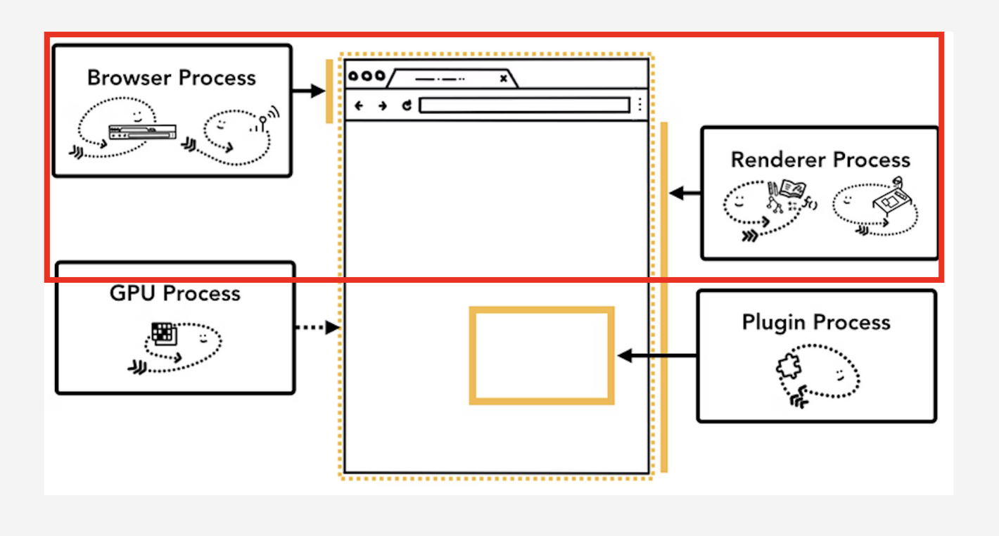
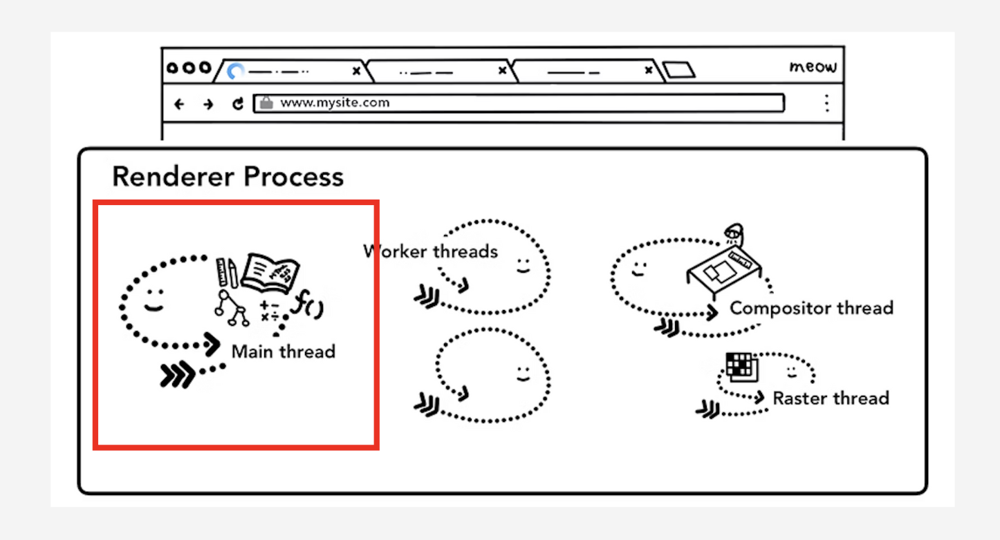

# 브라우저 동작 원리와 자바스크립트 엔진의 이벤트 루프

## Features

### 브라우저의 프로세스와 스레드 (브라우저 프로세스와 렌더러 프로세스)

프로세스는 흔히 어플리케이션의 실행 프로그램으로 묘사됩니다. 스레드는 프로세스 안에 살며, 프로세스의 프로그램 중 일부를 실행하는 역할을 합니다. 
브라우저 아키텍쳐 또한 프로세스와 스레드로 이해할 수 있습니다. 상징적인 프로세스들이 존재하며, 프로세스 안에 여러 개의 스레드가 존재합니다.

크롬 브라우저를 기준으로, 브라우저 창 1개마다 1개의 브라우저 프로세스(브라우저 엔진이라고도 합니다, 이하 BP로 표현하겠습니다.)가 생성됩니다. 
하나의 브라우저 프로세스 안에, 여러 개의 탭이 존재합니다. 이 탭 1개를 1개의 렌더러 프로세스(렌더링 엔진이라고도 합니다, 이하 RP로 표현하겠습니다.)라고 합니다.

- 크롬에서 BP는 탭 밖의 모든 일들을 처리하고, RP는 탭 안의 모든 일들을 처리합니다.
- 그리고 우리가 알고 싶어하는 자바스크립트 엔진은 이 RP 안에 내장되어 있습니다.

사용자가 주소창에 뭔가를 입력하면 어떻게 될까요?

BP가 판단을 먼저 합니다. 검색이면, 검색 엔진으로 URL이면 URL의 리소스를 가져올 수 있게 BP 안에 존재하는 네트워크 스레드에 요청을 합니다. 여기서 안전하다고 판단하면, BP는 RP에게 웹페이지를 그려달라며 데이터와 함께 요청을 합니다.

데이터를 받은 RP는 일련의 과정을 거쳐 렌더링을 합니다. 이 과정을 흔히 렌더링 과정 혹은 rendering critical path를 그린다고도 합니다. 
RP는 프로세스이므로 당연히 여러 개의 스레드가 내부에 존재합니다. 하지만 그중 메인스레드가 대부분 모든 일들을 처리합니다.

### 주소창에 도메인 주소를 입력해, 이벤트 루프가 실행되기까지

1. 먼저, 사용자가 주소창에 입력한 게 URL이라고 판단된다고 가정합시다. 그럼 브라우저는 DNS 서버에 도메인 이름을 검색합니다. 물론 검색하기 전에 캐싱된 DNS 기록이 있는지 확인합니다. 캐싱된 IP 주소가 있다면 바로 IP주소를 반환하지만, 없다면 DNS 서버에 IP주소를 요청합니다.

2. DNS 서버에 IP 주소를 요청하는 과정을 Recursive Query라고 합니다. 가장 가까운 DNS 서버부터 문답을 진행해 원하는 IP 주소가 나올 때까지 재귀적으로 요청하기 때문입니다. 결과적으로 웹브라우저에 입력된 도메인 주소는 DNS 프로토콜을 통해 IP 주소로 변환됩니다.

3. 1번 단계에서 캐싱된 IP주소가 있다면 2번 과정을 생략해 여기로 왔을 것입니다. 어쨌든. 아래 과정을 거칩니다.

- 웹브라우저는 전달받은 IP주소를 통해 웹서버에 해당 웹사이트에 맞는 html 문서를 요청합니다. 해당 http 요청 메시지는 TCP/IP 프로토콜을 거쳐 서버로 전송됩니다.
- HTTP 요청은 TCP/IP 스택을 따라 HTTP => TCP => IP => Ethernet 등을 거쳐 서버로 전송됩니다. Ethernet Frame에 대해 decapsulation을 진행하고 다시 Ethernet => IP => TCP => HTTP Request를 통해 웹서버 프로그램으로 보내집니다.
- TCP 3-way handshaking을 통해 클라이언트와 서버가 연결되면 완전한 요청과 응답을 주고 받습니다.

참고로, 일반적으로 HTTPS을 한다면, HTTP 전 단계에서 SSL 프로토콜 단계를 한번 더 거칩니다. 
한번의 완전한 요청/응답 이후에는 응답헤더에 작성된 Cache-Control에 따라 캐시의 생명주기를 결정합니다.

4. 브라우저로부터 완전한 요청을 받은 웹서버는 페이지 로직이나 데이터베이스 연동을 위해 WAS에게 처리를 요청합니다.

- 참고로, 웹서버는 정적인 콘텐츠를 담당하고, WAS(웹어플리케이션서버)는 동적인 콘텐츠를 담당합니다.

5. WAS에서의 작업 처리 결과를 웹서버로 전송합니다. 이제 웹서버는 웹브라우저(클라이언트)에게 HTML 문서 결과를 전달합니다.

6. 문서를 전달받은 브라우저는 내부적으로 html 파일을 렌더러프로세스에게 전달합니다. 이제 렌더러프로세스는 메인 스레드를 통해 렌더링을 진행합니다.

- 메인스레드는 가장 먼저, HTML을 브라우저가 해석할 수 있는 자료구조인 DOM Tree로 변환하는 작업을 수행합니다. 이 과정을 HTML 파서가 link 태그 또는 async, defer가 없는 script 태그와 같은 블로킹 리소스를 만나기 전까지 진행합니다. (참고로 css 파일은 스타일이 적용되지 않고 콘텐츠가 잠깐 뜨는 현상(Flash of unstyled content)를 방지하고자 파싱과 렌더링을 차단합니다. script 태그도 DOM을 변경하는 코드를 포함할 수 있으므로 파싱을 멈춥니다.) 파싱이 중단되면 리소스 사용이 늦어질 수 있습니다. 이를 방지하기 위해 브라우저는 preload scanner를 사용해 필요한 요청을 병렬적으로 처리하기도 합니다.
- 어쨌든, 메인 스레드는 DOM Tree를 구축하기 위해 파싱을 합니다. 그리고 CSSOM Tree도 생성합니다. 이 두 트리를 바탕으로 Render Tree를 구축합니다. 그리고 나서 Render Tree를 기반으로 렌더링을 진행하며, 내부적으로는 Layout, Paint, Compositing 과정을 거칩니다.
- 요약하자면, "Parsing => Style => Layout => Paint => Composite" 단계로 정리할 수 있습니다.
  - `Layout` : Render Tree의 노드들을 웹 페이지 상에 배치하기 위해 노드들의 정확한 위치, 크기 등을 계산합니다.
  - `Paint` : 레이아웃들과 계산된 값들을 바탕으로 화면에 그립니다. 다만 바로 화면에 그리는 게 아니라 이미지 별로 레이아웃을 쪼개서 레이어에 그립니다.
  - `Reflow & Repaint` : 변경사항이 발생하면, 요소를 재배치하거나 다시 페인팅합니다.
  - `Composition` : 만들어 놓은 레이어를 z-index에 따라 순서대로 쌓아서 합성합니다. 레이아웃이나 페인트 과정을 거치지 않아도 이 과정을 수행할 수 있습니다. 흔히 재렌더링 과정을 최적화하기 위해 최대한 Compsition만 할 수 있도록 의도적으로 스타일 코드를 작성하기도 합니다. 최소한 layout 과정까지는 반복하지 않는 것만으로도 웹페이지 속도를 상당 수준 높일 수 있습니다.

7. html 파일을 파싱하다가 script 태그를 만나면 멈춥니다. 이때 제어 권한이 렌더러프로세스 안에 있는 자바스크립트 엔진으로 넘어갑니다. 그리고 이때 드디어 이벤트 루프 개념이 등장합니다. 이벤트 루프는 JS 엔진의 콜스택과 다양한 큐들을 주시합니다. 콜스택이 비어있다면 큐에 대기하고 있는 작업들을 콜스택에 전달하는 역할을 합니다. 이벤트 루프는 결국, 자바스크립트의 가장 기본적인 동시성 모델이기도 합니다.

- 메인 스레드 내부 JS엔진을 통해 우리가 작성한 자바스크립트 코드가 실행됩니다. JS 엔진에는 기본적으로 메모리 할당이 발생하는 메모리 힙과 실행 컨텍스트들이 쌓이는 콜스택이 존재합니다. 콜스택은 하나이며, 한 번에 1개의 작업만 처리하는 싱글 스레드 방식으로 동작합니다.
- JS엔진이 아닌, 브라우저에서 실행되도록 설계된 web apis가 존재합니다. 이 api들을 이벤트 루프가 브라우저로 옮깁니다. 브라우저에서 실행을 끝낸 api들이 Queue에 담기고 이벤트 루프는 콜스택이 비워지는 특정 시점에 Queue에서 이 api들을 가져옵니다. 이유는, 정확한 실행시점을 관리하기 위해서 입니다.
- Queue에는 크게 3가지 종류가 존재합니다.
  - `Task Queue` (또는 Macrotask Queue, Event Queue, Callback Queue로도 불립니다.)
    - setTimeout과 같은 비동기 콜백들이 저장됩니다.
  - `Microtask Queue` (또는 Job Queue로도 불립니다.)
    - Promise, async/await, process.nextTick, object.observe, MutationObserver와 같은 Promise의 비동기 콜백들이 저장됩니다.
    - 하나의 사이클이 끝나면 실행되며, 빠르게 모든 콜백들이 전부 처리됩니다.
  - `Animation Frames` (또는 Render Queue로도 불립니다.)
    - 렌더링과 관련된 raF 콜백들이 독립적으로 쌓입니다.

## References

[Event Loop in Chrome browser](https://serhiikoziy.medium.com/event-loop-in-chrome-browser-72bd6c8db033) 
[Browser Event loop: micro and macro tasks, call stack, render queue: layout, paint, composite](https://blog.xnim.me/event-loop-and-render-queue) 
[What the heck is the event loop anyway? | Philip Roberts | JSConf EU](https://www.youtube.com/watch?v=8aGhZQkoFbQ) 
[Jake Archibald: IN THE LOOP - JSConf.Asia](https://www.youtube.com/watch?v=cCOL7MC4Pl0) 
[Inside look at modern web browser (part 1)](https://developer.chrome.com/blog/inside-browser-part1/) 
[JavaScript and the event queue!](https://dev.to/darken/javascript-and-the-event-loop-5dpb) 
