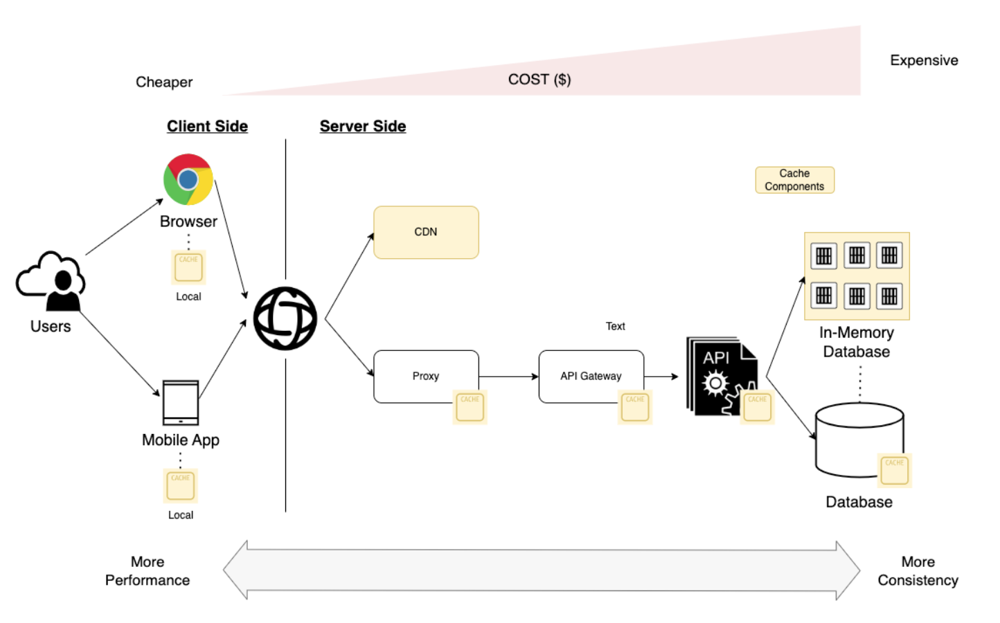
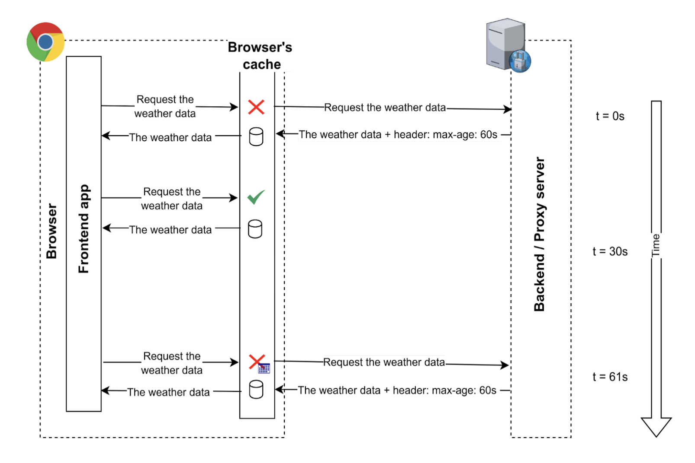
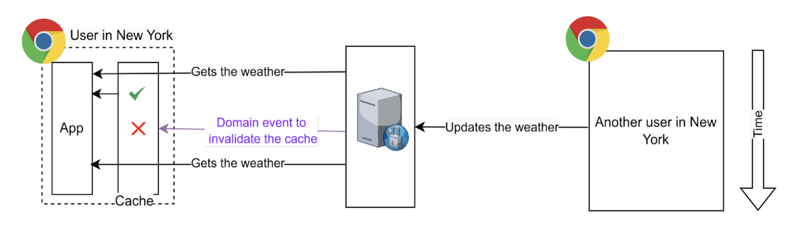
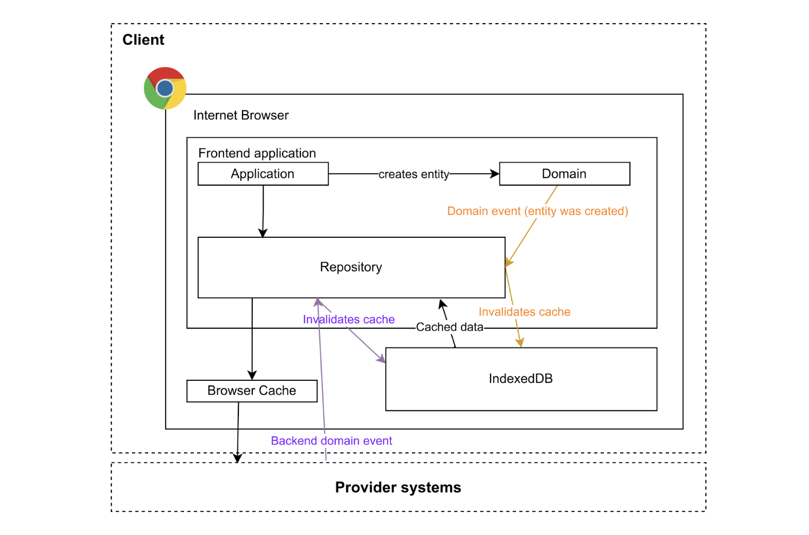

# HTTP Cache

# Features

캐시란, 다양한 프로그래밍 레이어에서 사용되는 중간 저장소 개념입니다. 캐시를 "적절히" 사용하면 다음과 같이 이점이 있습니다.

- 동일한 요청에 대해 데이터를 재사용하기 때문에, 불필요한 네트워크 요청을 줄일 수 있습니다.
- 서버에 요청하지 않고, 캐시에서 바로 가져오므로 어플리케이션 성능을 높일 수 있습니다.
- 캐시가 consumer에 가까우면 가까울 수록, 낮은 비용으로 scalability and performance을 높일 수 있습니다.

데이터 캐싱의 가장 큰 어려움은 적절히 캐싱하는 것, 즉 Data의 "consistency와 freshness"입니다. 
캐시는 소프트웨어 아키텍쳐에서 반드시 필요하지만, 불완전하기에 프로그래머가 최적화를 별도로 해야 합니다. 각자의 비즈니스 도메인에 맞게 전략이나 세부 설정 값은 달라질 수 있습니다.

캐시 전략은 크게 2가지(클라이언트 사이드와 서버 사이드)로 나뉩니다.

## Client-Side Caches

클라이언트 측의 캐시는 크게 3가지로 나뉩니다.

- `HTTP Caching`: intermediate cache system이며, 이는 부분적으로 server에 의존적입니다.
- `Cache API`: 브라우저 api를 사용해 요청을 캐싱하도록 하는 걸 의미합니다.
- `Custom Local Cache`: 프론트엔드 측에서, cache storage, expiration, invalidation, and update 등을 컨트롤하는 걸 의미합니다.

### 1. HTTP Caching

HTTP Headers를 통해, 브라우저와 관련한 storage, expiration, validation, fetch 등을 관리하는 걸 말합니다. 
완전한 HTTP 요청이후, 서버 측에서 HTTPP Headers를 설정해줘야 하므로 서버에 의존하는 캐싱 전략입니다.

### 2. Cache API

HTTP Caching과 유사하지만, 프론트 측에서 Requests를 캐시로부터 저장하거나 추출할 수 있습니다. 
단, 캐시의 만료기한을 잘 관리해야 합니다. 그렇지 않으면 영구히 저장됩니다.

### 3. Custom Local Cache

http 요청으로 데이터를 받아온 후, 브라우저의 IndexedDB, in the LocalStorage, SessionStorage 등에 저장해두고 사용하는 걸 말한다. 캐시를 관리하기가 편리하다는 장점이 있다.

### HTTP Cache 관리하기

**HTTP 캐시의 생명주기**

HTTP에서 리소스(resource)란 웹 브라우저가 HTTP 요청으로 가져올 수 있느 모든 종류의 파일을 말합니다. 웹 브라우저가 서버에서 지금까지 요청한 적 없는 리소스를 가져올 때, 서버와 브라우저는 완전한 HTTP 요청/응답을 주고 받습니다. 이후에는 HTTP 응답에 포함된 Cache-Control 헤더에 따라 리소스의 생명주기가 결정됩니다.

기본적으로 서버의 Cache-Control 헤더로 지정한 `max-age=<seconds>` 값이, 캐시의 유효 기간이 됩니다. 해당 기간 동안 브라우저는 서버에 요청을 보내는 대신, 디스크 또는 메모리에서 캐시를 읽어와 사용합니다.

캐시의 유효기간이 지나면 캐시가 완전히 사라지지 않고, 브라우저가 서버로 조건부요청(HTTP conditional requests)을 보내 캐시가 유효한지 재검증(Revalidation)을 진행합니다.

- 재검증 요청 헤더로는, `If-None-Match`와 `If-Modified-Since`가 존재합니다.
- 재검증시 캐시가 유효하다면, 서버는 304 Not Modified 응답을 내려줍니다. 해당 응답은 HTTP 본문을 포함하지 않으므로 빠르게 응답을 받을 수 있습니다.
- 재검증시 캐시가 유효하지 않다면, 서버는 200 또는 적합한 상태코드와 함께 본문을 내려줍니다.

캐시가 항상 좋은 건 아닙니다. 캐시의 생명주기 제어권을 가지고 의도한 대로 캐시를 적절히 제거해주는 게 필요합니다. 
max-age=0을 하더라도, 브라우저는 매번 리소스 요청 시 서버에 재검증 요청을 보내지 않을 수도 있습니다. 일부 브라우저는 빠른 웹 경험을 위해 웹 브라우저를 껐다 키기 전까지 리소스가 만료되지 않도록 하기도 합니다. 이 경우, 웹브라우저를 껐다 키거나 `no-store` 값을 사용해야 합니다.

- Cache-Control에서 `no-cache`는 max-age=0과 동일한 의미를 가집니다. 캐시를 저장하지만, 리소스를 요청할 때마다 재검증 요청을 보냅니다.
- Cache-Control에서 `no-store`는 강력한 요청입니다. 아예 리소스에 대한 캐시를 만들지 않도록 합니다.

**HTTP 캐시의 위치**

HTTP 캐시는 여러 레이어에 저장될 수 있습니다. CDN과 같은 중간 서버를 사용하면, 서버의 응답을 CDN이 먼저 캐싱합니다. 이후 CDN의 캐싱된 응답을 브라우저가 한번 더 가져와서 캐싱합니다.

중간에 위치한 CDN의 캐시를 제거하는 걸 `CDN Invalidation`이라고 합니다. 중간서버나 CDN이 여러 개라면, 각각 개별적으로 캐시를 관리해야 합니다.

기본적으로 Cache-Control 값으로 중간서버나 CDN이 캐싱할 수 있게 할지 말지를 결정할 수 있습니다. 
예를 들어, `Cache-Control: public, max-age=86400`와 같이 작성합니다.

- public은 모두가 캐시를 저장할 수 있음을 의미하며, private은 가장 끝 사용자인 브라우저만 캐시를 저장할 수 있다는 의미입니다.
- Cache-Control에는 중간서버에만 적용되는 캐시 유효기간을 설정할 수 있습니다. 예를 들어 `s-maxage`를 `Cache-Control: s-maxage=31536000, max-age=0`과 같이 설정하면, CDN에서는 1년 간 캐싱되지만, 브라우저는 매번 재검증 요청을 보냅니다.

## References

- [웹 서비스 캐시 똑똑하게 다루기](https://toss.tech/article/smart-web-service-cache)
- [Deploying: Going to Production | Next.js](https://nextjs.org/docs/pages/building-your-application/deploying/production-checklist)
- [Front-End: Cache Strategies You Should Know](https://dzone.com/articles/front-end-cache-strategies-you-should-know)
- [Cache It Right: Top Frontend Interview Questions on HTTP Caching — Part 1](https://bootcamp.uxdesign.cc/cache-it-right-top-frontend-interview-questions-on-http-caching-part-1-d852c3b75f90)
- [Cache It Right: Top Frontend Interview Questions on HTTP Caching — Part 2](https://bootcamp.uxdesign.cc/cache-it-right-top-frontend-interview-questions-on-http-caching-part-2-54034cf348ff)

### to be read

frontend http cache strategy

- [Cache | mdn](https://developer.mozilla.org/en-US/docs/Web/API/Cache)
- [[Cache API] 프론트엔드의 자체적인 HTTP caching 구현 및 만료 일자 지정하기 (feat. 서버의 response headers를 변경할 수 없을 때)](https://velog.io/@skyu_dev/Cache-API-%EC%84%9C%EB%B2%84-%EC%9D%91%EB%8B%B5response%EC%9D%98-%ED%8C%8C%EC%9D%BC%EC%9D%84-%EC%BA%90%EC%8B%B1%ED%95%98%EC%97%AC-%EB%B6%88%ED%95%84%EC%9A%94%ED%95%9C-%EC%9A%94%EC%B2%AD%EC%9D%84-%EC%A4%84%EC%97%AC%EB%B3%B4%EC%9E%90)
- [The Cache API: A quick guide](https://web.dev/articles/cache-api-quick-guide)
- [Why HTTP Caching Matters for APIs](https://thenewstack.io/why-http-caching-matters-for-apis/)
- [Prevent unnecessary network requests with the HTTP Cache](https://web.dev/articles/http-cache)
- [Frontend vs. Backend Caching: Which is Better?](https://copyprogramming.com/howto/caching-on-frontend-or-on-backend)
- [Cache It Right: Top Frontend Interview Questions on HTTP Caching — Part 2](https://bootcamp.uxdesign.cc/cache-it-right-top-frontend-interview-questions-on-http-caching-part-2-54034cf348ff)
