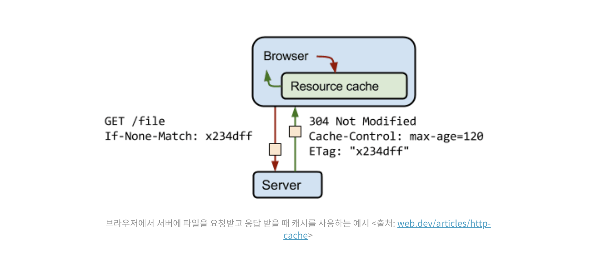
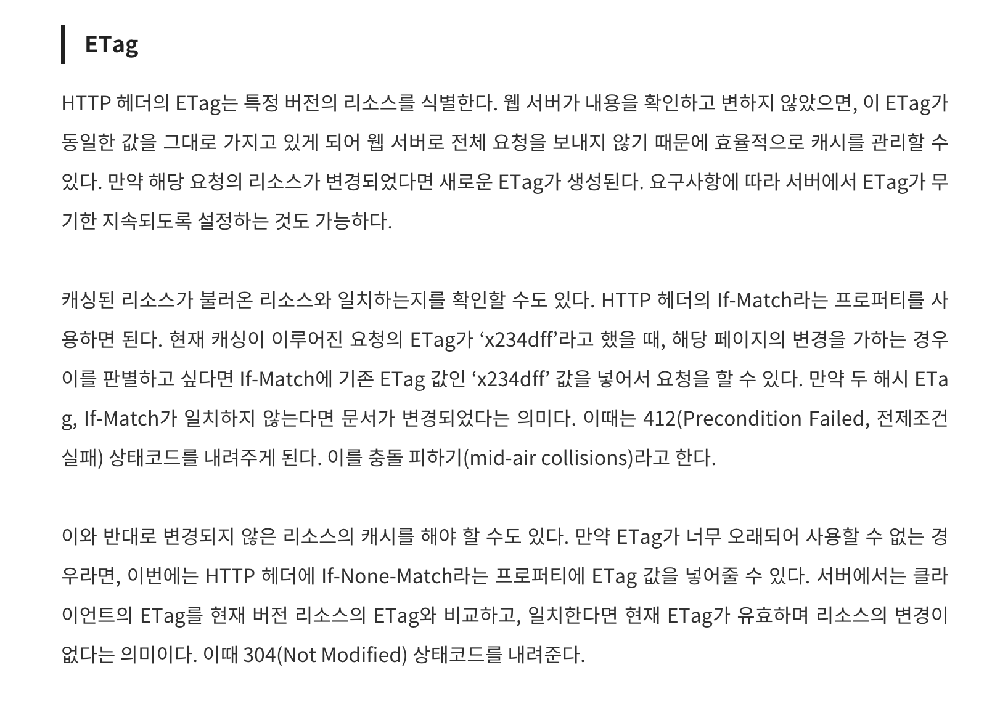
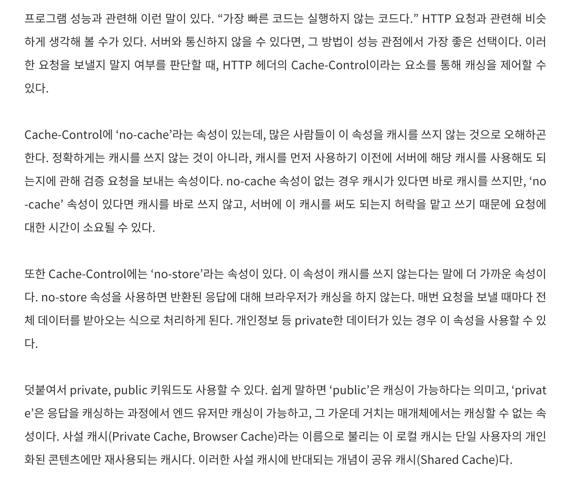
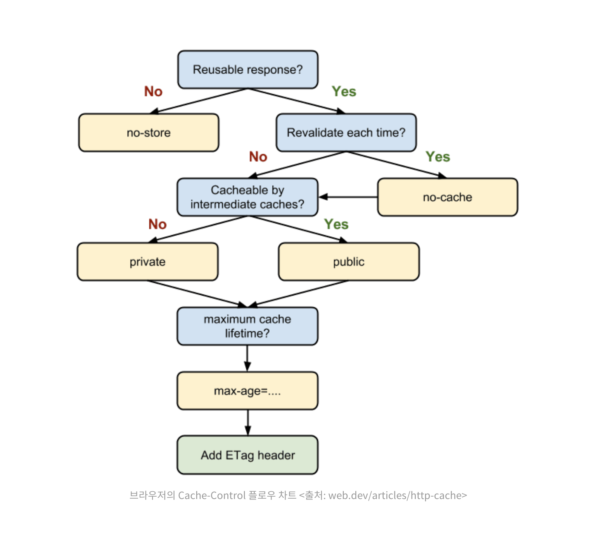
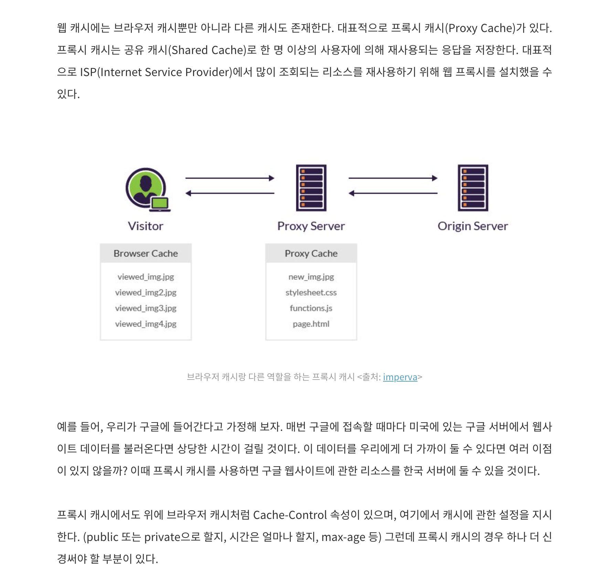
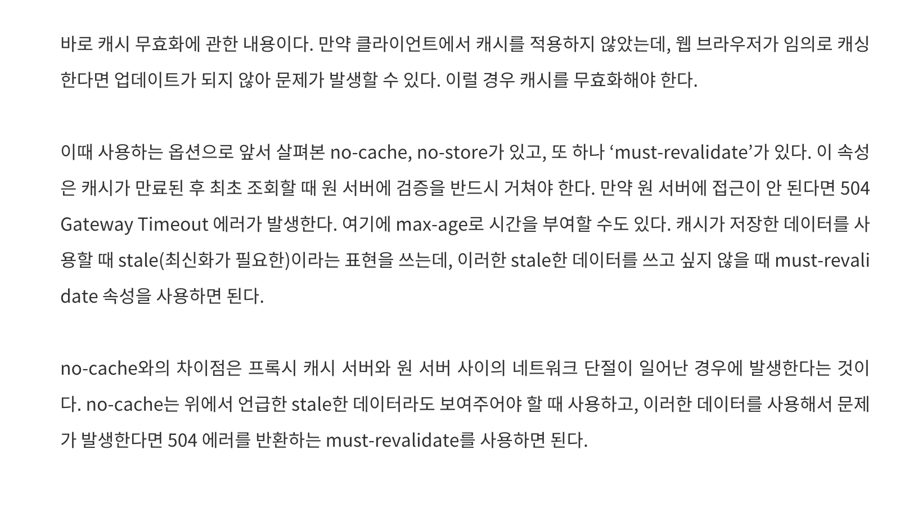
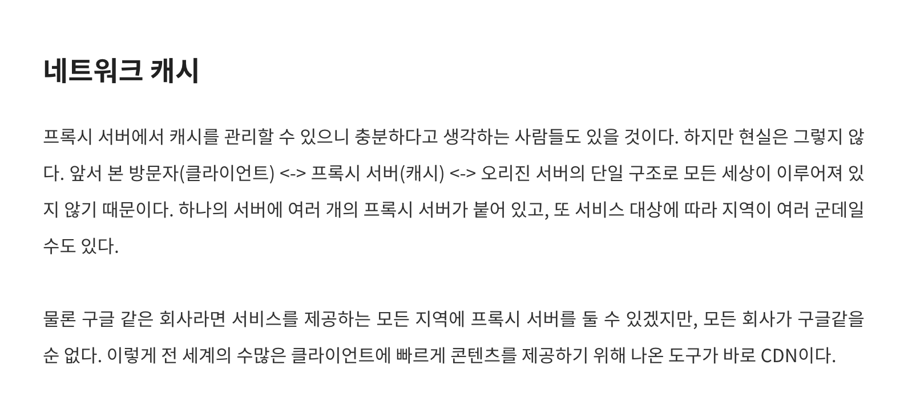
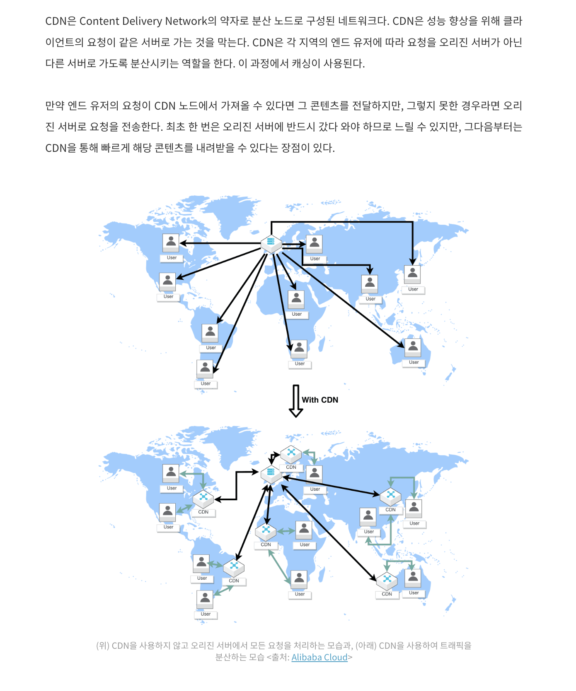
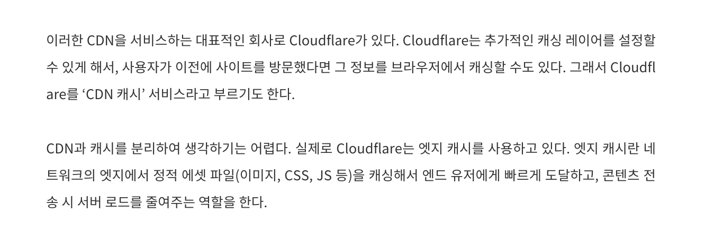

웹사이트 로딩 시간 줄이고, 자연스러운 사용자 경험 만드는 데 있어 캐싱은, 가장 기본적인 웹 최적화 방법 중 하나임.

캐싱은 어떤 데이터 1번 받아온 후, 그 데이터를 불러온 저장소보다 가까운 곳에 임시로 저장, => 이후 필요시 더 빠르게 불러와 사용하는 프로세스임.

=> 재사용을 충분히 많이 하는 데이터만 잘 선별해서 캐싱을 줄이는 게 중요함.

- 메모리 계층 구조에서 캐시는 디스크나 메인 메모리보다 더 빠르게 데이터 불러와서 사용해야 할 때 쓰이는데, 이런 장점 덕분에 단위 메모리당 비용이 비싼 편임. 무작정 캐시를 늘리면 성능을 위해 불필요한 비용을 내야 함.

# 웹 캐시

클라이언트는 서버로부터 http 요청을 통해 필요한 데이터 불러옴.

- 기본적으로 웹사이트 실행 시마다, 클라이언트는 필요한 데이터 매번 전부 불러옴.

이때 한번 불러왔던 데이터 중, 바뀔 일이 거의 없는 데이터라면 캐싱 적용 대상.

- 블로그 로그, 이미지, 제목, 사이드바 목차 등 => 여기에 적용하는 캐시가 브라우저 캐시임(browser cache)

## 브라우저 캐시 (http 캐시)

브라우저 캐시는 브라우저나 http 요청을 하는 클라이언트 어플리케이션에 의해 내부 디스크에 이루어지는 캐시임.

http 캐시라고도 하며, 이러한 캐시는 단일 사용자를 대상으로 하는 사설 캐시(private cache)임. 해당 사용자의 정보만을 저장함.

브라우저에서 캐싱 처리하는 대표적인 속성들

- ETag, Cache-Control

### ETag

HTTP 헤더의 ETag는 특정 버전의 리소스를 식별함.

- 웹 서버가 내용 확인, 변하지 않으면 ETag가 동일한 값 가지면서 웹서버로 전체 요청 안 보냄(이로 인해, 효율적으로 캐시 관리 가능)
- 만약 해당 요청의 리소스가 변경되면 새로운 ETag 생성. => 요구사항에 따라, 서버에서 ETag가 무기한 지속되도록 설정도 가능함.

### Cache-Control

성능을 높이려면, 실행하지 않는 게 가장 최고일 수도.

캐싱을 제어하는 속성임.

- no-cache : 캐시 사용 전 검증 요청
- no-store : 브라우저가 캐싱 안함.

public => 캐싱가능 
private => 엔드 유저만 캐싱 가능, 중간 매개체는 캐싱 불가능.

브라우저는 사설 캐시라고 불리는데, 단일 사용자의 개인화된 콘텐츠에만 재사용됨.

- 반대 개념이 공유 캐시(shared cache)

## Proxy Cache

웹 캐시에는 브라우저 캐시 말고 다른 캐시도 존재.

대표적으로 프록시 캐시. => 대표적인 공유 캐시임.

- 1명 이상의 사용자에 의해 재사용되는 응답을 저장.
- 프록시 캐시도, 브라우저 캐시처럼 cache-control, public/private, max-age 등 설정 가능
- 추가적으로 브라우저 캐시와 달리 캐시 무효화 신경 써야함
  - 클라이언트에서 캐싱 적용 안 했는데, 브라우저가 임의로 캐싱 해버릴 수 있으므로 no-cache, no-store, must-revalidate 알아두어야

캐시 무효화로, `no-cache`, `no-store` 말고 또 하나가 `must-revalidate`

- max-age로 시간을 부여하거나

## Network Cache

하나의 서버에 여러 개의 프록시 서버 붙어 있음. 
서비스 대상에 따라 지역이 여러 군데일 수도.

전 세계 수많은 클라이언트에 콘텐츠를 빠르게 제공하기 위해 나온 도구가 cdn.

### CDN

cdn(content delivery network). => 분산 노드로 구성된 네트워크.

- cdn은 성능 향상을 위해 클라이언트의 요청이 같은 서버로 가는 걸 막음. (오리진 서버가 아닌 다른 서버로 가도록 분산시킴. 이 과정에서 캐싱 사용)

cdn 서비스의 대표적인 회사가 cloudflare.

- cloudflare는 추가적인 캐싱 레이어를 설정할 수 있게 해, 사용자가 이전 사이트 방문했다면 그 정보를 브라우저에서 캐싱하도록 함.
- cloudflare를 그래서 `cdn 캐시` 서비스 라고 부르기도함.

cdn과 캐시는 분리해서 생각하기 어려움.

- 실제로 cloudflare에서는 엣지 캐시 사용함. => 엣지 캐시란, 네트워크의 엣지에서 정적 에셋 파일(이미지, css, js)을 캐싱해서 엔드 유저에게 빠르게 도달시키고, 콘텐츠 전송 시 서버 로드를 줄여주는 역할을 함.

## References

[프론트엔드 개발자가 알아야 할 '캐싱' 개념 정리](https://yozm.wishket.com/magazine/detail/2341/) 
[CDN vs Caching: How They Both Are Different In Work?](https://zrix.medium.com/cdn-vs-caching-how-they-both-are-different-in-work-efd8db89e139) 
[Browser Cache](https://www.imperva.com/learn/performance/browser-caching/) 
[HTTP 캐시로 불필요한 네트워크 요청 방지](https://web.dev/articles/http-cache?hl=ko) 
[프록시, 프록시 캐시, CDN](https://tigercoin.tistory.com/191) 
[HTTP 캐싱](https://developer.mozilla.org/ko/docs/Web/HTTP/Caching) 
