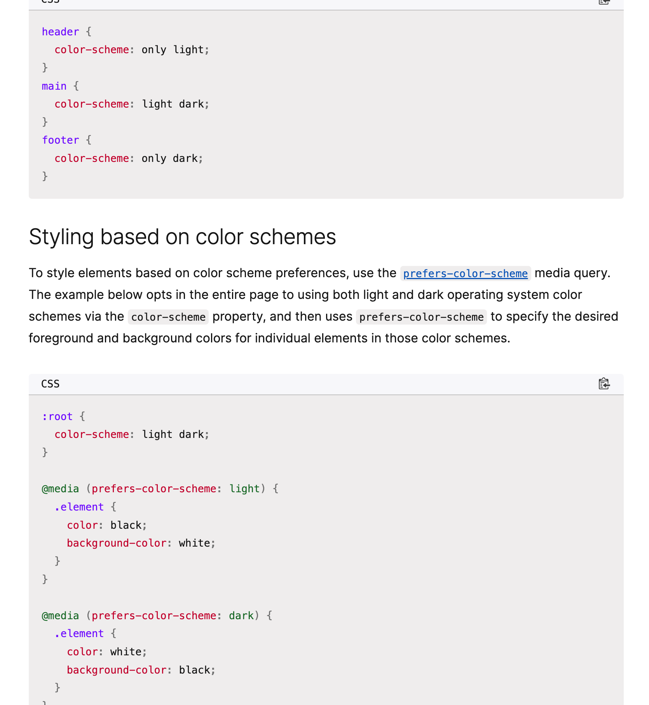

### text-wrap

텍스트 wrapping 할 때 사용함

[text wrap](https://developer.mozilla.org/en-US/docs/Web/CSS/text-wrap) 
[text-wrap playground](https://developer.mozilla.org/en-US/play) 

### color-scheme

light, dark 모드들 중에 어떤 거 허용할 건지 선택할 수 있음.

[color scheme](https://developer.mozilla.org/en-US/docs/Web/CSS/color-scheme) 

### scroll-margin

fixed, sticky로 gnb 만든 상태에서 anchor로 한 페이지 내에서 이동 시, gnb에 가려지는 문제가 발생할 수 있음.

=> css로 margin-top을 gnb 높이만큼 주고 visibility: hidden을 주면 됨.

또는 scroll-margin을 사용하면 쉽게 해결 가능.

[[CSS] fixed, sticky 헤더 사용 시 anchor 위치 문제 해결방법 -> scroll-margin](https://velog.io/@nowod_it/CSS-fixed-sticky-%ED%97%A4%EB%8D%94-%EC%82%AC%EC%9A%A9-%EC%8B%9C-anchor-%EC%9C%84%EC%B9%98-%EB%AC%B8%EC%A0%9C-%ED%95%B4%EA%B2%B0%EB%B0%A9%EB%B2%95-scroll-margin) 

## References

[scroll-margin](https://developer.mozilla.org/en-US/docs/Web/CSS/scroll-margin) 
[Three modern CSS properties your website must have](https://bejamas.io/blog/modern-css-properties-your-website-must-have/) 
