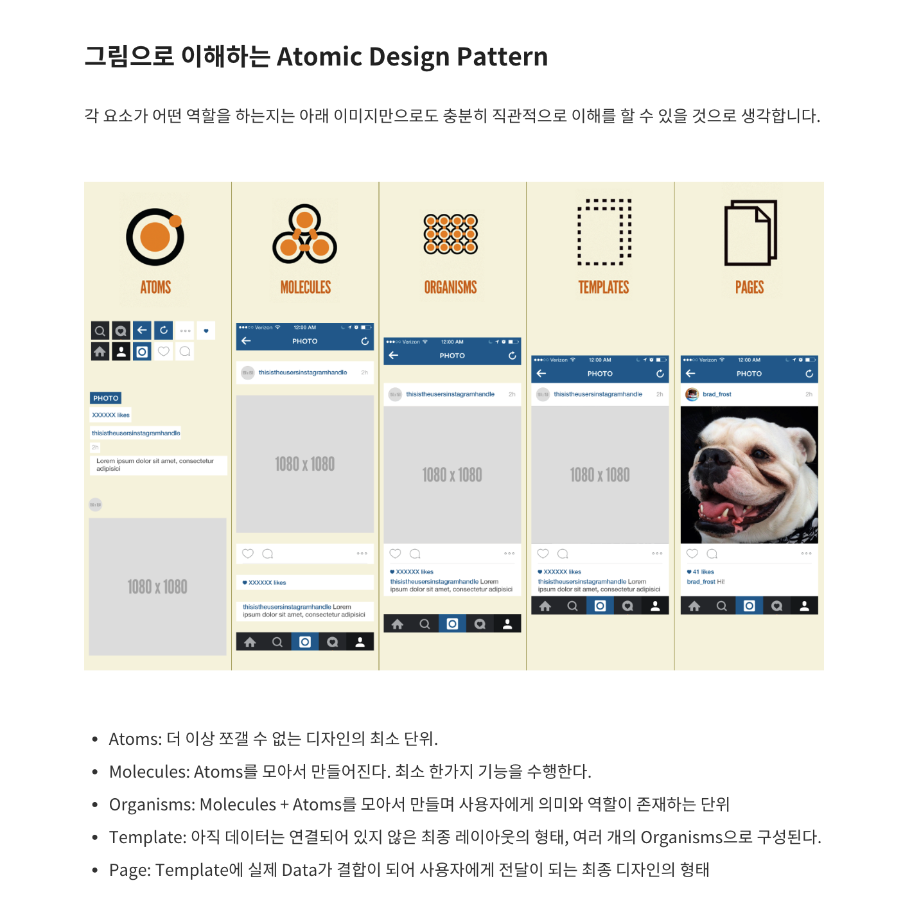
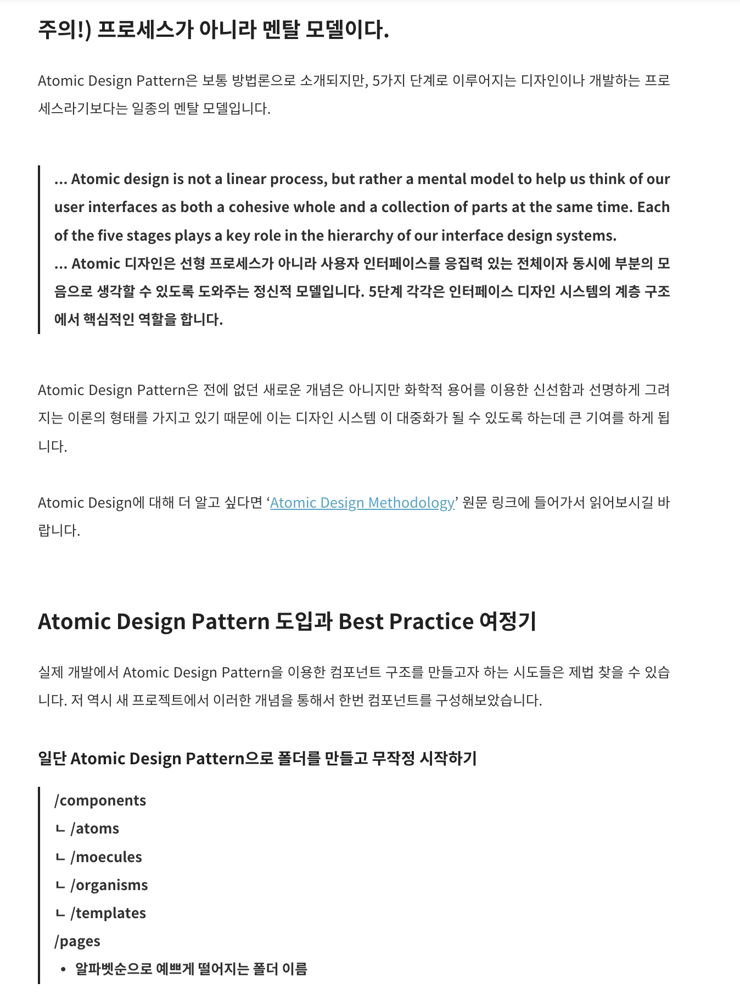
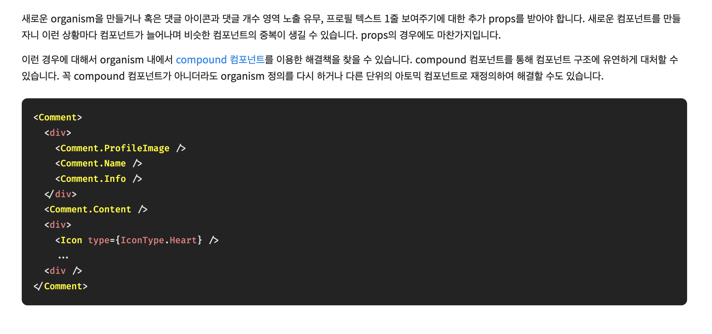
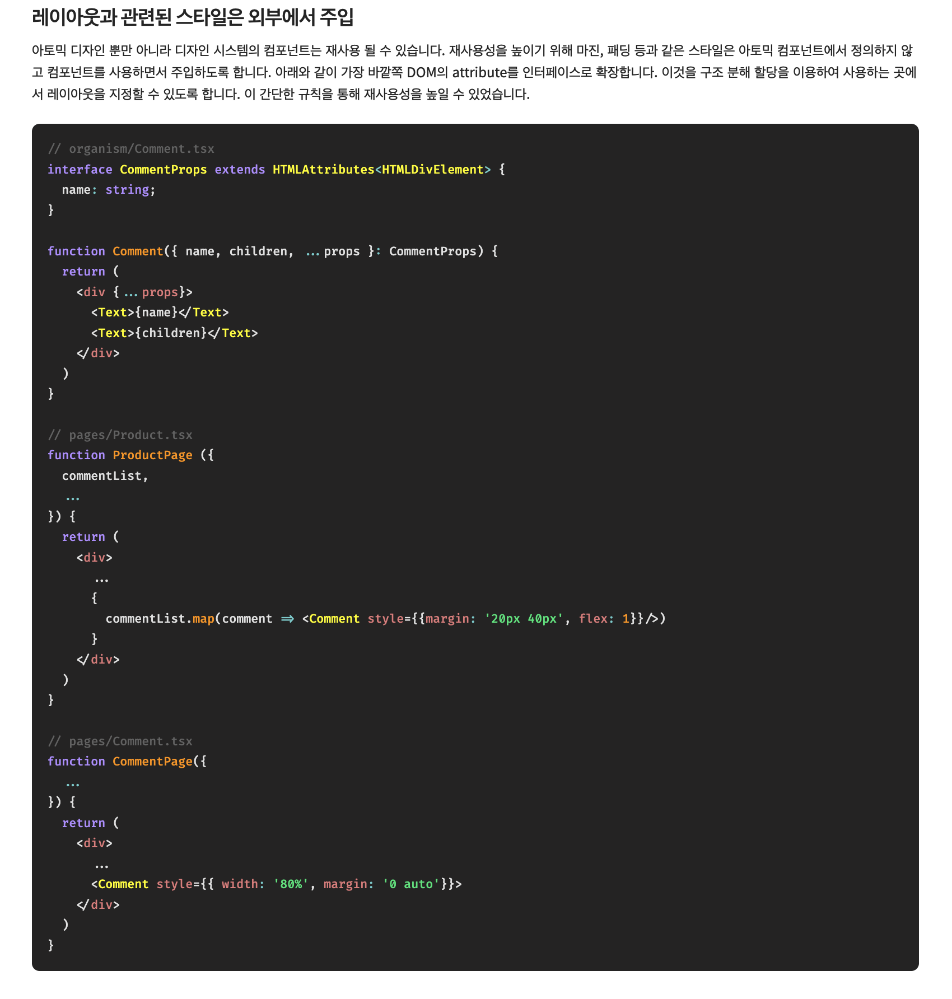

컴포넌트를 가장 작은 단위로 설정, 이를 바탕으로 상위 컴포넌트를 만들어 코드 재사용. => 컴포넌트 중심 설계 패턴.

- atoms - Button, Text, Icon
- molecules - InputForm, Navigation, Card
- organisms
- templates - Header, Main, Footer, ...
- pages

### 장점

컴포넌트 재사용성, 디자인 시스템 가이드라인으로 활용 등.

### 단점

변화가 누적되면서 컴포넌트 많아지면 답 없음

=> 컴포넌트 의존성이 상하로 발생하므로, 원자 단위 컴포넌트를 보수적으로 관리해야 함.

- 이벤트 핸들링에 대해서는 수동적으로 관리해야.
- 입력 필드와 같은 데이터 처리는 원자 단위보다는 한 단계 위인 분자 수준 컴포넌트에서 방어적으로 프로그래밍해야.

### 대응 방법

organism 내에서 새로운 컴포넌트들이 너무 많이 파생되는 문제 => compound component 패턴으로 적절히 대응 가능

재사용성을 높이기 위해, 레이아웃과 관련한 스타일은 외부에서 주입할 수 있게

## References

[아토믹 디자인(Atomic Design) 소개 및 실제 사용 경험](https://ghost4551.tistory.com/255) 
[아토믹(Atomic) 컴포넌트 디자인 개발 패턴](https://brunch.co.kr/@skykamja24/580) 
[Atomic Design Pattern의 Best Practice 여정기](https://yozm.wishket.com/magazine/detail/1531/) 
[아토믹 디자인을 활용한 디자인 시스템 도입기](https://fe-developers.kakaoent.com/2022/220505-how-page-part-use-atomic-design-system/) 
