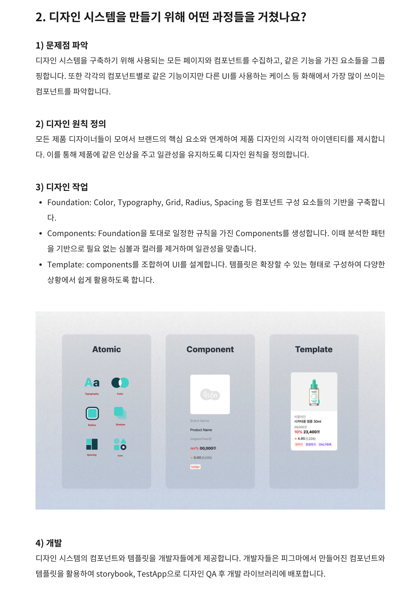

# design system

## References

[사용 가능한 진짜 디자인 시스템을 만드는 여정 | 화해](https://yozm.wishket.com/magazine/detail/2365/) 
[diegohaz | arc](https://github.com/diegohaz/arc) 
[Atomic Design by Brad Frost](https://atomicdesign.bradfrost.com/) 
[Thinking About React, Atomically](https://medium.com/@wheeler.katia/thinking-about-react-atomically-608c865d2262) 
[1단계: UI를 컴포넌트 계층 구조로 나누기](https://ko.reactjs.org/docs/thinking-in-react.html#step-1-break-the-ui-into-a-component-hierarchy) 
[design systems are for user interfaces](https://bradfrost.com/blog/post/design-systems-are-for-user-interfaces/) 
