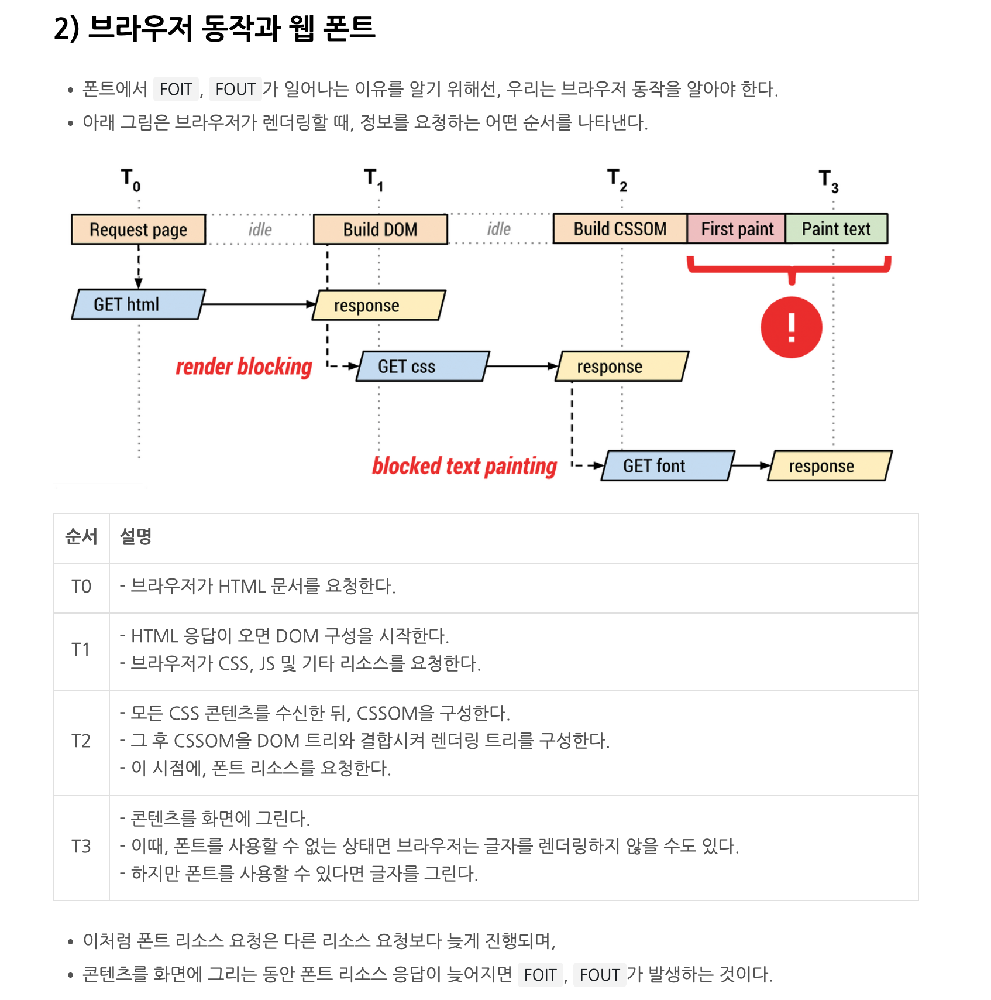
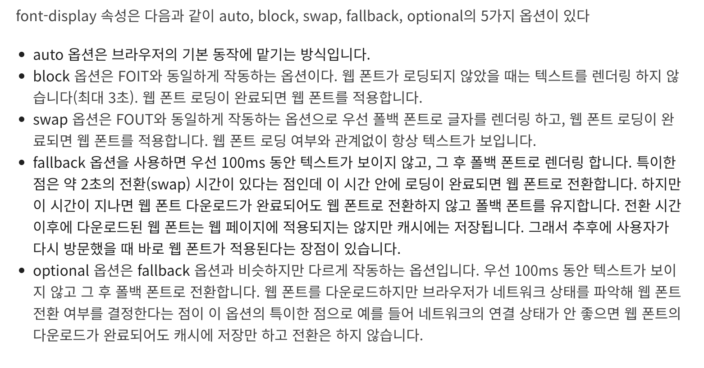

# Font

폰트를 일부에서만 쓰고 있다면, 굳이 global로 선언할 필요는 없음.<br>
해당 css 파일에 font-face 선언

`@font-face`로 폰트를 가져오곤 합니다.<br>
이때 local 함수를 사용하면, 사용자 로컬에 해당 폰트가 설치되어 있을 때 네트워크 비용을 줄일 수 있습니다.

[@font-face](https://developer.mozilla.org/ko/docs/Web/CSS/@font-face)<br>

## 사전 지식

### typeface와 font 구분

typeface는 서체. pretendard와 같은.

font는 서체 안에서의 특정 크기, 굵기 및 스타일을 지칭. pretendard-bold.

### web font 장단점

유저가 로컬에서 폰트가 없더라도 동일한 디자인 제공 가능<br>
but, 웹 폰트 용량이 커서 최적화 필요

### web font 확장자 종류

eot, ttf, woff, woff2

- ttf는 구형 안드로이드 버전에서 필요
- woff2는 woff보다 압축률 30% 더 좋음

## 최적화 방법

### 모던 파일 포맷 사용

@font-face로 선언하며, woff2를 가장 먼저 선언

### 확장자 순서

format() 함수를 사용해야 함. 그렇지 않으면 브라우저는 지원 가능한 파일 형식 나올 때까지 순서대로 다운로드함.<br>
ie8 이하를 지원해야 하면, eot를 가장 먼저 선언해야 하며 ie는 format을 읽지 못함.

이제 ie 배제하면 이제 그냥 woff2만 선언하면 됨.

```css
@font-face {
  font-family: "Typefesse";
  src: url(/static_fonts/NanumGothic-Regular.eot),
    url(/static_fonts/NanumGothic-Regular.woff2) format("woff2"), url(/static_fonts/NanumGothic-Regular.woff)
      format("woff"),
    url(/static_fonts/NanumGothic-Regular.ttf) format("truetype");
}
```

### local 문법 사용

css에 폰트 선언하면 무조건 다운로드 받음. => 네트워크 비용 발생<br>
src에서 local 함수 먼저 선언해주면, 시스템에 설치된 폰트는 다운로드받지 않음.

```css
src: local("Nanum-Gothic"),
  url(/static_fonts/NanumGothic-Regular.woff2) format("woff2"), url(/static_fonts/NanumGothic-Regular.woff)
    format("woff");
```

### 같은 폰트, font-family로 구분

```css
@font-face {
  font-family: "Nanum Gothic";
  font-style: normal;
  font-weight: 400;
  src: url(/static_fonts/NanumGothic-Regular.woff2) format("woff2"), url(/static_fonts/NanumGothic-Regular.woff)
      format("woff"),
    url(/static_fonts/NanumGothic-Regular.ttf) format("truetype");
}

@font-face {
  font-family: "Nanum Gothic"; /* Nanum Gothic Bold x */
  font-style: normal;
  font-weight: 700;
  src: url(/static_fonts/NanumGothic-Bold.woff2) format("woff2"), url(/static_fonts/NanumGothic-Bold.woff)
      format("woff"), url(/static_fonts/NanumGothic-Bold.ttf) format("truetype");
}

@font-face {
  font-family: "Nanum Gothic"; /* Nanum Gothic ExtraBold x */
  font-style: normal;
  font-weight: 800;
  src: url(/static_fonts/NanumGothic-ExtraBold.woff2) format("woff2"), url(/static_fonts/NanumGothic-ExtraBold.woff)
      format("woff"),
    url(/static_fonts/NanumGothic-ExtraBold.ttf) format("truetype");
}

@font-face {
  font-family: "Nanum Gothic"; /* Nanum Gothic italic x */
  font-style: italic;
  font-weight: 400;
  src: url(/static_fonts/NanumGothic-Regular-italic.woff2) format("woff2"), url(/static_fonts/NanumGothic-Regular-italic.woff)
      format("woff"),
    url(/static_fonts/NanumGothic-Regular-italic.ttf) format("truetype");
}
```

### 서브셋 폰트 사용

불필요한 글자 제거

특히, 영어는 26개 알파벳으로 대소문자 포함 총 72글자 필요.<br>
반면 한글은 자음, 모음 조합이라서 모든 조합 시 11,172글자 필요. => 그래서 한글 폰트가 영문보다 용량이 큼

서브셋 폰트 만드는 사이트들 존재함.

### 텍스트 항상 보이기 (렌더링 과정 이해)

ie 계열 브라우저는 `FOUT 방식(Flash Of Unstyled Text)`으로 렌더링 차단 처리<br>
그외 최신 브라우저는 `FOIT 방식(Flash Of Invisible Text)`으로 렌더링 차단 처리

웹 폰트 적용 시, 반짝임 현상(flash of text)

- FOUT는 적용 안된 폰트(unstyled) => 폰트 적용
- FOIT는 텍스트가 안 보이다가 적용

FOUT는 텍스트가 항상 보이는 장점 존재함.<br>
FOIT는 로딩 동안 안 보여서 UX 안 좋을 수도

이유는, 브라우저 렌더링 과정에서 폰트 리소스 요청이 우선순위 낮으므로



### font display / 폰트 로딩 api

외부 라이브러리 없이 font-display로 웹 폰트 로딩 상태에 따른 동작 설정 가능.



혹은 new FontFace api 사용

web font loader 사용

### preload 옵션 설정

미리 다운로드 할 수 있지만,<br>
원래 브라우저는 필요할 때만 다운로드하는 데 그거 대신 미리 전부 받는 거라 리스크 존재함.

```html
<link
  rel="preload"
  href="./nanumGothic.woff2"
  as="font"
  type="font/woff2"
  crossorigin="anonymous"
/>
```

### unicode-range 속성 사용

다국어 서비스 제공한다면, 나라별 필요한 폰트만 다운로드

```css
@font-face {
  font-family: 'korea font';
  font-weight: 400;
  src: local('korea font'),
    url(woff2-foo-font-ko-path) format('woff2'),
    url(woff-foo-font-ko-path) format('woff'),
  unicode-range: U+1100-U+11FF; /* 한글만 다운로드 */
}

@font-face {
  font-family: 'latin font';
  font-weight: 400;
  src: local('latin font'),
    url(woff2-foo-font-path) format('woff2'),
    url(woff-foo-font-path) format('woff'),
  unicode-range: U+000-5FF;    /* 라틴어만 다운로드 */
}
```

## 참고문서

[The Web Open Font Format (WOFF)](https://developer.mozilla.org/en-US/docs/Web/CSS/CSS_fonts/WOFF)<br>
[웹 폰트(Web Font) 최적화 하기](https://whales.tistory.com/66)<br>
[[CSS/JS] 웹 폰트를 최적화하는 5가지 방법](https://mong-blog.tistory.com/entry/CSSJS-%EC%9B%B9-%ED%8F%B0%ED%8A%B8%EB%A5%BC-%EC%B5%9C%EC%A0%81%ED%99%94%ED%95%98%EB%8A%94-5%EA%B0%80%EC%A7%80-%EB%B0%A9%EB%B2%95)<br>
[개발자에게 웹 폰트 최적화가 중요한 이유](https://yozm.wishket.com/magazine/detail/2107/)<br>
[웹 폰트(Web Font) 최적화 하는 법](https://www.datoybi.com/Web-font-optimization/)<br>
