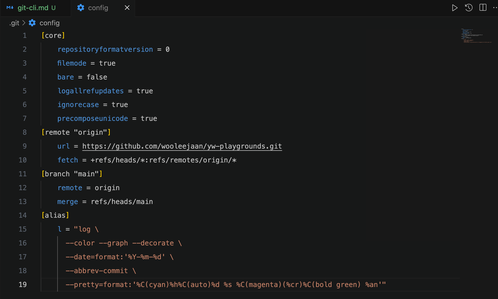

bash(zsh도 마찬가지)에서 줄바꿈해서 적고 싶으면 마지막에 `\`를 붙여주고 Enter를 눌러 계속 작성하면 됨.

### git basic

```bash
# 원격 저장소의 내용을 다운로드합니다.
$ git fetch

# 로컬 저장소에 내용을 병합합니다.
$ git merge

# 원격 저장소의 내용을 다운로드해서 로컬 저장소에 병합합니다.
$ git pull
```

### git alias

별칭 기능 사용법

```bash
# 로컬 프로젝트 범위에 적용되는 설정 파일을 변경합니다.
$ git config --edit --local

# 또는 원하는 에디터로 직접 열어서 수정해도 됩니다.
$ vi .git/config       # vim으로 설정 파일 열기
$ code .git/config     # vscode로 설정 파일 열기
```

### git log

`git log --oneline --decorate --graph`를 사용했을 때 단점 => 해당 커밋이 언제, 누가 작성했는지 알기 어려움.

```bash
git log \
      --color --graph --decorate \
      --date=format:'%Y-%m-%d' \
      --abbrev-commit \
      --pretty=format:'%C(red)%h%C(auto)%d %s %C(green)(%cr)%C(bold blue) %an'
```

아래와 같이 alias 등록하면 `git l`로 사용가능.



## References

[리눅스 Bash 줄바꿈](https://openwiki.kr/tech/%EB%A6%AC%EB%88%85%EC%8A%A4_bash_%EC%A4%84%EB%B0%94%EA%BF%88)<br>
[Git, Github 명령어 사용 꿀팁](https://prgms.tistory.com/217)<br>
[datalater/.gitconfig](https://gist.github.com/datalater/2e89ff92c264f3ee3a5fed1e1385827e)<br>
