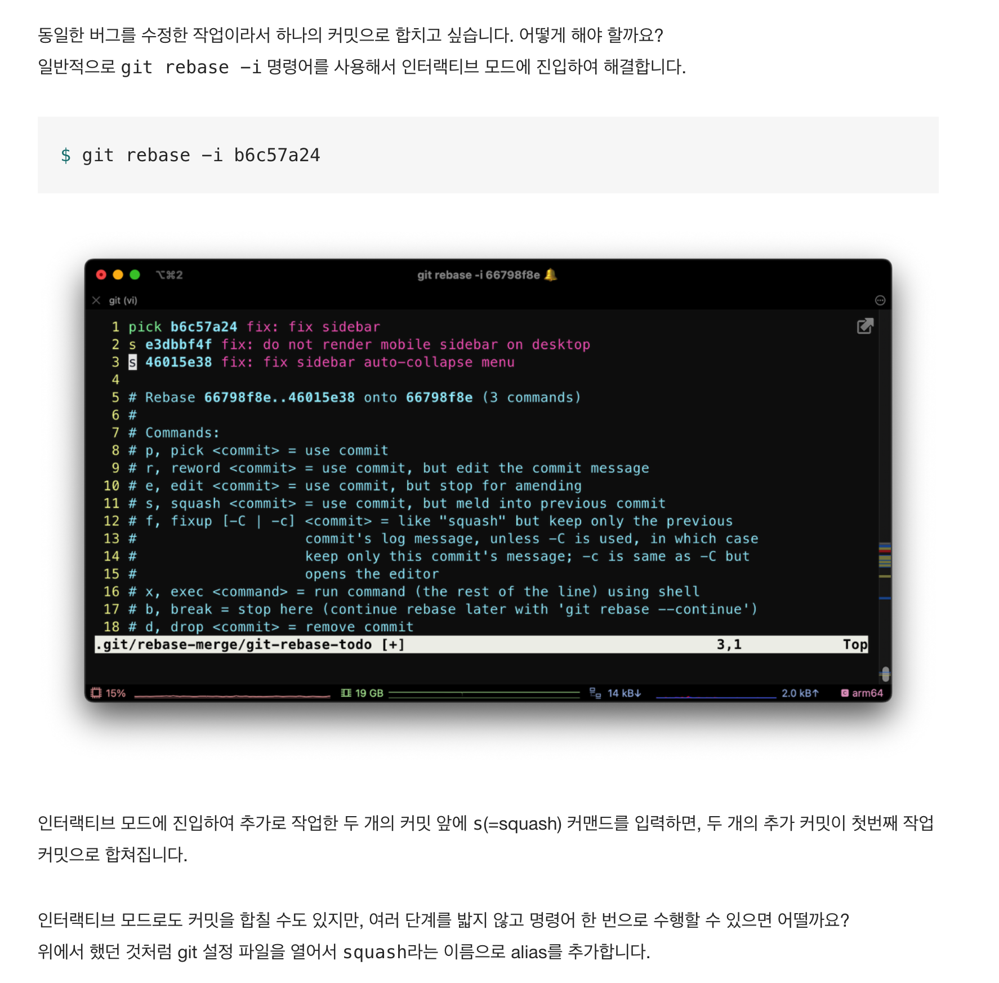
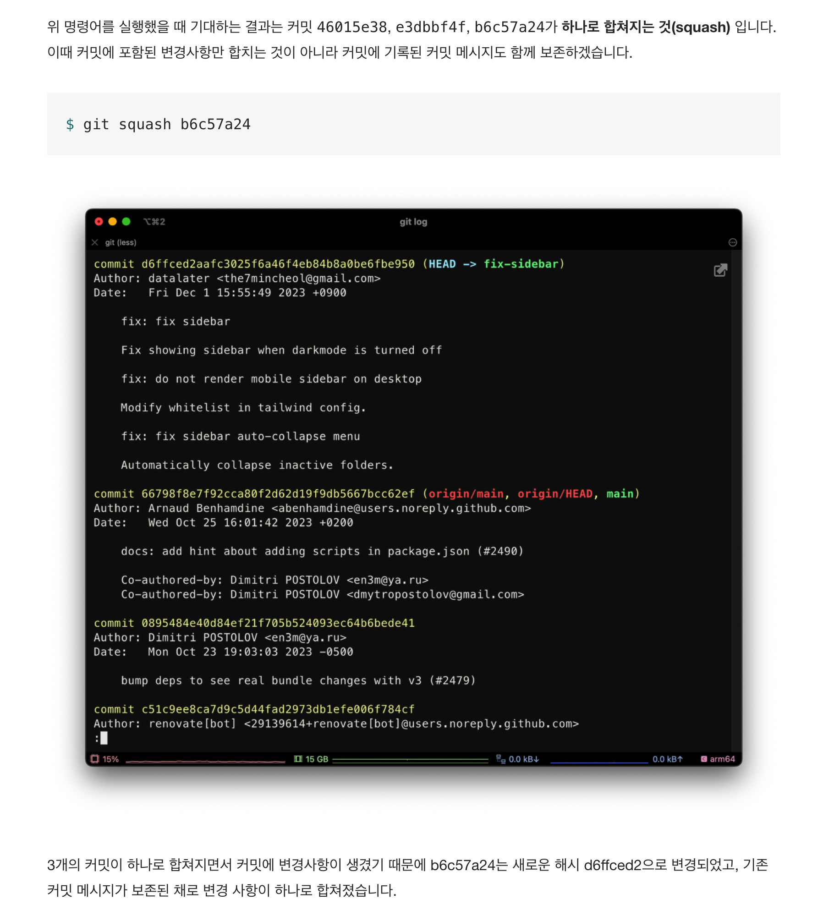

### Feature

여러 개의 커밋 하나로 합치기

- 현재커밋부터 합치고 싶은 커밋까지 전부 다 합치기

예를 들어,커밋 히스토리가 다음과 같을 때,

- dasd323 : 높이 버그 수정
- d8d7d6d : 높이 버그 수정 2
- v7v7v7v : 높이 버그 수정 3

3개의 커밋이 결국 하나의 작업이지만, 추가적으로 계속 작업하게 되어 커밋이 쌓인 경우.

일반적으로 `git rebase -i` 명령어를 사용해서 인터랙티브 모드에 진입함.

그럼 이렇게 명령하면 됨. `git rebase -i dasd323`

인터랙티브 모드에 진입해서, 추가로 추가 작업한 `버그 수정 2,3` 커밋 앞에 s=(squash) 커맨드를 입력하면, 2개의 추가 커밋이 첫번째 작업 커밋으로 합쳐짐.



이 과정을 alias로 추가하면 아래와 같음.

vscode를 사용한다면, `code .git/config`로 들어가서

```bash
[alias]
    l = "log \
      --color --graph --decorate \
      --date=format:'%Y-%m-%d' \
      --abbrev-commit \
      --pretty=format:'%C(red)%h%C(auto)%d %s %C(magenta)(%cr)%C(bold green) %an'"

    squash = "!f() { \
        messages=$(git log --format=%B --reverse ${1}~..HEAD); \
         git reset --soft ${1} && \
         echo \"${messages}\" | git commit --amend --allow-empty -F -; \
         unset -f f; \
    }; f"
```

명령어는 다음과 같음.

```bash
# git squash <합쳐질 부모 커밋>
$ git squash b6c57a24
```



`git l`로 로그를 확인해보면 커밋 로그가 보다 더 깔끔해졌음.

### Refactor

git squash 뒤에 파라미터를 전달하지 않으면 경고 메시지 출력하도록.

```bash
$ git squash
Please provide the commit hash of the parent commit where other commits will be squashed into.
```

아래와 같이 수정하면 됨.

```bash
[alias]
    l = "log \
        --color --graph --decorate \
        --date=format:'%Y-%m-%d' \
        --abbrev-commit \
        --pretty=format:'%C(red)%h%C(auto)%d %s %C(magenta)(%cr)%C(bold green) %an'"

    squash = "!f() { \
        if [ -z \"$1\" ]; then \
            echo 'Please provide the commit hash of the parent commit where other commits will be squashed into.'; \
        else \
            messages=$(git log --format=%B --reverse ${1}~..HEAD); \
            git reset --soft ${1} && \
            echo \"${messages}\" | git commit --amend --allow-empty -F -; \
        fi; \
        unset -f f; \
    }; f"
```

코드 설명을 위한 주석 추가

```bash
[alias]
    l = "log \
        --color --graph --decorate \
        --date=format:'%Y-%m-%d' \
        --abbrev-commit \
        --pretty=format:'%C(red)%h%C(auto)%d %s %C(magenta)(%cr)%C(bold green) %an'"

    squash = "!f() { \
        # 인자($1)를 전달하지 않으면 경고 메시지를 출력합니다.;\n \
        if [ -z \"$1\" ]; then \
            echo 'Please provide the commit hash of the parent commit where other commits will be squashed into.'; \
        else \
            # 인자($1)로 전달한 부모 커밋부터 현재 브랜치(HEAD)의 모든 커밋 메시지를 가져옵니다.;\n \
            messages=$(git log --format=%B --reverse ${1}~..HEAD); \
            # 현재 브랜치를 인자($1)로 전달한 부모 커밋으로 되돌립니다. 이때 부모 커밋 이후의 모든 변경사항을 staging area에 추가합니다.;\n \
            git reset --soft ${1} && \
            # 가져온 커밋 메시지를 사용해서 현재 커밋에 덮어씌웁니다.;\n \
            echo \"${messages}\" | git commit --amend --allow-empty -F -; \
        fi; \
        unset -f f; \
    }; f"
```

## References

[리눅스 Bash 줄바꿈](https://openwiki.kr/tech/%EB%A6%AC%EB%88%85%EC%8A%A4_bash_%EC%A4%84%EB%B0%94%EA%BF%88)<br>
[Git, Github 명령어 사용 꿀팁](https://prgms.tistory.com/217)<br>
[datalater/.gitconfig](https://gist.github.com/datalater/2e89ff92c264f3ee3a5fed1e1385827e)<br>
